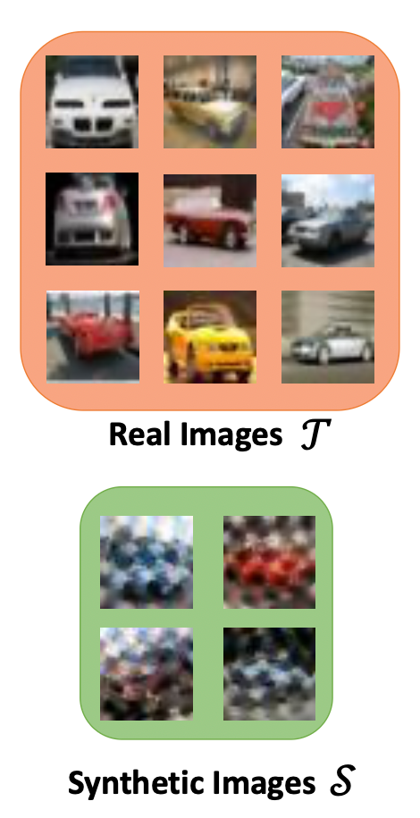

<!--
Tame.qmd
========================


Descripcion:
------------
Presentacion en Quarto con reveal.js sobre TAME (Tabular Alignment via
Moment Embeddings). Por ahora es solo el esqueleto: cada diapositiva
lleva texto de relleno que se sustituye por el contenido real conforme
se define.


Considerations:
------------
- Se compila con "quarto render Tame.qmd" o se previsualiza con
  "quarto preview Tame.qmd"
- El front matter YAML tiene que ser lo primero del archivo, por eso el
  encabezado va inmediatamente despues
- Cada "##" abre una diapositiva y cada "#" una seccion


Metadata:
----------
* Author: zxxz6 (Bryan Violante Arriaga)
* Version: 1.0.0
* License: Copyright (c) 2026 Bryan Violante Arriaga.


History:
------------
Author      Date            Description
zxxz6       25/09/2026      Creation


-->

## Contenido

1. Introducción
2. Motivación
3. Planteamiento del problema
4. Antecedentes
5. Método: TAME

::: {.notes}
Recorrido de la exposición. Primero qué es destilar un conjunto de
datos y por qué importa. Luego por qué el caso tabular es distinto,
cómo se plantea el problema, qué hay antes de TAME, el método en sí,
su principal limitación y nuestra propuesta para atacarla.
:::

# Introducción

## Destilación de conjuntos de datos

:::: {.columns}
::: {.column width="62%"}
Un conjunto **pequeño** que entrena modelos **casi tan bien** como el
conjunto completo.

- También se le llama *condensación*
- Las instancias suelen ser **sintéticas**
:::
::: {.column width="38%"}
{height="520px" fig-align="center"}
:::
::::

::: {.notes}
eN lo que coinciden todos los papers... destilar in a nutshell es
generar un subconjunto pequeño y muy informativo tal que un modelo 
entrenado con el tenga un desempeño comparable al del modelo entrenado 
con todos los datos.

Si en cambio se eligen renglones reales como representantes, se le
llama coreset selection... 

notar q las instancias destiladas no tienen pq existir en
el conjunto original

(en la imagen se ve como los datos destilados parecen no tener sentido)
:::

::: aside
Florea y Barnoviciu (2026); Kang et al. (2025); imagen de Zhang et al.
(2024)
:::

## Por qué reducir los datos

- **Cómputo:** se duplica cada 3.4 meses
- **Almacenamiento**
- **Privacidad** y derechos de autor
- **Entrenamientos repetidos**

::: {.notes}

Computo: Segun Zhao y Bilen, el costo de entrenar un modelo de
punta se duplica cada 3.4 meses

Almacenamiento: menos datos que guardar y mover

Privacidad y copyrigth: no hay que conservar ni reutilizar
grandes volúmenes de datos crudos (aunq tame dice que no es necesariamente cierto)

Entrenamientos repetidos:  Si se entrenan cientos de modelos sobre el
mismo conjunto, reducirlo una vez paga muchas veces
:::

::: aside
Zhao y Bilen (2023); Florea y Barnoviciu (2026); Kang et al. (2025)
:::

## Seleccionar o sintetizar

:::: {.columns}
::: {.column width="50%"}
**Selección** (*coreset*)

Elige renglones **reales**.

- Voraz y miope
- Acotada por lo que ya existe
:::
::: {.column width="50%"}
**Síntesis**

Aprende renglones **nuevos**.

- Rompe ese cuello de botella
- El costo pasa a construirlos
:::
::::

::: {.notes}
Dos formas de reducir...

Seleccion, o coreset: se eligen muestras del conjunto original con
criterios heurísticos (se usan varias tecnicas como kmediods, etc)

Sintesis: se aprenden muestras nuevas que concentran la información.
Eso rompe el cuello de botella, porque un renglón sintético puede
resumir a varios reales (desventaja, construirlos cuesta)
:::

::: aside
Zhao y Bilen (2023); Florea y Barnoviciu (2026)
:::

## Seleccionar o sintetizar, en una imagen {auto-animate=true}

```{=html}
<div class="lienzo">
<div class="pt ca" data-id="a0"
  style="left:286px;top:231px"></div>
<div class="pt ca" data-id="a1"
  style="left:288px;top:181px"></div>
<div class="pt ca" data-id="a2"
  style="left:249px;top:187px"></div>
<div class="pt ca" data-id="a3"
  style="left:361px;top:225px"></div>
<div class="pt ca" data-id="a4"
  style="left:357px;top:215px"></div>
<div class="pt ca" data-id="a5"
  style="left:322px;top:211px"></div>
<div class="pt ca" data-id="a6"
  style="left:208px;top:251px"></div>
<div class="pt ca" data-id="a7"
  style="left:328px;top:230px"></div>
<div class="pt ca" data-id="a8"
  style="left:207px;top:95px"></div>
<div class="pt ca" data-id="a9"
  style="left:251px;top:172px"></div>
<div class="pt ca" data-id="a10"
  style="left:317px;top:197px"></div>
<div class="pt ca" data-id="a11"
  style="left:329px;top:161px"></div>
<div class="pt ca" data-id="a12"
  style="left:317px;top:224px"></div>
<div class="pt ca" data-id="a13"
  style="left:264px;top:303px"></div>
<div class="pt ca" data-id="a14"
  style="left:331px;top:272px"></div>
<div class="pt ca" data-id="a15"
  style="left:266px;top:156px"></div>
<div class="pt ca" data-id="a16"
  style="left:281px;top:194px"></div>
<div class="pt ca" data-id="a17"
  style="left:335px;top:215px"></div>
<div class="pt ca" data-id="a18"
  style="left:275px;top:143px"></div>
<div class="pt ca" data-id="a19"
  style="left:271px;top:273px"></div>
<div class="pt ca" data-id="a20"
  style="left:256px;top:215px"></div>
<div class="pt ca" data-id="a21"
  style="left:323px;top:111px"></div>
<div class="pt ca" data-id="a22"
  style="left:303px;top:278px"></div>
<div class="pt ca" data-id="a23"
  style="left:189px;top:181px"></div>
<div class="pt ca" data-id="a24"
  style="left:294px;top:151px"></div>
<div class="pt ca" data-id="a25"
  style="left:327px;top:196px"></div>
<div class="pt ca" data-id="a26"
  style="left:219px;top:250px"></div>
<div class="pt ca" data-id="a27"
  style="left:337px;top:257px"></div>
<div class="pt cb" data-id="b0"
  style="left:779px;top:222px"></div>
<div class="pt cb" data-id="b1"
  style="left:707px;top:122px"></div>
<div class="pt cb" data-id="b2"
  style="left:734px;top:163px"></div>
<div class="pt cb" data-id="b3"
  style="left:675px;top:124px"></div>
<div class="pt cb" data-id="b4"
  style="left:647px;top:168px"></div>
<div class="pt cb" data-id="b5"
  style="left:771px;top:78px"></div>
<div class="pt cb" data-id="b6"
  style="left:620px;top:214px"></div>
<div class="pt cb" data-id="b7"
  style="left:779px;top:235px"></div>
<div class="pt cb" data-id="b8"
  style="left:596px;top:49px"></div>
<div class="pt cb" data-id="b9"
  style="left:720px;top:156px"></div>
<div class="pt cb" data-id="b10"
  style="left:638px;top:259px"></div>
<div class="pt cb" data-id="b11"
  style="left:761px;top:209px"></div>
<div class="pt cb" data-id="b12"
  style="left:714px;top:226px"></div>
<div class="pt cb" data-id="b13"
  style="left:788px;top:237px"></div>
<div class="pt cb" data-id="b14"
  style="left:729px;top:233px"></div>
<div class="pt cb" data-id="b15"
  style="left:614px;top:277px"></div>
<div class="pt cb" data-id="b16"
  style="left:753px;top:232px"></div>
<div class="pt cb" data-id="b17"
  style="left:591px;top:162px"></div>
<div class="pt cb" data-id="b18"
  style="left:746px;top:91px"></div>
<div class="pt cb" data-id="b19"
  style="left:690px;top:261px"></div>
<div class="pt cb" data-id="b20"
  style="left:628px;top:297px"></div>
<div class="pt cb" data-id="b21"
  style="left:730px;top:191px"></div>
<div class="pt cb" data-id="b22"
  style="left:718px;top:239px"></div>
<div class="pt cb" data-id="b23"
  style="left:707px;top:269px"></div>
<div class="pt cb" data-id="b24"
  style="left:664px;top:175px"></div>
<div class="pt cb" data-id="b25"
  style="left:757px;top:202px"></div>
<div class="pt cb" data-id="b26"
  style="left:652px;top:257px"></div>
<div class="pt cb" data-id="b27"
  style="left:781px;top:173px"></div>
</div>
```

::: {.pie data-id="pieA"}
56 renglones de dos clases
:::

::: {.notes}
Datos simulados: dos clases con 28 renglones cada una. Siguiente
clic: qué hace la seleccion...
:::

::: aside
Ilustración con datos simulados
:::

## Seleccionar o sintetizar, en una imagen {auto-animate=true}

```{=html}
<div class="lienzo">
<div class="pt ca tenue" data-id="a0"
  style="left:286px;top:231px"></div>
<div class="pt ca tenue" data-id="a1"
  style="left:288px;top:181px"></div>
<div class="pt ca tenue" data-id="a2"
  style="left:249px;top:187px"></div>
<div class="pt ca tenue" data-id="a3"
  style="left:361px;top:225px"></div>
<div class="pt ca tenue" data-id="a4"
  style="left:357px;top:215px"></div>
<div class="pt ca tenue" data-id="a5"
  style="left:322px;top:211px"></div>
<div class="pt ca sel" data-id="a6"
  style="left:208px;top:251px"></div>
<div class="pt ca tenue" data-id="a7"
  style="left:328px;top:230px"></div>
<div class="pt ca sel" data-id="a8"
  style="left:207px;top:95px"></div>
<div class="pt ca tenue" data-id="a9"
  style="left:251px;top:172px"></div>
<div class="pt ca tenue" data-id="a10"
  style="left:317px;top:197px"></div>
<div class="pt ca tenue" data-id="a11"
  style="left:329px;top:161px"></div>
<div class="pt ca tenue" data-id="a12"
  style="left:317px;top:224px"></div>
<div class="pt ca tenue" data-id="a13"
  style="left:264px;top:303px"></div>
<div class="pt ca sel" data-id="a14"
  style="left:331px;top:272px"></div>
<div class="pt ca tenue" data-id="a15"
  style="left:266px;top:156px"></div>
<div class="pt ca tenue" data-id="a16"
  style="left:281px;top:194px"></div>
<div class="pt ca tenue" data-id="a17"
  style="left:335px;top:215px"></div>
<div class="pt ca tenue" data-id="a18"
  style="left:275px;top:143px"></div>
<div class="pt ca tenue" data-id="a19"
  style="left:271px;top:273px"></div>
<div class="pt ca tenue" data-id="a20"
  style="left:256px;top:215px"></div>
<div class="pt ca tenue" data-id="a21"
  style="left:323px;top:111px"></div>
<div class="pt ca tenue" data-id="a22"
  style="left:303px;top:278px"></div>
<div class="pt ca tenue" data-id="a23"
  style="left:189px;top:181px"></div>
<div class="pt ca tenue" data-id="a24"
  style="left:294px;top:151px"></div>
<div class="pt ca tenue" data-id="a25"
  style="left:327px;top:196px"></div>
<div class="pt ca tenue" data-id="a26"
  style="left:219px;top:250px"></div>
<div class="pt ca tenue" data-id="a27"
  style="left:337px;top:257px"></div>
<div class="pt cb tenue" data-id="b0"
  style="left:779px;top:222px"></div>
<div class="pt cb tenue" data-id="b1"
  style="left:707px;top:122px"></div>
<div class="pt cb tenue" data-id="b2"
  style="left:734px;top:163px"></div>
<div class="pt cb tenue" data-id="b3"
  style="left:675px;top:124px"></div>
<div class="pt cb tenue" data-id="b4"
  style="left:647px;top:168px"></div>
<div class="pt cb tenue" data-id="b5"
  style="left:771px;top:78px"></div>
<div class="pt cb tenue" data-id="b6"
  style="left:620px;top:214px"></div>
<div class="pt cb tenue" data-id="b7"
  style="left:779px;top:235px"></div>
<div class="pt cb sel" data-id="b8"
  style="left:596px;top:49px"></div>
<div class="pt cb tenue" data-id="b9"
  style="left:720px;top:156px"></div>
<div class="pt cb tenue" data-id="b10"
  style="left:638px;top:259px"></div>
<div class="pt cb tenue" data-id="b11"
  style="left:761px;top:209px"></div>
<div class="pt cb tenue" data-id="b12"
  style="left:714px;top:226px"></div>
<div class="pt cb sel" data-id="b13"
  style="left:788px;top:237px"></div>
<div class="pt cb tenue" data-id="b14"
  style="left:729px;top:233px"></div>
<div class="pt cb sel" data-id="b15"
  style="left:614px;top:277px"></div>
<div class="pt cb tenue" data-id="b16"
  style="left:753px;top:232px"></div>
<div class="pt cb tenue" data-id="b17"
  style="left:591px;top:162px"></div>
<div class="pt cb tenue" data-id="b18"
  style="left:746px;top:91px"></div>
<div class="pt cb tenue" data-id="b19"
  style="left:690px;top:261px"></div>
<div class="pt cb tenue" data-id="b20"
  style="left:628px;top:297px"></div>
<div class="pt cb tenue" data-id="b21"
  style="left:730px;top:191px"></div>
<div class="pt cb tenue" data-id="b22"
  style="left:718px;top:239px"></div>
<div class="pt cb tenue" data-id="b23"
  style="left:707px;top:269px"></div>
<div class="pt cb tenue" data-id="b24"
  style="left:664px;top:175px"></div>
<div class="pt cb tenue" data-id="b25"
  style="left:757px;top:202px"></div>
<div class="pt cb tenue" data-id="b26"
  style="left:652px;top:257px"></div>
<div class="pt cb tenue" data-id="b27"
  style="left:781px;top:173px"></div>
</div>
```

::: {.pie data-id="pieA"}
Selección: 3 renglones reales por clase, repartidos (el mas lejano primero)
:::

::: {.notes}
Selección: se quedan 3 renglones reales por clase. se eligen como 
 G-Coreset, el más lejano primero, para cubrir el espacio (privilegia diversidad 
 geométrica sobre densidad y termina eligiendo puntos extremos)
:::

::: aside
Ilustración con datos simulados
:::

## Seleccionar o sintetizar, en una imagen {auto-animate=true}

```{=html}
<div class="lienzo">
<div class="pt ca tenue" data-id="a0"
  style="left:286px;top:231px"></div>
<div class="pt ca tenue" data-id="a1"
  style="left:288px;top:181px"></div>
<div class="pt ca tenue" data-id="a2"
  style="left:249px;top:187px"></div>
<div class="pt ca tenue" data-id="a3"
  style="left:361px;top:225px"></div>
<div class="pt ca tenue" data-id="a4"
  style="left:357px;top:215px"></div>
<div class="pt ca tenue" data-id="a5"
  style="left:322px;top:211px"></div>
<div class="pt ca sin" data-id="a6"
  style="left:350px;top:180px"></div>
<div class="pt ca tenue" data-id="a7"
  style="left:328px;top:230px"></div>
<div class="pt ca sin" data-id="a8"
  style="left:250px;top:150px"></div>
<div class="pt ca tenue" data-id="a9"
  style="left:251px;top:172px"></div>
<div class="pt ca tenue" data-id="a10"
  style="left:317px;top:197px"></div>
<div class="pt ca tenue" data-id="a11"
  style="left:329px;top:161px"></div>
<div class="pt ca tenue" data-id="a12"
  style="left:317px;top:224px"></div>
<div class="pt ca tenue" data-id="a13"
  style="left:264px;top:303px"></div>
<div class="pt ca sin" data-id="a14"
  style="left:300px;top:255px"></div>
<div class="pt ca tenue" data-id="a15"
  style="left:266px;top:156px"></div>
<div class="pt ca tenue" data-id="a16"
  style="left:281px;top:194px"></div>
<div class="pt ca tenue" data-id="a17"
  style="left:335px;top:215px"></div>
<div class="pt ca tenue" data-id="a18"
  style="left:275px;top:143px"></div>
<div class="pt ca tenue" data-id="a19"
  style="left:271px;top:273px"></div>
<div class="pt ca tenue" data-id="a20"
  style="left:256px;top:215px"></div>
<div class="pt ca tenue" data-id="a21"
  style="left:323px;top:111px"></div>
<div class="pt ca tenue" data-id="a22"
  style="left:303px;top:278px"></div>
<div class="pt ca tenue" data-id="a23"
  style="left:189px;top:181px"></div>
<div class="pt ca tenue" data-id="a24"
  style="left:294px;top:151px"></div>
<div class="pt ca tenue" data-id="a25"
  style="left:327px;top:196px"></div>
<div class="pt ca tenue" data-id="a26"
  style="left:219px;top:250px"></div>
<div class="pt ca tenue" data-id="a27"
  style="left:337px;top:257px"></div>
<div class="pt cb tenue" data-id="b0"
  style="left:779px;top:222px"></div>
<div class="pt cb tenue" data-id="b1"
  style="left:707px;top:122px"></div>
<div class="pt cb tenue" data-id="b2"
  style="left:734px;top:163px"></div>
<div class="pt cb tenue" data-id="b3"
  style="left:675px;top:124px"></div>
<div class="pt cb tenue" data-id="b4"
  style="left:647px;top:168px"></div>
<div class="pt cb tenue" data-id="b5"
  style="left:771px;top:78px"></div>
<div class="pt cb tenue" data-id="b6"
  style="left:620px;top:214px"></div>
<div class="pt cb tenue" data-id="b7"
  style="left:779px;top:235px"></div>
<div class="pt cb sin" data-id="b8"
  style="left:650px;top:170px"></div>
<div class="pt cb tenue" data-id="b9"
  style="left:720px;top:156px"></div>
<div class="pt cb tenue" data-id="b10"
  style="left:638px;top:259px"></div>
<div class="pt cb tenue" data-id="b11"
  style="left:761px;top:209px"></div>
<div class="pt cb tenue" data-id="b12"
  style="left:714px;top:226px"></div>
<div class="pt cb sin" data-id="b13"
  style="left:700px;top:250px"></div>
<div class="pt cb tenue" data-id="b14"
  style="left:729px;top:233px"></div>
<div class="pt cb sin" data-id="b15"
  style="left:750px;top:150px"></div>
<div class="pt cb tenue" data-id="b16"
  style="left:753px;top:232px"></div>
<div class="pt cb tenue" data-id="b17"
  style="left:591px;top:162px"></div>
<div class="pt cb tenue" data-id="b18"
  style="left:746px;top:91px"></div>
<div class="pt cb tenue" data-id="b19"
  style="left:690px;top:261px"></div>
<div class="pt cb tenue" data-id="b20"
  style="left:628px;top:297px"></div>
<div class="pt cb tenue" data-id="b21"
  style="left:730px;top:191px"></div>
<div class="pt cb tenue" data-id="b22"
  style="left:718px;top:239px"></div>
<div class="pt cb tenue" data-id="b23"
  style="left:707px;top:269px"></div>
<div class="pt cb tenue" data-id="b24"
  style="left:664px;top:175px"></div>
<div class="pt cb tenue" data-id="b25"
  style="left:757px;top:202px"></div>
<div class="pt cb tenue" data-id="b26"
  style="left:652px;top:257px"></div>
<div class="pt cb tenue" data-id="b27"
  style="left:781px;top:173px"></div>
</div>
```

::: {.pie data-id="pieA"}
Síntesis: 3 renglones nuevos por clase, optimizados
:::

::: {.notes}
Síntesis: los mismos 3 renglones por clase se mueven a posiciones
nuevas que no existen en los datos. Son las que un método de
destilación optimizaría para resumir mejor la clase.
:::

::: aside
Ilustración con datos simulados
:::

## Dos familias de síntesis

::: {.incremental}
- **Orientados a optimización:** empatan desempeño o parámetros con un
  problema binivel. Caros
- **Emparejamiento de distribuciones:** alinean las características de
  reales y sintéticos. Baratos
:::

::: {.notes}
Zhang en M3D, divide los métodos de síntesis en dos grupos
según si hacen o no una optimización binivel costosa.

Los orientados a optimización empatan el desempeño o los parámetros...
entrenan redes dentro del ciclo y calculan derivadas de segundo orden 
(por eso son caros y dificiles de escalar a conjuntos grandes)

Los de distribution matching, DM, alinean las
distribuciones de características de los datos reales y sintéticos.
No hay optimización anidada, así que el costo de síntesis baja
drásticamente (TAME pertenece a este)
:::

::: aside
Zhao y Bilen (2023); Zhang et al. (2024)
:::

# Motivación

## Los datos tabulares están en todas partes

- El tipo de dato **más común** en aplicaciones reales
- Medicina, finanzas, manufactura, clima, bases relacionales
- El aprendizaje profundo **no** domina aquí

::: {.notes}
segun Shwartz-Ziv y Armon, en aplicaciones reales el tipo de dato más
común es el tabular, renglones con el mismo conjunto de columnas...

:::

::: aside
Shwartz-Ziv y Armon (2022); Grinsztajn et al. (2022)
:::

## Los árboles siguen ganando

- **XGBoost** sigue siendo la herramienta por defecto
- En 45 conjuntos medianos, los árboles siguen siendo el estado del
  arte
- Las redes para tabular ganan solo en **sus propios** conjuntos

::: {.notes}
SEGUN Grinsztajn, los ensambles de árboles como XGBoost siguen siendo
de las herramientas mas usadas para ciencia de datos, y de las mas
usadas en datos tabulares en general...

Shwartz-Ziv y Armon evaluaron las redes profundas de cuatro papers
recientes en once conjuntos, nueve de ellos usados en esos mismos
papers. Cada modelo rinde mejor en los conjuntos de su propio artículo
y bastante peor en los demás. XGBoost casi siempre les gana y
necesita mucho menos ajuste de hiperparámetros (igual encontraron q lo q si funciona es
un ensamble de redes con XGBoost)
:::

::: aside
Grinsztajn et al. (2022); Shwartz-Ziv y Armon (2022)
:::

## Por qué a las redes les cuesta

Sin invariancias claras que aprovechar:

::: {.incremental}
- Características **heterogéneas**
- Pocas muestras, **valores extremos**, faltantes
- Sin **localidad** ni estructura previa
- Funciones objetivo **irregulares**
- Muchas características **no informativas**
:::

::: {.notes}
Las arquitecturas profundas se diseñan con sesgos inductivos que
reflejan invariancias de los datos, la convolución aprovecha la
localidad de una imagen, por ejemplo. En tabular esas invariancias son
difíciles de encontrar

estructura heterogtnea en datos tabulares: columnas numéricas, ordinales y categóricas mezcladas.
Pocas muestras, valores extremos y datos faltantes

Sin localidad: el orden de las columnas no significa nada, a diferencia de los pixeles o
las palabras

Las redes batallan para aprender
patrones irregulares de la función objetivo. Y son invariantes a
rotaciones del espacio de entrada, lo que estorba cuando hay muchas
columnas no informativas: el árbol simplemente las ignora, la red las
mezcla con las buenas
:::

::: aside
Grinsztajn et al. (2022); Shwartz-Ziv y Armon (2022)
:::

## Qué implica para destilar

- En visión funciona; en tabular, **poco explorada**
- Los árboles **no son diferenciables**
- El conjunto tiene que servirle a **los árboles**

::: {.fragment}
**La pregunta:** ¿cómo destilar sin retropropagar a través del
modelo?
:::

::: {.notes}
segun Barnoviciu y Florea la destilación de
conjuntos de datos logra resultados fuertes en visión por
computadora, pero en tabular está poco explorada

Los modelos de árboles no son diferenciables, así que no se pueden
componer ni entrenar junto con bloques de aprendizaje profundo.

Y el conjunto destilado tiene que servirle a los modelos que de verdad
se usan en tabular, que son justamente los árboles (de aqui es la premisa
de nuestra invesstigacion)
:::

::: aside
Barnoviciu y Florea (2026); Grinsztajn et al. (2022)
:::

# Planteamiento del problema

## Formulación

Buscar $\mathcal{S}$ con $|\mathcal{S}| \ll |\mathcal{T}|$ tal que

$$
\mathbb{E}_{x \sim P_{\mathcal{D}}}
  \big[\ell(\phi_{\theta^{\mathcal{T}}}(x), y)\big]
\simeq
\mathbb{E}_{x \sim P_{\mathcal{D}}}
  \big[\ell(\phi_{\theta^{\mathcal{S}}}(x), y)\big]
$$

::: {.notes}
La formulación de Zhao y Bilen. Tenemos el conjunto de entrenamiento
T de pares (x, y) y buscamos un conjunto sintético S, mucho más chico,
tal que el modelo phi entrenado con S generalice igual que entrenado
con T.

theta super T y theta super S son los parámetros del modelo entrenado
con cada conjunto. La esperanza es sobre la distribución real de los
datos, es decir, el error de prueba.

Este objetivo es intratable tal cual: habría que entrenar un modelo
completo para evaluar cada candidato a S. Todos los métodos que vamos
a ver son sustitutos de esta ecuación.
:::

::: aside
Zhao y Bilen (2023)
:::

## Emparejamiento de distribuciones

Por clase, con embedders aleatorios $\psi_\vartheta$:

$$
\min_{\mathcal{S}} \;
\mathbb{E}_{\vartheta \sim P_\vartheta}
\Big\lVert
  \frac{1}{|\mathcal{T}|} \sum_{i=1}^{|\mathcal{T}|} \psi_\vartheta(x_i)
  - \frac{1}{|\mathcal{S}|} \sum_{j=1}^{|\mathcal{S}|} \psi_\vartheta(s_j)
\Big\rVert^2
$$

- Sin entrenar ninguna red
- Solo iguala **medias**

::: {.notes}
El sustituto de DM, Zhao y Bilen. En vez de entrenar un modelo, se
proyectan los datos reales y los sintéticos con una red psi de
parámetros aleatorios, y se pide que la media de las proyecciones sea
la misma. Se hace por clase y se promedia sobre muchas redes
aleatorias distintas.

Ventaja: no hay que entrenar nada, solo evaluar redes.

Limitación: lo único que se compara es la media, el primer momento.
Esto es una MMD con kernel lineal. Dos distribuciones muy distintas
pueden tener la misma media, que es lo siguiente.
:::

::: aside
Zhao y Bilen (2023)
:::

## El orden de los momentos

Misma media no es misma distribución.

$$
\mathrm{MMD}^2(\mathcal{T}, \mathcal{S})
= \big\lVert \mu_{\mathcal{T}} - \mu_{\mathcal{S}} \big\rVert_{\mathcal{H}}^2 ,
\qquad
\mu_P = \mathbb{E}_{x \sim P}\big[k(x, \cdot)\big]
$$

Con un kernel característico se alinean **todos** los momentos.

::: {.notes}
en M3D, Zhang establece q los métodos DM pasan por alto el alineamiento de
orden superior. Dos distribuciones con la misma media pueden diferir
en varianza o en asimetría.

Su solución: incrustar ambas distribuciones en un espacio de Hilbert
con kernel reproductor. mu sub P es la incrustación de la media de la
distribución P: la esperanza del kernel evaluado en un punto de P. La
MMD es la distancia entre las dos incrustaciones.

Con un kernel característico, como el gaussiano que usan por defecto,
la incrustación es inyectiva: MMD cero solo si las distribuciones son
iguales. Así se alinean todos los momentos a la vez sin escribir un
término por momento.
:::

::: aside
Zhang et al. (2024)
:::

## Misma media, distribuciones distintas {auto-animate=true}

```{=html}
<div class="lienzo">
<div class="pt r" data-id="m0"
  style="left:397px;top:193px"></div>
<div class="pt r" data-id="m1"
  style="left:489px;top:184px"></div>
<div class="pt r" data-id="m2"
  style="left:605px;top:144px"></div>
<div class="pt r" data-id="m3"
  style="left:595px;top:130px"></div>
<div class="pt r" data-id="m4"
  style="left:441px;top:235px"></div>
<div class="pt r" data-id="m5"
  style="left:585px;top:247px"></div>
<div class="pt r" data-id="m6"
  style="left:526px;top:208px"></div>
<div class="pt r" data-id="m7"
  style="left:511px;top:232px"></div>
<div class="pt r" data-id="m8"
  style="left:487px;top:215px"></div>
<div class="pt r" data-id="m9"
  style="left:543px;top:200px"></div>
<div class="pt r" data-id="m10"
  style="left:557px;top:231px"></div>
<div class="pt r" data-id="m11"
  style="left:651px;top:218px"></div>
<div class="pt r" data-id="m12"
  style="left:468px;top:180px"></div>
<div class="pt r" data-id="m13"
  style="left:499px;top:251px"></div>
<div class="pt r" data-id="m14"
  style="left:475px;top:221px"></div>
<div class="pt r" data-id="m15"
  style="left:638px;top:59px"></div>
<div class="pt r" data-id="m16"
  style="left:416px;top:213px"></div>
<div class="pt r" data-id="m17"
  style="left:530px;top:213px"></div>
<div class="pt r" data-id="m18"
  style="left:468px;top:236px"></div>
<div class="pt r" data-id="m19"
  style="left:521px;top:171px"></div>
<div class="pt r" data-id="m20"
  style="left:682px;top:220px"></div>
<div class="pt r" data-id="m21"
  style="left:458px;top:195px"></div>
<div class="pt r" data-id="m22"
  style="left:483px;top:197px"></div>
<div class="pt r" data-id="m23"
  style="left:295px;top:173px"></div>
<div class="pt r" data-id="m24"
  style="left:576px;top:136px"></div>
<div class="pt r" data-id="m25"
  style="left:495px;top:252px"></div>
<div class="pt r" data-id="m26"
  style="left:564px;top:282px"></div>
<div class="pt r" data-id="m27"
  style="left:372px;top:181px"></div>
<div class="pt r" data-id="m28"
  style="left:474px;top:234px"></div>
<div class="pt r" data-id="m29"
  style="left:582px;top:52px"></div>
<div class="pt r" data-id="m30"
  style="left:582px;top:120px"></div>
<div class="pt r" data-id="m31"
  style="left:551px;top:118px"></div>
<div class="pt r" data-id="m32"
  style="left:513px;top:266px"></div>
<div class="pt r" data-id="m33"
  style="left:489px;top:211px"></div>
<div class="pt r" data-id="m34"
  style="left:560px;top:208px"></div>
<div class="pt r" data-id="m35"
  style="left:493px;top:284px"></div>
<div class="pt r" data-id="m36"
  style="left:579px;top:184px"></div>
<div class="pt r" data-id="m37"
  style="left:706px;top:137px"></div>
<div class="pt r" data-id="m38"
  style="left:569px;top:185px"></div>
<div class="pt r" data-id="m39"
  style="left:510px;top:239px"></div>
<div class="pt r" data-id="m40"
  style="left:517px;top:235px"></div>
<div class="pt r" data-id="m41"
  style="left:385px;top:117px"></div>
<div class="pt r" data-id="m42"
  style="left:546px;top:147px"></div>
<div class="pt r" data-id="m43"
  style="left:423px;top:119px"></div>
<div class="pt r" data-id="m44"
  style="left:595px;top:241px"></div>
<div class="pt r" data-id="m45"
  style="left:610px;top:148px"></div>
<div class="pt r" data-id="m46"
  style="left:500px;top:137px"></div>
<div class="pt r" data-id="m47"
  style="left:557px;top:287px"></div>
<div class="pt r" data-id="m48"
  style="left:433px;top:286px"></div>
<div class="pt r" data-id="m49"
  style="left:574px;top:190px"></div>
<div class="pt r" data-id="m50"
  style="left:352px;top:277px"></div>
<div class="pt r" data-id="m51"
  style="left:493px;top:167px"></div>
<div class="pt r" data-id="m52"
  style="left:530px;top:223px"></div>
<div class="pt r" data-id="m53"
  style="left:612px;top:144px"></div>
<div class="pt r" data-id="m54"
  style="left:585px;top:282px"></div>
<div class="pt r" data-id="m55"
  style="left:609px;top:190px"></div>
<div class="pt r" data-id="m56"
  style="left:444px;top:256px"></div>
<div class="pt r" data-id="m57"
  style="left:509px;top:207px"></div>
<div class="pt r" data-id="m58"
  style="left:607px;top:186px"></div>
<div class="pt r" data-id="m59"
  style="left:328px;top:179px"></div>
<div class="pt r" data-id="m60"
  style="left:361px;top:245px"></div>
<div class="pt r" data-id="m61"
  style="left:524px;top:166px"></div>
<div class="pt r" data-id="m62"
  style="left:499px;top:246px"></div>
<div class="pt r" data-id="m63"
  style="left:506px;top:273px"></div>
<div class="pt r" data-id="m64"
  style="left:495px;top:257px"></div>
<div class="pt r" data-id="m65"
  style="left:612px;top:289px"></div>
<div class="pt r" data-id="m66"
  style="left:450px;top:248px"></div>
<div class="pt r" data-id="m67"
  style="left:359px;top:140px"></div>
<div class="pt r" data-id="m68"
  style="left:353px;top:259px"></div>
<div class="pt r" data-id="m69"
  style="left:408px;top:199px"></div>
<div class="pt syn" data-id="s0"
  style="left:459px;top:215px"></div>
<div class="pt syn" data-id="s1"
  style="left:472px;top:220px"></div>
<div class="pt syn" data-id="s2"
  style="left:479px;top:199px"></div>
<div class="pt syn" data-id="s3"
  style="left:485px;top:211px"></div>
<div class="pt syn" data-id="s4"
  style="left:490px;top:230px"></div>
<div class="pt syn" data-id="s5"
  style="left:494px;top:170px"></div>
<div class="pt syn" data-id="s6"
  style="left:498px;top:192px"></div>
<div class="pt syn" data-id="s7"
  style="left:502px;top:180px"></div>
<div class="pt syn" data-id="s8"
  style="left:506px;top:201px"></div>
<div class="pt syn" data-id="s9"
  style="left:510px;top:196px"></div>
<div class="pt syn" data-id="s10"
  style="left:515px;top:185px"></div>
<div class="pt syn" data-id="s11"
  style="left:521px;top:204px"></div>
<div class="pt syn" data-id="s12"
  style="left:528px;top:208px"></div>
<div class="pt syn" data-id="s13"
  style="left:541px;top:189px"></div>
</div>
```

::: {.pie data-id="pieB"}
Misma media, distinta varianza
:::

::: {.leyenda}
Gris: datos reales. Rojo: datos sintéticos.
:::

::: {.notes}
Ilustración de la figura 1 de M3D con datos simulados. Gris, los
reales; rojo, los sintéticos. Aquí los sintéticos tienen exactamente
la misma media que los reales, pero mucho menos varianza: están
amontonados en el centro. DM los consideraría perfectos.
:::

::: aside
Ilustración a partir de Zhang et al. (2024), figura 1
:::

## Misma media, distribuciones distintas {auto-animate=true}

```{=html}
<div class="lienzo">
<div class="pt r" data-id="m0"
  style="left:397px;top:193px"></div>
<div class="pt r" data-id="m1"
  style="left:489px;top:184px"></div>
<div class="pt r" data-id="m2"
  style="left:605px;top:144px"></div>
<div class="pt r" data-id="m3"
  style="left:595px;top:130px"></div>
<div class="pt r" data-id="m4"
  style="left:441px;top:235px"></div>
<div class="pt r" data-id="m5"
  style="left:585px;top:247px"></div>
<div class="pt r" data-id="m6"
  style="left:526px;top:208px"></div>
<div class="pt r" data-id="m7"
  style="left:511px;top:232px"></div>
<div class="pt r" data-id="m8"
  style="left:487px;top:215px"></div>
<div class="pt r" data-id="m9"
  style="left:543px;top:200px"></div>
<div class="pt r" data-id="m10"
  style="left:557px;top:231px"></div>
<div class="pt r" data-id="m11"
  style="left:651px;top:218px"></div>
<div class="pt r" data-id="m12"
  style="left:468px;top:180px"></div>
<div class="pt r" data-id="m13"
  style="left:499px;top:251px"></div>
<div class="pt r" data-id="m14"
  style="left:475px;top:221px"></div>
<div class="pt r" data-id="m15"
  style="left:638px;top:59px"></div>
<div class="pt r" data-id="m16"
  style="left:416px;top:213px"></div>
<div class="pt r" data-id="m17"
  style="left:530px;top:213px"></div>
<div class="pt r" data-id="m18"
  style="left:468px;top:236px"></div>
<div class="pt r" data-id="m19"
  style="left:521px;top:171px"></div>
<div class="pt r" data-id="m20"
  style="left:682px;top:220px"></div>
<div class="pt r" data-id="m21"
  style="left:458px;top:195px"></div>
<div class="pt r" data-id="m22"
  style="left:483px;top:197px"></div>
<div class="pt r" data-id="m23"
  style="left:295px;top:173px"></div>
<div class="pt r" data-id="m24"
  style="left:576px;top:136px"></div>
<div class="pt r" data-id="m25"
  style="left:495px;top:252px"></div>
<div class="pt r" data-id="m26"
  style="left:564px;top:282px"></div>
<div class="pt r" data-id="m27"
  style="left:372px;top:181px"></div>
<div class="pt r" data-id="m28"
  style="left:474px;top:234px"></div>
<div class="pt r" data-id="m29"
  style="left:582px;top:52px"></div>
<div class="pt r" data-id="m30"
  style="left:582px;top:120px"></div>
<div class="pt r" data-id="m31"
  style="left:551px;top:118px"></div>
<div class="pt r" data-id="m32"
  style="left:513px;top:266px"></div>
<div class="pt r" data-id="m33"
  style="left:489px;top:211px"></div>
<div class="pt r" data-id="m34"
  style="left:560px;top:208px"></div>
<div class="pt r" data-id="m35"
  style="left:493px;top:284px"></div>
<div class="pt r" data-id="m36"
  style="left:579px;top:184px"></div>
<div class="pt r" data-id="m37"
  style="left:706px;top:137px"></div>
<div class="pt r" data-id="m38"
  style="left:569px;top:185px"></div>
<div class="pt r" data-id="m39"
  style="left:510px;top:239px"></div>
<div class="pt r" data-id="m40"
  style="left:517px;top:235px"></div>
<div class="pt r" data-id="m41"
  style="left:385px;top:117px"></div>
<div class="pt r" data-id="m42"
  style="left:546px;top:147px"></div>
<div class="pt r" data-id="m43"
  style="left:423px;top:119px"></div>
<div class="pt r" data-id="m44"
  style="left:595px;top:241px"></div>
<div class="pt r" data-id="m45"
  style="left:610px;top:148px"></div>
<div class="pt r" data-id="m46"
  style="left:500px;top:137px"></div>
<div class="pt r" data-id="m47"
  style="left:557px;top:287px"></div>
<div class="pt r" data-id="m48"
  style="left:433px;top:286px"></div>
<div class="pt r" data-id="m49"
  style="left:574px;top:190px"></div>
<div class="pt r" data-id="m50"
  style="left:352px;top:277px"></div>
<div class="pt r" data-id="m51"
  style="left:493px;top:167px"></div>
<div class="pt r" data-id="m52"
  style="left:530px;top:223px"></div>
<div class="pt r" data-id="m53"
  style="left:612px;top:144px"></div>
<div class="pt r" data-id="m54"
  style="left:585px;top:282px"></div>
<div class="pt r" data-id="m55"
  style="left:609px;top:190px"></div>
<div class="pt r" data-id="m56"
  style="left:444px;top:256px"></div>
<div class="pt r" data-id="m57"
  style="left:509px;top:207px"></div>
<div class="pt r" data-id="m58"
  style="left:607px;top:186px"></div>
<div class="pt r" data-id="m59"
  style="left:328px;top:179px"></div>
<div class="pt r" data-id="m60"
  style="left:361px;top:245px"></div>
<div class="pt r" data-id="m61"
  style="left:524px;top:166px"></div>
<div class="pt r" data-id="m62"
  style="left:499px;top:246px"></div>
<div class="pt r" data-id="m63"
  style="left:506px;top:273px"></div>
<div class="pt r" data-id="m64"
  style="left:495px;top:257px"></div>
<div class="pt r" data-id="m65"
  style="left:612px;top:289px"></div>
<div class="pt r" data-id="m66"
  style="left:450px;top:248px"></div>
<div class="pt r" data-id="m67"
  style="left:359px;top:140px"></div>
<div class="pt r" data-id="m68"
  style="left:353px;top:259px"></div>
<div class="pt r" data-id="m69"
  style="left:408px;top:199px"></div>
<div class="pt syn" data-id="s0"
  style="left:428px;top:251px"></div>
<div class="pt syn" data-id="s1"
  style="left:675px;top:268px"></div>
<div class="pt syn" data-id="s2"
  style="left:440px;top:195px"></div>
<div class="pt syn" data-id="s3"
  style="left:454px;top:237px"></div>
<div class="pt syn" data-id="s4"
  style="left:510px;top:299px"></div>
<div class="pt syn" data-id="s5"
  style="left:433px;top:101px"></div>
<div class="pt syn" data-id="s6"
  style="left:462px;top:174px"></div>
<div class="pt syn" data-id="s7"
  style="left:472px;top:132px"></div>
<div class="pt syn" data-id="s8"
  style="left:593px;top:205px"></div>
<div class="pt syn" data-id="s9"
  style="left:529px;top:185px"></div>
<div class="pt syn" data-id="s10"
  style="left:495px;top:149px"></div>
<div class="pt syn" data-id="s11"
  style="left:483px;top:215px"></div>
<div class="pt syn" data-id="s12"
  style="left:554px;top:226px"></div>
<div class="pt syn" data-id="s13"
  style="left:447px;top:163px"></div>
</div>
```

::: {.pie data-id="pieB"}
Misma media y varianza, distinta asimetría
:::

::: {.leyenda}
Gris: datos reales. Rojo: datos sintéticos.
:::

::: {.notes}
Ahora misma media y misma varianza, pero los sintéticos son
asimétricos: tienen una cola larga hacia un lado. Igualar hasta el
segundo momento tampoco basta. Aquí falla el tercer momento.
:::

::: aside
Ilustración a partir de Zhang et al. (2024), figura 1
:::

## Misma media, distribuciones distintas {auto-animate=true}

```{=html}
<div class="lienzo">
<div class="pt r" data-id="m0"
  style="left:397px;top:193px"></div>
<div class="pt r" data-id="m1"
  style="left:489px;top:184px"></div>
<div class="pt r" data-id="m2"
  style="left:605px;top:144px"></div>
<div class="pt r" data-id="m3"
  style="left:595px;top:130px"></div>
<div class="pt r" data-id="m4"
  style="left:441px;top:235px"></div>
<div class="pt r" data-id="m5"
  style="left:585px;top:247px"></div>
<div class="pt r" data-id="m6"
  style="left:526px;top:208px"></div>
<div class="pt r" data-id="m7"
  style="left:511px;top:232px"></div>
<div class="pt r" data-id="m8"
  style="left:487px;top:215px"></div>
<div class="pt r" data-id="m9"
  style="left:543px;top:200px"></div>
<div class="pt r" data-id="m10"
  style="left:557px;top:231px"></div>
<div class="pt r" data-id="m11"
  style="left:651px;top:218px"></div>
<div class="pt r" data-id="m12"
  style="left:468px;top:180px"></div>
<div class="pt r" data-id="m13"
  style="left:499px;top:251px"></div>
<div class="pt r" data-id="m14"
  style="left:475px;top:221px"></div>
<div class="pt r" data-id="m15"
  style="left:638px;top:59px"></div>
<div class="pt r" data-id="m16"
  style="left:416px;top:213px"></div>
<div class="pt r" data-id="m17"
  style="left:530px;top:213px"></div>
<div class="pt r" data-id="m18"
  style="left:468px;top:236px"></div>
<div class="pt r" data-id="m19"
  style="left:521px;top:171px"></div>
<div class="pt r" data-id="m20"
  style="left:682px;top:220px"></div>
<div class="pt r" data-id="m21"
  style="left:458px;top:195px"></div>
<div class="pt r" data-id="m22"
  style="left:483px;top:197px"></div>
<div class="pt r" data-id="m23"
  style="left:295px;top:173px"></div>
<div class="pt r" data-id="m24"
  style="left:576px;top:136px"></div>
<div class="pt r" data-id="m25"
  style="left:495px;top:252px"></div>
<div class="pt r" data-id="m26"
  style="left:564px;top:282px"></div>
<div class="pt r" data-id="m27"
  style="left:372px;top:181px"></div>
<div class="pt r" data-id="m28"
  style="left:474px;top:234px"></div>
<div class="pt r" data-id="m29"
  style="left:582px;top:52px"></div>
<div class="pt r" data-id="m30"
  style="left:582px;top:120px"></div>
<div class="pt r" data-id="m31"
  style="left:551px;top:118px"></div>
<div class="pt r" data-id="m32"
  style="left:513px;top:266px"></div>
<div class="pt r" data-id="m33"
  style="left:489px;top:211px"></div>
<div class="pt r" data-id="m34"
  style="left:560px;top:208px"></div>
<div class="pt r" data-id="m35"
  style="left:493px;top:284px"></div>
<div class="pt r" data-id="m36"
  style="left:579px;top:184px"></div>
<div class="pt r" data-id="m37"
  style="left:706px;top:137px"></div>
<div class="pt r" data-id="m38"
  style="left:569px;top:185px"></div>
<div class="pt r" data-id="m39"
  style="left:510px;top:239px"></div>
<div class="pt r" data-id="m40"
  style="left:517px;top:235px"></div>
<div class="pt r" data-id="m41"
  style="left:385px;top:117px"></div>
<div class="pt r" data-id="m42"
  style="left:546px;top:147px"></div>
<div class="pt r" data-id="m43"
  style="left:423px;top:119px"></div>
<div class="pt r" data-id="m44"
  style="left:595px;top:241px"></div>
<div class="pt r" data-id="m45"
  style="left:610px;top:148px"></div>
<div class="pt r" data-id="m46"
  style="left:500px;top:137px"></div>
<div class="pt r" data-id="m47"
  style="left:557px;top:287px"></div>
<div class="pt r" data-id="m48"
  style="left:433px;top:286px"></div>
<div class="pt r" data-id="m49"
  style="left:574px;top:190px"></div>
<div class="pt r" data-id="m50"
  style="left:352px;top:277px"></div>
<div class="pt r" data-id="m51"
  style="left:493px;top:167px"></div>
<div class="pt r" data-id="m52"
  style="left:530px;top:223px"></div>
<div class="pt r" data-id="m53"
  style="left:612px;top:144px"></div>
<div class="pt r" data-id="m54"
  style="left:585px;top:282px"></div>
<div class="pt r" data-id="m55"
  style="left:609px;top:190px"></div>
<div class="pt r" data-id="m56"
  style="left:444px;top:256px"></div>
<div class="pt r" data-id="m57"
  style="left:509px;top:207px"></div>
<div class="pt r" data-id="m58"
  style="left:607px;top:186px"></div>
<div class="pt r" data-id="m59"
  style="left:328px;top:179px"></div>
<div class="pt r" data-id="m60"
  style="left:361px;top:245px"></div>
<div class="pt r" data-id="m61"
  style="left:524px;top:166px"></div>
<div class="pt r" data-id="m62"
  style="left:499px;top:246px"></div>
<div class="pt r" data-id="m63"
  style="left:506px;top:273px"></div>
<div class="pt r" data-id="m64"
  style="left:495px;top:257px"></div>
<div class="pt r" data-id="m65"
  style="left:612px;top:289px"></div>
<div class="pt r" data-id="m66"
  style="left:450px;top:248px"></div>
<div class="pt r" data-id="m67"
  style="left:359px;top:140px"></div>
<div class="pt r" data-id="m68"
  style="left:353px;top:259px"></div>
<div class="pt r" data-id="m69"
  style="left:408px;top:199px"></div>
<div class="pt syn" data-id="s0"
  style="left:365px;top:251px"></div>
<div class="pt syn" data-id="s1"
  style="left:407px;top:268px"></div>
<div class="pt syn" data-id="s2"
  style="left:431px;top:195px"></div>
<div class="pt syn" data-id="s3"
  style="left:449px;top:237px"></div>
<div class="pt syn" data-id="s4"
  style="left:465px;top:299px"></div>
<div class="pt syn" data-id="s5"
  style="left:480px;top:101px"></div>
<div class="pt syn" data-id="s6"
  style="left:493px;top:174px"></div>
<div class="pt syn" data-id="s7"
  style="left:507px;top:132px"></div>
<div class="pt syn" data-id="s8"
  style="left:520px;top:205px"></div>
<div class="pt syn" data-id="s9"
  style="left:535px;top:185px"></div>
<div class="pt syn" data-id="s10"
  style="left:551px;top:149px"></div>
<div class="pt syn" data-id="s11"
  style="left:569px;top:215px"></div>
<div class="pt syn" data-id="s12"
  style="left:593px;top:226px"></div>
<div class="pt syn" data-id="s13"
  style="left:635px;top:163px"></div>
</div>
```

::: {.pie data-id="pieB"}
Distribuciones alineadas
:::

::: {.leyenda}
Gris: datos reales. Rojo: datos sintéticos.
:::

::: {.notes}
Distribuciones alineadas: los sintéticos cubren la nube real. Esto
es lo que M3D busca con la MMD, que compara todos los momentos.
:::

::: aside
Ilustración a partir de Zhang et al. (2024), figura 1
:::

## El caso tabular

- Columnas **heterogéneas**
- Aprendices **no diferenciables**
- Se evalúa con **RF, XGBoost, SVM**

::: {.notes}
casi toda la investigación en destilación es
sobre imágenes, y el caso tabular trae retos propios.

Columnas numéricas y categóricas mezcladas, con escalas y significados
distintos.

Los modelos más usados en tabular son ensambles de árboles y
vecinos más cercanos, que no son diferenciables, no se puede
retropropagar a través de ellos

:::

::: aside
Kang et al. (2025); Florea y Barnoviciu (2026)
:::

## El problema

Destilar datos **tabulares** alineando la distribución **completa**:

- con columnas heterogéneas,
- sin depender de un aprendiz diferenciable,
- perdiendo lo menos posible frente al conjunto completo.

::: {.notes}
El problema que aborda TAME, destilar un conjunto
tabular alineando la distribución completa de reales y sintéticos, no
solo su media como DM. Tiene que funcionar con columnas heterogéneas,
no puede requerir retropropagar a través del aprendiz final, y la
métrica es cuánto se pierde contra entrenar con todo el conjunto
:::

# Antecedentes

## Del binivel al emparejamiento de distribuciones {.smaller}

| Método | Qué empareja | Optimización | Limitación |
|--------|--------------|--------------|------------|
| DD (2018) | Pérdida tras entrenar con $\mathcal{S}$ | Binivel, desenrolla el entrenamiento | Caro, no escala |
| GM (2021) | Gradientes en cada paso | Binivel alternada | Seis hiperparámetros de ciclo |
| DM (2023) | Medias en incrustaciones aleatorias | Un nivel | Solo el primer momento |
| IDM (2023) | Medias, con modelos semientrenados | Un nivel | Más hiperparámetros |
| M3D (2024) | MMD con kernel gaussiano | Un nivel | Pensado para imágenes |

::: {.notes}
El recorrido histórico en una tabla.

DD, Wang et al. 2018: el original. Formula la destilación como
meta-aprendizaje binivel: entrenar con S en un ciclo interno y
evaluar la pérdida en T en el externo. Hay que desenrollar el
entrenamiento, es caro y no escala.

GM, 2021: empareja gradientes paso a paso; evita desenrollar, pero
sigue alternando entre entrenar la red y actualizar S.

DM, 2023: un solo nivel, redes aleatorias, pero solo medias.

IDM, 2023: mejora DM con modelos semientrenados, a costa de más
hiperparámetros.

M3D, 2024: todos los momentos con la MMD, pensado para imágenes.

TAME parte de DM y M3D.
:::

::: aside
Wang et al. (2018); Zhao et al. (2021); Zhao y Bilen (2023);
Zhao, Li et al. (2023); Zhang et al. (2024)
:::

## Destilación tabular: TDColER

1. Incrusta cada **columna**
2. Codifica el renglón en un **espacio latente**
3. **Destila ahí** con métodos existentes

Cambia **dónde** se destila, no **cómo**.

::: {.notes}
Kang et al., TMLR 2025, el antecedente tabular más directo.

Cada columna se vuelve una incrustación; las numéricas por intervalos,
con uno para datos faltantes. Un codificador, Transformer, GNN o red
densa, lleva el renglón a un espacio latente de dimensión 16. Se
entrena reconstruyendo el renglón y luego con supervisión.

Luego destilan en ese espacio latente con métodos ya existentes:
k-means, aglomerativo, KIP, emparejamiento de gradientes. Hallazgo
importante: en el espacio original, GM casi no se mueve de su
inicialización, hace falta una representación densa. La mejor
combinación fue Transformer supervisado con k-means.

La crítica de TAME: TDColER cambia dónde se destila, pero el objetivo
es heredado. Además requiere entrenar un autocodificador por conjunto
y hasta 500 pruebas de hiperparámetros.
:::

::: aside
Kang et al. (2025); Barnoviciu y Florea (2026)
:::


## Dónde se ubica TAME

::: {.incremental}
- **De DM:** embedders aleatorios, sin ciclo interno
- **De M3D:** más que la media, pero solo media y covarianza
- **De IDM:** nada
- **Frente a TDColER:** un objetivo nuevo
:::

Lo que mejora DM en imágenes no es lo que funciona en tabular.

::: {.notes}
TAME...

De DM toma los embedders aleatorios, congelados y remuestreados en
cada iteración, sin ciclo interno

De M3D toma la idea de emparejar más que la media, pero se queda con
los dos primeros momentos: media y covarianza completa, por clase.
Muestran que en tabular los momentos de orden alto aportan poco,
mientras que la covarianza sola tiene un efecto grande

De IDM no toma nada: en su ablación, los embedders aleatorios le ganan
a una red preentrenada

Frente a TDColER, propone un objetivo de emparejamiento nuevo, no un
espacio nuevo

:::

::: aside
Barnoviciu y Florea (2026)
:::

# Método: TAME

## Idea general

::: {.incremental}
- **Muchos embedders aleatorios**, uno por iteración
- Por clase: **media y covarianza**
- Sin ciclo interno, sin entrenar modelos
- $\mathcal{S}$ queda en el **espacio original**
:::

::: {.notes}
TAME adapta el emparejamiento de distribuciones al dominio tabular.

Proyecta los datos con muchos embedders aleatorios, a los que llaman
vistas, uno nuevo en cada iteración, para no ajustar S a ninguno en
particular. Es la proyección multiview

Por clase, empareja media y covarianza de las proyecciones de reales y
sintéticos.

Actualiza directamente las muestras sintéticas con descenso de
gradiente, sin ciclo interno y sin entrenar ningún modelo.

Y a diferencia de TDColER, S vive en el espacio original de las
columnas: cualquier aprendiz lo puede usar, árboles incluidos, sin
necesitar un codificador.
:::

::: aside
Barnoviciu y Florea (2026)
:::

## El proceso en una iteración {.nostretch}

```{=html}
<svg class="tame-fig" viewBox="0 0 1280 720" width="1280" height="720"
  style="position:absolute; top:0; left:0; pointer-events:none;">
<defs>
<marker id="punta" viewBox="0 0 10 10" refX="9" refY="5" markerWidth="8"
  markerHeight="8" orient="auto-start-reverse">
<path d="M0,0 L10,5 L0,10 z" fill="#333"/></marker>
</defs>
<rect x="70" y="150" width="1140" height="420" rx="6" fill="#f4f4f4"
  stroke="#999"/>
<g>
<rect x="110" y="235" width="190" height="80" fill="#eeeaf7" stroke="#6a5fa8"/>
<rect x="110" y="235" width="190" height="18" fill="#c9c3e6" stroke="#6a5fa8"/>
<rect x="110" y="425" width="190" height="80" fill="#f7eaf4" stroke="#a85f95"/>
<rect x="110" y="425" width="190" height="18" fill="#e6c9e0" stroke="#a85f95"/>
</g>
<g class="fragment" data-fragment-index="1">
<polyline points="300,285 350,285 350,345 405,345" fill="none" stroke="#333"
  stroke-width="2.5" marker-end="url(#punta)"/>
<polyline points="300,465 350,465 350,405 405,405" fill="none" stroke="#333"
  stroke-width="2.5" marker-end="url(#punta)"/>
<g class="carta"><rect x="432" y="268" width="300" height="190" rx="14"
  fill="#b9cdea" stroke="#5b7fb5"/></g>
<rect x="421" y="279" width="300" height="190" rx="14" fill="#c7d8ef"
  stroke="#5b7fb5"/>
<rect x="410" y="290" width="300" height="190" rx="14" fill="#dbe7f6"
  stroke="#5b7fb5" stroke-width="2"/>
<g stroke="#445" stroke-width="1.4"><line class="arista" style="animation-delay:0.00s" x1="470" y1="335" x2="540" y2="315"/><line class="arista" style="animation-delay:0.14s" x1="470" y1="335" x2="540" y2="355"/><line class="arista" style="animation-delay:0.27s" x1="470" y1="335" x2="540" y2="395"/><line class="arista" style="animation-delay:0.41s" x1="470" y1="335" x2="540" y2="435"/><line class="arista" style="animation-delay:0.55s" x1="470" y1="375" x2="540" y2="315"/><line class="arista" style="animation-delay:0.69s" x1="470" y1="375" x2="540" y2="355"/><line class="arista" style="animation-delay:0.82s" x1="470" y1="375" x2="540" y2="395"/><line class="arista" style="animation-delay:0.96s" x1="470" y1="375" x2="540" y2="435"/><line class="arista" style="animation-delay:1.10s" x1="470" y1="415" x2="540" y2="315"/><line class="arista" style="animation-delay:1.23s" x1="470" y1="415" x2="540" y2="355"/><line class="arista" style="animation-delay:1.37s" x1="470" y1="415" x2="540" y2="395"/><line class="arista" style="animation-delay:1.51s" x1="470" y1="415" x2="540" y2="435"/><line class="arista" style="animation-delay:0.04s" x1="540" y1="315" x2="610" y2="315"/><line class="arista" style="animation-delay:0.18s" x1="540" y1="315" x2="610" y2="355"/><line class="arista" style="animation-delay:0.32s" x1="540" y1="315" x2="610" y2="395"/><line class="arista" style="animation-delay:0.46s" x1="540" y1="315" x2="610" y2="435"/><line class="arista" style="animation-delay:0.59s" x1="540" y1="355" x2="610" y2="315"/><line class="arista" style="animation-delay:0.73s" x1="540" y1="355" x2="610" y2="355"/><line class="arista" style="animation-delay:0.87s" x1="540" y1="355" x2="610" y2="395"/><line class="arista" style="animation-delay:1.00s" x1="540" y1="355" x2="610" y2="435"/><line class="arista" style="animation-delay:1.14s" x1="540" y1="395" x2="610" y2="315"/><line class="arista" style="animation-delay:1.28s" x1="540" y1="395" x2="610" y2="355"/><line class="arista" style="animation-delay:1.41s" x1="540" y1="395" x2="610" y2="395"/><line class="arista" style="animation-delay:1.55s" x1="540" y1="395" x2="610" y2="435"/><line class="arista" style="animation-delay:0.09s" x1="540" y1="435" x2="610" y2="315"/><line class="arista" style="animation-delay:0.23s" x1="540" y1="435" x2="610" y2="355"/><line class="arista" style="animation-delay:0.36s" x1="540" y1="435" x2="610" y2="395"/><line class="arista" style="animation-delay:0.50s" x1="540" y1="435" x2="610" y2="435"/><line class="arista" style="animation-delay:0.64s" x1="610" y1="315" x2="680" y2="335"/><line class="arista" style="animation-delay:0.77s" x1="610" y1="315" x2="680" y2="375"/><line class="arista" style="animation-delay:0.91s" x1="610" y1="315" x2="680" y2="415"/><line class="arista" style="animation-delay:1.05s" x1="610" y1="355" x2="680" y2="335"/><line class="arista" style="animation-delay:1.18s" x1="610" y1="355" x2="680" y2="375"/><line class="arista" style="animation-delay:1.32s" x1="610" y1="355" x2="680" y2="415"/><line class="arista" style="animation-delay:1.46s" x1="610" y1="395" x2="680" y2="335"/><line class="arista" style="animation-delay:1.59s" x1="610" y1="395" x2="680" y2="375"/><line class="arista" style="animation-delay:0.13s" x1="610" y1="395" x2="680" y2="415"/><line class="arista" style="animation-delay:0.27s" x1="610" y1="435" x2="680" y2="335"/><line class="arista" style="animation-delay:0.41s" x1="610" y1="435" x2="680" y2="375"/><line class="arista" style="animation-delay:0.54s" x1="610" y1="435" x2="680" y2="415"/></g>
<g fill="#fff" stroke="#333" stroke-width="2"><circle cx="470" cy="335" r="9"/><circle cx="470" cy="375" r="9"/><circle cx="470" cy="415" r="9"/><circle cx="540" cy="315" r="9"/><circle cx="540" cy="355" r="9"/><circle cx="540" cy="395" r="9"/><circle cx="540" cy="435" r="9"/><circle cx="610" cy="315" r="9"/><circle cx="610" cy="355" r="9"/><circle cx="610" cy="395" r="9"/><circle cx="610" cy="435" r="9"/><circle cx="680" cy="335" r="9"/><circle cx="680" cy="375" r="9"/><circle cx="680" cy="415" r="9"/></g>
</g>
<g class="fragment" data-fragment-index="2">
<polyline points="710,385 740,385 740,290 780,290" fill="none" stroke="#333"
  stroke-width="2.5" marker-end="url(#punta)"/>
<polyline points="710,385 740,385 740,465 780,465" fill="none" stroke="#333"
  stroke-width="2.5" marker-end="url(#punta)"/>
<rect x="785" y="245" width="120" height="90" fill="#d9d4ef" stroke="#555"/><polygon points="785,245 801,229 921,229 905,245" fill="#c9c3e6" stroke="#555"/><polygon points="905,245 921,229 921,319 905,335" fill="#b3abd8" stroke="#555"/>
<rect x="785" y="420" width="120" height="90" fill="#f0d9ea" stroke="#555"/><polygon points="785,420 801,404 921,404 905,420" fill="#e6c9e0" stroke="#555"/><polygon points="905,420 921,404 921,494 905,510" fill="#d6b0cc" stroke="#555"/>
</g>
<g class="fragment" data-fragment-index="3">
<polyline points="921,282 950,282 950,375 985,375" fill="none" stroke="#333"
  stroke-width="2.5" marker-end="url(#punta)"/>
<polyline points="921,457 950,457 950,375 985,375" fill="none" stroke="#333"
  stroke-width="2.5" marker-end="url(#punta)"/>
<rect x="990" y="335" width="190" height="80" rx="16" fill="#fff"
  stroke="#222" stroke-width="3"/>
</g>
<g class="fragment" data-fragment-index="4">
<polyline class="retro" points="1085,335 1085,195 205,195 205,230"
  fill="none" stroke="#333" stroke-width="2.5" marker-end="url(#punta)"/>
</g>
</svg>
```

::: {.pos1 .etq}
$B_c^{\mathcal{S}}$ $(\mathrm{IPC} \times d)$
:::

::: {.pos2 .etq}
$B_c^{\mathcal{T}}$ $(B \times d)$
:::

::: {.pos3 .etq .fragment fragment-index="1"}
Embedders congelados $f_\vartheta^k$
:::

::: {.pos4 .etq .fragment fragment-index="2"}
$Z_c^{\mathcal{S}}$<br>$(\mathrm{IPC} \times p)$
:::

::: {.pos5 .etq .fragment fragment-index="2"}
$Z_c^{\mathcal{T}}$<br>$(B \times p)$
:::

::: {.pos6 .etq .fragment fragment-index="3"}
$\mathcal{L}_c(\mu, \Sigma)$
:::

::: {.pos7 .etq .fragment fragment-index="4"}
$\mathcal{S} \leftarrow \mathcal{S} - \eta \nabla_{\mathcal{S}} \mathcal{L}$
:::

::: {.pos8 .fragment fragment-index="5"}
El mismo $f_\vartheta^k$ proyecta ambos lotes; en la siguiente
iteración es otro.
:::

::: {.notes}

Entran dos lotes de la clase c, el sintético, de IPC renglones por d
columnas, y un lote real de B renglones

los dos pasan por el mismo embedder congelado f super k.
Los pesos parpadean para indicar que es aleatorio y cambia en cada
iteración.

salen las proyecciones Z, de dimensión p.

con ellas se calcula la pérdida por clase, que compara
media y covarianza.

el gradiente de esa pérdida actualiza directamente S. El
embedder nunca se entrena; al terminar la iteración se descarta y se
muestrea otro.
:::

::: aside
Barnoviciu y Florea (2026), figura 1
:::

## Momentos por clase {.smaller}

Con $Z_c^{\mathcal{T}} = f_\vartheta(B_c^{\mathcal{T}})$ y
$Z_c^{\mathcal{S}} = f_\vartheta(B_c^{\mathcal{S}})$:

$$
\mu_c = \frac{1}{|B_c|} \sum_{z \in Z_c} z ,
\qquad
\Sigma_c = \frac{1}{|B_c|} \sum_{z \in Z_c}
  (z - \mu_c)(z - \mu_c)^{\top}
$$

$$
\mathcal{L}_c(\vartheta; \mathcal{S})
= \big\lVert \mu_c^{\mathcal{T}} - \mu_c^{\mathcal{S}} \big\rVert_2^2
+ \lambda \,
  \big\lVert \Sigma_c^{\mathcal{T}} - \Sigma_c^{\mathcal{S}} \big\rVert_F^2
\qquad
\min_{\mathcal{S}} \;
\mathbb{E}_{\vartheta \sim P(\vartheta)}
\Big[ \sum_{c=0}^{C-1} \mathcal{L}_c(\vartheta; \mathcal{S}) \Big]
$$

- $\lambda = 0$ es DM; por defecto $\lambda = 1$

::: {.notes}
para cada clase se calculan la media y la
covarianza de las proyecciones, reales y sinteticas por separado.

La perdida de la clase es la distancia euclidiana al cuadrado entre
medias más lambda por la norma de Frobenius al cuadrado de la
diferencia de covarianzas. El objetivo total suma sobre clases y
promedia sobre embedders aleatorios.

Con lambda cero recuperamos DM exactamente. El valor por defecto es
uno y el resultado es estable entre 0.5 y 2

La covarianza es completa, no diagonal, porque el embedder correlaciona
sus salidas. Métodos parecidos de transferencia de estilo asumen
diagonal; TAME no.
:::

::: aside
Barnoviciu y Florea (2026), ecuaciones 5 a 8
:::

## Qué aporta la covarianza {auto-animate=true}

```{=html}
<div class="lienzo">
<div class="pt r" data-id="q0"
  style="left:474px;top:212px"></div>
<div class="pt r" data-id="q1"
  style="left:427px;top:251px"></div>
<div class="pt r" data-id="q2"
  style="left:738px;top:76px"></div>
<div class="pt r" data-id="q3"
  style="left:591px;top:202px"></div>
<div class="pt r" data-id="q4"
  style="left:447px;top:164px"></div>
<div class="pt r" data-id="q5"
  style="left:449px;top:282px"></div>
<div class="pt r" data-id="q6"
  style="left:269px;top:292px"></div>
<div class="pt r" data-id="q7"
  style="left:650px;top:161px"></div>
<div class="pt r" data-id="q8"
  style="left:518px;top:231px"></div>
<div class="pt r" data-id="q9"
  style="left:497px;top:141px"></div>
<div class="pt r" data-id="q10"
  style="left:279px;top:285px"></div>
<div class="pt r" data-id="q11"
  style="left:610px;top:113px"></div>
<div class="pt r" data-id="q12"
  style="left:364px;top:233px"></div>
<div class="pt r" data-id="q13"
  style="left:295px;top:303px"></div>
<div class="pt r" data-id="q14"
  style="left:351px;top:298px"></div>
<div class="pt r" data-id="q15"
  style="left:194px;top:379px"></div>
<div class="pt r" data-id="q16"
  style="left:374px;top:168px"></div>
<div class="pt r" data-id="q17"
  style="left:590px;top:138px"></div>
<div class="pt r" data-id="q18"
  style="left:186px;top:322px"></div>
<div class="pt r" data-id="q19"
  style="left:529px;top:161px"></div>
<div class="pt r" data-id="q20"
  style="left:619px;top:175px"></div>
<div class="pt r" data-id="q21"
  style="left:595px;top:166px"></div>
<div class="pt r" data-id="q22"
  style="left:691px;top:132px"></div>
<div class="pt r" data-id="q23"
  style="left:516px;top:85px"></div>
<div class="pt r" data-id="q24"
  style="left:646px;top:189px"></div>
<div class="pt r" data-id="q25"
  style="left:451px;top:202px"></div>
<div class="pt r" data-id="q26"
  style="left:720px;top:16px"></div>
<div class="pt r" data-id="q27"
  style="left:613px;top:263px"></div>
<div class="pt r" data-id="q28"
  style="left:392px;top:293px"></div>
<div class="pt r" data-id="q29"
  style="left:747px;top:62px"></div>
<div class="pt r" data-id="q30"
  style="left:593px;top:196px"></div>
<div class="pt r" data-id="q31"
  style="left:378px;top:260px"></div>
<div class="pt r" data-id="q32"
  style="left:556px;top:212px"></div>
<div class="pt r" data-id="q33"
  style="left:491px;top:195px"></div>
<div class="pt r" data-id="q34"
  style="left:358px;top:257px"></div>
<div class="pt r" data-id="q35"
  style="left:620px;top:141px"></div>
<div class="pt r" data-id="q36"
  style="left:369px;top:227px"></div>
<div class="pt r" data-id="q37"
  style="left:877px;top:58px"></div>
<div class="pt r" data-id="q38"
  style="left:530px;top:52px"></div>
<div class="pt r" data-id="q39"
  style="left:592px;top:175px"></div>
<div class="pt r" data-id="q40"
  style="left:732px;top:98px"></div>
<div class="pt r" data-id="q41"
  style="left:502px;top:226px"></div>
<div class="pt r" data-id="q42"
  style="left:264px;top:378px"></div>
<div class="pt r" data-id="q43"
  style="left:528px;top:149px"></div>
<div class="pt r" data-id="q44"
  style="left:714px;top:179px"></div>
<div class="pt r" data-id="q45"
  style="left:300px;top:272px"></div>
<div class="pt r" data-id="q46"
  style="left:542px;top:187px"></div>
<div class="pt r" data-id="q47"
  style="left:427px;top:189px"></div>
<div class="pt r" data-id="q48"
  style="left:803px;top:92px"></div>
<div class="pt r" data-id="q49"
  style="left:313px;top:231px"></div>
<div class="pt r" data-id="q50"
  style="left:746px;top:119px"></div>
<div class="pt r" data-id="q51"
  style="left:758px;top:104px"></div>
<div class="pt r" data-id="q52"
  style="left:390px;top:272px"></div>
<div class="pt r" data-id="q53"
  style="left:198px;top:322px"></div>
<div class="pt r" data-id="q54"
  style="left:503px;top:225px"></div>
<div class="pt r" data-id="q55"
  style="left:401px;top:246px"></div>
<div class="pt r" data-id="q56"
  style="left:569px;top:183px"></div>
<div class="pt r" data-id="q57"
  style="left:589px;top:163px"></div>
<div class="pt r" data-id="q58"
  style="left:474px;top:254px"></div>
<div class="pt r" data-id="q59"
  style="left:489px;top:164px"></div>
<div class="pt r" data-id="q60"
  style="left:417px;top:244px"></div>
<div class="pt r" data-id="q61"
  style="left:489px;top:214px"></div>
<div class="pt r" data-id="q62"
  style="left:504px;top:207px"></div>
<div class="pt r" data-id="q63"
  style="left:456px;top:159px"></div>
<div class="pt r" data-id="q64"
  style="left:578px;top:212px"></div>
<div class="pt r" data-id="q65"
  style="left:554px;top:162px"></div>
<div class="pt r" data-id="q66"
  style="left:539px;top:130px"></div>
<div class="pt r" data-id="q67"
  style="left:250px;top:336px"></div>
<div class="pt r" data-id="q68"
  style="left:392px;top:295px"></div>
<div class="pt r" data-id="q69"
  style="left:301px;top:172px"></div>
<div class="pt r" data-id="q70"
  style="left:396px;top:336px"></div>
<div class="pt r" data-id="q71"
  style="left:421px;top:172px"></div>
<div class="pt r" data-id="q72"
  style="left:410px;top:274px"></div>
<div class="pt r" data-id="q73"
  style="left:570px;top:172px"></div>
<div class="pt r" data-id="q74"
  style="left:711px;top:124px"></div>
<div class="pt r" data-id="q75"
  style="left:510px;top:225px"></div>
<div class="pt r" data-id="q76"
  style="left:740px;top:122px"></div>
<div class="pt r" data-id="q77"
  style="left:613px;top:85px"></div>
<div class="pt r" data-id="q78"
  style="left:496px;top:239px"></div>
<div class="pt r" data-id="q79"
  style="left:483px;top:263px"></div>
<div class="pt syn" data-id="t0"
  style="left:480px;top:192px"></div>
<div class="pt syn" data-id="t1"
  style="left:488px;top:195px"></div>
<div class="pt syn" data-id="t2"
  style="left:492px;top:188px"></div>
<div class="pt syn" data-id="t3"
  style="left:495px;top:180px"></div>
<div class="pt syn" data-id="t4"
  style="left:498px;top:212px"></div>
<div class="pt syn" data-id="t5"
  style="left:502px;top:208px"></div>
<div class="pt syn" data-id="t6"
  style="left:505px;top:205px"></div>
<div class="pt syn" data-id="t7"
  style="left:508px;top:202px"></div>
<div class="pt syn" data-id="t8"
  style="left:512px;top:198px"></div>
<div class="pt syn" data-id="t9"
  style="left:520px;top:220px"></div>
<div class="cruz" data-id="cz" style="left:500px;top:200px">+</div>
</div>
```

::: {.pie data-id="pieC"}
Solo la media, λ = 0: los sintéticos se amontonan en el centro
:::

::: {.leyenda}
Proyecciones de una clase en el espacio del embedder. La cruz es la
media, igual en ambos casos.
:::

::: {.notes}
Ilustración con datos simulados de lo que significa lambda. Gris, las
proyecciones reales de una clase, alargadas en diagonal; rojo, los
sintéticos. Con lambda cero solo importa la media, la cruz: los
sintéticos pueden quedar todos amontonados en el centro y la pérdida
es cero.
:::

::: aside
Ilustración con datos simulados; Barnoviciu y Florea (2026)
:::

## Qué aporta la covarianza {auto-animate=true}

```{=html}
<div class="lienzo">
<div class="pt r" data-id="q0"
  style="left:474px;top:212px"></div>
<div class="pt r" data-id="q1"
  style="left:427px;top:251px"></div>
<div class="pt r" data-id="q2"
  style="left:738px;top:76px"></div>
<div class="pt r" data-id="q3"
  style="left:591px;top:202px"></div>
<div class="pt r" data-id="q4"
  style="left:447px;top:164px"></div>
<div class="pt r" data-id="q5"
  style="left:449px;top:282px"></div>
<div class="pt r" data-id="q6"
  style="left:269px;top:292px"></div>
<div class="pt r" data-id="q7"
  style="left:650px;top:161px"></div>
<div class="pt r" data-id="q8"
  style="left:518px;top:231px"></div>
<div class="pt r" data-id="q9"
  style="left:497px;top:141px"></div>
<div class="pt r" data-id="q10"
  style="left:279px;top:285px"></div>
<div class="pt r" data-id="q11"
  style="left:610px;top:113px"></div>
<div class="pt r" data-id="q12"
  style="left:364px;top:233px"></div>
<div class="pt r" data-id="q13"
  style="left:295px;top:303px"></div>
<div class="pt r" data-id="q14"
  style="left:351px;top:298px"></div>
<div class="pt r" data-id="q15"
  style="left:194px;top:379px"></div>
<div class="pt r" data-id="q16"
  style="left:374px;top:168px"></div>
<div class="pt r" data-id="q17"
  style="left:590px;top:138px"></div>
<div class="pt r" data-id="q18"
  style="left:186px;top:322px"></div>
<div class="pt r" data-id="q19"
  style="left:529px;top:161px"></div>
<div class="pt r" data-id="q20"
  style="left:619px;top:175px"></div>
<div class="pt r" data-id="q21"
  style="left:595px;top:166px"></div>
<div class="pt r" data-id="q22"
  style="left:691px;top:132px"></div>
<div class="pt r" data-id="q23"
  style="left:516px;top:85px"></div>
<div class="pt r" data-id="q24"
  style="left:646px;top:189px"></div>
<div class="pt r" data-id="q25"
  style="left:451px;top:202px"></div>
<div class="pt r" data-id="q26"
  style="left:720px;top:16px"></div>
<div class="pt r" data-id="q27"
  style="left:613px;top:263px"></div>
<div class="pt r" data-id="q28"
  style="left:392px;top:293px"></div>
<div class="pt r" data-id="q29"
  style="left:747px;top:62px"></div>
<div class="pt r" data-id="q30"
  style="left:593px;top:196px"></div>
<div class="pt r" data-id="q31"
  style="left:378px;top:260px"></div>
<div class="pt r" data-id="q32"
  style="left:556px;top:212px"></div>
<div class="pt r" data-id="q33"
  style="left:491px;top:195px"></div>
<div class="pt r" data-id="q34"
  style="left:358px;top:257px"></div>
<div class="pt r" data-id="q35"
  style="left:620px;top:141px"></div>
<div class="pt r" data-id="q36"
  style="left:369px;top:227px"></div>
<div class="pt r" data-id="q37"
  style="left:877px;top:58px"></div>
<div class="pt r" data-id="q38"
  style="left:530px;top:52px"></div>
<div class="pt r" data-id="q39"
  style="left:592px;top:175px"></div>
<div class="pt r" data-id="q40"
  style="left:732px;top:98px"></div>
<div class="pt r" data-id="q41"
  style="left:502px;top:226px"></div>
<div class="pt r" data-id="q42"
  style="left:264px;top:378px"></div>
<div class="pt r" data-id="q43"
  style="left:528px;top:149px"></div>
<div class="pt r" data-id="q44"
  style="left:714px;top:179px"></div>
<div class="pt r" data-id="q45"
  style="left:300px;top:272px"></div>
<div class="pt r" data-id="q46"
  style="left:542px;top:187px"></div>
<div class="pt r" data-id="q47"
  style="left:427px;top:189px"></div>
<div class="pt r" data-id="q48"
  style="left:803px;top:92px"></div>
<div class="pt r" data-id="q49"
  style="left:313px;top:231px"></div>
<div class="pt r" data-id="q50"
  style="left:746px;top:119px"></div>
<div class="pt r" data-id="q51"
  style="left:758px;top:104px"></div>
<div class="pt r" data-id="q52"
  style="left:390px;top:272px"></div>
<div class="pt r" data-id="q53"
  style="left:198px;top:322px"></div>
<div class="pt r" data-id="q54"
  style="left:503px;top:225px"></div>
<div class="pt r" data-id="q55"
  style="left:401px;top:246px"></div>
<div class="pt r" data-id="q56"
  style="left:569px;top:183px"></div>
<div class="pt r" data-id="q57"
  style="left:589px;top:163px"></div>
<div class="pt r" data-id="q58"
  style="left:474px;top:254px"></div>
<div class="pt r" data-id="q59"
  style="left:489px;top:164px"></div>
<div class="pt r" data-id="q60"
  style="left:417px;top:244px"></div>
<div class="pt r" data-id="q61"
  style="left:489px;top:214px"></div>
<div class="pt r" data-id="q62"
  style="left:504px;top:207px"></div>
<div class="pt r" data-id="q63"
  style="left:456px;top:159px"></div>
<div class="pt r" data-id="q64"
  style="left:578px;top:212px"></div>
<div class="pt r" data-id="q65"
  style="left:554px;top:162px"></div>
<div class="pt r" data-id="q66"
  style="left:539px;top:130px"></div>
<div class="pt r" data-id="q67"
  style="left:250px;top:336px"></div>
<div class="pt r" data-id="q68"
  style="left:392px;top:295px"></div>
<div class="pt r" data-id="q69"
  style="left:301px;top:172px"></div>
<div class="pt r" data-id="q70"
  style="left:396px;top:336px"></div>
<div class="pt r" data-id="q71"
  style="left:421px;top:172px"></div>
<div class="pt r" data-id="q72"
  style="left:410px;top:274px"></div>
<div class="pt r" data-id="q73"
  style="left:570px;top:172px"></div>
<div class="pt r" data-id="q74"
  style="left:711px;top:124px"></div>
<div class="pt r" data-id="q75"
  style="left:510px;top:225px"></div>
<div class="pt r" data-id="q76"
  style="left:740px;top:122px"></div>
<div class="pt r" data-id="q77"
  style="left:613px;top:85px"></div>
<div class="pt r" data-id="q78"
  style="left:496px;top:239px"></div>
<div class="pt r" data-id="q79"
  style="left:483px;top:263px"></div>
<div class="pt syn" data-id="t0"
  style="left:268px;top:289px"></div>
<div class="pt syn" data-id="t1"
  style="left:355px;top:258px"></div>
<div class="pt syn" data-id="t2"
  style="left:389px;top:206px"></div>
<div class="pt syn" data-id="t3"
  style="left:414px;top:162px"></div>
<div class="pt syn" data-id="t4"
  style="left:505px;top:250px"></div>
<div class="pt syn" data-id="t5"
  style="left:531px;top:218px"></div>
<div class="pt syn" data-id="t6"
  style="left:559px;top:188px"></div>
<div class="pt syn" data-id="t7"
  style="left:592px;top:157px"></div>
<div class="pt syn" data-id="t8"
  style="left:635px;top:122px"></div>
<div class="pt syn" data-id="t9"
  style="left:753px;top:150px"></div>
<div class="cruz" data-id="cz" style="left:500px;top:200px">+</div>
</div>
```

::: {.pie data-id="pieC"}
Media y covarianza, λ = 1: los sintéticos cubren la forma de la clase
:::

::: {.leyenda}
Proyecciones de una clase en el espacio del embedder. La cruz es la
media, igual en ambos casos.
:::

::: {.notes}
Con lambda uno la pérdida también compara covarianzas, así que los
sintéticos tienen que repartirse sobre la forma de la clase. La media
no cambió. En la ablación del paper, quitar la covarianza baja la
exactitud de Random Forest de 0.795 a 0.708 y la de XGBoost de 0.757
a 0.684; el MLP casi no lo nota.
:::

::: aside
Ilustración con datos simulados; Barnoviciu y Florea (2026)
:::

## Por qué media y covarianza

- MMD con kernel cuadrático y datos gaussianos: solo $\mu$ y $\Sigma$
- Una gaussiana es su media y su covarianza
- La **proyección** tiende a ser gaussiana

::: {.notes}

Si se toma la MMD de M3D con un kernel cuadrático y se asume que los
datos son gaussianos, la expresión depende solo de medias y
covarianzas. TAME es una simplificación de la MMD bajo esos supuestos

Y una gaussiana queda determinada por completo por esos dos momentos (mean y cov)

El supuesto gaussiano no es sobre los datos crudos, que en tabular no
lo son: son sesgados y con colas pesadas. Es sobre la proyección. Cada
capa suma muchas entradas ponderadas, que por el teorema central del
limite tiende a una forma gaussiana; LayerNorm empuja en la misma
dirección. 
Citan además a Tasker et al., que reportan que las redes
mapean a un espacio latente aproximadamente normal.

root del problema
:::

::: aside
Barnoviciu y Florea (2026), secciones 2.4 y 2.5
:::

## Algoritmo

::: {.algo}
::: {.cap}
**Algoritmo 1** Destilación por alineación tabular mediante incrustaciones
de momentos (TAME)
:::

::: {.req}
**Requiere:** conjunto de entrenamiento $\mathcal{T}$, clases $C$,
presupuesto IPC, tasa de aprendizaje $\eta$, iteraciones $K$, tamaño de
lote real $B$, distribución de embedder $P(\vartheta)$
:::

| [1:]{.ln}Inicializar $\mathcal{S}$ con IPC muestras por clase tomadas de
 $\mathcal{T}$
| [2:]{.ln}**para** $k = 1$ **hasta** $K$ **hacer**
| [3:]{.ln}[Muestrear parámetros congelados $\vartheta \sim P(\vartheta)$.
 Generar $f_\vartheta^k$]{.i1}
| [4:]{.ln}[$L \leftarrow 0$]{.i1}
| [5:]{.ln}[**para** $c = 0$ **hasta** $C - 1$ **hacer**]{.i1}
| [6:]{.ln}[Muestrear un lote real $B_c^{\mathcal{T}} \subset \mathcal{T}$ de
 tamaño $B$ de la clase $c$]{.i2}
| [7:]{.ln}[Sea $B_c^{\mathcal{S}} = \{\tilde{s} \in \mathcal{S} : \tilde{y} =
 c\}$]{.i2}
| [8:]{.ln}[Calcular $Z_c^{\mathcal{T}} = f_\vartheta^k(B_c^{\mathcal{T}})$,
 $Z_c^{\mathcal{S}} = f_\vartheta^k(B_c^{\mathcal{S}})$]{.i2}
| [9:]{.ln}[Calcular $\mu_c^{\mathcal{T}}, \Sigma_c^{\mathcal{T}}$ y
 $\mu_c^{\mathcal{S}}, \Sigma_c^{\mathcal{S}}$]{.i2}
| [10:]{.ln}[$L \leftarrow L + \lVert \mu_c^{\mathcal{T}} -
 \mu_c^{\mathcal{S}} \rVert_2^2 + \lambda \lVert \Sigma_c^{\mathcal{T}} -
 \Sigma_c^{\mathcal{S}} \rVert_F^2$]{.i2}
| [11:]{.ln}[**fin para**]{.i1}
| [12:]{.ln}[$\mathcal{S} \leftarrow \mathcal{S} - \eta \nabla_{\mathcal{S}}
 L$]{.i1}
| [13:]{.ln}**fin para**
| [14:]{.ln}**devolver** $\mathcal{S}$
:::

::: {.notes}
El algoritmo 1

Línea 1: S se inicializa con renglones reales de cada clase, no con
ruido.

Líneas 2 y 3: en cada iteración se muestrea un embedder nuevo.

Líneas 5 a 10: para cada clase, un lote real, el lote sintético de esa
clase, las proyecciones, los momentos y la pérdida acumulada.

Línea 12: un paso de gradiente sobre S.

Detalle práctico que dice el pie: la dimensión de la proyección tiene
que ser menor que IPC, o la covarianza de los sintéticos es de rango
deficiente.
:::

::: aside
Barnoviciu y Florea (2026), algoritmo 1. La dimensión de la proyección
debe ser menor que IPC, o la covarianza sintética pierde rango.
:::

## Embedders {.smaller}

| Embedder | Idea | Parámetros |
|-----------|------|------------|
| **LnRes** (por defecto) | MLP residual con LayerNorm | 2,143,024 |
| DCNv2 | Capas de cruce entre características | 591,408 |
| NODE | Árboles olvidadizos diferenciables | 220,248 |

::: {.notes}
usan 3 familias de embedders

LnRes un MLP residual con LayerNorm, 4 bloques de
ancho 256 con factor de expansión 4

DCNv2, capas de cruce que modelan explícitamente interacciones entre
características

NODE, intentan emular a un bosque aleatorio, que no es diferenciable,
con un análogo continuo

:::

::: aside
Barnoviciu y Florea (2026), sección 2.6
:::

## Dos variantes

**Crítico adversarial:** un término de "realismo" estilo CTGAN.

**Selección por validación:** guardar $\mathcal{S}$ cada 100
iteraciones y elegir con validación. Con IPC 10: **+3.2** en RF,
**+4.4** en XGBoost.

::: {.notes}
Dos variantes que prueba el paper.

El crítico adversarial: un MLP condicional por clase, inspirado en
CTGAN, entrenado con pérdida de Wasserstein y penalización de
gradiente... el propio paper lo reporta como exploratorio y sin una
mejora clara

La selección por validación sí funciona, durante la destilación se
guarda una copia de S cada 100 iteraciones y al final se elige la que
mejor rinde en validación
:::

::: aside
Barnoviciu y Florea (2026), secciones 2.7 y 4.2
:::

## El problema con TAME

Con redes gana; con **árboles**, la ventaja se reduce.

::: {.incremental}
- Los árboles aprovechan lo **no gaussiano**
- El embedder **gaussianiza**
- $\mathcal{S}$ queda **arrastrado** hacia esa forma
:::

::: {.notes}
La principal limitaciion... Con clasificadores neuronales
TAME supera a los coresets de forma consistente. Con Random Forest y
XGBoost la ventaja se reduce y el leverage score le compite.

La explicación que proponen tiene dos partes. 
Primera: los árboles se benefician más que las redes de las distribuciones no gaussianas,
colas pesadas, asimetrías, valores extremos; eso viene de Grinsztajn.

Segunda: el embedder neuronal empuja los datos hacia una forma
gaussiana. Los sintéticos nunca pasan por él como salida, pero se
actualizan con una pérdida calculada en ese espacio casi gaussiano, y
esa pérdida los arrastra hacia la misma forma.

Resultado: el conjunto destilado pierde justo la estructura que los
árboles aprovechan
:::

::: aside
Barnoviciu y Florea (2026), sección 5.3; Grinsztajn et al. (2022)
:::

## La evidencia: normalidad {.smaller}

| Etapa | Pasa Shapiro-Wilk | Desviación de Mardia |
|-------|-------------------|----------------------|
| Datos crudos | 0.061 | 16,427 |
| Proyectados (LnRes) | 0.316 | 583 |
| Leverage score, IPC 50 | 0.151 | 73 |
| TAME-LnRes, IPC 50 | 0.320 | 33 |
| TAME-DCNv2, IPC 50 | 0.339 | 33 |
| TAME-NODE, IPC 50 | 0.347 | 33 |

- Proyectar: normalidad **5 veces** mayor
- Destilado: Mardia **33** contra **73** del *coreset*

::: {.notes}
Miden normalidad en tres etapas: datos crudos, datos
proyectados por el embedder y datos destilados. 

Shapiro-Wilk es la
proporción de columnas que pasan la prueba de normalidad univariada;
más alto es más gaussiano. 

Mardia es la desviación de la curtosis
multivariada respecto a la de una gaussiana; más bajo es más
gaussiano.

Proyectar multiplica la tasa de Shapiro-Wilk por 5, de 0.06 a 0.32, y
baja Mardia de 16 mil a 583.

:::

::: aside
Barnoviciu y Florea (2026), tabla 14. Mayor tasa de Shapiro-Wilk y
menor desviación de Mardia indican datos más gaussianos.
:::

## Gaussianización durante la destilación {auto-animate=true}

```{=html}
<div class="lienzo">
<div class="barra" data-id="h0"
  style="left:110px;height:10px"></div>
<div class="barra" data-id="h1"
  style="left:150px;height:155px"></div>
<div class="barra" data-id="h2"
  style="left:190px;height:320px"></div>
<div class="barra" data-id="h3"
  style="left:230px;height:328px"></div>
<div class="barra" data-id="h4"
  style="left:270px;height:263px"></div>
<div class="barra" data-id="h5"
  style="left:310px;height:192px"></div>
<div class="barra" data-id="h6"
  style="left:350px;height:134px"></div>
<div class="barra" data-id="h7"
  style="left:390px;height:93px"></div>
<div class="barra" data-id="h8"
  style="left:430px;height:65px"></div>
<div class="barra" data-id="h9"
  style="left:470px;height:46px"></div>
<div class="barra" data-id="h10"
  style="left:510px;height:34px"></div>
<div class="barra" data-id="h11"
  style="left:550px;height:25px"></div>
<div class="barra" data-id="h12"
  style="left:590px;height:20px"></div>
<div class="barra" data-id="h13"
  style="left:630px;height:16px"></div>
<div class="barra" data-id="h14"
  style="left:670px;height:14px"></div>
<div class="barra" data-id="h15"
  style="left:710px;height:12px"></div>
<div class="barra" data-id="h16"
  style="left:750px;height:11px"></div>
<div class="barra" data-id="h17"
  style="left:790px;height:10px"></div>
<div class="barra" data-id="h18"
  style="left:830px;height:9px"></div>
<div class="barra" data-id="h19"
  style="left:870px;height:9px"></div>
</div>
```

::: {.pie data-id="pieH"}
 Inicialización con muestras reales: sesgo y cola larga
:::

::: {.notes}
Ilustración con datos simulados de la figura 13. Al inicio, S son
renglones reales: una columna típica es sesgada y con cola larga, lo
que un árbol aprovecha para cortar.
:::

::: aside
Ilustración con datos simulados; Barnoviciu y Florea (2026), figura 13
:::

## Gaussianización durante la destilación {auto-animate=true}

```{=html}
<div class="lienzo">
<div class="barra g" data-id="h0"
  style="left:110px;height:11px"></div>
<div class="barra g" data-id="h1"
  style="left:150px;height:15px"></div>
<div class="barra g" data-id="h2"
  style="left:190px;height:25px"></div>
<div class="barra g" data-id="h3"
  style="left:230px;height:43px"></div>
<div class="barra g" data-id="h4"
  style="left:270px;height:74px"></div>
<div class="barra g" data-id="h5"
  style="left:310px;height:119px"></div>
<div class="barra g" data-id="h6"
  style="left:350px;height:178px"></div>
<div class="barra g" data-id="h7"
  style="left:390px;height:241px"></div>
<div class="barra g" data-id="h8"
  style="left:430px;height:296px"></div>
<div class="barra g" data-id="h9"
  style="left:470px;height:328px"></div>
<div class="barra g" data-id="h10"
  style="left:510px;height:328px"></div>
<div class="barra g" data-id="h11"
  style="left:550px;height:296px"></div>
<div class="barra g" data-id="h12"
  style="left:590px;height:241px"></div>
<div class="barra g" data-id="h13"
  style="left:630px;height:178px"></div>
<div class="barra g" data-id="h14"
  style="left:670px;height:119px"></div>
<div class="barra g" data-id="h15"
  style="left:710px;height:74px"></div>
<div class="barra g" data-id="h16"
  style="left:750px;height:43px"></div>
<div class="barra g" data-id="h17"
  style="left:790px;height:25px"></div>
<div class="barra g" data-id="h18"
  style="left:830px;height:15px"></div>
<div class="barra g" data-id="h19"
  style="left:870px;height:11px"></div>
</div>
```

::: {.pie data-id="pieH"}
Al converger: forma gaussiana, la cola desaparece
:::

::: {.notes}
Al converger, la misma columna tiene forma de campana y la cola
desapareció. Los puntos de corte que servían a los árboles ya no
existen. Por eso la selección por validación ayuda más a los árboles:
elige una copia de S anterior, menos gaussianizada.
:::

::: aside
Ilustración con datos simulados; Barnoviciu y Florea (2026), figura 13
:::

## Propuesta

Conservar la **forma** de los datos reales al sintetizar.

::: {.incremental}
- Mantener TAME: embedders aleatorios, media y covarianza
- Agregar una **señal de forma** de $\mathcal{T}$
- Llevarla por una **rama sin gaussianizar**
:::

::: {.notes}
Nuestra propuesta ataca directamente esa limitación: conservar la
forma de los datos reales después de sintetizar, es decir, las colas,
asimetrías y valores extremos que la proyección gaussianiza y que los
árboles aprovechan.

Mantenemos lo que funciona de TAME: embedders aleatorios, emparejamiento
de media y covarianza, sin ciclo interno.

Agregamos una señal de forma de los datos reales que entra al embedder,
y la llevamos por una rama que no se gaussianiza hasta la salida, para
que la pérdida también compare la forma y no solo los dos primeros
momentos de una proyección casi gaussiana.
:::

## Propuesta: TAME modificado {.nostretch}

```{=html}
<svg class="tame-fig" viewBox="0 0 1280 720" width="1280" height="720"
  style="position:absolute; top:0; left:0; pointer-events:none;">
<defs>
<marker id="punta2" viewBox="0 0 10 10" refX="9" refY="5" markerWidth="8"
  markerHeight="8" orient="auto-start-reverse">
<path d="M0,0 L10,5 L0,10 z" fill="#333"/></marker>
</defs>
<rect x="70" y="150" width="1140" height="420" rx="6" fill="#f4f4f4"
  stroke="#999"/>
<g>
<rect x="110" y="235" width="190" height="80" fill="#eeeaf7" stroke="#6a5fa8"/>
<rect x="110" y="235" width="190" height="18" fill="#c9c3e6" stroke="#6a5fa8"/>
<rect x="110" y="425" width="190" height="80" fill="#f7eaf4" stroke="#a85f95"/>
<rect x="110" y="425" width="190" height="18" fill="#e6c9e0" stroke="#a85f95"/>
</g>
<g>
<polyline points="300,285 350,285 350,345 405,345" fill="none" stroke="#333"
  stroke-width="2.5" marker-end="url(#punta2)"/>
<polyline points="300,465 350,465 350,405 405,405" fill="none" stroke="#333"
  stroke-width="2.5" marker-end="url(#punta2)"/>
<g class="carta"><rect x="432" y="268" width="300" height="190" rx="14"
  fill="#b9cdea" stroke="#5b7fb5"/></g>
<rect x="421" y="279" width="300" height="190" rx="14" fill="#c7d8ef"
  stroke="#5b7fb5"/>
<rect x="410" y="290" width="300" height="190" rx="14" fill="#dbe7f6"
  stroke="#5b7fb5" stroke-width="2"/>
<g stroke="#445" stroke-width="1.4"><line class="arista" style="animation-delay:0.00s" x1="470" y1="335" x2="540" y2="315"/><line class="arista" style="animation-delay:0.14s" x1="470" y1="335" x2="540" y2="355"/><line class="arista" style="animation-delay:0.27s" x1="470" y1="335" x2="540" y2="395"/><line class="arista" style="animation-delay:0.41s" x1="470" y1="335" x2="540" y2="435"/><line class="arista" style="animation-delay:0.55s" x1="470" y1="375" x2="540" y2="315"/><line class="arista" style="animation-delay:0.69s" x1="470" y1="375" x2="540" y2="355"/><line class="arista" style="animation-delay:0.82s" x1="470" y1="375" x2="540" y2="395"/><line class="arista" style="animation-delay:0.96s" x1="470" y1="375" x2="540" y2="435"/><line class="arista" style="animation-delay:1.10s" x1="470" y1="415" x2="540" y2="315"/><line class="arista" style="animation-delay:1.23s" x1="470" y1="415" x2="540" y2="355"/><line class="arista" style="animation-delay:1.37s" x1="470" y1="415" x2="540" y2="395"/><line class="arista" style="animation-delay:1.51s" x1="470" y1="415" x2="540" y2="435"/><line class="arista" style="animation-delay:0.04s" x1="540" y1="315" x2="610" y2="315"/><line class="arista" style="animation-delay:0.18s" x1="540" y1="315" x2="610" y2="355"/><line class="arista" style="animation-delay:0.32s" x1="540" y1="315" x2="610" y2="395"/><line class="arista" style="animation-delay:0.46s" x1="540" y1="315" x2="610" y2="435"/><line class="arista" style="animation-delay:0.59s" x1="540" y1="355" x2="610" y2="315"/><line class="arista" style="animation-delay:0.73s" x1="540" y1="355" x2="610" y2="355"/><line class="arista" style="animation-delay:0.87s" x1="540" y1="355" x2="610" y2="395"/><line class="arista" style="animation-delay:1.00s" x1="540" y1="355" x2="610" y2="435"/><line class="arista" style="animation-delay:1.14s" x1="540" y1="395" x2="610" y2="315"/><line class="arista" style="animation-delay:1.28s" x1="540" y1="395" x2="610" y2="355"/><line class="arista" style="animation-delay:1.41s" x1="540" y1="395" x2="610" y2="395"/><line class="arista" style="animation-delay:1.55s" x1="540" y1="395" x2="610" y2="435"/><line class="arista" style="animation-delay:0.09s" x1="540" y1="435" x2="610" y2="315"/><line class="arista" style="animation-delay:0.23s" x1="540" y1="435" x2="610" y2="355"/><line class="arista" style="animation-delay:0.36s" x1="540" y1="435" x2="610" y2="395"/><line class="arista" style="animation-delay:0.50s" x1="540" y1="435" x2="610" y2="435"/><line class="arista" style="animation-delay:0.64s" x1="610" y1="315" x2="680" y2="335"/><line class="arista" style="animation-delay:0.77s" x1="610" y1="315" x2="680" y2="375"/><line class="arista" style="animation-delay:0.91s" x1="610" y1="315" x2="680" y2="415"/><line class="arista" style="animation-delay:1.05s" x1="610" y1="355" x2="680" y2="335"/><line class="arista" style="animation-delay:1.18s" x1="610" y1="355" x2="680" y2="375"/><line class="arista" style="animation-delay:1.32s" x1="610" y1="355" x2="680" y2="415"/><line class="arista" style="animation-delay:1.46s" x1="610" y1="395" x2="680" y2="335"/><line class="arista" style="animation-delay:1.59s" x1="610" y1="395" x2="680" y2="375"/><line class="arista" style="animation-delay:0.13s" x1="610" y1="395" x2="680" y2="415"/><line class="arista" style="animation-delay:0.27s" x1="610" y1="435" x2="680" y2="335"/><line class="arista" style="animation-delay:0.41s" x1="610" y1="435" x2="680" y2="375"/><line class="arista" style="animation-delay:0.54s" x1="610" y1="435" x2="680" y2="415"/></g>
<g fill="#fff" stroke="#333" stroke-width="2"><circle cx="470" cy="335" r="9"/><circle cx="470" cy="375" r="9"/><circle cx="470" cy="415" r="9"/><circle cx="540" cy="315" r="9"/><circle cx="540" cy="355" r="9"/><circle cx="540" cy="395" r="9"/><circle cx="540" cy="435" r="9"/><circle cx="610" cy="315" r="9"/><circle cx="610" cy="355" r="9"/><circle cx="610" cy="395" r="9"/><circle cx="610" cy="435" r="9"/><circle cx="680" cy="335" r="9"/><circle cx="680" cy="375" r="9"/><circle cx="680" cy="415" r="9"/></g>
</g>
<g>
<polyline points="710,385 740,385 740,290 780,290" fill="none" stroke="#333"
  stroke-width="2.5" marker-end="url(#punta2)"/>
<polyline points="710,385 740,385 740,465 780,465" fill="none" stroke="#333"
  stroke-width="2.5" marker-end="url(#punta2)"/>
<rect x="785" y="245" width="120" height="90" fill="#d9d4ef" stroke="#555"/><polygon points="785,245 801,229 921,229 905,245" fill="#c9c3e6" stroke="#555"/><polygon points="905,245 921,229 921,319 905,335" fill="#b3abd8" stroke="#555"/>
<rect x="785" y="420" width="120" height="90" fill="#f0d9ea" stroke="#555"/><polygon points="785,420 801,404 921,404 905,420" fill="#e6c9e0" stroke="#555"/><polygon points="905,420 921,404 921,494 905,510" fill="#d6b0cc" stroke="#555"/>
</g>
<g>
<polyline points="921,282 950,282 950,375 985,375" fill="none" stroke="#333"
  stroke-width="2.5" marker-end="url(#punta2)"/>
<polyline points="921,457 950,457 950,375 985,375" fill="none" stroke="#333"
  stroke-width="2.5" marker-end="url(#punta2)"/>
<rect x="990" y="335" width="190" height="80" rx="16" fill="#fff"
  stroke="#222" stroke-width="3"/>
</g>
<g>
<polyline class="retro" points="1085,335 1085,195 205,195 205,230"
  fill="none" stroke="#333" stroke-width="2.5" marker-end="url(#punta2)"/>
</g>
<defs><marker id="puntaN" viewBox="0 0 10 10" refX="9" refY="5"
  markerWidth="7" markerHeight="7" orient="auto-start-reverse">
<path d="M0,0 L10,5 L0,10 z" fill="#c77700"/></marker></defs>
<g class="fragment" data-fragment-index="1">
<rect class="nuevo" x="240" y="330" width="90" height="60" rx="12"/>
<path class="rama" d="M330,362 C360,368 380,372 404,376"
  marker-end="url(#puntaN)"/>
</g>
<g class="fragment" data-fragment-index="2">
<rect class="nuevo" x="467" y="458" width="181" height="40" rx="10"/>
<path class="rama" d="M418,405 C420,450 435,476 463,478"
  marker-end="url(#puntaN)"/>
<path class="rama" d="M650,478 C685,476 700,440 706,398"
  marker-end="url(#puntaN)"/>
</g>
</svg>
```

::: {.pos1 .etq}
$B_c^{\mathcal{S}}$ $(\mathrm{IPC} \times d)$
:::

::: {.pos2 .etq}
$B_c^{\mathcal{T}}$ $(B \times d)$
:::

::: {.pos3 .etq}
Embedders congelados $f_\vartheta^k$
:::

::: {.pos4 .etq}
$Z_c^{\mathcal{S}}$<br>$(\mathrm{IPC} \times p)$
:::

::: {.pos5 .etq}
$Z_c^{\mathcal{T}}$<br>$(B \times p)$
:::

::: {.pos6 .etq}
$\mathcal{L}_c(\mu, \Sigma)$
:::

::: {.pos7 .etq}
$\mathcal{S} \leftarrow \mathcal{S} - \eta \nabla_{\mathcal{S}} \mathcal{L}$
:::

::: {.p-forma .etq .nueva .fragment fragment-index="1"}
Forma
:::

::: {.p-rama .etq .nueva .fragment fragment-index="2"}
Rama sin gaussianizar
:::

::: {.pos8 .fragment fragment-index="3"}
En naranja, lo que se agrega a TAME.
:::

::: {.notes}
El mismo diagrama de TAME, completo. Lo nuevo aparece en naranja.

una entrada con la forma de los datos reales, que entra
al embedder junto con los lotes.

una rama que atraviesa el embedder sin pasar por las
capas que gaussianizan y llega a la salida. Así la pérdida recibe
también información de forma.

el embedder sigue siendo aleatorio y
congelado, y el gradiente sigue actualizando S directamente.
:::

::: aside
Modificación propia sobre Barnoviciu y Florea (2026), figura 1
:::

## Referencias {.refs}

:::: {.columns}
::: {.column width="50%"}
- Barnoviciu, E., y Florea, C. (2026). Dataset Distillation by Tabular
  Alignment via Moment Embeddings. *Machine Learning and Knowledge
  Extraction*, 8, 241. <https://doi.org/10.3390/make8080241>
- Florea, C., y Barnoviciu, E. (2026). Tabular Data Distillation: An
  Extensive Comparison. *Machine Learning and Knowledge Extraction*,
  8, 84. <https://doi.org/10.3390/make8040084>
- Grinsztajn, L., Oyallon, E., y Varoquaux, G. (2022). Why do
  tree-based models still outperform deep learning on tabular data?
  *NeurIPS, Datasets and Benchmarks*. arXiv:2207.08815
- Kang, I., Ram, P., Zhou, Y., Samulowitz, H., y Seneviratne, O.
  (2025). On Learning Representations for Tabular Data Distillation.
  *Transactions on Machine Learning Research*.
  <https://openreview.net/forum?id=GXlsrvOGIK>
- Shwartz-Ziv, R., y Armon, A. (2022). Tabular Data: Deep Learning
  is Not All You Need. *Information Fusion*, 81, 84-90.
  arXiv:2106.03253
:::
::: {.column width="50%"}
- Wang, T., Zhu, J.-Y., Torralba, A., y Efros, A. A. (2018). Dataset
  Distillation. arXiv:1811.10959
- Zhang, H., Li, S., Wang, P., Zeng, D., y Ge, S. (2024). M3D: Dataset
  Condensation by Minimizing Maximum Mean Discrepancy. *AAAI*.
  arXiv:2312.15927
- Zhao, B., y Bilen, H. (2023). Dataset Condensation with Distribution
  Matching. *WACV*. arXiv:2110.04181
- Zhao, B., Mopuri, K. R., y Bilen, H. (2021). Dataset Condensation
  with Gradient Matching. *ICLR*. arXiv:2006.05929
- Zhao, G., Li, G., Qin, Y., y Yu, Y. (2023). Improved Distribution
  Matching for Dataset Condensation. *CVPR*. arXiv:2307.09742
:::
::::


<!--
############################### END OF TAME.QMD ################################
################################################################################
-->
