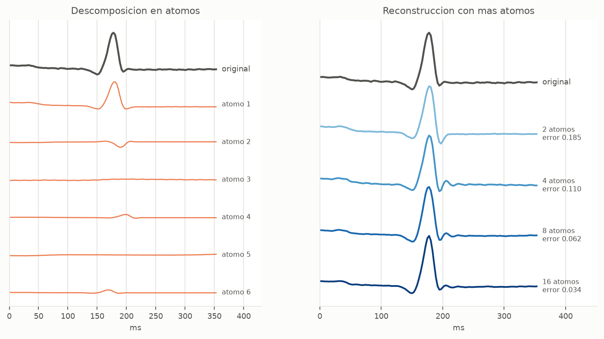
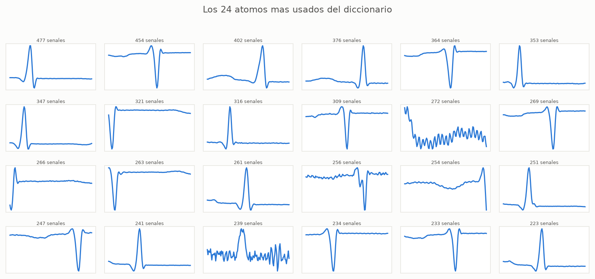

---
# =====================================================================
#  Ksvd.qmd
#  ========================
#
#
#  Descripcion:
#  ------------
#  Presentacion en Quarto con reveal.js del proyecto 1 de Matematicas
#  para la Computacion: representaciones dispersas con K-SVD sobre ECG
#  de MIT-BIH. Explica solo las bases necesarias, rango 1, SVD, OMP y
#  K-SVD, y como se aplicaron al proyecto.
#
#  Las regiones marcadas con los comentarios inicio:nombre y fin:nombre
#  las escribe FigurasPresentacion.py con los datos reales del
#  experimento; no se editan a mano. Se compila con
#  "quarto render Ksvd.qmd".
#
#  El encabezado va dentro del YAML y no en un comentario HTML despues
#  de el: Quarto convierte cualquier contenido previo al primer "##" en
#  una diapositiva, y el comentario dejaba una vacia en la posicion 2.
#
#
#  Metadata:
#  ----------
#   * Author: zxxz6 (Bryan Violante Arriaga)
#   * Version: 1.0.0
#
#
#  History:
#  ------------
#  Author      Date            Description
#  zxxz6       04/10/2026      El atomo C con el mismo desglose que B
#  zxxz6       04/10/2026      La reconstruccion de partida del paso SVD
#  zxxz6       04/10/2026      Los renglones de OMP aparecen con su fragmento
#  zxxz6       04/10/2026      Ejemplo de juguete del paso SVD
#  zxxz6       04/10/2026      Ejemplo de juguete de OMP paso a paso
#  zxxz6       04/10/2026      El paso SVD paso a paso y el diccionario mejorado
#  zxxz6       04/10/2026      Coautores y la serie SEE Matrix en referencias
#  zxxz6       04/10/2026      Creation
#
#
# =====================================================================
title: "Representaciones dispersas con K-SVD"
subtitle: "Dictionary Learning sobre señales de ECG"
author:
  - "Carlos Luis Bruzual Roa"
  - "Arturo Zabdí Reyes Pérez"
  - "Sergio Cesar Villanueva Estrada"
  - "Bryan Ezequiel Violante Arriaga"
lang: es
format:
  revealjs:
    theme: simple
    slide-number: true
    progress: true
    hash: true
    transition: fade
    html-math-method: katex
    embed-resources: true
    center: false
    width: 1280
    height: 720
    include-in-header:
      text: |
        <style>
        .reveal .slides section .aside,
        .reveal .slides section aside {
          position: absolute; bottom: 14px; left: 0; right: 0;
          font-size: 15px !important; line-height: 1.25; color: #777;
        }
        .reveal .slides section { padding-bottom: 40px; }
        .caja { position: absolute; }
        .caja svg { width: 100%; height: 100%; overflow: visible; }
        .panel { background: #f6f6f4; border-radius: 8px; }
        .ventana { background: rgba(42, 120, 214, 0.10);
          border: 2px solid #2a78d6; border-radius: 4px; }
        .t { fill: none; stroke-width: 2.4; stroke-linejoin: round;
          stroke-linecap: round; vector-effect: non-scaling-stroke; }
        .t.tinta { stroke: #52514e; }
        .t.azul { stroke: #2a78d6; }
        .t.naranja { stroke: #eb6834; }
        .t.aqua { stroke: #1baf7a; }
        .t.gris { stroke: #b8b7b0; }
        .t.fino { stroke-width: 1.6; }
        .t.punteado { stroke-dasharray: 7 5; stroke-width: 2.6; }
        .t.grueso { stroke-width: 3.4; }
        .eje { stroke: #b8b7b0; stroke-width: 1;
          vector-effect: non-scaling-stroke; }
        .dibuja { stroke-dasharray: 1; stroke-dashoffset: 1; }
        .reveal .present .dibuja { animation: dibuja 1.8s ease-out
          forwards; }
        .reveal .fragment .dibuja { animation: none; }
        .reveal .fragment.visible .dibuja { animation: dibuja 1.4s
          ease-out forwards; }
        @keyframes dibuja { to { stroke-dashoffset: 0; } }
        .crece { transform-origin: bottom; transform: scaleY(0); }
        .reveal .present .crece { animation: crece 0.9s ease-out
          forwards; }
        @keyframes crece { to { transform: scaleY(1); } }
        html.print-pdf .dibuja { stroke-dashoffset: 0; animation: none; }
        html.print-pdf .crece { transform: none; animation: none; }
        .barra { position: absolute; border-radius: 3px 3px 0 0; }
        .barra.h { border-radius: 0 4px 4px 0; }
        .azul-f { background: #2a78d6; }
        .naranja-f { background: #eb6834; }
        .aqua-f { background: #1baf7a; }
        .gris-f { background: #b8b7b0; }
        .chip { position: absolute; padding: 4px 12px; border-radius: 6px;
          font-size: 24px; background: #fff; color: #52514e;
          border: 2px solid #2a78d6; white-space: nowrap; }
        .chip.nuevo { border-color: #eb6834; }
        .etq { position: absolute; font-size: 26px; color: #52514e;
          line-height: 1.2; }
        .etq.c { text-align: center; }
        .etq.chica { font-size: 20px; }
        .etq.grande { font-size: 32px; }
        .etq.texto { font-size: 30px; line-height: 1.3; }
        .etq p { margin: 0; }
        .cuadro { position: absolute; width: 30px; height: 30px;
          border-radius: 4px; }
        .pulso { animation: pulso 1.6s ease-in-out infinite; }
        @keyframes pulso { 0%, 100% { opacity: 0.45; }
          50% { opacity: 1; } }
        .ksvd-fig text { font-family: inherit; }
        .ksvd-fig .flujo { stroke-dasharray: 9 6;
          animation: marcha 0.9s linear infinite; }
        @keyframes marcha { to { stroke-dashoffset: -30; } }
        .algo { border-top: 2px solid #000; border-bottom: 2px solid #000;
          font-size: 27px; line-height: 1.3; margin-top: 0; }
        .algo p { margin: 0; }
        .algo .cap { border-bottom: 1px solid #000; padding: 3px 0; }
        .algo .line-block { margin: 4px 0 0 0; }
        .algo .ln { display: inline-block; width: 2.1em; color: #444;
          font-size: 85%; }
        .algo .i1 { display: inline-block; margin-left: 1.6em; }
        .algo .req { padding: 3px 0 3px 2.1em; text-indent: -2.1em; }
        .algo .com { color: #2a78d6; font-size: 85%; }
        .tabla-montaje table { font-size: 27px; }
        .producto { position: absolute; display: grid; gap: 6px; }
        .producto div { width: 64px; height: 64px; display: flex;
          align-items: center; justify-content: center; font-size: 26px;
          border-radius: 6px; }
        .producto .u { background: #dbe7f6; }
        .producto .v { background: #fbe0d4; }
        .producto .m { background: #eef0f2; }
        .producto.p1 { grid-template-columns: 64px; }
        .producto.p3 { grid-template-columns: repeat(3, 64px); }
        .muestra { display: inline-block; width: 18px; height: 18px;
          border-radius: 3px; margin-right: 8px; vertical-align: -2px; }
        .punto { stroke: #fcfcfb; stroke-width: 2; }
        .punto.azul { fill: #2a78d6; }
        .punto.naranja { fill: #eb6834; }
        .punto.aqua { fill: #1baf7a; }
        .aro { fill: none; stroke: #1baf7a; stroke-width: 3; }
        .cz { fill: #eef0f2; }
        .cn { fill: #9dbbe3; }
        .cj { fill: #eb6834; }
        .cjz { fill: #fbe0d4; }
        .k-x { left: 40px; top: 262px; width: 180px; }
        .k-omp { left: 272px; top: 224px; width: 310px; }
        .k-svd { left: 652px; top: 224px; width: 330px; }
        .k-dic { left: 1050px; top: 262px; width: 190px; }
        .k-rep { left: 427px; top: 528px; width: 720px; }
        #title-slide .quarto-title-authors { flex-direction: column;
          align-items: center; gap: 0; }
        #title-slide .quarto-title-author { padding: 2px 0; }
        #title-slide .portada-inst { font-size: 26px; margin: 6px 0 0; }
        #title-slide .portada-liga { font-size: 22px; color: #555; }
        .refs .columns { font-size: 21px; line-height: 1.3; }
        .refs li { margin-bottom: 12px; }
        .refs a { word-break: break-all; }
        .omp-j { font-size: 20px; color: #52514e; }
        .omp-j p { margin: 0; }
        .omp-j .intro { font-size: 22px; margin: 0 0 6px; }
        .omp-j .linea { font-size: 22px; margin: 8px 0 0; }
        .omp-j .nar { color: #eb6834; }
        .omp-j .paso { font-size: 21px; font-weight: 600; color: #2a78d6;
          margin: 6px 0 4px; }
        .omp-j .paso .num { display: inline-block; width: 28px;
          height: 28px; line-height: 28px; border-radius: 50%;
          background: #2a78d6; color: #fff; text-align: center;
          font-size: 17px; margin-right: 8px; }
        .omp-j .nota { font-size: 18px; line-height: 1.35;
          color: #52514e; }
        .omp-j .fila { display: flex; align-items: flex-start; gap: 8px;
          margin-bottom: 52px; }
        .omp-j .abajo { display: flex; gap: 48px;
          align-items: flex-start; }
        .omp-j .op { font-size: 30px; padding-top: 50px;
          white-space: nowrap; }
        .omp-j .mxw { position: relative; display: inline-flex;
          flex-direction: column; align-items: center; }
        .omp-j .mxc { position: absolute; top: 100%; left: -30px;
          right: -30px; font-size: 15px; line-height: 1.2;
          color: #6b6a65; text-align: center; margin-top: 4px; }
        .omp-j .mx { display: grid; position: relative; }
        .omp-j .mx > div { height: 34px; line-height: 34px;
          text-align: center; font-size: 22px; color: #2b2b2b; }
        .omp-j .mx .ch { height: 26px; line-height: 26px;
          font-size: 15px; color: #8a8984; white-space: nowrap; }
        .omp-j .mx .rh { font-size: 15px; color: #8a8984;
          white-space: nowrap;
          text-align: right; padding-right: 9px; }
        .omp-j .mx .chl { color: #eb6834; font-weight: 700; }
        .omp-j .mx > .cor { height: auto !important; align-self: stretch; position: relative;
          border-left: 2.5px solid #52514e;
          border-right: 2.5px solid #52514e; pointer-events: none; }
        .omp-j .mx .cor::before, .omp-j .mx .cor::after {
          content: ""; position: absolute; top: 0; bottom: 0;
          width: 7px; border-top: 2.5px solid #52514e;
          border-bottom: 2.5px solid #52514e; }
        .omp-j .mx .cor::before { left: 0; }
        .omp-j .mx .cor::after { right: 0; }
        .omp-j .mx .hn { background: #fbe0d4; }
        .omp-j .mx .ha { background: #d4f1e5; }
        .omp-j .mx .hb { background: #dbe7f6; }
        .omp-j .mx .hg { background: #eb6834; color: #fff;
          font-weight: 700; }
        .omp-j .mx .z { color: #b8b7b0; }
        .omp-j.g .mx > div { height: 40px; line-height: 40px;
          font-size: 26px; }
        .omp-j.g .mx .ch { height: 30px; line-height: 30px;
          font-size: 18px; }
        .omp-j.g .mx .rh { font-size: 18px; }
        .omp-j.g .mxc { font-size: 18px; }
        .omp-j.g .op { font-size: 36px; padding-top: 70px; }
        .omp-j .sistema { font-size: 21px; line-height: 1.55;
          margin: 4px 0 10px 8px; }
        .omp-j .sistema .eq { color: #8a8984; font-size: 17px;
          margin-left: 10px; }
        .omp-j table.resumen { font-size: 19px; margin: 8px 0 0;
          border-collapse: collapse; }
        .omp-j table.resumen th, .omp-j table.resumen td {
          padding: 3px 16px; border-bottom: 1px solid #ddd; }
        </style>
    include-after-body:
      text: |
        <script>
        (function () {
          var t = document.getElementById("title-slide");
          if (!t) return;
          var a = t.querySelector(".quarto-title-authors");
          var i = document.createElement("p");
          i.className = "portada-inst";
          i.textContent = "INAOE";
          if (a) a.insertAdjacentElement("afterend", i);
          var l = document.createElement("p");
          l.className = "portada-liga";
          l.textContent = "Matemáticas para la Computación, proyecto 1, " +
            "otoño 2026";
          t.appendChild(l);
        })();
        </script>
---


## Contenido

1. El problema
2. Las bases: rango 1, SVD, OMP y K-SVD
3. Aplicación al ECG
4. Resultados

::: {.notes}
Primero qué se quiere: describir una señal con pocas piezas. Luego las
cuatro herramientas que hacen falta, solo lo necesario. Después cómo se
montó sobre el ECG y qué salió.
:::

# El problema

## Objetivo {.smaller}

:::: {.columns}
::: {.column width="55%"}
> Implementar K-SVD y obtener una base entrenada para algún tipo de
> señal, de manera que se pueda comparar la señal original con su
> reconstrucción a partir de la señal dispersa.

- **Señal elegida:** electrocardiograma
- **Por qué:** se repite, latido tras latido. Un diccionario que
  *aprenda* esa forma debería describirla con pocas piezas
:::
::: {.column width="45%"}
{width="100%" fig-align="center"}
:::
::::

::: {.notes}
El enunciado pide tres cosas: implementar K-SVD, entrenar una base para
un tipo de señal y comparar original contra reconstrucción. La figura
de la derecha es justo el entregable, la vamos a ver con calma al
final.

Escogí ECG porque tiene estructura repetida. Esa repetición es lo que
un diccionario aprendido puede aprovechar y uno genérico no.
:::

## Una ventana, pocas piezas {auto-animate=true}

<!-- inicio:representacion_1 -->
```{=html}
<div class="caja panel" data-id="rep-panel"
  style="left:240px;top:140px;width:800px;height:260px;"></div>
<div class="caja" data-id="rep-x"
  style="left:240px;top:140px;width:800px;height:260px;">
<svg viewBox="0 0 800 260" preserveAspectRatio="none">
<polyline class="t tinta grueso dibuja" pathLength="1" points="
8.0,183.5 14.2,184.2 20.3,183.5 26.5,184.8 32.7,185.4 38.9,186.0
45.0,186.0 51.2,185.4 57.4,184.8 63.6,184.8 69.7,184.8 75.9,184.2
82.1,182.9 88.3,185.4 94.4,186.6 100.6,187.8 106.8,191.5 112.9,192.7
119.1,194.5 125.3,195.1 131.5,195.7 137.6,197.0 143.8,196.3 150.0,197.0
156.2,198.2 162.3,197.6 168.5,197.0 174.7,197.6 180.9,197.6 187.0,198.8
193.2,201.2 199.4,198.2 205.5,197.0 211.7,198.2 217.9,198.8 224.1,200.6
230.2,201.2 236.4,200.6 242.6,200.0 248.8,199.4 254.9,200.0 261.1,200.6
267.3,202.4 273.4,201.8 279.6,199.4 285.8,200.6 292.0,202.4 298.1,204.3
304.3,206.7 310.5,209.1 316.7,211.6 322.8,217.1 329.0,220.1 335.2,224.4
341.4,228.0 347.5,225.0 353.7,214.0 359.9,196.3 366.0,176.8 372.2,154.3
378.4,126.3 384.6,89.1 390.7,56.8 396.9,33.6 403.1,26.9 409.3,36.7
415.4,73.8 421.6,123.8 427.8,172.6 434.0,204.3 440.1,214.6 446.3,210.4
452.5,204.3 458.6,200.6 464.8,201.8 471.0,203.0 477.2,204.3 483.3,204.9
489.5,205.5 495.7,204.9 501.9,203.7 508.0,204.3 514.2,205.5 520.4,206.1
526.6,204.3 532.7,203.7 538.9,203.7 545.1,204.3 551.2,205.5 557.4,205.5
563.6,206.1 569.8,204.3 575.9,202.4 582.1,203.0 588.3,204.9 594.5,203.7
600.6,204.3 606.8,203.7 613.0,202.4 619.1,203.0 625.3,203.7 631.5,205.5
637.7,204.9 643.8,206.1 650.0,203.7 656.2,204.3 662.4,204.9 668.5,204.9
674.7,206.7 680.9,204.9 687.1,203.0 693.2,203.7 699.4,203.7 705.6,205.5
711.7,204.9 717.9,203.7 724.1,202.4 730.3,201.8 736.4,203.7 742.6,203.7
748.8,204.3 755.0,202.4 761.1,201.8 767.3,201.8 773.5,202.4 779.7,203.7
785.8,203.7 792.0,203.0"/>
</svg></div>
<div class="etq c" data-id="rep-tx"
  style="left:240px;top:412px;width:800px;">
una ventana del ECG: 128 números
</div>
```
<!-- fin:representacion_1 -->

::: {.notes}
Esto es una ventana real del ECG, 128 números. La pregunta del proyecto
es si se puede describir con muchos menos.
:::

## Una ventana, pocas piezas {auto-animate=true}

<!-- inicio:representacion_2 -->
```{=html}
<div class="caja panel" data-id="rep-panel"
  style="left:240px;top:140px;width:800px;height:260px;"></div>
<div class="caja" data-id="rep-x"
  style="left:240px;top:140px;width:800px;height:260px;">
<svg viewBox="0 0 800 260" preserveAspectRatio="none">
<polyline class="t tinta grueso" pathLength="1" points="
8.0,183.5 14.2,184.2 20.3,183.5 26.5,184.8 32.7,185.4 38.9,186.0
45.0,186.0 51.2,185.4 57.4,184.8 63.6,184.8 69.7,184.8 75.9,184.2
82.1,182.9 88.3,185.4 94.4,186.6 100.6,187.8 106.8,191.5 112.9,192.7
119.1,194.5 125.3,195.1 131.5,195.7 137.6,197.0 143.8,196.3 150.0,197.0
156.2,198.2 162.3,197.6 168.5,197.0 174.7,197.6 180.9,197.6 187.0,198.8
193.2,201.2 199.4,198.2 205.5,197.0 211.7,198.2 217.9,198.8 224.1,200.6
230.2,201.2 236.4,200.6 242.6,200.0 248.8,199.4 254.9,200.0 261.1,200.6
267.3,202.4 273.4,201.8 279.6,199.4 285.8,200.6 292.0,202.4 298.1,204.3
304.3,206.7 310.5,209.1 316.7,211.6 322.8,217.1 329.0,220.1 335.2,224.4
341.4,228.0 347.5,225.0 353.7,214.0 359.9,196.3 366.0,176.8 372.2,154.3
378.4,126.3 384.6,89.1 390.7,56.8 396.9,33.6 403.1,26.9 409.3,36.7
415.4,73.8 421.6,123.8 427.8,172.6 434.0,204.3 440.1,214.6 446.3,210.4
452.5,204.3 458.6,200.6 464.8,201.8 471.0,203.0 477.2,204.3 483.3,204.9
489.5,205.5 495.7,204.9 501.9,203.7 508.0,204.3 514.2,205.5 520.4,206.1
526.6,204.3 532.7,203.7 538.9,203.7 545.1,204.3 551.2,205.5 557.4,205.5
563.6,206.1 569.8,204.3 575.9,202.4 582.1,203.0 588.3,204.9 594.5,203.7
600.6,204.3 606.8,203.7 613.0,202.4 619.1,203.0 625.3,203.7 631.5,205.5
637.7,204.9 643.8,206.1 650.0,203.7 656.2,204.3 662.4,204.9 668.5,204.9
674.7,206.7 680.9,204.9 687.1,203.0 693.2,203.7 699.4,203.7 705.6,205.5
711.7,204.9 717.9,203.7 724.1,202.4 730.3,201.8 736.4,203.7 742.6,203.7
748.8,204.3 755.0,202.4 761.1,201.8 767.3,201.8 773.5,202.4 779.7,203.7
785.8,203.7 792.0,203.0"/>
</svg></div>
<div class="etq c" data-id="rep-tx"
  style="left:240px;top:412px;width:800px;">
una ventana del ECG: 128 números
</div>
<div class="caja panel" data-id="rep-pp0"
  style="left:70px;top:470px;width:340px;height:150px;"></div>
<div class="caja" data-id="rep-p0"
  style="left:70px;top:470px;width:340px;height:150px;">
<svg viewBox="0 0 340 150" preserveAspectRatio="none">
<polyline class="t naranja" pathLength="1" points="
8.0,100.4 10.6,100.4 13.1,101.0 15.7,101.4 18.2,101.5 20.8,101.0
23.3,101.0 25.9,101.6 28.4,101.7 31.0,101.4 33.5,101.0 36.1,100.1
38.6,100.3 41.2,100.6 43.7,101.5 46.3,102.5 48.8,103.2 51.4,105.0
53.9,105.9 56.5,107.0 59.0,108.0 61.6,109.4 64.1,110.1 66.7,110.4
69.2,110.7 71.8,110.9 74.3,111.9 76.9,111.7 79.4,112.1 82.0,111.7
84.5,112.1 87.1,112.2 89.6,112.4 92.2,112.8 94.7,112.9 97.3,112.7
99.8,112.4 102.4,112.6 104.9,113.0 107.5,113.6 110.0,113.3 112.6,113.4
115.1,113.4 117.7,113.4 120.3,113.8 122.8,113.9 125.4,114.3 127.9,114.5
130.5,115.4 133.0,117.0 135.6,118.8 138.1,121.5 140.7,123.0 143.2,124.6
145.8,126.3 148.3,126.0 150.9,123.0 153.4,116.2 156.0,106.3 158.5,94.3
161.1,80.6 163.6,63.8 166.2,45.1 168.7,29.3 171.3,19.3 173.8,17.2
176.4,26.3 178.9,47.3 181.5,75.0 184.0,100.5 186.6,117.0 189.1,125.2
191.7,126.5 194.2,124.9 196.8,122.6 199.3,120.3 201.9,119.1 204.4,118.2
207.0,117.8 209.5,117.8 212.1,117.7 214.6,117.8 217.2,118.1 219.7,118.1
222.3,117.6 224.9,118.3 227.4,118.4 230.0,118.0 232.5,117.9 235.1,118.0
237.6,117.6 240.2,117.9 242.7,118.1 245.3,118.3 247.8,118.0 250.4,117.9
252.9,117.8 255.5,117.8 258.0,117.4 260.6,117.9 263.1,117.8 265.7,117.4
268.2,117.2 270.8,117.3 273.3,118.0 275.9,117.9 278.4,117.6 281.0,117.7
283.5,117.2 286.1,117.7 288.6,117.5 291.2,118.0 293.7,117.8 296.3,117.5
298.8,117.4 301.4,117.4 303.9,117.8 306.5,118.0 309.0,118.2 311.6,118.3
314.1,117.9 316.7,118.0 319.2,117.6 321.8,117.8 324.3,118.1 326.9,117.8
329.4,117.6 332.0,117.9"/>
</svg></div>
<div class="etq c" data-id="rep-e0"
  style="left:70px;top:628px;width:340px;">
1.06 d<sub>204</sub>
</div>
<div class="caja panel" data-id="rep-pp1"
  style="left:460px;top:470px;width:340px;height:150px;"></div>
<div class="caja" data-id="rep-p1"
  style="left:460px;top:470px;width:340px;height:150px;">
<svg viewBox="0 0 340 150" preserveAspectRatio="none">
<polyline class="t naranja" pathLength="1" points="
8.0,110.1 10.6,110.2 13.1,110.3 15.7,110.3 18.2,110.3 20.8,110.5
23.3,110.5 25.9,110.5 28.4,110.4 31.0,110.2 33.5,110.1 36.1,110.1
38.6,110.2 41.2,110.2 43.7,110.2 46.3,110.1 48.8,110.1 51.4,110.2
53.9,110.4 56.5,110.3 59.0,110.0 61.6,109.8 64.1,109.6 66.7,109.5
69.2,109.3 71.8,109.2 74.3,108.8 76.9,108.6 79.4,108.4 82.0,108.5
84.5,108.5 87.1,108.4 89.6,108.4 92.2,108.3 94.7,108.3 97.3,108.3
99.8,108.3 102.4,108.3 104.9,108.2 107.5,108.2 110.0,108.2 112.6,108.1
115.1,108.2 117.7,108.1 120.3,108.1 122.8,108.0 125.4,108.0 127.9,108.1
130.5,108.1 133.0,108.1 135.6,108.1 138.1,108.0 140.7,107.8 143.2,107.6
145.8,107.3 148.3,106.9 150.9,106.3 153.4,105.7 156.0,105.2 158.5,104.9
161.1,105.4 163.6,106.7 166.2,108.5 168.7,110.9 171.3,113.9 173.8,118.0
176.4,122.8 178.9,126.6 181.5,128.8 184.0,128.6 186.6,125.4 189.1,119.6
191.7,113.1 194.2,108.3 196.8,105.9 199.3,105.7 201.9,106.4 204.4,107.3
207.0,107.6 209.5,107.7 212.1,107.5 214.6,107.4 217.2,107.5 219.7,107.5
222.3,107.7 224.9,107.6 227.4,107.6 230.0,107.5 232.5,107.4 235.1,107.5
237.6,107.6 240.2,107.6 242.7,107.5 245.3,107.3 247.8,107.3 250.4,107.5
252.9,107.6 255.5,107.6 258.0,107.6 260.6,107.4 263.1,107.4 265.7,107.5
268.2,107.5 270.8,107.4 273.3,107.5 275.9,107.3 278.4,107.4 281.0,107.4
283.5,107.5 286.1,107.5 288.6,107.5 291.2,107.3 293.7,107.3 296.3,107.4
298.8,107.5 301.4,107.5 303.9,107.5 306.5,107.4 309.0,107.4 311.6,107.4
314.1,107.5 316.7,107.5 319.2,107.5 321.8,107.4 324.3,107.3 326.9,107.4
329.4,107.5 332.0,107.4"/>
</svg></div>
<div class="etq c" data-id="rep-e1"
  style="left:460px;top:628px;width:340px;">
-0.21 d<sub>105</sub>
</div>
<div class="caja panel" data-id="rep-pp2"
  style="left:850px;top:470px;width:340px;height:150px;"></div>
<div class="caja" data-id="rep-p2"
  style="left:850px;top:470px;width:340px;height:150px;">
<svg viewBox="0 0 340 150" preserveAspectRatio="none">
<polyline class="t naranja" pathLength="1" points="
8.0,111.9 10.6,112.1 13.1,111.6 15.7,111.2 18.2,111.0 20.8,111.8
23.3,112.0 25.9,112.1 28.4,111.3 31.0,110.9 33.5,110.9 36.1,111.7
38.6,111.9 41.2,112.2 43.7,111.5 46.3,110.7 48.8,110.6 51.4,111.1
53.9,111.6 56.5,111.5 59.0,110.8 61.6,109.9 64.1,109.7 66.7,110.5
69.2,111.0 71.8,111.2 74.3,110.8 76.9,110.2 79.4,110.3 82.0,110.9
84.5,111.7 87.1,111.6 89.6,111.1 92.2,110.8 94.7,110.9 97.3,111.7
99.8,112.3 102.4,112.4 104.9,111.8 107.5,111.5 110.0,111.4 112.6,111.8
115.1,112.6 117.7,112.3 120.3,111.7 122.8,110.9 125.4,110.6 127.9,111.0
130.5,111.5 133.0,111.5 135.6,110.5 138.1,109.9 140.7,109.7 143.2,110.0
145.8,110.2 148.3,110.0 150.9,108.7 153.4,108.0 156.0,107.3 158.5,107.7
161.1,108.1 163.6,107.6 166.2,106.9 168.7,106.1 171.3,105.8 173.8,106.1
176.4,106.6 178.9,106.8 181.5,106.2 184.0,105.5 186.6,105.5 189.1,106.2
191.7,106.3 194.2,106.4 196.8,105.8 199.3,105.5 201.9,105.4 204.4,106.0
207.0,107.0 209.5,107.0 212.1,106.5 214.6,105.9 217.2,105.9 219.7,106.7
222.3,107.4 224.9,107.6 227.4,107.3 230.0,106.5 232.5,106.6 235.1,106.9
237.6,107.6 240.2,107.4 242.7,107.1 245.3,106.8 247.8,107.0 250.4,107.6
252.9,108.2 255.5,108.3 258.0,107.7 260.6,107.3 263.1,107.4 265.7,107.6
268.2,108.3 270.8,108.2 273.3,107.9 275.9,107.5 278.4,107.8 281.0,108.5
283.5,109.3 286.1,109.3 288.6,108.8 291.2,108.2 293.7,107.9 296.3,108.5
298.8,109.0 301.4,109.2 303.9,108.6 306.5,107.9 309.0,108.1 311.6,108.4
314.1,109.3 316.7,109.1 319.2,108.8 321.8,108.2 324.3,108.1 326.9,108.8
329.4,109.5 332.0,109.3"/>
</svg></div>
<div class="etq c" data-id="rep-e2"
  style="left:850px;top:628px;width:340px;">
0.11 d<sub>178</sub>
</div>
```
<!-- fin:representacion_2 -->

::: {.notes}
Tres átomos del diccionario entrenado, cada uno multiplicado por su
peso. Cada átomo también es una ventana de 128 números, pero el
diccionario es fijo: lo que hay que guardar por ventana son solo los
tres pesos y cuáles átomos.
:::

## Una ventana, pocas piezas {auto-animate=true}

<!-- inicio:representacion_3 -->
```{=html}
<div class="caja panel" data-id="rep-panel"
  style="left:240px;top:140px;width:800px;height:260px;"></div>
<div class="caja" data-id="rep-x"
  style="left:240px;top:140px;width:800px;height:260px;">
<svg viewBox="0 0 800 260" preserveAspectRatio="none">
<polyline class="t tinta grueso" pathLength="1" points="
8.0,183.5 14.2,184.2 20.3,183.5 26.5,184.8 32.7,185.4 38.9,186.0
45.0,186.0 51.2,185.4 57.4,184.8 63.6,184.8 69.7,184.8 75.9,184.2
82.1,182.9 88.3,185.4 94.4,186.6 100.6,187.8 106.8,191.5 112.9,192.7
119.1,194.5 125.3,195.1 131.5,195.7 137.6,197.0 143.8,196.3 150.0,197.0
156.2,198.2 162.3,197.6 168.5,197.0 174.7,197.6 180.9,197.6 187.0,198.8
193.2,201.2 199.4,198.2 205.5,197.0 211.7,198.2 217.9,198.8 224.1,200.6
230.2,201.2 236.4,200.6 242.6,200.0 248.8,199.4 254.9,200.0 261.1,200.6
267.3,202.4 273.4,201.8 279.6,199.4 285.8,200.6 292.0,202.4 298.1,204.3
304.3,206.7 310.5,209.1 316.7,211.6 322.8,217.1 329.0,220.1 335.2,224.4
341.4,228.0 347.5,225.0 353.7,214.0 359.9,196.3 366.0,176.8 372.2,154.3
378.4,126.3 384.6,89.1 390.7,56.8 396.9,33.6 403.1,26.9 409.3,36.7
415.4,73.8 421.6,123.8 427.8,172.6 434.0,204.3 440.1,214.6 446.3,210.4
452.5,204.3 458.6,200.6 464.8,201.8 471.0,203.0 477.2,204.3 483.3,204.9
489.5,205.5 495.7,204.9 501.9,203.7 508.0,204.3 514.2,205.5 520.4,206.1
526.6,204.3 532.7,203.7 538.9,203.7 545.1,204.3 551.2,205.5 557.4,205.5
563.6,206.1 569.8,204.3 575.9,202.4 582.1,203.0 588.3,204.9 594.5,203.7
600.6,204.3 606.8,203.7 613.0,202.4 619.1,203.0 625.3,203.7 631.5,205.5
637.7,204.9 643.8,206.1 650.0,203.7 656.2,204.3 662.4,204.9 668.5,204.9
674.7,206.7 680.9,204.9 687.1,203.0 693.2,203.7 699.4,203.7 705.6,205.5
711.7,204.9 717.9,203.7 724.1,202.4 730.3,201.8 736.4,203.7 742.6,203.7
748.8,204.3 755.0,202.4 761.1,201.8 767.3,201.8 773.5,202.4 779.7,203.7
785.8,203.7 792.0,203.0"/>
</svg></div>
<div class="caja panel" data-id="rep-pp0"
  style="left:70px;top:470px;width:340px;height:150px;
  opacity:0;"></div>
<div class="caja" data-id="rep-p0"
  style="left:240px;top:140px;width:800px;height:260px;
  opacity:0.7;">
<svg viewBox="0 0 800 260" preserveAspectRatio="none">
<polyline class="t naranja fino" pathLength="1" points="
8.0,176.3 14.2,176.3 20.3,177.3 26.5,178.1 32.7,178.3 38.9,177.4
45.0,177.4 51.2,178.4 57.4,178.5 63.6,178.1 69.7,177.3 75.9,175.8
82.1,176.1 88.3,176.6 94.4,178.2 100.6,180.1 106.8,181.4 112.9,184.5
119.1,186.2 125.3,188.3 131.5,190.2 137.6,192.7 143.8,194.0 150.0,194.5
156.2,195.1 162.3,195.4 168.5,197.1 174.7,196.9 180.9,197.5 187.0,196.9
193.2,197.6 199.4,197.7 205.5,198.1 211.7,198.8 217.9,199.1 224.1,198.6
230.2,198.1 236.4,198.4 242.6,199.3 248.8,200.3 254.9,199.8 261.1,199.9
267.3,199.9 273.4,199.9 279.6,200.6 285.8,200.9 292.0,201.6 298.1,201.9
304.3,203.5 310.5,206.5 316.7,209.8 322.8,214.6 329.0,217.4 335.2,220.4
341.4,223.5 347.5,222.8 353.7,217.5 359.9,205.1 366.0,187.0 372.2,165.1
378.4,140.2 384.6,109.6 390.7,75.5 396.9,46.8 403.1,28.5 409.3,24.8
415.4,41.3 421.6,79.6 427.8,130.1 434.0,176.4 440.1,206.5 446.3,221.4
452.5,223.8 458.6,220.9 464.8,216.8 471.0,212.5 477.2,210.4 483.3,208.7
489.5,207.9 495.7,208.0 501.9,207.8 508.0,208.0 514.2,208.4 520.4,208.4
526.6,207.6 532.7,208.9 538.9,209.0 545.1,208.3 551.2,208.2 557.4,208.3
563.6,207.6 569.8,208.2 575.9,208.5 582.1,208.9 588.3,208.4 594.5,208.1
600.6,207.9 606.8,208.0 613.0,207.3 619.1,208.1 625.3,208.0 631.5,207.2
637.7,206.8 643.8,207.1 650.0,208.3 656.2,208.1 662.4,207.5 668.5,207.7
674.7,206.8 680.9,207.8 687.1,207.4 693.2,208.3 699.4,207.8 705.6,207.4
711.7,207.3 717.9,207.3 724.1,207.9 730.3,208.3 736.4,208.7 742.6,208.9
748.8,208.1 755.0,208.3 761.1,207.6 767.3,208.0 773.5,208.4 779.7,208.0
785.8,207.7 792.0,208.2"/>
</svg></div>
<div class="etq c" data-id="rep-e0"
  style="left:70px;top:628px;width:340px;
  opacity:0;">
1.06 d<sub>204</sub>
</div>
<div class="caja panel" data-id="rep-pp1"
  style="left:460px;top:470px;width:340px;height:150px;
  opacity:0;"></div>
<div class="caja" data-id="rep-p1"
  style="left:240px;top:140px;width:800px;height:260px;
  opacity:0.7;">
<svg viewBox="0 0 800 260" preserveAspectRatio="none">
<polyline class="t naranja fino" pathLength="1" points="
8.0,193.9 14.2,194.1 20.3,194.2 26.5,194.3 32.7,194.3 38.9,194.6
45.0,194.6 51.2,194.6 57.4,194.5 63.6,194.2 69.7,194.0 75.9,193.9
82.1,194.1 88.3,194.1 94.4,194.2 100.6,193.9 106.8,193.8 112.9,194.1
119.1,194.4 125.3,194.3 131.5,193.8 137.6,193.4 143.8,193.1 150.0,192.8
156.2,192.4 162.3,192.2 168.5,191.6 174.7,191.2 180.9,190.9 187.0,190.9
193.2,190.9 199.4,190.9 205.5,190.7 211.7,190.7 217.9,190.6 224.1,190.7
230.2,190.6 236.4,190.6 242.6,190.5 248.8,190.5 254.9,190.5 261.1,190.2
267.3,190.5 273.4,190.3 279.6,190.2 285.8,190.2 292.0,190.2 298.1,190.2
304.3,190.3 310.5,190.2 316.7,190.3 322.8,190.1 329.0,189.8 335.2,189.4
341.4,188.8 347.5,188.1 353.7,187.1 359.9,185.9 366.0,185.0 372.2,184.5
378.4,185.4 384.6,187.7 390.7,191.1 396.9,195.4 403.1,200.8 409.3,208.3
415.4,217.0 421.6,224.0 427.8,228.0 434.0,227.6 440.1,221.9 446.3,211.2
452.5,199.5 458.6,190.6 464.8,186.2 471.0,185.9 477.2,187.2 483.3,188.8
489.5,189.4 495.7,189.5 501.9,189.1 508.0,189.1 514.2,189.2 520.4,189.2
526.6,189.5 532.7,189.3 538.9,189.3 545.1,189.1 551.2,189.0 557.4,189.1
563.6,189.3 569.8,189.3 575.9,189.1 582.1,188.8 588.3,188.8 594.5,189.1
600.6,189.3 606.8,189.3 613.0,189.3 619.1,189.0 625.3,189.0 631.5,189.1
637.7,189.2 643.8,189.1 650.0,189.1 656.2,188.8 662.4,189.0 668.5,189.0
674.7,189.1 680.9,189.2 687.1,189.1 693.2,188.9 699.4,188.9 705.6,189.1
711.7,189.1 717.9,189.2 724.1,189.1 730.3,189.0 736.4,189.0 742.6,189.0
748.8,189.1 755.0,189.2 761.1,189.2 767.3,189.1 773.5,188.9 779.7,189.0
785.8,189.2 792.0,189.0"/>
</svg></div>
<div class="etq c" data-id="rep-e1"
  style="left:460px;top:628px;width:340px;
  opacity:0;">
-0.21 d<sub>105</sub>
</div>
<div class="caja panel" data-id="rep-pp2"
  style="left:850px;top:470px;width:340px;height:150px;
  opacity:0;"></div>
<div class="caja" data-id="rep-p2"
  style="left:240px;top:140px;width:800px;height:260px;
  opacity:0.7;">
<svg viewBox="0 0 800 260" preserveAspectRatio="none">
<polyline class="t naranja fino" pathLength="1" points="
8.0,197.1 14.2,197.6 20.3,196.7 26.5,195.9 32.7,195.5 38.9,197.0
45.0,197.4 51.2,197.5 57.4,196.0 63.6,195.4 69.7,195.4 75.9,196.7
82.1,197.2 88.3,197.7 94.4,196.5 100.6,195.1 106.8,194.8 112.9,195.8
119.1,196.6 125.3,196.5 131.5,195.1 137.6,193.6 143.8,193.2 150.0,194.6
156.2,195.6 162.3,196.0 168.5,195.2 174.7,194.1 180.9,194.2 187.0,195.4
193.2,196.9 199.4,196.6 205.5,195.8 211.7,195.2 217.9,195.4 224.1,196.8
230.2,197.9 236.4,198.1 242.6,197.1 248.8,196.4 254.9,196.2 261.1,196.9
267.3,198.4 273.4,198.0 279.6,196.8 285.8,195.4 292.0,194.9 298.1,195.5
304.3,196.4 310.5,196.5 316.7,194.7 322.8,193.6 329.0,193.1 335.2,193.7
341.4,194.0 347.5,193.7 353.7,191.3 359.9,190.1 366.0,188.8 372.2,189.5
378.4,190.2 384.6,189.4 390.7,188.1 396.9,186.6 403.1,186.1 409.3,186.6
415.4,187.5 421.6,187.8 427.8,186.8 434.0,185.6 440.1,185.6 446.3,186.7
452.5,187.0 458.6,187.1 464.8,186.1 471.0,185.6 477.2,185.3 483.3,186.4
489.5,188.2 495.7,188.2 501.9,187.4 508.0,186.2 514.2,186.4 520.4,187.8
526.6,189.0 532.7,189.4 538.9,188.8 545.1,187.4 551.2,187.5 557.4,188.2
563.6,189.3 569.8,189.0 575.9,188.5 582.1,187.9 588.3,188.3 594.5,189.3
600.6,190.4 606.8,190.6 613.0,189.6 619.1,188.7 625.3,188.9 631.5,189.4
637.7,190.6 643.8,190.5 650.0,189.9 656.2,189.1 662.4,189.7 668.5,191.0
674.7,192.4 680.9,192.5 687.1,191.6 693.2,190.4 699.4,190.0 705.6,191.1
711.7,191.8 717.9,192.2 724.1,191.2 730.3,189.9 736.4,190.2 742.6,190.8
748.8,192.4 755.0,192.1 761.1,191.5 767.3,190.4 773.5,190.3 779.7,191.6
785.8,192.9 792.0,192.5"/>
</svg></div>
<div class="etq c" data-id="rep-e2"
  style="left:850px;top:628px;width:340px;
  opacity:0;">
0.11 d<sub>178</sub>
</div>
<div class="caja" data-id="rep-suma"
  style="left:240px;top:140px;width:800px;height:260px;">
<svg viewBox="0 0 800 260" preserveAspectRatio="none">
<polyline class="t azul grueso dibuja" pathLength="1" points="
8.0,183.1 14.2,183.8 20.3,184.0 26.5,184.1 32.7,183.9 38.9,184.8
45.0,185.3 51.2,186.4 57.4,184.9 63.6,183.5 69.7,182.6 75.9,182.3
82.1,183.3 88.3,184.3 94.4,184.7 100.6,184.9 106.8,185.9 112.9,190.2
119.1,193.1 125.3,194.9 131.5,194.9 137.6,195.5 143.8,196.1 150.0,197.8
156.2,199.0 162.3,199.4 168.5,199.7 174.7,198.0 180.9,198.4 187.0,199.0
193.2,201.3 199.4,201.0 205.5,200.5 211.7,200.5 217.9,200.9 224.1,201.9
230.2,202.5 236.4,202.9 242.6,202.7 248.8,203.0 254.9,202.4 261.1,202.9
267.3,204.7 273.4,204.0 279.6,203.4 285.8,202.3 292.0,202.5 298.1,203.5
304.3,206.0 310.5,209.0 316.7,210.6 322.8,214.2 329.0,216.1 335.2,219.3
341.4,222.2 347.5,220.5 353.7,211.7 359.9,196.9 366.0,176.6 372.2,154.9
378.4,131.6 384.6,102.5 390.7,70.4 396.9,44.5 403.1,31.3 409.3,35.6
415.4,61.7 421.6,107.3 427.8,160.7 434.0,205.4 440.1,229.8 446.3,235.2
452.5,226.1 458.6,214.5 464.8,204.9 471.0,199.8 477.2,198.7 483.3,199.7
489.5,201.4 495.7,201.5 501.9,200.1 508.0,199.0 514.2,199.8 520.4,201.3
526.6,201.9 532.7,203.5 538.9,202.9 545.1,200.6 551.2,200.5 557.4,201.4
563.6,202.0 569.8,202.3 575.9,201.9 582.1,201.4 588.3,201.3 594.5,202.3
600.6,203.4 606.8,203.8 613.0,202.0 619.1,201.7 625.3,201.8 631.5,201.5
637.7,202.4 643.8,202.5 650.0,203.2 656.2,201.9 662.4,202.1 668.5,203.6
674.7,204.2 680.9,205.3 687.1,203.9 693.2,203.4 699.4,202.5 705.6,203.4
711.7,204.1 717.9,204.6 724.1,204.0 730.3,203.0 736.4,203.7 742.6,204.6
748.8,205.5 755.0,205.4 761.1,204.1 767.3,203.3 773.5,203.4 779.7,204.4
785.8,205.5 792.0,205.6"/>
</svg></div>
```

::: {.etq .c .grande style="left:140px; top:425px; width:1000px;"}
$x \approx 1.06\,d_{204} - 0.21\,d_{105} + 0.11\,d_{178}$
:::

::: {.etq .c style="left:140px; top:500px; width:1000px;"}
3 números en lugar de 128, con error relativo de **0.150**
:::
<!-- fin:representacion_3 -->

::: {.notes}
Sumados, los tres átomos dan la curva azul, que ya se parece mucho a la
original. Tres números en lugar de 128, con 15 por ciento de error. Con
más átomos el error baja, lo vemos en los resultados.
:::

## En forma de matrices

```{=html}
<svg class="ksvd-fig" viewBox="0 0 1280 720" width="1280" height="720"
  style="position:absolute; top:0; left:0; pointer-events:none;">
<rect x="110" y="170" width="44" height="300" rx="4" fill="#eef0f2"
  stroke="#52514e" stroke-width="2"/>
<g>
<rect x="290" y="170" width="600" height="300" rx="4" fill="#f6f6f4"
  stroke="#52514e" stroke-width="2"/>
<g stroke="#e8e7e2" stroke-width="2">
<line x1="327" y1="172" x2="327" y2="468"/>
<line x1="365" y1="172" x2="365" y2="468"/>
<line x1="402" y1="172" x2="402" y2="468"/>
<line x1="440" y1="172" x2="440" y2="468"/>
<line x1="477" y1="172" x2="477" y2="468"/>
<line x1="515" y1="172" x2="515" y2="468"/>
<line x1="552" y1="172" x2="552" y2="468"/>
<line x1="590" y1="172" x2="590" y2="468"/>
<line x1="627" y1="172" x2="627" y2="468"/>
<line x1="665" y1="172" x2="665" y2="468"/>
<line x1="702" y1="172" x2="702" y2="468"/>
<line x1="740" y1="172" x2="740" y2="468"/>
<line x1="777" y1="172" x2="777" y2="468"/>
<line x1="815" y1="172" x2="815" y2="468"/>
<line x1="852" y1="172" x2="852" y2="468"/>
</g>
</g>
<rect x="1010" y="100" width="44" height="440" rx="4" fill="#eef0f2"
  stroke="#52514e" stroke-width="2"/>
<g stroke="#e8e7e2" stroke-width="1.5">
<line x1="1012" y1="127" x2="1052" y2="127"/>
<line x1="1012" y1="155" x2="1052" y2="155"/>
<line x1="1012" y1="182" x2="1052" y2="182"/>
<line x1="1012" y1="210" x2="1052" y2="210"/>
<line x1="1012" y1="237" x2="1052" y2="237"/>
<line x1="1012" y1="265" x2="1052" y2="265"/>
<line x1="1012" y1="292" x2="1052" y2="292"/>
<line x1="1012" y1="320" x2="1052" y2="320"/>
<line x1="1012" y1="347" x2="1052" y2="347"/>
<line x1="1012" y1="375" x2="1052" y2="375"/>
<line x1="1012" y1="402" x2="1052" y2="402"/>
<line x1="1012" y1="430" x2="1052" y2="430"/>
<line x1="1012" y1="457" x2="1052" y2="457"/>
<line x1="1012" y1="485" x2="1052" y2="485"/>
<line x1="1012" y1="512" x2="1052" y2="512"/>
</g>
<g class="fragment" data-fragment-index="1">
<rect class="pulso" x="402" y="172" width="38" height="296"
  fill="#eb6834" opacity="0.8"/>
<rect class="pulso" x="627" y="172" width="38" height="296"
  fill="#eb6834" opacity="0.8"/>
<rect class="pulso" x="777" y="172" width="38" height="296"
  fill="#eb6834" opacity="0.8"/>
<rect class="pulso" x="1012" y="183" width="40" height="27"
  fill="#eb6834"/>
<rect class="pulso" x="1012" y="348" width="40" height="27"
  fill="#eb6834"/>
<rect class="pulso" x="1012" y="458" width="40" height="27"
  fill="#eb6834"/>
</g>
</svg>
```

::: {.etq .c style="left:72px; top:485px; width:120px;"}
$x$<br>$128 \times 1$
:::

::: {.etq .c .grande style="left:205px; top:300px; width:60px;"}
$\approx$
:::

::: {.etq .c style="left:290px; top:485px; width:600px;"}
$D$, el diccionario: $128 \times 256$<br>cada columna es un átomo
:::

::: {.etq .c style="left:962px; top:555px; width:140px;"}
$\alpha$<br>$256 \times 1$
:::

::: {.etq .c .fragment fragment-index="1"
    style="left:150px;top:600px;width:760px"}
De 256 pesos, casi todos valen **cero**: solo trabajan unos cuantos
átomos.
:::

::: {.notes}
Lo mismo en matrices. La ventana x es una columna de 128. El
diccionario D tiene 256 columnas, una por átomo. Y alfa trae un peso
por átomo.

Como hay más átomos que muestras, el sistema tiene infinitas soluciones.
De todas buscamos la más dispersa, la que usa menos átomos: en naranja,
las tres columnas que trabajan y sus tres pesos.
:::

# Las bases

## Rango 1: columna por fila

::: {.producto .p1 style="left:150px;top:220px"}
::: {.u}
2
:::
::: {.u}
1
:::
::: {.u}
3
:::
:::

::: {.producto .p3 style="left:270px;top:140px"}
::: {.v}
1
:::
::: {.v}
2
:::
::: {.v}
3
:::
:::

::: {.producto .p3 .fragment fragment-index="1"
    style="left:270px;top:220px"}
::: {.m}
2
:::
::: {.m}
4
:::
::: {.m}
6
:::
::: {.m}
1
:::
::: {.m}
2
:::
::: {.m}
3
:::
::: {.m}
3
:::
::: {.m}
6
:::
::: {.m}
9
:::
:::

::: {.etq .c style="left:120px; top:440px; width:130px;"}
$u$
:::

::: {.etq .c style="left:270px; top:100px; width:204px;"}
$v^{\mathsf T}$
:::

::: {.etq .texto style="left:590px;top:180px;width:630px"}
Una columna por una fila da una matriz donde **todas las columnas son
múltiplos de la misma**.

<br>

Eso es una matriz de **rango 1**: tiene una sola dirección genuina.
:::

::: {.etq .texto .fragment fragment-index="2"
    style="left:590px;top:450px;width:630px"}
En K-SVD, un átomo por sus pesos, $d_j\,\alpha_j^{\mathsf T}$, es
justo esto. **Siempre es de rango 1.**
:::

::: {.notes}
El rango es cuántas columnas son de verdad independientes. Aquí la
segunda columna es la primera por 2 y la tercera por 3: una sola
dirección, rango 1.

Lo importante para el proyecto es la última frase: un átomo por sus
pesos tiene exactamente esta forma, columna por fila. Eso va a decidir
cómo se actualiza cada átomo.
:::

## La SVD como suma de piezas de rango 1 {.smaller}

Toda matriz se descompone como $A = U \Sigma V^{\mathsf T}$, y eso se
puede leer como una suma:

$$
A = \sigma_1\, u_1 v_1^{\mathsf T} + \sigma_2\, u_2 v_2^{\mathsf T} +
\sigma_3\, u_3 v_3^{\mathsf T} + \cdots
\qquad \sigma_1 \ge \sigma_2 \ge \sigma_3 \ge \cdots
$$

Cada pieza es de rango 1, y vienen ordenadas de la que más pesa a la
que menos.

::: {.fragment}
**Teorema de Eckart-Young.** Quedarse con las primeras $k$ piezas da
la **mejor aproximación de rango $k$**: ninguna otra matriz de rango
$k$ queda más cerca. Y lo que se pierde se sabe de antemano:

$$
\lVert A - A_k \rVert^2 = \sigma_{k+1}^2 + \sigma_{k+2}^2 + \cdots
$$
:::

::: {.notes}
La SVD parte cualquier matriz en piezas de rango 1, cada una pesada
por un valor singular, ordenadas de mayor a menor.

Eckart-Young dice algo muy fuerte: la mejor aproximación de rango k no
es solo la mejor entre las truncaciones de esta suma, es la mejor entre
todas las matrices de rango k que existen. Y el error son los sigma que
se tiraron.

Para K-SVD solo vamos a necesitar k igual a 1: la primera pieza.
:::

## OMP: cada ventana escoge sus átomos

::: {.algo}
::: {.cap}
**Algoritmo 1** Orthogonal Matching Pursuit
:::

::: {.req}
**Requiere:** diccionario $D$, ventana $x$, error objetivo
$\varepsilon = 0.1$, tope de 16 átomos
:::

| [1:]{.ln}$r \leftarrow x$, $\quad S \leftarrow \emptyset$
| [2:]{.ln}**mientras** $\lVert r \rVert / \lVert x \rVert >
 \varepsilon$ **hacer**
| [3:]{.ln}[$i \leftarrow \arg\max_i \lvert d_i^{\mathsf T} r \rvert$
 [escoger el átomo más parecido a lo que falta]{.com}]{.i1}
| [4:]{.ln}[$S \leftarrow S \cup \{i\}$]{.i1}
| [5:]{.ln}[$\alpha_S \leftarrow$ mínimos cuadrados de $x$ sobre $D_S$
 [reajustar **todos** los pesos]{.com}]{.i1}
| [6:]{.ln}[$r \leftarrow x - D_S\,\alpha_S$]{.i1}
| [7:]{.ln}**devolver** $\alpha$
:::

<br>

::: {.fragment}
El paso 5 es el *orthogonal* del nombre: deja el residual perpendicular
a todos los átomos escogidos, así que **ninguno se repite**.
:::

::: {.notes}
OMP es voraz. En cada vuelta escoge el átomo con mayor producto punto
contra el residual, lo que falta por explicar.

El detalle está en la línea 5: no solo se calcula el peso del átomo
nuevo, se recalculan todos. Por eso se llama orthogonal, y por eso un
átomo ya escogido nunca vuelve a ganar: el residual ya no tiene nada de
él.

Para cuando el error relativo baja de 0.1 o llega a 16 átomos.
:::

## OMP paso a paso: un ejemplo de juguete {#omp-juguete-datos}

```{=html}
<div class="omp-j g">
<p class="intro">Átomos de <b>3</b> números (en vez de 128) y <b>4</b>
átomos (en vez de 256). El procedimiento es exactamente el mismo.</p>
<div class="fila" style="margin-top:26px;margin-bottom:110px;justify-content:center;">
<div class="mxw"><div class="mx" style="grid-template-columns:auto repeat(2, 74px);"><div class="ch" style="grid-row:1;grid-column:2;">v₁</div><div class="ch" style="grid-row:1;grid-column:3;">v₂</div><div class="rh" style="grid-row:2;grid-column:1;">muestra 1</div><div class="c hb" style="grid-row:2;grid-column:2;">1</div><div class="c hb" style="grid-row:2;grid-column:3;">0.9</div><div class="rh" style="grid-row:3;grid-column:1;">muestra 2</div><div class="c hb" style="grid-row:3;grid-column:2;">1</div><div class="c hb" style="grid-row:3;grid-column:3;">1</div><div class="rh" style="grid-row:4;grid-column:1;">muestra 3</div><div class="c hb" style="grid-row:4;grid-column:2;">0.5</div><div class="c hb" style="grid-row:4;grid-column:3;">0</div><div class="cor" style="grid-row:2 / span 3;grid-column:2 / span 2;"></div></div><div class="mxc"><b>X</b> · 3 × 2<br>filas: muestras<br>columnas: ventanas</div></div>
<div class="op">≈</div>
<div class="mxw"><div class="mx" style="grid-template-columns:auto repeat(4, 74px);"><div class="ch" style="grid-row:1;grid-column:2;">A</div><div class="ch" style="grid-row:1;grid-column:3;">B</div><div class="ch" style="grid-row:1;grid-column:4;">C</div><div class="ch" style="grid-row:1;grid-column:5;">E</div><div class="rh" style="grid-row:2;grid-column:1;">muestra 1</div><div class="c" style="grid-row:2;grid-column:2;">1</div><div class="c" style="grid-row:2;grid-column:3;">0.6</div><div class="c" style="grid-row:2;grid-column:4;">0</div><div class="c" style="grid-row:2;grid-column:5;">0</div><div class="rh" style="grid-row:3;grid-column:1;">muestra 2</div><div class="c" style="grid-row:3;grid-column:2;">0</div><div class="c" style="grid-row:3;grid-column:3;">0.8</div><div class="c" style="grid-row:3;grid-column:4;">0</div><div class="c" style="grid-row:3;grid-column:5;">1</div><div class="rh" style="grid-row:4;grid-column:1;">muestra 3</div><div class="c" style="grid-row:4;grid-column:2;">0</div><div class="c" style="grid-row:4;grid-column:3;">0</div><div class="c" style="grid-row:4;grid-column:4;">1</div><div class="c" style="grid-row:4;grid-column:5;">0</div><div class="cor" style="grid-row:2 / span 3;grid-column:2 / span 4;"></div></div><div class="mxc"><b>D</b> · 3 × 4<br>filas: muestras<br>columnas: átomos</div></div>
<div class="op">·</div>
<div class="mxw"><div class="mx" style="grid-template-columns:auto repeat(2, 74px);"><div class="ch" style="grid-row:1;grid-column:2;">v₁</div><div class="ch" style="grid-row:1;grid-column:3;">v₂</div><div class="rh" style="grid-row:2;grid-column:1;">A</div><div class="c hn" style="grid-row:2;grid-column:2;">?</div><div class="c hn" style="grid-row:2;grid-column:3;">?</div><div class="rh" style="grid-row:3;grid-column:1;">B</div><div class="c hn" style="grid-row:3;grid-column:2;">?</div><div class="c hn" style="grid-row:3;grid-column:3;">?</div><div class="rh" style="grid-row:4;grid-column:1;">C</div><div class="c hn" style="grid-row:4;grid-column:2;">?</div><div class="c hn" style="grid-row:4;grid-column:3;">?</div><div class="rh" style="grid-row:5;grid-column:1;">E</div><div class="c hn" style="grid-row:5;grid-column:2;">?</div><div class="c hn" style="grid-row:5;grid-column:3;">?</div><div class="cor" style="grid-row:2 / span 4;grid-column:2 / span 2;"></div></div><div class="mxc"><b>α</b> · 4 × 2<br>filas: átomos<br>columnas: ventanas</div></div></div>
<div class="fragment" data-fragment-index="1">
<p class="linea">Cada átomo mide 1: <span class="math inline">\lVert B \rVert = \sqrt{0.6^2 + 0.8^2} = 1</span>.
OMP para cuando el error relativo <span class="math inline">\lVert r \rVert / \lVert x \rVert</span>
baja de <b>0.1</b> (o al llegar a 16 átomos).</p>
</div>
<div class="fragment" data-fragment-index="2">
<p class="linea">En el proyecto: <b>X</b> es 128 × 2539, <b>D</b> es
128 × 256 y <b>α</b> es 256 × 2539. Mismas reglas, solo más grande.</p>
</div>
</div>
```

::: {.notes}
Antes de ver OMP con el ECG real, lo hacemos a mano con un ejemplo
que cabe en una hoja.

Tres matrices. X son las ventanas: tiene dos columnas, v1 y v2, y cada
columna tiene tres números, uno por muestra. D es el diccionario: cuatro
columnas, los átomos A, B, C y E, y las filas son las mismas tres
muestras. Que las filas coincidan es lo que permite sumar átomos para
armar una ventana.

Lo que OMP tiene que encontrar es alfa: una fila por átomo y una columna
por ventana. Cada columna de alfa es la receta de una ventana: cuánto de
cada átomo usa.

Todos los átomos miden 1, y OMP para cuando lo que falta por explicar es
menos del 10 por ciento de la ventana, o cuando ya usó 16 átomos.

En el proyecto es igual, solo que con 128 muestras, 256 átomos y 2539
ventanas.
:::

## Ventana 1, vuelta 1 {#omp-juguete-v1-1}

```{=html}
<div class="omp-j">
<p class="intro">Ventana <span class="math inline">x = v_1 = (1,\, 1,\, 0.5)</span>, con <span class="math inline">\lVert x \rVert = 1.5</span>.
Al inicio falta explicar todo: <span class="math inline">r = x</span> y <span class="math inline">S = \{\,\}</span>.</p>
<div class="paso"><span class="num">1</span>Comparar <b>todos</b> los átomos con lo que falta: <span class="math inline">D^{\mathsf T} r</span></div>
<div class="fila" >
<div class="mxw"><div class="mx" style="grid-template-columns:auto repeat(3, 84px);"><div class="ch" style="grid-row:1;grid-column:2;">muestra 1</div><div class="ch" style="grid-row:1;grid-column:3;">muestra 2</div><div class="ch" style="grid-row:1;grid-column:4;">muestra 3</div><div class="rh" style="grid-row:2;grid-column:1;">átomo A</div><div class="c" style="grid-row:2;grid-column:2;">1</div><div class="c" style="grid-row:2;grid-column:3;">0</div><div class="c" style="grid-row:2;grid-column:4;">0</div><div class="rh chl" style="grid-row:3;grid-column:1;">átomo B</div><div class="c hn" style="grid-row:3;grid-column:2;">0.6</div><div class="c hn" style="grid-row:3;grid-column:3;">0.8</div><div class="c hn" style="grid-row:3;grid-column:4;">0</div><div class="rh" style="grid-row:4;grid-column:1;">átomo C</div><div class="c" style="grid-row:4;grid-column:2;">0</div><div class="c" style="grid-row:4;grid-column:3;">0</div><div class="c" style="grid-row:4;grid-column:4;">1</div><div class="rh" style="grid-row:5;grid-column:1;">átomo E</div><div class="c" style="grid-row:5;grid-column:2;">0</div><div class="c" style="grid-row:5;grid-column:3;">1</div><div class="c" style="grid-row:5;grid-column:4;">0</div><div class="cor" style="grid-row:2 / span 4;grid-column:2 / span 3;"></div></div><div class="mxc"><span class="math inline">D^{\mathsf T}</span> · 4 × 3<br>cada fila es un átomo</div></div>
<div class="op">·</div>
<div class="mxw"><div class="mx" style="grid-template-columns:auto repeat(1, 76px);"><div class="ch" style="grid-row:1;grid-column:2;">r</div><div class="rh" style="grid-row:2;grid-column:1;">muestra 1</div><div class="c ha" style="grid-row:2;grid-column:2;">1</div><div class="rh" style="grid-row:3;grid-column:1;">muestra 2</div><div class="c ha" style="grid-row:3;grid-column:2;">1</div><div class="rh" style="grid-row:4;grid-column:1;">muestra 3</div><div class="c ha" style="grid-row:4;grid-column:2;">0.5</div><div class="cor" style="grid-row:2 / span 3;grid-column:2 / span 1;"></div></div><div class="mxc">r = x · 3 × 1</div></div>
<div class="op">=</div>
<div class="mxw"><div class="mx" style="grid-template-columns:auto repeat(1, 78px);"><div class="ch" style="grid-row:1;grid-column:2;">parecido</div><div class="rh" style="grid-row:2;grid-column:1;">A</div><div class="c" style="grid-row:2;grid-column:2;">1</div><div class="rh" style="grid-row:3;grid-column:1;">B</div><div class="c hg" style="grid-row:3;grid-column:2;">1.4</div><div class="rh" style="grid-row:4;grid-column:1;">C</div><div class="c" style="grid-row:4;grid-column:2;">0.5</div><div class="rh" style="grid-row:5;grid-column:1;">E</div><div class="c" style="grid-row:5;grid-column:2;">1</div><div class="cor" style="grid-row:2 / span 4;grid-column:2 / span 1;"></div></div><div class="mxc"><span class="math inline">D^{\mathsf T} r</span> · 4 × 1<br>uno por átomo</div></div>
<div class="nota" style="margin-left:22px;">Fila de <span class="math inline">D^{\mathsf T}</span> por <span class="math inline">r</span> = producto punto:<br><span class="math inline">B \cdot r = 0.6(1)+0.8(1)+0(0.5)</span><br><span class="math inline">= 1.4</span><br><br>Gana el mayor |valor|: <b class='nar'>B</b><br><span class="math inline">S = \{B\}</span></div></div>
<div class="abajo">
<div style="width:390px;">
<div class="paso fragment" data-fragment-index="1"><span class="num">2</span>Calcular el peso</div>
<div class="fragment nota" data-fragment-index="1">
Con un solo átomo el sistema es de 1 × 1:<br>
<span class="math inline">(B \cdot B)\, w_B = B \cdot x</span><br>
<span class="math inline">1 \cdot w_B = 1.4 \;\Rightarrow\; w_B = 1.4</span>
</div>
</div>
<div>
<div class="paso fragment" data-fragment-index="2"><span class="num">3</span>Residual y error</div>
<div class="fila fragment" data-fragment-index="2">
<div class="mxw"><div class="mx" style="grid-template-columns:auto repeat(1, 64px);"><div class="ch" style="grid-row:1;grid-column:2;">x</div><div class="rh" style="grid-row:2;grid-column:1;">muestra 1</div><div class="c" style="grid-row:2;grid-column:2;">1</div><div class="rh" style="grid-row:3;grid-column:1;">muestra 2</div><div class="c" style="grid-row:3;grid-column:2;">1</div><div class="rh" style="grid-row:4;grid-column:1;">muestra 3</div><div class="c" style="grid-row:4;grid-column:2;">0.5</div><div class="cor" style="grid-row:2 / span 3;grid-column:2 / span 1;"></div></div></div>
<div class="op">−</div>
<div class="op">1.4 ·</div>
<div class="mxw"><div class="mx" style="grid-template-columns:repeat(1, 64px);"><div class="ch" style="grid-row:1;grid-column:1;">B</div><div class="c hn" style="grid-row:2;grid-column:1;">0.6</div><div class="c hn" style="grid-row:3;grid-column:1;">0.8</div><div class="c hn" style="grid-row:4;grid-column:1;">0</div><div class="cor" style="grid-row:2 / span 3;grid-column:1 / span 1;"></div></div></div>
<div class="op">=</div>
<div class="mxw"><div class="mx" style="grid-template-columns:repeat(1, 84px);"><div class="ch" style="grid-row:1;grid-column:1;">r nuevo</div><div class="c ha" style="grid-row:2;grid-column:1;">0.16</div><div class="c ha" style="grid-row:3;grid-column:1;">−0.12</div><div class="c ha" style="grid-row:4;grid-column:1;">0.5</div><div class="cor" style="grid-row:2 / span 3;grid-column:1 / span 1;"></div></div></div>
<div class="nota" style="margin-left:18px;"><span class="math inline">\lVert r \rVert = \sqrt{0.16^2+0.12^2+0.5^2} = 0.539</span><br><span class="math inline">0.539 / 1.5 = 0.359 > 0.1</span><br><b>sigue</b></div></div>
</div>
</div>
</div>
```

::: {.notes}
Vuelta 1 con la ventana 1, x igual a (1, 1, 0.5). Al principio no se ha
explicado nada, así que el residual r es la ventana completa.

Paso 1, comparar. En lugar de hacer cuatro productos punto por separado,
es una sola multiplicación: D transpuesta por r. Cada fila de D
transpuesta es un átomo, así que cada renglón del resultado es el
producto punto de un átomo con lo que falta. Por ejemplo, para B: 0.6
por 1, más 0.8 por 1, más 0 por 0.5, da 1.4. Es el mayor, gana B.

Paso 2, el peso. Con un solo átomo la ecuación es de uno por uno: B
punto B, que vale 1 porque B mide 1, por w igual a B punto x. Sale 1.4.

Paso 3. A la ventana le quito 1.4 veces B y queda el residual nuevo:
(0.16, -0.12, 0.5). Mide 0.539, que es el 36 por ciento de la ventana.
Más que 10 por ciento, así que sigue.
:::

## Ventana 1, vuelta 2 {#omp-juguete-v1-2}

```{=html}
<div class="omp-j">
<p class="intro">Se compara contra el residual <b>nuevo</b>, no contra
<span class="math inline">x</span>. Escogidos hasta ahora: <span class="math inline">S = \{B\}</span>.</p>
<div class="paso"><span class="num">1</span>Comparar con lo que falta: <span class="math inline">D^{\mathsf T} r</span></div>
<div class="fila" >
<div class="mxw"><div class="mx" style="grid-template-columns:auto repeat(3, 84px);"><div class="ch" style="grid-row:1;grid-column:2;">muestra 1</div><div class="ch" style="grid-row:1;grid-column:3;">muestra 2</div><div class="ch" style="grid-row:1;grid-column:4;">muestra 3</div><div class="rh" style="grid-row:2;grid-column:1;">átomo A</div><div class="c" style="grid-row:2;grid-column:2;">1</div><div class="c" style="grid-row:2;grid-column:3;">0</div><div class="c" style="grid-row:2;grid-column:4;">0</div><div class="rh" style="grid-row:3;grid-column:1;">átomo B</div><div class="c" style="grid-row:3;grid-column:2;">0.6</div><div class="c" style="grid-row:3;grid-column:3;">0.8</div><div class="c" style="grid-row:3;grid-column:4;">0</div><div class="rh chl" style="grid-row:4;grid-column:1;">átomo C</div><div class="c hn" style="grid-row:4;grid-column:2;">0</div><div class="c hn" style="grid-row:4;grid-column:3;">0</div><div class="c hn" style="grid-row:4;grid-column:4;">1</div><div class="rh" style="grid-row:5;grid-column:1;">átomo E</div><div class="c" style="grid-row:5;grid-column:2;">0</div><div class="c" style="grid-row:5;grid-column:3;">1</div><div class="c" style="grid-row:5;grid-column:4;">0</div><div class="cor" style="grid-row:2 / span 4;grid-column:2 / span 3;"></div></div><div class="mxc"><span class="math inline">D^{\mathsf T}</span> · 4 × 3<br>cada fila es un átomo</div></div>
<div class="op">·</div>
<div class="mxw"><div class="mx" style="grid-template-columns:auto repeat(1, 76px);"><div class="ch" style="grid-row:1;grid-column:2;">r</div><div class="rh" style="grid-row:2;grid-column:1;">muestra 1</div><div class="c ha" style="grid-row:2;grid-column:2;">0.16</div><div class="rh" style="grid-row:3;grid-column:1;">muestra 2</div><div class="c ha" style="grid-row:3;grid-column:2;">−0.12</div><div class="rh" style="grid-row:4;grid-column:1;">muestra 3</div><div class="c ha" style="grid-row:4;grid-column:2;">0.5</div><div class="cor" style="grid-row:2 / span 3;grid-column:2 / span 1;"></div></div><div class="mxc">r · 3 × 1</div></div>
<div class="op">=</div>
<div class="mxw"><div class="mx" style="grid-template-columns:auto repeat(1, 78px);"><div class="ch" style="grid-row:1;grid-column:2;">parecido</div><div class="rh" style="grid-row:2;grid-column:1;">A</div><div class="c" style="grid-row:2;grid-column:2;">0.16</div><div class="rh" style="grid-row:3;grid-column:1;">B</div><div class="c z" style="grid-row:3;grid-column:2;">0</div><div class="rh" style="grid-row:4;grid-column:1;">C</div><div class="c hg" style="grid-row:4;grid-column:2;">0.5</div><div class="rh" style="grid-row:5;grid-column:1;">E</div><div class="c" style="grid-row:5;grid-column:2;">−0.12</div><div class="cor" style="grid-row:2 / span 4;grid-column:2 / span 1;"></div></div><div class="mxc"><span class="math inline">D^{\mathsf T} r</span> · 4 × 1<br>uno por átomo</div></div>
<div class="nota" style="margin-left:22px;"><b>B da 0</b>: el residual ya no tiene<br>nada de B, así que no se repite.<br><br>Gana <b class='nar'>C</b>: lo que más falta<br>es el 0.5 de la muestra 3.<br><span class="math inline">S = \{B, C\}</span></div></div>
<div class="abajo">
<div>
<div class="paso fragment" data-fragment-index="1"><span class="num">2</span>Pesos de <b>todos</b> los escogidos: ecuaciones normales</div>
<div class="fila fragment" data-fragment-index="1">
<div class="mxw"><div class="mx" style="grid-template-columns:auto repeat(2, 64px);"><div class="ch chl" style="grid-row:1;grid-column:2;">B</div><div class="ch chl" style="grid-row:1;grid-column:3;">C</div><div class="rh" style="grid-row:2;grid-column:1;">muestra 1</div><div class="c hn" style="grid-row:2;grid-column:2;">0.6</div><div class="c hn" style="grid-row:2;grid-column:3;">0</div><div class="rh" style="grid-row:3;grid-column:1;">muestra 2</div><div class="c hn" style="grid-row:3;grid-column:2;">0.8</div><div class="c hn" style="grid-row:3;grid-column:3;">0</div><div class="rh" style="grid-row:4;grid-column:1;">muestra 3</div><div class="c hn" style="grid-row:4;grid-column:2;">0</div><div class="c hn" style="grid-row:4;grid-column:3;">1</div><div class="cor" style="grid-row:2 / span 3;grid-column:2 / span 2;"></div></div><div class="mxc"><span class="math inline">D_S</span> · 3 × 2<br>átomos escogidos</div></div><div style="width:22px"></div>
<div class="mxw"><div class="mx" style="grid-template-columns:auto repeat(2, 64px);"><div class="ch" style="grid-row:1;grid-column:2;">B</div><div class="ch" style="grid-row:1;grid-column:3;">C</div><div class="rh" style="grid-row:2;grid-column:1;">B</div><div class="c" style="grid-row:2;grid-column:2;">1</div><div class="c" style="grid-row:2;grid-column:3;">0</div><div class="rh" style="grid-row:3;grid-column:1;">C</div><div class="c" style="grid-row:3;grid-column:2;">0</div><div class="c" style="grid-row:3;grid-column:3;">1</div><div class="cor" style="grid-row:2 / span 2;grid-column:2 / span 2;"></div></div><div class="mxc"><span class="math inline">D_S^{\mathsf T} D_S</span> · 2 × 2</div></div>
<div class="op">·</div>
<div class="mxw"><div class="mx" style="grid-template-columns:auto repeat(1, 64px);"><div class="ch" style="grid-row:1;grid-column:2;">w</div><div class="rh" style="grid-row:2;grid-column:1;">B</div><div class="c" style="grid-row:2;grid-column:2;">w<sub>B</sub></div><div class="rh" style="grid-row:3;grid-column:1;">C</div><div class="c" style="grid-row:3;grid-column:2;">w<sub>C</sub></div><div class="cor" style="grid-row:2 / span 2;grid-column:2 / span 1;"></div></div><div class="mxc">2 × 1</div></div>
<div class="op">=</div>
<div class="mxw"><div class="mx" style="grid-template-columns:auto repeat(1, 64px);"><div class="ch" style="grid-row:1;grid-column:2;"></div><div class="rh" style="grid-row:2;grid-column:1;">B·x</div><div class="c" style="grid-row:2;grid-column:2;">1.4</div><div class="rh" style="grid-row:3;grid-column:1;">C·x</div><div class="c" style="grid-row:3;grid-column:2;">0.5</div><div class="cor" style="grid-row:2 / span 2;grid-column:2 / span 1;"></div></div><div class="mxc"><span class="math inline">D_S^{\mathsf T} x</span> · 2 × 1</div></div>
<div class="op">⇒</div>
<div class="mxw"><div class="mx" style="grid-template-columns:repeat(1, 64px);"><div class="ch" style="grid-row:1;grid-column:1;">w</div><div class="c hn" style="grid-row:2;grid-column:1;">1.4</div><div class="c hn" style="grid-row:3;grid-column:1;">0.5</div><div class="cor" style="grid-row:2 / span 2;grid-column:1 / span 1;"></div></div></div></div>
</div>
<div>
<div class="paso fragment" data-fragment-index="2"><span class="num">3</span>Residual y error</div>
<div class="fila fragment" data-fragment-index="2">
<div class="mxw"><div class="mx" style="grid-template-columns:auto repeat(1, 64px);"><div class="ch" style="grid-row:1;grid-column:2;">x</div><div class="rh" style="grid-row:2;grid-column:1;">muestra 1</div><div class="c" style="grid-row:2;grid-column:2;">1</div><div class="rh" style="grid-row:3;grid-column:1;">muestra 2</div><div class="c" style="grid-row:3;grid-column:2;">1</div><div class="rh" style="grid-row:4;grid-column:1;">muestra 3</div><div class="c" style="grid-row:4;grid-column:2;">0.5</div><div class="cor" style="grid-row:2 / span 3;grid-column:2 / span 1;"></div></div></div>
<div class="op">−</div>
<div class="mxw"><div class="mx" style="grid-template-columns:repeat(1, 64px);"><div class="ch" style="grid-row:1;grid-column:1;">D<sub>S</sub>w</div><div class="c" style="grid-row:2;grid-column:1;">0.84</div><div class="c" style="grid-row:3;grid-column:1;">1.12</div><div class="c" style="grid-row:4;grid-column:1;">0.5</div><div class="cor" style="grid-row:2 / span 3;grid-column:1 / span 1;"></div></div></div>
<div class="op">=</div>
<div class="mxw"><div class="mx" style="grid-template-columns:repeat(1, 76px);"><div class="ch" style="grid-row:1;grid-column:1;">r</div><div class="c ha" style="grid-row:2;grid-column:1;">0.16</div><div class="c ha" style="grid-row:3;grid-column:1;">−0.12</div><div class="c ha" style="grid-row:4;grid-column:1;">0</div><div class="cor" style="grid-row:2 / span 3;grid-column:1 / span 1;"></div></div></div></div>
<div class="fragment nota" data-fragment-index="2" style="margin-top:-30px;">
<span class="math inline">\lVert r \rVert = \sqrt{0.16^2 + 0.12^2} = 0.2</span><br>
<span class="math inline">0.2 / 1.5 = 0.133 > 0.1</span> → <b>sigue</b></div>
</div>
</div>
</div>
```

::: {.notes}
Vuelta 2. Ojo: ahora se compara contra el residual nuevo, lo que falta,
no contra la ventana original.

B da exactamente cero. No es casualidad: el residual quedó perpendicular
a B, ya no tiene nada de él, y por eso un átomo nunca se repite. Gana C,
con 0.5, que tiene sentido: lo que más faltaba era el 0.5 de la tercera
muestra. Al principio C era el que menos se parecía a la ventana.

Paso 2. Ahora hay dos átomos escogidos, y se recalculan los pesos de los
dos. D sub S son solo las columnas escogidas, B y C. Las ecuaciones
normales piden D_S transpuesta por D_S, que son productos punto entre
los átomos escogidos, y del otro lado D_S transpuesta por x. Como B y C
son perpendiculares, esa matriz es la identidad: cada peso es su producto
punto con x, 1.4 y 0.5. El peso de B no cambia.

Paso 3. Queda (0.16, -0.12, 0), un error de 13 por ciento. Sigue.
:::

## Ventana 1, vuelta 3 {#omp-juguete-v1-3}

```{=html}
<div class="omp-j">
<p class="intro">Escogidos: <span class="math inline">S = \{B, C\}</span>. Lo que falta:
<span class="math inline">r = (0.16,\, -0.12,\, 0)</span>.</p>
<div class="paso"><span class="num">1</span>Comparar con lo que falta: <span class="math inline">D^{\mathsf T} r</span></div>
<div class="fila" >
<div class="mxw"><div class="mx" style="grid-template-columns:auto repeat(3, 84px);"><div class="ch" style="grid-row:1;grid-column:2;">muestra 1</div><div class="ch" style="grid-row:1;grid-column:3;">muestra 2</div><div class="ch" style="grid-row:1;grid-column:4;">muestra 3</div><div class="rh chl" style="grid-row:2;grid-column:1;">átomo A</div><div class="c hn" style="grid-row:2;grid-column:2;">1</div><div class="c hn" style="grid-row:2;grid-column:3;">0</div><div class="c hn" style="grid-row:2;grid-column:4;">0</div><div class="rh" style="grid-row:3;grid-column:1;">átomo B</div><div class="c" style="grid-row:3;grid-column:2;">0.6</div><div class="c" style="grid-row:3;grid-column:3;">0.8</div><div class="c" style="grid-row:3;grid-column:4;">0</div><div class="rh" style="grid-row:4;grid-column:1;">átomo C</div><div class="c" style="grid-row:4;grid-column:2;">0</div><div class="c" style="grid-row:4;grid-column:3;">0</div><div class="c" style="grid-row:4;grid-column:4;">1</div><div class="rh" style="grid-row:5;grid-column:1;">átomo E</div><div class="c" style="grid-row:5;grid-column:2;">0</div><div class="c" style="grid-row:5;grid-column:3;">1</div><div class="c" style="grid-row:5;grid-column:4;">0</div><div class="cor" style="grid-row:2 / span 4;grid-column:2 / span 3;"></div></div><div class="mxc"><span class="math inline">D^{\mathsf T}</span> · 4 × 3<br>cada fila es un átomo</div></div>
<div class="op">·</div>
<div class="mxw"><div class="mx" style="grid-template-columns:auto repeat(1, 76px);"><div class="ch" style="grid-row:1;grid-column:2;">r</div><div class="rh" style="grid-row:2;grid-column:1;">muestra 1</div><div class="c ha" style="grid-row:2;grid-column:2;">0.16</div><div class="rh" style="grid-row:3;grid-column:1;">muestra 2</div><div class="c ha" style="grid-row:3;grid-column:2;">−0.12</div><div class="rh" style="grid-row:4;grid-column:1;">muestra 3</div><div class="c ha" style="grid-row:4;grid-column:2;">0</div><div class="cor" style="grid-row:2 / span 3;grid-column:2 / span 1;"></div></div><div class="mxc">r · 3 × 1</div></div>
<div class="op">=</div>
<div class="mxw"><div class="mx" style="grid-template-columns:auto repeat(1, 78px);"><div class="ch" style="grid-row:1;grid-column:2;">parecido</div><div class="rh" style="grid-row:2;grid-column:1;">A</div><div class="c hg" style="grid-row:2;grid-column:2;">0.16</div><div class="rh" style="grid-row:3;grid-column:1;">B</div><div class="c z" style="grid-row:3;grid-column:2;">0</div><div class="rh" style="grid-row:4;grid-column:1;">C</div><div class="c z" style="grid-row:4;grid-column:2;">0</div><div class="rh" style="grid-row:5;grid-column:1;">E</div><div class="c" style="grid-row:5;grid-column:2;">−0.12</div><div class="cor" style="grid-row:2 / span 4;grid-column:2 / span 1;"></div></div><div class="mxc"><span class="math inline">D^{\mathsf T} r</span> · 4 × 1<br>uno por átomo</div></div>
<div class="nota" style="margin-left:22px;">B y C dan 0: ya están escogidos.<br><br>Gana <b class='nar'>A</b>, porque<br>|0.16| > |−0.12|<br><span class="math inline">S = \{B, C, A\}</span></div></div>
<div class="paso fragment" data-fragment-index="1"><span class="num">2</span>Pesos de los tres: ecuaciones normales</div>
<div class="fila fragment" data-fragment-index="1">
<div class="mxw"><div class="mx" style="grid-template-columns:auto repeat(3, 64px);"><div class="ch chl" style="grid-row:1;grid-column:2;">B</div><div class="ch chl" style="grid-row:1;grid-column:3;">C</div><div class="ch chl" style="grid-row:1;grid-column:4;">A</div><div class="rh" style="grid-row:2;grid-column:1;">muestra 1</div><div class="c hn" style="grid-row:2;grid-column:2;">0.6</div><div class="c hn" style="grid-row:2;grid-column:3;">0</div><div class="c hn" style="grid-row:2;grid-column:4;">1</div><div class="rh" style="grid-row:3;grid-column:1;">muestra 2</div><div class="c hn" style="grid-row:3;grid-column:2;">0.8</div><div class="c hn" style="grid-row:3;grid-column:3;">0</div><div class="c hn" style="grid-row:3;grid-column:4;">0</div><div class="rh" style="grid-row:4;grid-column:1;">muestra 3</div><div class="c hn" style="grid-row:4;grid-column:2;">0</div><div class="c hn" style="grid-row:4;grid-column:3;">1</div><div class="c hn" style="grid-row:4;grid-column:4;">0</div><div class="cor" style="grid-row:2 / span 3;grid-column:2 / span 3;"></div></div><div class="mxc"><span class="math inline">D_S</span> · 3 × 3<br>átomos escogidos</div></div><div style="width:26px"></div>
<div class="mxw"><div class="mx" style="grid-template-columns:auto repeat(3, 64px);"><div class="ch" style="grid-row:1;grid-column:2;">B</div><div class="ch" style="grid-row:1;grid-column:3;">C</div><div class="ch" style="grid-row:1;grid-column:4;">A</div><div class="rh" style="grid-row:2;grid-column:1;">B</div><div class="c" style="grid-row:2;grid-column:2;">1</div><div class="c" style="grid-row:2;grid-column:3;">0</div><div class="c hg" style="grid-row:2;grid-column:4;">0.6</div><div class="rh" style="grid-row:3;grid-column:1;">C</div><div class="c" style="grid-row:3;grid-column:2;">0</div><div class="c" style="grid-row:3;grid-column:3;">1</div><div class="c" style="grid-row:3;grid-column:4;">0</div><div class="rh" style="grid-row:4;grid-column:1;">A</div><div class="c hg" style="grid-row:4;grid-column:2;">0.6</div><div class="c" style="grid-row:4;grid-column:3;">0</div><div class="c" style="grid-row:4;grid-column:4;">1</div><div class="cor" style="grid-row:2 / span 3;grid-column:2 / span 3;"></div></div><div class="mxc"><span class="math inline">D_S^{\mathsf T} D_S</span> · 3 × 3<br>productos punto entre átomos</div></div>
<div class="op">·</div>
<div class="mxw"><div class="mx" style="grid-template-columns:auto repeat(1, 64px);"><div class="ch" style="grid-row:1;grid-column:2;">w</div><div class="rh" style="grid-row:2;grid-column:1;">B</div><div class="c" style="grid-row:2;grid-column:2;">w<sub>B</sub></div><div class="rh" style="grid-row:3;grid-column:1;">C</div><div class="c" style="grid-row:3;grid-column:2;">w<sub>C</sub></div><div class="rh" style="grid-row:4;grid-column:1;">A</div><div class="c" style="grid-row:4;grid-column:2;">w<sub>A</sub></div><div class="cor" style="grid-row:2 / span 3;grid-column:2 / span 1;"></div></div><div class="mxc">3 × 1</div></div>
<div class="op">=</div>
<div class="mxw"><div class="mx" style="grid-template-columns:auto repeat(1, 64px);"><div class="ch" style="grid-row:1;grid-column:2;"></div><div class="rh" style="grid-row:2;grid-column:1;">B·x</div><div class="c" style="grid-row:2;grid-column:2;">1.4</div><div class="rh" style="grid-row:3;grid-column:1;">C·x</div><div class="c" style="grid-row:3;grid-column:2;">0.5</div><div class="rh" style="grid-row:4;grid-column:1;">A·x</div><div class="c" style="grid-row:4;grid-column:2;">1</div><div class="cor" style="grid-row:2 / span 3;grid-column:2 / span 1;"></div></div><div class="mxc"><span class="math inline">D_S^{\mathsf T} x</span> · 3 × 1</div></div>
<div class="nota" style="margin-left:22px;"><span class="math inline">A \cdot B = 0.6 \neq 0</span><br><b>A y B no son<br>perpendiculares</b>:<br>ya no basta un producto<br>punto por peso, hay que<br>resolver el sistema.</div></div>
</div>
```

::: {.notes}
Vuelta 3. B y C dan cero porque ya están escogidos. Entre A y E gana A,
porque 0.16 es mayor en valor absoluto que -0.12.

Ahora hay tres átomos escogidos: B, C y A. Se arma otra vez el sistema
con las ecuaciones normales. La matriz de la izquierda tiene en cada
casilla el producto punto entre dos átomos escogidos. En la diagonal hay
unos, porque cada átomo mide 1.

Lo importante son los dos 0.6 en naranja: A punto B vale 0.6, no cero. A
y B no son perpendiculares, se pisan: los dos aportan en la primera
muestra. Por eso la matriz ya no es la identidad, y los pesos no se
pueden sacar con un producto punto cada uno. Hay que resolver el
sistema, que es lo que vemos en la siguiente.
:::

## Ventana 1, vuelta 3: resolver {#omp-juguete-v1-4}

```{=html}
<div class="omp-j">
<div class="abajo" style="margin-top:6px;align-items:flex-start;">
<div style="width:520px;">
<div class="paso"><span class="num">2</span>Resolver el sistema (continuación)</div>
<p class="nota">El sistema de la diapositiva anterior, renglón por
renglón (renglones B, C y A):</p>
<div class="sistema">
<span class="math inline">w_B + 0.6\,w_A = 1.4</span> <span class="eq">(1)</span><br>
<span class="math inline">w_C = 0.5</span> <span class="eq">(2)</span><br>
<span class="math inline">0.6\,w_B + w_A = 1</span> <span class="eq">(3)</span>
</div>
<div class="fragment sistema" data-fragment-index="1">
De (3): <span class="math inline">w_A = 1 - 0.6\,w_B</span>. Sustituyendo en (1):<br>
<span class="math inline">w_B + 0.6\,(1 - 0.6\,w_B) = 1.4</span><br>
<span class="math inline">w_B + 0.6 - 0.36\,w_B = 1.4</span><br>
<span class="math inline">0.64\,w_B = 0.8 \;\Rightarrow\; w_B = 1.25</span><br>
<span class="math inline">w_A = 1 - 0.6(1.25) = 0.25</span>
</div>
<div class="fragment" data-fragment-index="3">
<table class="resumen">
<tr><th>Vuelta</th><th>Gana</th><th>Pesos</th><th>Error</th></tr>
<tr><td>1</td><td>B</td><td>B = 1.4</td><td>0.359</td></tr>
<tr><td>2</td><td>C</td><td>B = 1.4, C = 0.5</td><td>0.133</td></tr>
<tr><td>3</td><td>A</td><td>B = 1.25, C = 0.5, A = 0.25</td><td>0</td></tr>
</table>
</div>
</div>
<div class="fragment" data-fragment-index="2">
<div class="paso"><span class="num">3</span>Residual y error</div>
<div class="fila" style="margin-bottom:40px;">
<div class="mxw"><div class="mx" style="grid-template-columns:auto repeat(1, 64px);"><div class="ch" style="grid-row:1;grid-column:2;">x</div><div class="rh" style="grid-row:2;grid-column:1;">muestra 1</div><div class="c" style="grid-row:2;grid-column:2;">1</div><div class="rh" style="grid-row:3;grid-column:1;">muestra 2</div><div class="c" style="grid-row:3;grid-column:2;">1</div><div class="rh" style="grid-row:4;grid-column:1;">muestra 3</div><div class="c" style="grid-row:4;grid-column:2;">0.5</div><div class="cor" style="grid-row:2 / span 3;grid-column:2 / span 1;"></div></div></div>
<div class="op">−</div>
<div class="mxw"><div class="mx" style="grid-template-columns:repeat(3, 64px);"><div class="ch chl" style="grid-row:1;grid-column:1;">B</div><div class="ch chl" style="grid-row:1;grid-column:2;">C</div><div class="ch chl" style="grid-row:1;grid-column:3;">A</div><div class="c hn" style="grid-row:2;grid-column:1;">0.6</div><div class="c hn" style="grid-row:2;grid-column:2;">0</div><div class="c hn" style="grid-row:2;grid-column:3;">1</div><div class="c hn" style="grid-row:3;grid-column:1;">0.8</div><div class="c hn" style="grid-row:3;grid-column:2;">0</div><div class="c hn" style="grid-row:3;grid-column:3;">0</div><div class="c hn" style="grid-row:4;grid-column:1;">0</div><div class="c hn" style="grid-row:4;grid-column:2;">1</div><div class="c hn" style="grid-row:4;grid-column:3;">0</div><div class="cor" style="grid-row:2 / span 3;grid-column:1 / span 3;"></div></div><div class="mxc">D<sub>S</sub></div></div>
<div class="op">·</div>
<div class="mxw"><div class="mx" style="grid-template-columns:auto repeat(1, 64px);"><div class="ch" style="grid-row:1;grid-column:2;">w</div><div class="rh" style="grid-row:2;grid-column:1;">B</div><div class="c hg" style="grid-row:2;grid-column:2;">1.25</div><div class="rh" style="grid-row:3;grid-column:1;">C</div><div class="c" style="grid-row:3;grid-column:2;">0.5</div><div class="rh" style="grid-row:4;grid-column:1;">A</div><div class="c" style="grid-row:4;grid-column:2;">0.25</div><div class="cor" style="grid-row:2 / span 3;grid-column:2 / span 1;"></div></div></div>
<div class="op">=</div>
<div class="mxw"><div class="mx" style="grid-template-columns:repeat(1, 64px);"><div class="ch" style="grid-row:1;grid-column:1;">r</div><div class="c ha" style="grid-row:2;grid-column:1;">0</div><div class="c ha" style="grid-row:3;grid-column:1;">0</div><div class="c ha" style="grid-row:4;grid-column:1;">0</div><div class="cor" style="grid-row:2 / span 3;grid-column:1 / span 1;"></div></div></div></div>
<p class="nota" style="margin:0 0 2px;"><span class="math inline">D_S\,w</span> es sumar cada
átomo por su peso:</p>
<div class="fila" style="margin-bottom:14px;">
<div class="op">1.25 ·</div>
<div class="mxw"><div class="mx" style="grid-template-columns:repeat(1, 64px);"><div class="ch" style="grid-row:1;grid-column:1;">B</div><div class="c" style="grid-row:2;grid-column:1;">0.6</div><div class="c" style="grid-row:3;grid-column:1;">0.8</div><div class="c" style="grid-row:4;grid-column:1;">0</div><div class="cor" style="grid-row:2 / span 3;grid-column:1 / span 1;"></div></div></div>
<div class="op">+ 0.5 ·</div>
<div class="mxw"><div class="mx" style="grid-template-columns:repeat(1, 64px);"><div class="ch" style="grid-row:1;grid-column:1;">C</div><div class="c" style="grid-row:2;grid-column:1;">0</div><div class="c" style="grid-row:3;grid-column:1;">0</div><div class="c" style="grid-row:4;grid-column:1;">1</div><div class="cor" style="grid-row:2 / span 3;grid-column:1 / span 1;"></div></div></div>
<div class="op">+ 0.25 ·</div>
<div class="mxw"><div class="mx" style="grid-template-columns:repeat(1, 64px);"><div class="ch" style="grid-row:1;grid-column:1;">A</div><div class="c" style="grid-row:2;grid-column:1;">1</div><div class="c" style="grid-row:3;grid-column:1;">0</div><div class="c" style="grid-row:4;grid-column:1;">0</div><div class="cor" style="grid-row:2 / span 3;grid-column:1 / span 1;"></div></div></div>
<div class="op">=</div>
<div class="mxw"><div class="mx" style="grid-template-columns:repeat(1, 64px);"><div class="ch" style="grid-row:1;grid-column:1;">x</div><div class="c hb" style="grid-row:2;grid-column:1;">1</div><div class="c hb" style="grid-row:3;grid-column:1;">1</div><div class="c hb" style="grid-row:4;grid-column:1;">0.5</div><div class="cor" style="grid-row:2 / span 3;grid-column:1 / span 1;"></div></div></div></div>
<div class="nota">Error <span class="math inline">= 0</span> → <b>para</b>. La ventana 1 sale exacta
con 3 átomos.</div>

<div class="nota" style="margin-top:14px;">
<b class="nar">El peso de B cambió de 1.4 a 1.25:</b> ahora A le ayuda
en la muestra 1 y B ya no carga con todo.</div>
</div>
</div>
</div>
```

::: {.notes}
Resolver el sistema. Escrito como ecuaciones: la segunda ya da w_C igual
a 0.5. De la tercera despejo w_A y lo sustituyo en la primera. Queda
0.64 w_B igual a 0.8, o sea w_B igual a 1.25, y de regreso w_A igual a
0.25.

Comprobación: x menos D_S por w da cero. La ventana sale exacta con tres
átomos y el error es cero, así que se detiene.

Fíjense en el peso de B: empezó en 1.4 y ahora vale 1.25. En la vuelta 1
B explicaba sola la primera muestra. Ahora A también aporta ahí, así que
B ya no carga con todo. Eso es lo ortogonal de OMP: cada vuelta se
reajustan todos los pesos. Si nos quedáramos con 1.4 y le sumáramos A con
peso 1, la reconstrucción quedaría mal.

La tabla resume las tres vueltas: cada vez entra un átomo y el error
baja.
:::

## Ventana 2: basta un átomo {#omp-juguete-v2}

```{=html}
<div class="omp-j">
<p class="intro">Ventana <span class="math inline">x = v_2 = (0.9,\, 1,\, 0)</span>, con
<span class="math inline">\lVert x \rVert = \sqrt{0.81 + 1} = 1.345</span>. Al inicio <span class="math inline">r = x</span>.</p>
<div class="paso"><span class="num">1</span>Comparar: <span class="math inline">D^{\mathsf T} r</span></div>
<div class="fila" >
<div class="mxw"><div class="mx" style="grid-template-columns:auto repeat(3, 84px);"><div class="ch" style="grid-row:1;grid-column:2;">muestra 1</div><div class="ch" style="grid-row:1;grid-column:3;">muestra 2</div><div class="ch" style="grid-row:1;grid-column:4;">muestra 3</div><div class="rh" style="grid-row:2;grid-column:1;">átomo A</div><div class="c" style="grid-row:2;grid-column:2;">1</div><div class="c" style="grid-row:2;grid-column:3;">0</div><div class="c" style="grid-row:2;grid-column:4;">0</div><div class="rh chl" style="grid-row:3;grid-column:1;">átomo B</div><div class="c hn" style="grid-row:3;grid-column:2;">0.6</div><div class="c hn" style="grid-row:3;grid-column:3;">0.8</div><div class="c hn" style="grid-row:3;grid-column:4;">0</div><div class="rh" style="grid-row:4;grid-column:1;">átomo C</div><div class="c" style="grid-row:4;grid-column:2;">0</div><div class="c" style="grid-row:4;grid-column:3;">0</div><div class="c" style="grid-row:4;grid-column:4;">1</div><div class="rh" style="grid-row:5;grid-column:1;">átomo E</div><div class="c" style="grid-row:5;grid-column:2;">0</div><div class="c" style="grid-row:5;grid-column:3;">1</div><div class="c" style="grid-row:5;grid-column:4;">0</div><div class="cor" style="grid-row:2 / span 4;grid-column:2 / span 3;"></div></div><div class="mxc"><span class="math inline">D^{\mathsf T}</span> · 4 × 3<br>cada fila es un átomo</div></div>
<div class="op">·</div>
<div class="mxw"><div class="mx" style="grid-template-columns:auto repeat(1, 76px);"><div class="ch" style="grid-row:1;grid-column:2;">r</div><div class="rh" style="grid-row:2;grid-column:1;">muestra 1</div><div class="c ha" style="grid-row:2;grid-column:2;">0.9</div><div class="rh" style="grid-row:3;grid-column:1;">muestra 2</div><div class="c ha" style="grid-row:3;grid-column:2;">1</div><div class="rh" style="grid-row:4;grid-column:1;">muestra 3</div><div class="c ha" style="grid-row:4;grid-column:2;">0</div><div class="cor" style="grid-row:2 / span 3;grid-column:2 / span 1;"></div></div><div class="mxc">r = x · 3 × 1</div></div>
<div class="op">=</div>
<div class="mxw"><div class="mx" style="grid-template-columns:auto repeat(1, 78px);"><div class="ch" style="grid-row:1;grid-column:2;">parecido</div><div class="rh" style="grid-row:2;grid-column:1;">A</div><div class="c" style="grid-row:2;grid-column:2;">0.9</div><div class="rh" style="grid-row:3;grid-column:1;">B</div><div class="c hg" style="grid-row:3;grid-column:2;">1.34</div><div class="rh" style="grid-row:4;grid-column:1;">C</div><div class="c" style="grid-row:4;grid-column:2;">0</div><div class="rh" style="grid-row:5;grid-column:1;">E</div><div class="c" style="grid-row:5;grid-column:2;">1</div><div class="cor" style="grid-row:2 / span 4;grid-column:2 / span 1;"></div></div><div class="mxc"><span class="math inline">D^{\mathsf T} r</span> · 4 × 1<br>uno por átomo</div></div>
<div class="nota" style="margin-left:22px;"><span class="math inline">B \cdot r = 0.54 + 0.8 = 1.34</span><br><br>Gana <b class='nar'>B</b>: <span class="math inline">S = \{B\}</span></div></div>
<div class="abajo">
<div style="width:330px;">
<div class="paso fragment" data-fragment-index="1"><span class="num">2</span>Peso</div>
<div class="fragment nota" data-fragment-index="1">
<span class="math inline">1 \cdot w_B = B \cdot x = 1.34</span><br><span class="math inline">w_B = 1.34</span></div>
</div>
<div>
<div class="paso fragment" data-fragment-index="2"><span class="num">3</span>Residual y error</div>
<div class="fila fragment" data-fragment-index="2">
<div class="mxw"><div class="mx" style="grid-template-columns:auto repeat(1, 64px);"><div class="ch" style="grid-row:1;grid-column:2;">x</div><div class="rh" style="grid-row:2;grid-column:1;">muestra 1</div><div class="c" style="grid-row:2;grid-column:2;">0.9</div><div class="rh" style="grid-row:3;grid-column:1;">muestra 2</div><div class="c" style="grid-row:3;grid-column:2;">1</div><div class="rh" style="grid-row:4;grid-column:1;">muestra 3</div><div class="c" style="grid-row:4;grid-column:2;">0</div><div class="cor" style="grid-row:2 / span 3;grid-column:2 / span 1;"></div></div></div>
<div class="op">−</div>
<div class="op">1.34 ·</div>
<div class="mxw"><div class="mx" style="grid-template-columns:repeat(1, 64px);"><div class="ch" style="grid-row:1;grid-column:1;">B</div><div class="c hn" style="grid-row:2;grid-column:1;">0.6</div><div class="c hn" style="grid-row:3;grid-column:1;">0.8</div><div class="c hn" style="grid-row:4;grid-column:1;">0</div><div class="cor" style="grid-row:2 / span 3;grid-column:1 / span 1;"></div></div></div>
<div class="op">=</div>
<div class="mxw"><div class="mx" style="grid-template-columns:repeat(1, 88px);"><div class="ch" style="grid-row:1;grid-column:1;">r</div><div class="c ha" style="grid-row:2;grid-column:1;">0.096</div><div class="c ha" style="grid-row:3;grid-column:1;">−0.072</div><div class="c ha" style="grid-row:4;grid-column:1;">0</div><div class="cor" style="grid-row:2 / span 3;grid-column:1 / span 1;"></div></div></div>
<div class="nota" style="margin-left:18px;"><span class="math inline">\lVert r \rVert = 0.12</span><br><span class="math inline">0.12 / 1.345 = 0.089 < 0.1</span><br><b>para</b> con un solo átomo.<br>No es exacta, pero ya<br>cumple el objetivo.</div></div>
</div>
</div>
</div>
```

::: {.notes}
La ventana 2 es (0.9, 1, 0). Mismo procedimiento.

Comparar: otra vez gana B, con 1.34. Su peso es 1.34.

Residual: le quito 1.34 veces B y queda (0.096, -0.072, 0). Mide 0.12,
que dividido entre 1.345 da 0.089. Ya es menos del 10 por ciento, así
que OMP se detiene con un solo átomo. No queda exacta, pero cumple el
objetivo, y OMP no gasta átomos de más. Así se consigue la dispersión.
:::

## El resultado de OMP: la matriz α {#omp-juguete-alpha}

```{=html}
<div class="omp-j">
<div class="abajo" style="margin-top:4px;align-items:center;">
<div class="fila" style="margin-bottom:60px;">
<div class="mxw"><div class="mx" style="grid-template-columns:auto repeat(2, 70px);"><div class="ch" style="grid-row:1;grid-column:2;">v₁</div><div class="ch" style="grid-row:1;grid-column:3;">v₂</div><div class="rh" style="grid-row:2;grid-column:1;">átomo A</div><div class="c hn" style="grid-row:2;grid-column:2;">0.25</div><div class="c z" style="grid-row:2;grid-column:3;">0</div><div class="rh" style="grid-row:3;grid-column:1;">átomo B</div><div class="c hn" style="grid-row:3;grid-column:2;">1.25</div><div class="c hn" style="grid-row:3;grid-column:3;">1.34</div><div class="rh" style="grid-row:4;grid-column:1;">átomo C</div><div class="c hn" style="grid-row:4;grid-column:2;">0.5</div><div class="c z" style="grid-row:4;grid-column:3;">0</div><div class="rh" style="grid-row:5;grid-column:1;">átomo E</div><div class="c z" style="grid-row:5;grid-column:2;">0</div><div class="c z" style="grid-row:5;grid-column:3;">0</div><div class="cor" style="grid-row:2 / span 4;grid-column:2 / span 2;"></div></div><div class="mxc"><b>α</b> · 4 × 2<br>filas: átomos · columnas: ventanas</div></div></div>

<div class="nota" style="font-size:21px;line-height:1.45;">
<b>Por columna</b>: la receta de cada ventana.<br>
<span class="math inline">v_1 = 0.25\,A + 1.25\,B + 0.5\,C</span> y <span class="math inline">v_2 \approx 1.34\,B</span><br><br>
<b>Por fila</b>: qué ventanas usan cada átomo.<br>
B lo usan las dos; E, ninguna. Esta lectura la usa el paso SVD.<br><br>
Casi todo es <b>cero</b>: es una representación dispersa.
</div>
</div>
<div class="fragment" data-fragment-index="1">
<div class="paso"><span class="num">✓</span>Comprobar: <span class="math inline">D\,\alpha \approx X</span></div>
<div class="fila" >
<div class="mxw"><div class="mx" style="grid-template-columns:auto repeat(4, 64px);"><div class="ch" style="grid-row:1;grid-column:2;">A</div><div class="ch" style="grid-row:1;grid-column:3;">B</div><div class="ch" style="grid-row:1;grid-column:4;">C</div><div class="ch" style="grid-row:1;grid-column:5;">E</div><div class="rh" style="grid-row:2;grid-column:1;">muestra 1</div><div class="c" style="grid-row:2;grid-column:2;">1</div><div class="c" style="grid-row:2;grid-column:3;">0.6</div><div class="c" style="grid-row:2;grid-column:4;">0</div><div class="c" style="grid-row:2;grid-column:5;">0</div><div class="rh" style="grid-row:3;grid-column:1;">muestra 2</div><div class="c" style="grid-row:3;grid-column:2;">0</div><div class="c" style="grid-row:3;grid-column:3;">0.8</div><div class="c" style="grid-row:3;grid-column:4;">0</div><div class="c" style="grid-row:3;grid-column:5;">1</div><div class="rh" style="grid-row:4;grid-column:1;">muestra 3</div><div class="c" style="grid-row:4;grid-column:2;">0</div><div class="c" style="grid-row:4;grid-column:3;">0</div><div class="c" style="grid-row:4;grid-column:4;">1</div><div class="c" style="grid-row:4;grid-column:5;">0</div><div class="cor" style="grid-row:2 / span 3;grid-column:2 / span 4;"></div></div><div class="mxc"><b>D</b> · 3 × 4</div></div>
<div class="op">·</div>
<div class="mxw"><div class="mx" style="grid-template-columns:auto repeat(2, 64px);"><div class="ch" style="grid-row:1;grid-column:2;">v₁</div><div class="ch" style="grid-row:1;grid-column:3;">v₂</div><div class="rh" style="grid-row:2;grid-column:1;">A</div><div class="c hn" style="grid-row:2;grid-column:2;">0.25</div><div class="c z" style="grid-row:2;grid-column:3;">0</div><div class="rh" style="grid-row:3;grid-column:1;">B</div><div class="c hn" style="grid-row:3;grid-column:2;">1.25</div><div class="c hn" style="grid-row:3;grid-column:3;">1.34</div><div class="rh" style="grid-row:4;grid-column:1;">C</div><div class="c hn" style="grid-row:4;grid-column:2;">0.5</div><div class="c z" style="grid-row:4;grid-column:3;">0</div><div class="rh" style="grid-row:5;grid-column:1;">E</div><div class="c z" style="grid-row:5;grid-column:2;">0</div><div class="c z" style="grid-row:5;grid-column:3;">0</div><div class="cor" style="grid-row:2 / span 4;grid-column:2 / span 2;"></div></div><div class="mxc"><b>α</b> · 4 × 2</div></div>
<div class="op">=</div>
<div class="mxw"><div class="mx" style="grid-template-columns:repeat(2, 72px);"><div class="ch" style="grid-row:1;grid-column:1;">v₁</div><div class="ch" style="grid-row:1;grid-column:2;">v₂</div><div class="c ha" style="grid-row:2;grid-column:1;">1</div><div class="c" style="grid-row:2;grid-column:2;">0.804</div><div class="c ha" style="grid-row:3;grid-column:1;">1</div><div class="c" style="grid-row:3;grid-column:2;">1.072</div><div class="c ha" style="grid-row:4;grid-column:1;">0.5</div><div class="c" style="grid-row:4;grid-column:2;">0</div><div class="cor" style="grid-row:2 / span 3;grid-column:1 / span 2;"></div></div><div class="mxc"><b>Dα</b> · 3 × 2</div></div>
<div class="op">≈</div>
<div class="mxw"><div class="mx" style="grid-template-columns:repeat(2, 64px);"><div class="ch" style="grid-row:1;grid-column:1;">v₁</div><div class="ch" style="grid-row:1;grid-column:2;">v₂</div><div class="c hb" style="grid-row:2;grid-column:1;">1</div><div class="c hb" style="grid-row:2;grid-column:2;">0.9</div><div class="c hb" style="grid-row:3;grid-column:1;">1</div><div class="c hb" style="grid-row:3;grid-column:2;">1</div><div class="c hb" style="grid-row:4;grid-column:1;">0.5</div><div class="c hb" style="grid-row:4;grid-column:2;">0</div><div class="cor" style="grid-row:2 / span 3;grid-column:1 / span 2;"></div></div><div class="mxc"><b>X</b> · 3 × 2</div></div>
<div class="nota" style="margin-left:22px;">v₁ sale exacta.<br>A v₂ le falta<br>(0.096, −0.072, 0):<br>error 0.089 &lt; 0.1</div></div>
</div>
<p class="fragment linea" data-fragment-index="2" style="margin-top:58px;">
OMP solo produce <b>α</b>: el diccionario <b>D</b> no cambió. Ahora,
lo mismo con una ventana real del ECG.</p>
</div>
```

::: {.notes}
Juntando las dos recetas como columnas sale alfa: cuatro filas, una
por átomo, y dos columnas, una por ventana.

Se lee de dos maneras. Por columna es la receta: la ventana 1 es 0.25 de
A más 1.25 de B más 0.5 de C; la ventana 2 es casi 1.34 de B. Por fila
dice quién usa cada átomo: B lo usan las dos ventanas y E nadie. Esa
lectura por fila es la que necesita el paso SVD para mejorar cada átomo.

Comprobación: D por alfa reconstruye todas las ventanas en una sola
multiplicación. Tres por cuatro, por cuatro por dos, da tres por dos, el
tamaño de X. La ventana 1 sale exacta y la 2 casi.

Lo importante: OMP solo produce alfa, el diccionario no se tocó. Ahora
veamos lo mismo con una ventana real del ECG, de 128 muestras y con 256
átomos.
:::

## OMP en una ventana real {auto-animate=true}

<!-- inicio:omp_1 -->
```{=html}
<div class="caja panel" data-id="omp-px"
  style="left:60px;top:130px;width:780px;height:270px;"></div>
<div class="caja" data-id="omp-x"
  style="left:60px;top:130px;width:780px;height:270px;">
<svg viewBox="0 0 780 270" preserveAspectRatio="none">
<polyline class="t tinta grueso" pathLength="1" points="
8.0,196.0 14.0,196.7 20.0,196.0 26.0,197.4 32.1,198.0 38.1,198.7
44.1,198.7 50.1,198.0 56.1,197.4 62.1,197.4 68.2,197.4 74.2,196.7
80.2,195.4 86.2,198.0 92.2,199.4 98.2,200.7 104.3,204.7 110.3,206.0
116.3,208.0 122.3,208.7 128.3,209.3 134.3,210.6 140.3,210.0 146.4,210.6
152.4,212.0 158.4,211.3 164.4,210.6 170.4,211.3 176.4,211.3 182.5,212.6
188.5,215.3 194.5,212.0 200.5,210.6 206.5,212.0 212.5,212.6 218.6,214.6
224.6,215.3 230.6,214.6 236.6,214.0 242.6,213.3 248.6,214.0 254.6,214.6
260.7,216.6 266.7,216.0 272.7,213.3 278.7,214.6 284.7,216.6 290.7,218.6
296.8,221.3 302.8,223.9 308.8,226.6 314.8,232.5 320.8,235.9 326.8,240.5
332.9,244.5 338.9,241.2 344.9,229.2 350.9,210.0 356.9,188.7 362.9,164.2
368.9,133.7 375.0,93.2 381.0,58.0 387.0,32.8 393.0,25.5 399.0,36.1
405.0,76.6 411.1,131.0 417.1,184.1 423.1,218.6 429.1,229.9 435.1,225.2
441.1,218.6 447.1,214.6 453.2,216.0 459.2,217.3 465.2,218.6 471.2,219.3
477.2,219.9 483.2,219.3 489.3,217.9 495.3,218.6 501.3,219.9 507.3,220.6
513.3,218.6 519.3,217.9 525.4,217.9 531.4,218.6 537.4,219.9 543.4,219.9
549.4,220.6 555.4,218.6 561.4,216.6 567.5,217.3 573.5,219.3 579.5,217.9
585.5,218.6 591.5,217.9 597.5,216.6 603.6,217.3 609.6,217.9 615.6,219.9
621.6,219.3 627.6,220.6 633.6,217.9 639.7,218.6 645.7,219.3 651.7,219.3
657.7,221.3 663.7,219.3 669.7,217.3 675.7,217.9 681.8,217.9 687.8,219.9
693.8,219.3 699.8,217.9 705.8,216.6 711.8,216.0 717.9,217.9 723.9,217.9
729.9,218.6 735.9,216.6 741.9,216.0 747.9,216.0 754.0,216.6 760.0,217.9
766.0,217.9 772.0,217.3"/>
</svg></div>
<div class="caja"
  style="left:60px;top:130px;width:780px;height:270px;">
<svg viewBox="0 0 780 270" preserveAspectRatio="none">
<polyline class="t azul grueso" pathLength="1" points="
8.0,189.6 14.0,189.7 20.0,190.6 26.0,191.5 32.1,191.7 38.1,190.7
44.1,190.8 50.1,191.8 56.1,191.9 62.1,191.5 68.2,190.7 74.2,189.1
80.2,189.4 86.2,190.0 92.2,191.6 98.2,193.5 104.3,194.8 110.3,197.8
116.3,199.5 122.3,201.6 128.3,203.4 134.3,205.9 140.3,207.2 146.4,207.7
152.4,208.3 158.4,208.6 164.4,210.3 170.4,210.1 176.4,210.7 182.5,210.1
188.5,210.9 194.5,210.9 200.5,211.4 206.5,212.0 212.5,212.3 218.6,211.8
224.6,211.3 230.6,211.7 236.6,212.5 242.6,213.5 248.6,213.0 254.6,213.1
260.7,213.1 266.7,213.1 272.7,213.8 278.7,214.1 284.7,214.8 290.7,215.1
296.8,216.7 302.8,219.6 308.8,223.0 314.8,227.7 320.8,230.5 326.8,233.5
332.9,236.5 338.9,235.9 344.9,230.6 350.9,218.2 356.9,200.3 362.9,178.5
368.9,153.8 375.0,123.4 381.0,89.5 387.0,61.0 393.0,42.9 399.0,39.2
405.0,55.6 411.1,93.6 417.1,143.8 423.1,189.8 429.1,219.7 435.1,234.4
441.1,236.8 447.1,234.0 453.2,229.9 459.2,225.7 465.2,223.5 471.2,221.8
477.2,221.1 483.2,221.2 489.3,220.9 495.3,221.1 501.3,221.6 507.3,221.6
513.3,220.8 519.3,222.1 525.4,222.2 531.4,221.4 537.4,221.3 543.4,221.5
549.4,220.7 555.4,221.3 561.4,221.6 567.5,222.0 573.5,221.5 579.5,221.2
585.5,221.0 591.5,221.1 597.5,220.4 603.6,221.3 609.6,221.1 615.6,220.4
621.6,219.9 627.6,220.2 633.6,221.5 639.7,221.2 645.7,220.7 651.7,220.9
657.7,220.0 663.7,221.0 669.7,220.5 675.7,221.4 681.8,221.0 687.8,220.6
693.8,220.4 699.8,220.4 705.8,221.0 711.8,221.5 717.9,221.8 723.9,222.0
729.9,221.2 735.9,221.4 741.9,220.8 747.9,221.1 754.0,221.6 760.0,221.2
766.0,220.8 772.0,221.4"/>
</svg></div>
<div class="etq chica" data-id="omp-t1"
  style="left:74px;top:138px;width:400px;">
original y reconstrucción
</div>
<div class="caja panel" data-id="omp-pr"
  style="left:60px;top:420px;width:780px;height:190px;"></div>
<div class="caja"
  style="left:60px;top:420px;width:780px;height:190px;">
<svg viewBox="0 0 780 190" preserveAspectRatio="none">
<polyline class="t naranja" pathLength="1" points="
8.0,101.4 14.0,102.0 20.0,100.4 26.0,100.9 32.1,101.4 38.1,103.0
44.1,102.9 50.1,101.3 56.1,100.5 62.1,100.9 68.2,101.7 74.2,102.6
80.2,100.9 86.2,103.1 92.2,102.8 98.2,102.2 104.3,104.9 110.3,103.2
116.3,103.5 122.3,102.1 128.3,100.9 134.3,99.7 140.3,97.8 146.4,97.9
152.4,98.7 158.4,97.7 164.4,95.3 170.4,96.2 176.4,95.6 182.5,97.5
188.5,99.4 194.5,96.1 200.5,94.3 206.5,95.0 212.5,95.4 218.6,97.8
224.6,98.9 230.6,98.0 236.6,96.5 242.6,94.8 248.6,95.9 254.6,96.5
260.7,98.5 266.7,97.8 272.7,94.5 278.7,95.5 284.7,96.8 290.7,98.5
296.8,99.6 302.8,99.3 308.8,98.6 314.8,99.8 320.8,100.4 326.8,102.0
332.9,102.9 338.9,100.3 344.9,93.7 350.9,86.7 356.9,83.4 362.9,80.6
368.9,74.8 375.0,64.8 381.0,63.5 387.0,66.8 393.0,77.6 399.0,91.9
405.0,116.0 411.1,132.4 417.1,135.3 423.1,123.8 429.1,105.2 435.1,85.8
441.1,76.8 447.1,75.6 453.2,81.1 459.2,86.6 465.2,90.1 471.2,92.4
477.2,93.8 483.2,93.1 489.3,92.0 495.3,92.5 501.3,93.4 507.3,94.0
513.3,92.8 519.3,90.9 525.4,90.8 531.4,92.2 537.4,93.6 543.4,93.5
549.4,94.9 555.4,92.3 561.4,90.0 567.5,90.3 573.5,92.7 579.5,91.7
585.5,92.6 591.5,91.8 597.5,91.2 603.6,91.0 609.6,91.8 615.6,94.5
621.6,94.3 627.6,95.3 633.6,91.5 639.7,92.4 645.7,93.6 651.7,93.4
657.7,96.3 663.7,93.3 669.7,91.7 675.7,91.5 681.8,91.9 687.8,94.3
693.8,93.8 699.8,92.5 705.8,90.6 711.8,89.5 717.9,91.1 723.9,90.9
729.9,92.4 735.9,90.2 741.9,90.2 747.9,89.8 754.0,90.0 760.0,91.8
766.0,92.1 772.0,90.9"/>
</svg></div>
<div class="etq chica" data-id="omp-t2"
  style="left:74px;top:428px;width:400px;">
residual: lo que falta
</div>
<div class="etq grande" data-id="omp-vuelta"
  style="left:880px;top:92px;width:340px;">
Vuelta 1
</div>
<div class="chip nuevo" data-id="omp-c204"
  style="left:880px;top:140px;">d<sub>204</sub>, peso 0.97</div>
<div class="etq" data-id="omp-te"
  style="left:880px;top:400px;width:340px;">
error relativo
</div>
<div class="barra h naranja-f" data-id="omp-barra"
  style="left:880px;top:432px;width:287px;height:30px;"></div>
<div class="etq" data-id="omp-num"
  style="left:1177px;top:434px;width:120px;">
0.253
</div>
<div class="etq c" data-id="omp-nota"
  style="left:60px;top:628px;width:1160px;">
Cada vuelta, el residual se encoge
</div>
```
<!-- fin:omp_1 -->

::: {.notes}
Vuelta 1. Gana el átomo 204, que ya tiene la forma del QRS. La curva
azul es la reconstrucción y la naranja de abajo lo que sobra. Error de
0.25, todavía alto.
:::

## OMP en una ventana real {auto-animate=true}

<!-- inicio:omp_2 -->
```{=html}
<div class="caja panel" data-id="omp-px"
  style="left:60px;top:130px;width:780px;height:270px;"></div>
<div class="caja" data-id="omp-x"
  style="left:60px;top:130px;width:780px;height:270px;">
<svg viewBox="0 0 780 270" preserveAspectRatio="none">
<polyline class="t tinta grueso" pathLength="1" points="
8.0,196.0 14.0,196.7 20.0,196.0 26.0,197.4 32.1,198.0 38.1,198.7
44.1,198.7 50.1,198.0 56.1,197.4 62.1,197.4 68.2,197.4 74.2,196.7
80.2,195.4 86.2,198.0 92.2,199.4 98.2,200.7 104.3,204.7 110.3,206.0
116.3,208.0 122.3,208.7 128.3,209.3 134.3,210.6 140.3,210.0 146.4,210.6
152.4,212.0 158.4,211.3 164.4,210.6 170.4,211.3 176.4,211.3 182.5,212.6
188.5,215.3 194.5,212.0 200.5,210.6 206.5,212.0 212.5,212.6 218.6,214.6
224.6,215.3 230.6,214.6 236.6,214.0 242.6,213.3 248.6,214.0 254.6,214.6
260.7,216.6 266.7,216.0 272.7,213.3 278.7,214.6 284.7,216.6 290.7,218.6
296.8,221.3 302.8,223.9 308.8,226.6 314.8,232.5 320.8,235.9 326.8,240.5
332.9,244.5 338.9,241.2 344.9,229.2 350.9,210.0 356.9,188.7 362.9,164.2
368.9,133.7 375.0,93.2 381.0,58.0 387.0,32.8 393.0,25.5 399.0,36.1
405.0,76.6 411.1,131.0 417.1,184.1 423.1,218.6 429.1,229.9 435.1,225.2
441.1,218.6 447.1,214.6 453.2,216.0 459.2,217.3 465.2,218.6 471.2,219.3
477.2,219.9 483.2,219.3 489.3,217.9 495.3,218.6 501.3,219.9 507.3,220.6
513.3,218.6 519.3,217.9 525.4,217.9 531.4,218.6 537.4,219.9 543.4,219.9
549.4,220.6 555.4,218.6 561.4,216.6 567.5,217.3 573.5,219.3 579.5,217.9
585.5,218.6 591.5,217.9 597.5,216.6 603.6,217.3 609.6,217.9 615.6,219.9
621.6,219.3 627.6,220.6 633.6,217.9 639.7,218.6 645.7,219.3 651.7,219.3
657.7,221.3 663.7,219.3 669.7,217.3 675.7,217.9 681.8,217.9 687.8,219.9
693.8,219.3 699.8,217.9 705.8,216.6 711.8,216.0 717.9,217.9 723.9,217.9
729.9,218.6 735.9,216.6 741.9,216.0 747.9,216.0 754.0,216.6 760.0,217.9
766.0,217.9 772.0,217.3"/>
</svg></div>
<div class="caja"
  style="left:60px;top:130px;width:780px;height:270px;">
<svg viewBox="0 0 780 270" preserveAspectRatio="none">
<polyline class="t azul grueso" pathLength="1" points="
8.0,189.8 14.0,190.1 20.0,191.3 26.0,192.3 32.1,192.5 38.1,191.7
44.1,191.9 50.1,193.0 56.1,192.9 62.1,192.2 68.2,191.1 74.2,189.3
80.2,189.9 86.2,190.5 92.2,192.3 98.2,194.1 104.3,195.5 110.3,199.1
116.3,201.2 122.3,203.4 128.3,205.0 134.3,207.3 140.3,208.4 146.4,208.7
152.4,209.0 158.4,209.1 164.4,210.3 170.4,209.7 176.4,210.0 182.5,209.4
188.5,210.3 194.5,210.2 200.5,210.6 206.5,211.3 212.5,211.5 218.6,211.0
224.6,210.5 230.6,210.8 236.6,211.6 242.6,212.7 248.6,212.2 254.6,212.0
260.7,212.4 266.7,212.1 272.7,212.7 278.7,213.0 284.7,213.8 290.7,214.2
296.8,216.0 302.8,219.2 308.8,223.0 314.8,228.0 320.8,230.7 326.8,233.6
332.9,236.4 338.9,235.0 344.9,228.1 350.9,213.3 356.9,192.6 362.9,168.2
368.9,141.8 375.0,110.6 381.0,76.6 387.0,49.5 393.0,35.0 399.0,38.6
405.0,65.5 411.1,114.5 417.1,173.7 423.1,224.0 429.1,251.2 435.1,256.8
441.1,247.5 447.1,235.5 453.2,226.5 459.2,221.5 465.2,220.5 471.2,220.2
477.2,220.0 483.2,220.2 489.3,219.5 495.3,219.7 501.3,220.3 507.3,220.3
513.3,219.7 519.3,221.0 525.4,221.1 531.4,220.1 537.4,219.9 543.4,220.1
549.4,219.4 555.4,220.2 561.4,220.3 567.5,220.4 573.5,219.9 579.5,219.8
585.5,219.8 591.5,220.0 597.5,219.2 603.6,219.8 609.6,219.6 615.6,218.9
621.6,218.5 627.6,218.7 633.6,220.2 639.7,219.5 645.7,219.1 651.7,219.4
657.7,218.5 663.7,219.6 669.7,219.1 675.7,219.8 681.8,219.4 687.8,219.1
693.8,219.0 699.8,219.1 705.8,219.6 711.8,220.0 717.9,220.4 723.9,220.6
729.9,219.9 735.9,220.1 741.9,219.4 747.9,219.7 754.0,220.0 760.0,219.6
766.0,219.5 772.0,219.9"/>
</svg></div>
<div class="etq chica" data-id="omp-t1"
  style="left:74px;top:138px;width:400px;">
original y reconstrucción
</div>
<div class="caja panel" data-id="omp-pr"
  style="left:60px;top:420px;width:780px;height:190px;"></div>
<div class="caja"
  style="left:60px;top:420px;width:780px;height:190px;">
<svg viewBox="0 0 780 190" preserveAspectRatio="none">
<polyline class="t naranja" pathLength="1" points="
8.0,101.2 14.0,101.6 20.0,99.8 26.0,100.1 32.1,100.5 38.1,102.0
44.1,101.8 50.1,100.1 56.1,99.5 62.1,100.2 68.2,101.3 74.2,102.4
80.2,100.5 86.2,102.5 92.2,102.1 98.2,101.6 104.3,104.2 110.3,101.9
116.3,101.7 122.3,100.2 128.3,99.3 134.3,98.3 140.3,96.6 146.4,97.0
152.4,98.0 158.4,97.2 164.4,95.3 170.4,96.6 176.4,96.3 182.5,98.2
188.5,100.0 194.5,96.7 200.5,95.0 206.5,95.7 212.5,96.2 218.6,98.6
224.6,99.8 230.6,98.8 236.6,97.3 242.6,95.6 248.6,96.8 254.6,97.6
260.7,99.3 266.7,98.8 272.7,95.5 278.7,96.6 284.7,97.8 290.7,99.4
296.8,100.2 302.8,99.7 308.8,98.6 314.8,99.5 320.8,100.2 326.8,101.9
332.9,103.1 338.9,101.2 344.9,96.1 350.9,91.7 356.9,91.1 362.9,91.0
368.9,86.9 375.0,77.6 381.0,76.4 387.0,78.3 393.0,85.5 399.0,92.5
405.0,106.2 411.1,111.6 417.1,105.4 423.1,89.6 429.1,73.7 435.1,63.5
441.1,66.1 447.1,74.2 453.2,84.5 459.2,90.8 465.2,93.1 471.2,94.1
477.2,94.9 483.2,94.1 489.3,93.5 495.3,93.9 501.3,94.6 507.3,95.3
513.3,93.9 519.3,91.9 525.4,91.9 531.4,93.5 537.4,95.1 543.4,94.8
549.4,96.1 555.4,93.4 561.4,91.4 567.5,91.9 573.5,94.4 579.5,93.1
585.5,93.8 591.5,93.0 597.5,92.5 603.6,92.5 609.6,93.3 615.6,96.0
621.6,95.8 627.6,96.9 633.6,92.8 639.7,94.1 645.7,95.1 651.7,94.9
657.7,97.8 663.7,94.6 669.7,93.2 675.7,93.1 681.8,93.6 687.8,95.8
693.8,95.2 699.8,93.8 705.8,92.0 711.8,91.0 717.9,92.5 723.9,92.3
729.9,93.7 735.9,91.5 741.9,91.5 747.9,91.2 754.0,91.6 760.0,93.3
766.0,93.5 772.0,92.4"/>
</svg></div>
<div class="etq chica" data-id="omp-t2"
  style="left:74px;top:428px;width:400px;">
residual: lo que falta
</div>
<div class="etq grande" data-id="omp-vuelta"
  style="left:880px;top:92px;width:340px;">
Vuelta 2
</div>
<div class="chip" data-id="omp-c204"
  style="left:880px;top:140px;">d<sub>204</sub>, peso 1.07</div>
<div class="chip nuevo" data-id="omp-c105"
  style="left:880px;top:196px;">d<sub>105</sub>, peso -0.20</div>
<div class="etq" data-id="omp-te"
  style="left:880px;top:400px;width:340px;">
error relativo
</div>
<div class="barra h naranja-f" data-id="omp-barra"
  style="left:880px;top:432px;width:210px;height:30px;"></div>
<div class="etq" data-id="omp-num"
  style="left:1100px;top:434px;width:120px;">
0.185
</div>
<div class="etq c" data-id="omp-nota"
  style="left:60px;top:628px;width:1160px;">
El peso de d<sub>204</sub> cambió de 0.97 a 1.07: en cada vuelta se
reajustan <strong>todos</strong>
</div>
```
<!-- fin:omp_2 -->

::: {.notes}
Vuelta 2. Entra el 105, con peso negativo. Fíjense en el peso del 204:
cambió. Es el paso 5, se reajustan todos.
:::

## OMP en una ventana real {auto-animate=true}

<!-- inicio:omp_3 -->
```{=html}
<div class="caja panel" data-id="omp-px"
  style="left:60px;top:130px;width:780px;height:270px;"></div>
<div class="caja" data-id="omp-x"
  style="left:60px;top:130px;width:780px;height:270px;">
<svg viewBox="0 0 780 270" preserveAspectRatio="none">
<polyline class="t tinta grueso" pathLength="1" points="
8.0,196.0 14.0,196.7 20.0,196.0 26.0,197.4 32.1,198.0 38.1,198.7
44.1,198.7 50.1,198.0 56.1,197.4 62.1,197.4 68.2,197.4 74.2,196.7
80.2,195.4 86.2,198.0 92.2,199.4 98.2,200.7 104.3,204.7 110.3,206.0
116.3,208.0 122.3,208.7 128.3,209.3 134.3,210.6 140.3,210.0 146.4,210.6
152.4,212.0 158.4,211.3 164.4,210.6 170.4,211.3 176.4,211.3 182.5,212.6
188.5,215.3 194.5,212.0 200.5,210.6 206.5,212.0 212.5,212.6 218.6,214.6
224.6,215.3 230.6,214.6 236.6,214.0 242.6,213.3 248.6,214.0 254.6,214.6
260.7,216.6 266.7,216.0 272.7,213.3 278.7,214.6 284.7,216.6 290.7,218.6
296.8,221.3 302.8,223.9 308.8,226.6 314.8,232.5 320.8,235.9 326.8,240.5
332.9,244.5 338.9,241.2 344.9,229.2 350.9,210.0 356.9,188.7 362.9,164.2
368.9,133.7 375.0,93.2 381.0,58.0 387.0,32.8 393.0,25.5 399.0,36.1
405.0,76.6 411.1,131.0 417.1,184.1 423.1,218.6 429.1,229.9 435.1,225.2
441.1,218.6 447.1,214.6 453.2,216.0 459.2,217.3 465.2,218.6 471.2,219.3
477.2,219.9 483.2,219.3 489.3,217.9 495.3,218.6 501.3,219.9 507.3,220.6
513.3,218.6 519.3,217.9 525.4,217.9 531.4,218.6 537.4,219.9 543.4,219.9
549.4,220.6 555.4,218.6 561.4,216.6 567.5,217.3 573.5,219.3 579.5,217.9
585.5,218.6 591.5,217.9 597.5,216.6 603.6,217.3 609.6,217.9 615.6,219.9
621.6,219.3 627.6,220.6 633.6,217.9 639.7,218.6 645.7,219.3 651.7,219.3
657.7,221.3 663.7,219.3 669.7,217.3 675.7,217.9 681.8,217.9 687.8,219.9
693.8,219.3 699.8,217.9 705.8,216.6 711.8,216.0 717.9,217.9 723.9,217.9
729.9,218.6 735.9,216.6 741.9,216.0 747.9,216.0 754.0,216.6 760.0,217.9
766.0,217.9 772.0,217.3"/>
</svg></div>
<div class="caja"
  style="left:60px;top:130px;width:780px;height:270px;">
<svg viewBox="0 0 780 270" preserveAspectRatio="none">
<polyline class="t azul grueso" pathLength="1" points="
8.0,195.6 14.0,196.4 20.0,196.5 26.0,196.7 32.1,196.4 38.1,197.4
44.1,198.0 50.1,199.2 56.1,197.5 62.1,196.0 68.2,195.0 74.2,194.7
80.2,195.7 86.2,196.8 92.2,197.3 98.2,197.6 104.3,198.6 110.3,203.3
116.3,206.4 122.3,208.4 128.3,208.4 134.3,209.0 140.3,209.7 146.4,211.5
152.4,212.8 158.4,213.3 164.4,213.6 170.4,211.8 176.4,212.3 182.5,212.8
188.5,215.4 194.5,215.1 200.5,214.5 206.5,214.5 212.5,214.9 218.6,216.0
224.6,216.7 230.6,217.2 236.6,216.9 242.6,217.3 248.6,216.5 254.6,217.1
260.7,219.1 266.7,218.3 272.7,217.7 278.7,216.4 284.7,216.7 290.7,217.8
296.8,220.5 302.8,223.7 308.8,225.5 314.8,229.4 320.8,231.5 326.8,235.0
332.9,238.1 338.9,236.2 344.9,226.7 350.9,210.5 356.9,188.5 362.9,164.9
368.9,139.5 375.0,107.8 381.0,72.9 387.0,44.7 393.0,30.3 399.0,35.0
405.0,63.4 411.1,113.0 417.1,171.2 423.1,219.9 429.1,246.4 435.1,252.2
441.1,242.4 447.1,229.7 453.2,219.3 459.2,213.8 465.2,212.6 471.2,213.6
477.2,215.4 483.2,215.6 489.3,214.1 495.3,212.9 501.3,213.7 507.3,215.3
513.3,216.1 519.3,217.8 525.4,217.1 531.4,214.6 537.4,214.5 543.4,215.5
549.4,216.1 555.4,216.5 561.4,216.0 567.5,215.5 573.5,215.4 579.5,216.5
585.5,217.7 591.5,218.1 597.5,216.2 603.6,215.8 609.6,215.9 615.6,215.6
621.6,216.6 627.6,216.7 633.6,217.4 639.7,216.0 645.7,216.2 651.7,217.9
657.7,218.6 663.7,219.8 669.7,218.2 675.7,217.7 681.8,216.7 687.8,217.7
693.8,218.4 699.8,218.9 705.8,218.3 711.8,217.3 717.9,218.0 723.9,218.9
729.9,219.9 735.9,219.8 741.9,218.4 747.9,217.6 754.0,217.7 760.0,218.7
766.0,220.0 772.0,220.0"/>
</svg></div>
<div class="etq chica" data-id="omp-t1"
  style="left:74px;top:138px;width:400px;">
original y reconstrucción
</div>
<div class="caja panel" data-id="omp-pr"
  style="left:60px;top:420px;width:780px;height:190px;"></div>
<div class="caja"
  style="left:60px;top:420px;width:780px;height:190px;">
<svg viewBox="0 0 780 190" preserveAspectRatio="none">
<polyline class="t naranja" pathLength="1" points="
8.0,95.5 14.0,95.3 20.0,94.5 26.0,95.7 32.1,96.6 38.1,96.3
44.1,95.7 50.1,93.9 56.1,94.9 62.1,96.4 68.2,97.4 74.2,97.1
80.2,94.6 86.2,96.2 92.2,97.1 98.2,98.1 104.3,101.1 110.3,97.7
116.3,96.6 122.3,95.2 128.3,95.9 134.3,96.6 140.3,95.3 146.4,94.1
152.4,94.1 158.4,93.0 164.4,92.0 170.4,94.5 176.4,94.0 182.5,94.8
188.5,94.9 194.5,91.9 200.5,91.2 206.5,92.5 212.5,92.7 218.6,93.6
224.6,93.6 230.6,92.5 236.6,92.1 242.6,91.0 248.6,92.4 254.6,92.5
260.7,92.5 266.7,92.6 272.7,90.6 278.7,93.2 284.7,95.0 290.7,95.9
296.8,95.8 302.8,95.2 308.8,96.0 314.8,98.2 320.8,99.4 326.8,100.5
332.9,101.4 338.9,99.9 344.9,97.5 350.9,94.4 356.9,95.2 362.9,94.3
368.9,89.1 375.0,80.4 381.0,80.1 387.0,83.1 393.0,90.3 399.0,96.2
405.0,108.2 411.1,113.0 417.1,107.9 423.1,93.7 429.1,78.5 435.1,68.0
441.1,71.2 447.1,79.9 453.2,91.6 459.2,98.5 465.2,101.0 471.2,100.6
477.2,99.5 483.2,98.6 489.3,98.9 495.3,100.7 501.3,101.2 507.3,100.3
513.3,97.5 519.3,95.2 525.4,95.8 531.4,99.0 537.4,100.5 543.4,99.5
549.4,99.5 555.4,97.1 561.4,95.6 567.5,96.8 573.5,98.8 579.5,96.5
585.5,96.0 591.5,94.9 597.5,95.4 603.6,96.5 609.6,97.1 615.6,99.3
621.6,97.7 627.6,98.9 633.6,95.5 639.7,97.6 645.7,98.0 651.7,96.3
657.7,97.7 663.7,94.5 669.7,94.1 675.7,95.3 681.8,96.2 687.8,97.3
693.8,95.8 699.8,94.0 705.8,93.3 711.8,93.7 717.9,94.9 723.9,94.0
729.9,93.7 735.9,91.8 741.9,92.5 747.9,93.4 754.0,93.9 760.0,94.2
766.0,93.0 772.0,92.3"/>
</svg></div>
<div class="etq chica" data-id="omp-t2"
  style="left:74px;top:428px;width:400px;">
residual: lo que falta
</div>
<div class="etq grande" data-id="omp-vuelta"
  style="left:880px;top:92px;width:340px;">
Vuelta 3
</div>
<div class="chip" data-id="omp-c204"
  style="left:880px;top:140px;">d<sub>204</sub>, peso 1.06</div>
<div class="chip" data-id="omp-c105"
  style="left:880px;top:196px;">d<sub>105</sub>, peso -0.21</div>
<div class="chip nuevo" data-id="omp-c178"
  style="left:880px;top:252px;">d<sub>178</sub>, peso 0.11</div>
<div class="etq" data-id="omp-te"
  style="left:880px;top:400px;width:340px;">
error relativo
</div>
<div class="barra h naranja-f" data-id="omp-barra"
  style="left:880px;top:432px;width:170px;height:30px;"></div>
<div class="etq" data-id="omp-num"
  style="left:1060px;top:434px;width:120px;">
0.150
</div>
<div class="etq c" data-id="omp-nota"
  style="left:60px;top:628px;width:1160px;">
Cada vuelta, el residual se encoge
</div>
```
<!-- fin:omp_3 -->

::: {.notes}
Vuelta 3. El residual se sigue encogiendo.
:::

## OMP en una ventana real {auto-animate=true}

<!-- inicio:omp_4 -->
```{=html}
<div class="caja panel" data-id="omp-px"
  style="left:60px;top:130px;width:780px;height:270px;"></div>
<div class="caja" data-id="omp-x"
  style="left:60px;top:130px;width:780px;height:270px;">
<svg viewBox="0 0 780 270" preserveAspectRatio="none">
<polyline class="t tinta grueso" pathLength="1" points="
8.0,196.0 14.0,196.7 20.0,196.0 26.0,197.4 32.1,198.0 38.1,198.7
44.1,198.7 50.1,198.0 56.1,197.4 62.1,197.4 68.2,197.4 74.2,196.7
80.2,195.4 86.2,198.0 92.2,199.4 98.2,200.7 104.3,204.7 110.3,206.0
116.3,208.0 122.3,208.7 128.3,209.3 134.3,210.6 140.3,210.0 146.4,210.6
152.4,212.0 158.4,211.3 164.4,210.6 170.4,211.3 176.4,211.3 182.5,212.6
188.5,215.3 194.5,212.0 200.5,210.6 206.5,212.0 212.5,212.6 218.6,214.6
224.6,215.3 230.6,214.6 236.6,214.0 242.6,213.3 248.6,214.0 254.6,214.6
260.7,216.6 266.7,216.0 272.7,213.3 278.7,214.6 284.7,216.6 290.7,218.6
296.8,221.3 302.8,223.9 308.8,226.6 314.8,232.5 320.8,235.9 326.8,240.5
332.9,244.5 338.9,241.2 344.9,229.2 350.9,210.0 356.9,188.7 362.9,164.2
368.9,133.7 375.0,93.2 381.0,58.0 387.0,32.8 393.0,25.5 399.0,36.1
405.0,76.6 411.1,131.0 417.1,184.1 423.1,218.6 429.1,229.9 435.1,225.2
441.1,218.6 447.1,214.6 453.2,216.0 459.2,217.3 465.2,218.6 471.2,219.3
477.2,219.9 483.2,219.3 489.3,217.9 495.3,218.6 501.3,219.9 507.3,220.6
513.3,218.6 519.3,217.9 525.4,217.9 531.4,218.6 537.4,219.9 543.4,219.9
549.4,220.6 555.4,218.6 561.4,216.6 567.5,217.3 573.5,219.3 579.5,217.9
585.5,218.6 591.5,217.9 597.5,216.6 603.6,217.3 609.6,217.9 615.6,219.9
621.6,219.3 627.6,220.6 633.6,217.9 639.7,218.6 645.7,219.3 651.7,219.3
657.7,221.3 663.7,219.3 669.7,217.3 675.7,217.9 681.8,217.9 687.8,219.9
693.8,219.3 699.8,217.9 705.8,216.6 711.8,216.0 717.9,217.9 723.9,217.9
729.9,218.6 735.9,216.6 741.9,216.0 747.9,216.0 754.0,216.6 760.0,217.9
766.0,217.9 772.0,217.3"/>
</svg></div>
<div class="caja"
  style="left:60px;top:130px;width:780px;height:270px;">
<svg viewBox="0 0 780 270" preserveAspectRatio="none">
<polyline class="t azul grueso" pathLength="1" points="
8.0,194.2 14.0,194.9 20.0,195.1 26.0,195.5 32.1,195.2 38.1,196.0
44.1,196.6 50.1,197.8 56.1,196.2 62.1,194.5 68.2,193.4 74.2,192.6
80.2,193.8 86.2,195.1 92.2,195.9 98.2,196.3 104.3,197.4 110.3,202.3
116.3,205.6 122.3,207.6 128.3,207.7 134.3,208.5 140.3,209.2 146.4,211.0
152.4,212.3 158.4,212.9 164.4,213.2 170.4,211.4 176.4,212.1 182.5,212.6
188.5,215.2 194.5,214.9 200.5,214.4 206.5,214.6 212.5,215.1 218.6,216.0
224.6,216.6 230.6,217.0 236.6,216.9 242.6,217.3 248.6,216.6 254.6,217.0
260.7,219.0 266.7,218.1 272.7,217.6 278.7,216.5 284.7,217.1 290.7,218.0
296.8,220.8 302.8,224.2 308.8,226.6 314.8,230.8 320.8,233.1 326.8,236.6
332.9,239.5 338.9,237.7 344.9,227.6 350.9,210.4 356.9,187.4 362.9,162.4
368.9,136.5 375.0,104.9 381.0,70.2 387.0,42.1 393.0,28.2 399.0,34.6
405.0,66.4 411.1,118.9 417.1,178.0 423.1,223.9 429.1,243.6 435.1,240.0
441.1,222.4 447.1,208.2 453.2,202.9 459.2,206.5 465.2,214.2 471.2,220.1
477.2,222.4 483.2,220.7 489.3,216.9 495.3,214.7 501.3,215.5 507.3,217.2
513.3,218.2 519.3,219.9 525.4,219.3 531.4,216.6 537.4,216.3 543.4,217.3
549.4,218.0 555.4,218.4 561.4,217.9 567.5,217.3 573.5,217.2 579.5,218.2
585.5,219.4 591.5,219.9 597.5,218.1 603.6,217.6 609.6,217.7 615.6,217.5
621.6,218.3 627.6,218.3 633.6,219.3 639.7,217.6 645.7,217.9 651.7,219.4
657.7,219.7 663.7,221.1 669.7,219.7 675.7,218.9 681.8,218.2 687.8,219.1
693.8,219.8 699.8,220.3 705.8,219.8 711.8,218.8 717.9,219.7 723.9,220.4
729.9,221.2 735.9,221.2 741.9,220.0 747.9,219.0 754.0,219.1 760.0,220.1
766.0,221.2 772.0,221.3"/>
</svg></div>
<div class="etq chica" data-id="omp-t1"
  style="left:74px;top:138px;width:400px;">
original y reconstrucción
</div>
<div class="caja panel" data-id="omp-pr"
  style="left:60px;top:420px;width:780px;height:190px;"></div>
<div class="caja"
  style="left:60px;top:420px;width:780px;height:190px;">
<svg viewBox="0 0 780 190" preserveAspectRatio="none">
<polyline class="t naranja" pathLength="1" points="
8.0,96.9 14.0,96.8 20.0,95.9 26.0,96.9 32.1,97.9 38.1,97.7
44.1,97.1 50.1,95.3 56.1,96.2 62.1,97.8 68.2,99.0 74.2,99.1
80.2,96.5 86.2,97.9 92.2,98.5 98.2,99.4 104.3,102.3 110.3,98.7
116.3,97.4 122.3,96.0 128.3,96.6 134.3,97.2 140.3,95.8 146.4,94.7
152.4,94.7 158.4,93.4 164.4,92.4 170.4,95.0 176.4,94.2 182.5,95.0
188.5,95.1 194.5,92.0 200.5,91.2 206.5,92.4 212.5,92.5 218.6,93.6
224.6,93.7 230.6,92.7 236.6,92.1 242.6,91.0 248.6,92.3 254.6,92.6
260.7,92.6 266.7,92.8 272.7,90.7 278.7,93.1 284.7,94.5 290.7,95.6
296.8,95.5 302.8,94.8 308.8,95.0 314.8,96.7 320.8,97.8 326.8,98.9
332.9,100.0 338.9,98.5 344.9,96.6 350.9,94.5 356.9,96.3 362.9,96.8
368.9,92.2 375.0,83.3 381.0,82.9 387.0,85.7 393.0,92.3 399.0,96.5
405.0,105.2 411.1,107.1 417.1,101.1 423.1,89.7 429.1,81.3 435.1,80.2
441.1,91.2 447.1,101.4 453.2,108.0 459.2,105.8 465.2,99.4 471.2,94.2
477.2,92.6 483.2,93.6 489.3,96.1 495.3,98.9 501.3,99.5 507.3,98.4
513.3,95.4 519.3,93.1 525.4,93.7 531.4,97.0 537.4,98.7 543.4,97.6
549.4,97.6 555.4,95.2 561.4,93.7 567.5,95.0 573.5,97.1 579.5,94.7
585.5,94.2 591.5,93.1 597.5,93.5 603.6,94.6 609.6,95.3 615.6,97.5
621.6,96.0 627.6,97.3 633.6,93.7 639.7,96.0 645.7,96.4 651.7,94.9
657.7,96.5 663.7,93.1 669.7,92.5 675.7,94.0 681.8,94.8 687.8,95.9
693.8,94.5 699.8,92.6 705.8,91.8 711.8,92.2 717.9,93.3 723.9,92.6
729.9,92.4 735.9,90.5 741.9,91.0 747.9,92.0 754.0,92.5 760.0,92.9
766.0,91.7 772.0,91.0"/>
</svg></div>
<div class="etq chica" data-id="omp-t2"
  style="left:74px;top:428px;width:400px;">
residual: lo que falta
</div>
<div class="etq grande" data-id="omp-vuelta"
  style="left:880px;top:92px;width:340px;">
Vuelta 4
</div>
<div class="chip" data-id="omp-c204"
  style="left:880px;top:140px;">d<sub>204</sub>, peso 1.12</div>
<div class="chip" data-id="omp-c105"
  style="left:880px;top:196px;">d<sub>105</sub>, peso -0.35</div>
<div class="chip" data-id="omp-c178"
  style="left:880px;top:252px;">d<sub>178</sub>, peso 0.10</div>
<div class="chip nuevo" data-id="omp-c185"
  style="left:880px;top:308px;">d<sub>185</sub>, peso -0.16</div>
<div class="etq" data-id="omp-te"
  style="left:880px;top:400px;width:340px;">
error relativo
</div>
<div class="barra h naranja-f" data-id="omp-barra"
  style="left:880px;top:432px;width:125px;height:30px;"></div>
<div class="etq" data-id="omp-num"
  style="left:1015px;top:434px;width:120px;">
0.110
</div>
<div class="etq c" data-id="omp-nota"
  style="left:60px;top:628px;width:1160px;">
Con 4 átomos el error ya es 0.110. Un par de vueltas más y baja del umbral
de 0.1
</div>
```
<!-- fin:omp_4 -->

::: {.notes}
Vuelta 4. Con cuatro átomos el error ya es 0.11. Dos vueltas más y baja
del umbral de 0.1.
:::

## K-SVD: aprender el diccionario

```{=html}
<svg class="ksvd-fig" viewBox="0 0 1280 720" width="1280" height="720"
  style="position:absolute; top:0; left:0; pointer-events:none;">
<defs>
<marker id="punta" viewBox="0 0 10 10" refX="9" refY="5" markerWidth="8"
  markerHeight="8" orient="auto-start-reverse">
<path d="M0,0 L10,5 L0,10 z" fill="#52514e"/></marker>
</defs>
<rect x="40" y="235" width="180" height="140" rx="10" fill="#eef0f2"
  stroke="#52514e" stroke-width="2"/>
<g class="fragment" data-fragment-index="1">
<line x1="222" y1="305" x2="262" y2="305" stroke="#52514e"
  stroke-width="2.5" marker-end="url(#punta)"/>
<rect x="266" y="200" width="322" height="210" rx="12" fill="#dbe7f6"
  stroke="#2a78d6" stroke-width="3"/>
</g>
<g class="fragment" data-fragment-index="2">
<line x1="590" y1="305" x2="642" y2="305" stroke="#52514e"
  stroke-width="2.5" marker-end="url(#punta)"/>
<rect x="646" y="200" width="342" height="210" rx="12" fill="#fbe0d4"
  stroke="#eb6834" stroke-width="3"/>
</g>
<g class="fragment" data-fragment-index="3">
<line x1="990" y1="305" x2="1040" y2="305" stroke="#52514e"
  stroke-width="2.5" marker-end="url(#punta)"/>
<rect x="1044" y="235" width="202" height="140" rx="10" fill="#d4f0e6"
  stroke="#1baf7a" stroke-width="3"/>
</g>
<g class="fragment" data-fragment-index="4">
<polyline class="flujo" points="1145,377 1145,510 427,510 427,414"
  fill="none" stroke="#52514e" stroke-width="2.5"
  marker-end="url(#punta)"/>
</g>
</svg>
```

::: {.etq .c .k-x}
**Ventanas**<br>$X$<br>$128 \times 2539$
:::

::: {.etq .c .k-omp .fragment fragment-index="1"}
**1. OMP**<br>con $D$ fijo, cada ventana escoge sus átomos<br>
$\Rightarrow \alpha$ disperso
:::

::: {.etq .c .k-svd .fragment fragment-index="2"}
**2. Una SVD por átomo**<br>con los ceros de $\alpha$ fijos, se
corrige cada átomo y sus pesos
:::

::: {.etq .c .k-dic .fragment fragment-index="3"}
**Diccionario**<br>$D$ mejorado
:::

::: {.etq .c .k-rep .fragment fragment-index="4"}
y se repite: 20 iteraciones
:::

::: {.notes}
K-SVD alterna dos pasos, igual que k-means. Primero, con el
diccionario fijo, OMP le encuentra a cada ventana sus átomos. Luego,
con esas decisiones fijas, se corrige cada átomo con una SVD. Y se
repite.

El primer paso ya lo vimos. El segundo es donde entra Eckart-Young.
:::

## Actualizar un átomo es buscar el mejor rango 1 {.smaller}

Para el átomo $j$, con solo las ventanas $w$ que lo usan y la fila
$j$ de $\alpha_w$ en cero:

$$
R = X_w - D\,\alpha_w
\qquad\Longrightarrow\qquad
d_j = u_1, \quad \alpha_j = \sigma_1 v_1
$$

- $R$ es lo que le toca explicar al átomo: a esas ventanas se les quita
  todo lo que aportan los **demás** átomos
- Un átomo por sus pesos, $d_j\,\alpha_j^{\mathsf T}$, es columna por
  fila: **rango 1**, siempre
- La mejor aproximación de rango 1 de $R$ la da **Eckart-Young**: la
  primera pieza de su SVD
- Solo se usan las ventanas que ya usan el átomo. Con todas, el átomo
  entraría donde no estaba y se perderían los ceros de $\alpha$

::: {.notes}
El concepto antes del ejemplo. R es lo que el átomo j tendría que
explicar. Como un átomo por sus pesos es de rango 1, el mejor átomo es
la mejor aproximación de rango 1 de R, y Eckart-Young dice cuál es: u1,
con sus pesos sigma1 por v1. Primero lo vemos a mano con el ejemplo de
juguete de OMP, y luego con un átomo de verdad.
:::

## El paso SVD in a nutshell {#svd-juguete-datos}

```{=html}
<div class="omp-j g">
<p class="intro">Se sigue con el ejemplo de OMP. Ahora <b>α</b> se queda fijo en sus ceros y se corrige <b>D</b>, un átomo a la vez y en orden: A, B, C, E.</p>
<div class="fila" style="margin-top:18px;margin-bottom:62px;justify-content:center;">
<div class="mxw"><div class="mx" style="grid-template-columns:auto repeat(2, 74px);"><div class="ch" style="grid-row:1;grid-column:2;">v₁</div><div class="ch" style="grid-row:1;grid-column:3;">v₂</div><div class="rh" style="grid-row:2;grid-column:1;">muestra 1</div><div class="c hb" style="grid-row:2;grid-column:2;">1</div><div class="c hb" style="grid-row:2;grid-column:3;">0.9</div><div class="rh" style="grid-row:3;grid-column:1;">muestra 2</div><div class="c hb" style="grid-row:3;grid-column:2;">1</div><div class="c hb" style="grid-row:3;grid-column:3;">1</div><div class="rh" style="grid-row:4;grid-column:1;">muestra 3</div><div class="c hb" style="grid-row:4;grid-column:2;">0.5</div><div class="c hb" style="grid-row:4;grid-column:3;">0</div><div class="cor" style="grid-row:2 / span 3;grid-column:2 / span 2;"></div></div><div class="mxc"><b>X</b> · 3 × 2<br>no cambia</div></div>
<div class="op">≈</div>
<div class="mxw"><div class="mx" style="grid-template-columns:auto repeat(4, 74px);"><div class="ch" style="grid-row:1;grid-column:2;">A</div><div class="ch" style="grid-row:1;grid-column:3;">B</div><div class="ch" style="grid-row:1;grid-column:4;">C</div><div class="ch" style="grid-row:1;grid-column:5;">E</div><div class="rh" style="grid-row:2;grid-column:1;">muestra 1</div><div class="c" style="grid-row:2;grid-column:2;">1</div><div class="c" style="grid-row:2;grid-column:3;">0.6</div><div class="c" style="grid-row:2;grid-column:4;">0</div><div class="c" style="grid-row:2;grid-column:5;">0</div><div class="rh" style="grid-row:3;grid-column:1;">muestra 2</div><div class="c" style="grid-row:3;grid-column:2;">0</div><div class="c" style="grid-row:3;grid-column:3;">0.8</div><div class="c" style="grid-row:3;grid-column:4;">0</div><div class="c" style="grid-row:3;grid-column:5;">1</div><div class="rh" style="grid-row:4;grid-column:1;">muestra 3</div><div class="c" style="grid-row:4;grid-column:2;">0</div><div class="c" style="grid-row:4;grid-column:3;">0</div><div class="c" style="grid-row:4;grid-column:4;">1</div><div class="c" style="grid-row:4;grid-column:5;">0</div><div class="cor" style="grid-row:2 / span 3;grid-column:2 / span 4;"></div></div><div class="mxc"><b>D</b> · 3 × 4<br>se va a corregir</div></div>
<div class="op">·</div>
<div class="mxw"><div class="mx" style="grid-template-columns:auto repeat(2, 74px);"><div class="ch" style="grid-row:1;grid-column:2;">v₁</div><div class="ch" style="grid-row:1;grid-column:3;">v₂</div><div class="rh" style="grid-row:2;grid-column:1;">A</div><div class="c hn" style="grid-row:2;grid-column:2;">0.25</div><div class="c z" style="grid-row:2;grid-column:3;">0</div><div class="rh" style="grid-row:3;grid-column:1;">B</div><div class="c hn" style="grid-row:3;grid-column:2;">1.25</div><div class="c hn" style="grid-row:3;grid-column:3;">1.34</div><div class="rh" style="grid-row:4;grid-column:1;">C</div><div class="c hn" style="grid-row:4;grid-column:2;">0.5</div><div class="c z" style="grid-row:4;grid-column:3;">0</div><div class="rh" style="grid-row:5;grid-column:1;">E</div><div class="c z" style="grid-row:5;grid-column:2;">0</div><div class="c z" style="grid-row:5;grid-column:3;">0</div><div class="cor" style="grid-row:2 / span 4;grid-column:2 / span 2;"></div></div><div class="mxc"><b>α</b> · 4 × 2<br>sale de OMP</div></div>
</div>
<div class="fragment" data-fragment-index="1">
<p class="linea" style="margin:0 0 4px;">Punto de partida: lo que le falta a cada ventana, <span class="math inline">X - D\,\alpha</span></p>
<div class="fila" style="margin-bottom:56px;">
<div class="mxw"><div class="mx" style="grid-template-columns:auto repeat(2, 74px);"><div class="ch" style="grid-row:1;grid-column:2;">v₁</div><div class="ch" style="grid-row:1;grid-column:3;">v₂</div><div class="rh" style="grid-row:2;grid-column:1;">muestra 1</div><div class="c hb" style="grid-row:2;grid-column:2;">1</div><div class="c hb" style="grid-row:2;grid-column:3;">0.9</div><div class="rh" style="grid-row:3;grid-column:1;">muestra 2</div><div class="c hb" style="grid-row:3;grid-column:2;">1</div><div class="c hb" style="grid-row:3;grid-column:3;">1</div><div class="rh" style="grid-row:4;grid-column:1;">muestra 3</div><div class="c hb" style="grid-row:4;grid-column:2;">0.5</div><div class="c hb" style="grid-row:4;grid-column:3;">0</div><div class="cor" style="grid-row:2 / span 3;grid-column:2 / span 2;"></div></div><div class="mxc"><b>X</b></div></div>
<div class="op">−</div>
<div class="mxw"><div class="mx" style="grid-template-columns:repeat(2, 86px);"><div class="ch" style="grid-row:1;grid-column:1;">v₁</div><div class="ch" style="grid-row:1;grid-column:2;">v₂</div><div class="c ha" style="grid-row:2;grid-column:1;">1</div><div class="c" style="grid-row:2;grid-column:2;">0.804</div><div class="c ha" style="grid-row:3;grid-column:1;">1</div><div class="c" style="grid-row:3;grid-column:2;">1.072</div><div class="c ha" style="grid-row:4;grid-column:1;">0.5</div><div class="c" style="grid-row:4;grid-column:2;">0</div><div class="cor" style="grid-row:2 / span 3;grid-column:1 / span 2;"></div></div><div class="mxc"><b>Dα</b>, la reconstrucción</div></div>
<div class="op">=</div>
<div class="mxw"><div class="mx" style="grid-template-columns:repeat(2, 86px);"><div class="ch" style="grid-row:1;grid-column:1;">v₁</div><div class="ch" style="grid-row:1;grid-column:2;">v₂</div><div class="c ha" style="grid-row:2;grid-column:1;">0</div><div class="c hg" style="grid-row:2;grid-column:2;">0.096</div><div class="c ha" style="grid-row:3;grid-column:1;">0</div><div class="c hg" style="grid-row:3;grid-column:2;">−0.072</div><div class="c ha" style="grid-row:4;grid-column:1;">0</div><div class="c ha" style="grid-row:4;grid-column:2;">0</div><div class="cor" style="grid-row:2 / span 3;grid-column:1 / span 2;"></div></div><div class="mxc">lo que falta</div></div>
<div class="nota" style="margin-left:30px;"><span class="math inline">v_1 = 0.25\,A + 1.25\,B + 0.5\,C</span>: <b>exacta</b><br><span class="math inline">v_2 \approx 1.34\,B</span>: le falta<br><span class="math inline">(0.096,\, -0.072,\, 0)</span>, que mide <b>0.12</b></div>
</div>
</div>
<div class="fragment" data-fragment-index="2">
<p class="linea">Para cada átomo: <b>1</b> qué ventanas lo usan, <b>2</b> qué les falta explicar, <span class="math inline">R</span>, y <b>3</b> la SVD de <span class="math inline">R</span>: átomo <span class="math inline">u_1</span>, pesos <span class="math inline">\sigma_1 v_1</span>.</p>
</div>
</div>
```

::: {.notes}
El segundo paso de K-SVD con el mismo ejemplo de juguete. Tenemos las
mismas ventanas X, el mismo diccionario D, y la alfa que acaba de salir
de OMP.

Ahora se invierte la pregunta: alfa se queda fija, al menos en dónde
tiene ceros, y lo que se corrige es D. Se va átomo por átomo, en orden:
A, B, C y E.

Antes de empezar, el error. D por alfa es la reconstrucción de cada
ventana: la ventana 1 es 0.25 de A, más 1.25 de B, más 0.5 de C, y da
exactamente (1, 1, 0.5). La ventana 2 es solo 1.34 de B, que da (0.804,
1.072, 0). Restando, a la ventana 1 no le falta nada y a la ventana 2 le
falta (0.096, -0.072, 0), que mide 0.12. Ese es el número que queremos
bajar.

Para cada átomo son siempre tres pasos: ver qué ventanas lo usan, ver
qué les falta explicar a esas ventanas, que es R, y sacarle la SVD a R.
:::

## Átomo A: una sola ventana {#svd-juguete-a}

```{=html}
<div class="omp-j">
<p class="intro">Las ventanas que usan un átomo se leen en <b>su fila de α</b>: las que tienen peso distinto de cero.</p>
<div class="paso"><span class="num">1</span>Qué ventanas lo usan: la fila A de α</div>
<div class="fila" style="margin-bottom:40px;">
<div class="mxw"><div class="mx" style="grid-template-columns:auto repeat(2, 70px);"><div class="ch" style="grid-row:1;grid-column:2;">v₁</div><div class="ch" style="grid-row:1;grid-column:3;">v₂</div><div class="rh chl" style="grid-row:2;grid-column:1;">átomo A</div><div class="c hg" style="grid-row:2;grid-column:2;">0.25</div><div class="c z" style="grid-row:2;grid-column:3;">0</div><div class="rh" style="grid-row:3;grid-column:1;">átomo B</div><div class="c" style="grid-row:3;grid-column:2;">1.25</div><div class="c" style="grid-row:3;grid-column:3;">1.34</div><div class="rh" style="grid-row:4;grid-column:1;">átomo C</div><div class="c" style="grid-row:4;grid-column:2;">0.5</div><div class="c z" style="grid-row:4;grid-column:3;">0</div><div class="rh" style="grid-row:5;grid-column:1;">átomo E</div><div class="c z" style="grid-row:5;grid-column:2;">0</div><div class="c z" style="grid-row:5;grid-column:3;">0</div><div class="cor" style="grid-row:2 / span 4;grid-column:2 / span 2;"></div></div><div class="mxc"><b>α</b> · 4 × 2</div></div>
<div class="nota" style="margin-left:22px;">Fila A <span class="math inline">= (0.25,\ 0)</span><br>Solo la usa <b class='nar'>v₁</b>.<br><br>Entonces <span class="math inline">R</span> tiene <b>una</b> columna.</div>
</div>
<div class="abajo">
<div>
<div class="paso fragment" data-fragment-index="1"><span class="num">2</span>Qué le falta explicar: quitar los otros átomos</div>
<div class="fila fragment" data-fragment-index="1" style="margin-bottom:10px;">
<div class="mxw"><div class="mx" style="grid-template-columns:auto repeat(1, 64px);"><div class="ch" style="grid-row:1;grid-column:2;">v₁</div><div class="rh" style="grid-row:2;grid-column:1;">muestra 1</div><div class="c" style="grid-row:2;grid-column:2;">1</div><div class="rh" style="grid-row:3;grid-column:1;">muestra 2</div><div class="c" style="grid-row:3;grid-column:2;">1</div><div class="rh" style="grid-row:4;grid-column:1;">muestra 3</div><div class="c" style="grid-row:4;grid-column:2;">0.5</div><div class="cor" style="grid-row:2 / span 3;grid-column:2 / span 1;"></div></div></div>
<div class="op">−</div>
<div class="op">1.25 ·</div>
<div class="mxw"><div class="mx" style="grid-template-columns:repeat(1, 64px);"><div class="ch" style="grid-row:1;grid-column:1;">B</div><div class="c" style="grid-row:2;grid-column:1;">0.6</div><div class="c" style="grid-row:3;grid-column:1;">0.8</div><div class="c" style="grid-row:4;grid-column:1;">0</div><div class="cor" style="grid-row:2 / span 3;grid-column:1 / span 1;"></div></div></div>
<div class="op">−</div>
<div class="op">0.5 ·</div>
<div class="mxw"><div class="mx" style="grid-template-columns:repeat(1, 64px);"><div class="ch" style="grid-row:1;grid-column:1;">C</div><div class="c" style="grid-row:2;grid-column:1;">0</div><div class="c" style="grid-row:3;grid-column:1;">0</div><div class="c" style="grid-row:4;grid-column:1;">1</div><div class="cor" style="grid-row:2 / span 3;grid-column:1 / span 1;"></div></div></div>
<div class="op">=</div>
<div class="mxw"><div class="mx" style="grid-template-columns:repeat(1, 64px);"><div class="ch" style="grid-row:1;grid-column:1;">R</div><div class="c ha" style="grid-row:2;grid-column:1;">0.25</div><div class="c ha" style="grid-row:3;grid-column:1;">0</div><div class="c ha" style="grid-row:4;grid-column:1;">0</div><div class="cor" style="grid-row:2 / span 3;grid-column:1 / span 1;"></div></div></div>
</div>
<div class="nota fragment" data-fragment-index="1" style="width:600px;">v₁ usa A, B y C. B y C se quedan como están; lo que sobra es lo único que A puede mejorar.</div>
</div>
<div style="width:400px;">
<div class="paso fragment" data-fragment-index="2"><span class="num">3</span>SVD de una sola columna</div>
<div class="nota fragment" data-fragment-index="2" style=""><span class="math inline">\sigma = \lVert R \rVert = 0.25,\quad v = (1)</span><br><span class="math inline">u = R / \sigma = (1,\ 0,\ 0)</span><br><br>Con una columna, la SVD solo normaliza.<br><br><b class='nar'>A nuevo = (1, 0, 0)</b>, peso 0.25: <b>no cambia</b>. Lo que le tocaba ya apuntaba en su dirección.</div>
</div>
</div>
</div>
```

::: {.notes}
Empezamos con A. Para saber qué ventanas lo usan se lee su fila en
alfa: (0.25, 0). Solo la ventana 1 tiene peso, así que solo la ventana 1
cuenta.

Paso 2. La ventana 1 usa A, B y C. B y C se quedan fijos, así que les
quito su parte: 1.25 de B y 0.5 de C. Lo que sobra, (0.25, 0, 0), es lo
que A tiene que explicar. Eso es R.

Paso 3. R tiene una sola columna, y la SVD de una columna es lo más
simple que hay: sigma es su largo, 0.25, y u es R normalizado, (1, 0, 0).
Es exactamente el A que ya teníamos, con el mismo peso. A no cambia,
porque lo que le tocaba explicar ya apuntaba en su dirección.
:::

## Átomo B: qué le toca explicar {#svd-juguete-b1}

```{=html}
<div class="omp-j">
<p class="intro">Fila B de α <span class="math inline">= (1.25,\ 1.34)</span>: lo usan <b>las dos</b> ventanas, así que <span class="math inline">R</span> tiene dos columnas.</p>
<div class="paso"><span class="num">1</span>Lo que aportan los demás átomos: <span class="math inline">D\,\alpha_w</span> con la fila B en cero</div>
<div class="fila" style="margin-bottom:46px;">
<div class="mxw"><div class="mx" style="grid-template-columns:auto repeat(4, 64px);"><div class="ch" style="grid-row:1;grid-column:2;">A</div><div class="ch chl" style="grid-row:1;grid-column:3;">B</div><div class="ch" style="grid-row:1;grid-column:4;">C</div><div class="ch" style="grid-row:1;grid-column:5;">E</div><div class="rh" style="grid-row:2;grid-column:1;">muestra 1</div><div class="c" style="grid-row:2;grid-column:2;">1</div><div class="c" style="grid-row:2;grid-column:3;">0.6</div><div class="c" style="grid-row:2;grid-column:4;">0</div><div class="c" style="grid-row:2;grid-column:5;">0</div><div class="rh" style="grid-row:3;grid-column:1;">muestra 2</div><div class="c" style="grid-row:3;grid-column:2;">0</div><div class="c" style="grid-row:3;grid-column:3;">0.8</div><div class="c" style="grid-row:3;grid-column:4;">0</div><div class="c" style="grid-row:3;grid-column:5;">1</div><div class="rh" style="grid-row:4;grid-column:1;">muestra 3</div><div class="c" style="grid-row:4;grid-column:2;">0</div><div class="c" style="grid-row:4;grid-column:3;">0</div><div class="c" style="grid-row:4;grid-column:4;">1</div><div class="c" style="grid-row:4;grid-column:5;">0</div><div class="cor" style="grid-row:2 / span 3;grid-column:2 / span 4;"></div></div><div class="mxc"><b>D</b> · 3 × 4</div></div>
<div class="op">·</div>
<div class="mxw"><div class="mx" style="grid-template-columns:auto repeat(2, 64px);"><div class="ch" style="grid-row:1;grid-column:2;">v₁</div><div class="ch" style="grid-row:1;grid-column:3;">v₂</div><div class="rh" style="grid-row:2;grid-column:1;">A</div><div class="c" style="grid-row:2;grid-column:2;">0.25</div><div class="c z" style="grid-row:2;grid-column:3;">0</div><div class="rh chl" style="grid-row:3;grid-column:1;">B</div><div class="c hn" style="grid-row:3;grid-column:2;">0</div><div class="c hn" style="grid-row:3;grid-column:3;">0</div><div class="rh" style="grid-row:4;grid-column:1;">C</div><div class="c" style="grid-row:4;grid-column:2;">0.5</div><div class="c z" style="grid-row:4;grid-column:3;">0</div><div class="rh" style="grid-row:5;grid-column:1;">E</div><div class="c z" style="grid-row:5;grid-column:2;">0</div><div class="c z" style="grid-row:5;grid-column:3;">0</div><div class="cor" style="grid-row:2 / span 4;grid-column:2 / span 2;"></div></div><div class="mxc">α<sub>w</sub>, B apagado</div></div>
<div class="op">=</div>
<div class="mxw"><div class="mx" style="grid-template-columns:repeat(2, 72px);"><div class="ch" style="grid-row:1;grid-column:1;">v₁</div><div class="ch" style="grid-row:1;grid-column:2;">v₂</div><div class="c" style="grid-row:2;grid-column:1;">0.25</div><div class="c" style="grid-row:2;grid-column:2;">0</div><div class="c" style="grid-row:3;grid-column:1;">0</div><div class="c" style="grid-row:3;grid-column:2;">0</div><div class="c" style="grid-row:4;grid-column:1;">0.5</div><div class="c" style="grid-row:4;grid-column:2;">0</div><div class="cor" style="grid-row:2 / span 3;grid-column:1 / span 2;"></div></div><div class="mxc">parte fija</div></div>
<div class="nota" style="margin-left:22px;">Poner la fila B en 0 es<br><b>apagar B</b> y ver qué queda:<br>lo que aportan A y C.</div>
</div>
<div class="paso fragment" data-fragment-index="1"><span class="num">2</span>Lo que le falta a cada ventana: <span class="math inline">R = X_w - D\,\alpha_w</span></div>
<div class="fila fragment" data-fragment-index="1">
<div class="mxw"><div class="mx" style="grid-template-columns:auto repeat(2, 64px);"><div class="ch" style="grid-row:1;grid-column:2;">v₁</div><div class="ch" style="grid-row:1;grid-column:3;">v₂</div><div class="rh" style="grid-row:2;grid-column:1;">muestra 1</div><div class="c hb" style="grid-row:2;grid-column:2;">1</div><div class="c hb" style="grid-row:2;grid-column:3;">0.9</div><div class="rh" style="grid-row:3;grid-column:1;">muestra 2</div><div class="c hb" style="grid-row:3;grid-column:2;">1</div><div class="c hb" style="grid-row:3;grid-column:3;">1</div><div class="rh" style="grid-row:4;grid-column:1;">muestra 3</div><div class="c hb" style="grid-row:4;grid-column:2;">0.5</div><div class="c hb" style="grid-row:4;grid-column:3;">0</div><div class="cor" style="grid-row:2 / span 3;grid-column:2 / span 2;"></div></div><div class="mxc"><b>X<sub>w</sub></b></div></div>
<div class="op">−</div>
<div class="mxw"><div class="mx" style="grid-template-columns:repeat(2, 72px);"><div class="ch" style="grid-row:1;grid-column:1;">v₁</div><div class="ch" style="grid-row:1;grid-column:2;">v₂</div><div class="c" style="grid-row:2;grid-column:1;">0.25</div><div class="c" style="grid-row:2;grid-column:2;">0</div><div class="c" style="grid-row:3;grid-column:1;">0</div><div class="c" style="grid-row:3;grid-column:2;">0</div><div class="c" style="grid-row:4;grid-column:1;">0.5</div><div class="c" style="grid-row:4;grid-column:2;">0</div><div class="cor" style="grid-row:2 / span 3;grid-column:1 / span 2;"></div></div><div class="mxc">parte fija</div></div>
<div class="op">=</div>
<div class="mxw"><div class="mx" style="grid-template-columns:repeat(2, 72px);"><div class="ch" style="grid-row:1;grid-column:1;">R₁</div><div class="ch" style="grid-row:1;grid-column:2;">R₂</div><div class="c ha" style="grid-row:2;grid-column:1;">0.75</div><div class="c ha" style="grid-row:2;grid-column:2;">0.9</div><div class="c ha" style="grid-row:3;grid-column:1;">1</div><div class="c ha" style="grid-row:3;grid-column:2;">1</div><div class="c ha" style="grid-row:4;grid-column:1;">0</div><div class="c ha" style="grid-row:4;grid-column:2;">0</div><div class="cor" style="grid-row:2 / span 3;grid-column:1 / span 2;"></div></div><div class="mxc"><b>R</b> · 3 × 2</div></div>
<div class="nota fragment" data-fragment-index="2" style="margin-left:30px;">¿Les sirve el B viejo?<br><span class="math inline">1.25\,B = (0.75,\ 1,\ 0) = R_1</span> exacto<br><span class="math inline">1.34\,B = (0.804,\ 1.072,\ 0) \neq R_2</span><br><br>Se busca <b>un</b> átomo <span class="math inline">b</span> y dos pesos:<br><span class="math inline">b\,(p_1\ \ p_2) \approx R</span>, columna por fila:<br><b class='nar'>rango 1</b>.</div>
</div>
</div>
```

::: {.notes}
B es el caso interesante, porque lo usan las dos ventanas.

Paso 1. Primero calculo lo que aportan los otros átomos. Es D por alfa,
pero con la fila de B en cero: así B no aporta nada y lo que queda es la
parte fija, lo que ponen A y C. A la ventana 1 le aportan (0.25, 0, 0.5);
a la ventana 2 nada, porque solo usaba B.

Paso 2. R es X menos esa parte fija: lo que le falta a cada ventana.
R1 = (0.75, 1, 0) y R2 = (0.9, 1, 0). Cada columna es lo que B tiene que
cubrir en esa ventana.

¿Le sirve el B viejo? A la ventana 1 sí, 1.25 veces B da exactamente R1.
A la ventana 2 no: 1.34 veces B no es R2, y esa diferencia es el error
de 0.12. Queremos una sola dirección, con un peso por ventana, que les
quede bien a las dos. Átomo por pesos es columna por fila: rango 1. Y la
mejor aproximación de rango 1 de R la da la SVD.
:::

## Átomo B: la SVD de R a mano {#svd-juguete-b2}

```{=html}
<div class="omp-j">
<div class="paso"><span class="num">1</span><span class="math inline">R^{\mathsf T} R</span>: productos punto entre las columnas de <span class="math inline">R</span></div>
<div class="fila" style="margin-bottom:44px;">
<div class="mxw"><div class="mx" style="grid-template-columns:auto repeat(3, 84px);"><div class="ch" style="grid-row:1;grid-column:2;">muestra 1</div><div class="ch" style="grid-row:1;grid-column:3;">muestra 2</div><div class="ch" style="grid-row:1;grid-column:4;">muestra 3</div><div class="rh" style="grid-row:2;grid-column:1;">R₁</div><div class="c" style="grid-row:2;grid-column:2;">0.75</div><div class="c" style="grid-row:2;grid-column:3;">1</div><div class="c" style="grid-row:2;grid-column:4;">0</div><div class="rh" style="grid-row:3;grid-column:1;">R₂</div><div class="c" style="grid-row:3;grid-column:2;">0.9</div><div class="c" style="grid-row:3;grid-column:3;">1</div><div class="c" style="grid-row:3;grid-column:4;">0</div><div class="cor" style="grid-row:2 / span 2;grid-column:2 / span 3;"></div></div><div class="mxc"><span class="math inline">R^{\mathsf T}</span> · 2 × 3</div></div>
<div class="op">·</div>
<div class="mxw"><div class="mx" style="grid-template-columns:repeat(2, 64px);"><div class="ch" style="grid-row:1;grid-column:1;">R₁</div><div class="ch" style="grid-row:1;grid-column:2;">R₂</div><div class="c ha" style="grid-row:2;grid-column:1;">0.75</div><div class="c ha" style="grid-row:2;grid-column:2;">0.9</div><div class="c ha" style="grid-row:3;grid-column:1;">1</div><div class="c ha" style="grid-row:3;grid-column:2;">1</div><div class="c ha" style="grid-row:4;grid-column:1;">0</div><div class="c ha" style="grid-row:4;grid-column:2;">0</div><div class="cor" style="grid-row:2 / span 3;grid-column:1 / span 2;"></div></div><div class="mxc">R · 3 × 2</div></div>
<div class="op">=</div>
<div class="mxw"><div class="mx" style="grid-template-columns:auto repeat(2, 84px);"><div class="ch" style="grid-row:1;grid-column:2;">R₁</div><div class="ch" style="grid-row:1;grid-column:3;">R₂</div><div class="rh" style="grid-row:2;grid-column:1;">R₁</div><div class="c hn" style="grid-row:2;grid-column:2;">1.5625</div><div class="c hn" style="grid-row:2;grid-column:3;">1.675</div><div class="rh" style="grid-row:3;grid-column:1;">R₂</div><div class="c hn" style="grid-row:3;grid-column:2;">1.675</div><div class="c hn" style="grid-row:3;grid-column:3;">1.81</div><div class="cor" style="grid-row:2 / span 2;grid-column:2 / span 2;"></div></div><div class="mxc"><span class="math inline">R^{\mathsf T} R</span> · 2 × 2</div></div>
<div class="nota" style="margin-left:22px;"><span class="math inline">R_1 \cdot R_1 = 0.75^2 + 1^2 = 1.5625</span><br><span class="math inline">R_1 \cdot R_2 = 0.75(0.9) + 1(1) = 1.675</span><br><span class="math inline">R_2 \cdot R_2 = 0.9^2 + 1^2 = 1.81</span></div>
</div>
<div class="abajo">
<div style="width:500px;">
<div class="paso fragment" data-fragment-index="1"><span class="num">2</span>Eigenvalores y valores singulares</div>
<div class="sistema fragment" data-fragment-index="1">
<span class="math inline">\text{traza} = 1.5625 + 1.81 = 3.3725</span><br>
<span class="math inline">\det = 1.5625(1.81) - 1.675^2 = 0.0225</span><br>
<span class="math inline">\lambda = \dfrac{3.3725 \pm \sqrt{3.3725^2 - 4(0.0225)}}{2}</span><br>
<span class="math inline">\lambda_1 = 3.3658, \quad \lambda_2 = 0.0067</span><br>
<span class="math inline">\sigma_1 = \sqrt{\lambda_1} = 1.8346, \quad \sigma_2 = 0.0818</span>
</div>
<div class="nota fragment" data-fragment-index="1" style="">σ₁ carga el <b>99.8 %</b> de la energía: R₁ y R₂ apuntan casi a lo mismo.</div>
</div>
<div>
<div class="paso fragment" data-fragment-index="2"><span class="num">3</span>Las direcciones <span class="math inline">v_1</span> y <span class="math inline">u_1</span></div>
<div class="sistema fragment" data-fragment-index="2">
<span class="math inline">(R^{\mathsf T} R - \lambda_1 I)\,v = 0 \;\Rightarrow\; v_1 = (0.6806,\ 0.7327)</span>
</div>
<div class="fila fragment" data-fragment-index="2">
<div class="mxw"><div class="mx" style="grid-template-columns:repeat(2, 64px);"><div class="ch" style="grid-row:1;grid-column:1;">R₁</div><div class="ch" style="grid-row:1;grid-column:2;">R₂</div><div class="c ha" style="grid-row:2;grid-column:1;">0.75</div><div class="c ha" style="grid-row:2;grid-column:2;">0.9</div><div class="c ha" style="grid-row:3;grid-column:1;">1</div><div class="c ha" style="grid-row:3;grid-column:2;">1</div><div class="c ha" style="grid-row:4;grid-column:1;">0</div><div class="c ha" style="grid-row:4;grid-column:2;">0</div><div class="cor" style="grid-row:2 / span 3;grid-column:1 / span 2;"></div></div><div class="mxc">R</div></div>
<div class="op">·</div>
<div class="mxw"><div class="mx" style="grid-template-columns:repeat(1, 84px);"><div class="ch" style="grid-row:1;grid-column:1;">v₁</div><div class="c" style="grid-row:2;grid-column:1;">0.6806</div><div class="c" style="grid-row:3;grid-column:1;">0.7327</div><div class="cor" style="grid-row:2 / span 2;grid-column:1 / span 1;"></div></div></div>
<div class="op">=</div>
<div class="mxw"><div class="mx" style="grid-template-columns:repeat(1, 84px);"><div class="ch" style="grid-row:1;grid-column:1;">R v₁</div><div class="c" style="grid-row:2;grid-column:1;">1.1698</div><div class="c" style="grid-row:3;grid-column:1;">1.4133</div><div class="c" style="grid-row:4;grid-column:1;">0</div><div class="cor" style="grid-row:2 / span 3;grid-column:1 / span 1;"></div></div></div>
<div class="op">÷ 1.8346 =</div>
<div class="mxw"><div class="mx" style="grid-template-columns:repeat(1, 84px);"><div class="ch" style="grid-row:1;grid-column:1;">u₁</div><div class="c hg" style="grid-row:2;grid-column:1;">0.6377</div><div class="c hg" style="grid-row:3;grid-column:1;">0.7703</div><div class="c hg" style="grid-row:4;grid-column:1;">0</div><div class="cor" style="grid-row:2 / span 3;grid-column:1 / span 1;"></div></div></div>
</div>
</div>
</div>
</div>
```

::: {.notes}
Ahora la SVD de R, a mano.

Paso 1. R transpuesta por R. Cada casilla es un producto punto entre
columnas de R: R1 con R1 da 1.5625, R1 con R2 da 1.675, y R2 con R2 da
1.81. Es simétrica, como siempre.

Paso 2. Sus eigenvalores. Para una matriz de dos por dos salen de la
traza y el determinante: lambda1 = 3.3658 y lambda2 = 0.0067. Los valores
singulares son sus raíces: sigma1 = 1.8346 y sigma2 = 0.0818. Sigma1 es
unas 22 veces sigma2, se lleva el 99.8 por ciento de la energía: las dos
ventanas piden casi la misma dirección.

Paso 3. v1 sale de resolver (RtR - lambda1 I) v = 0 y normalizar:
(0.6806, 0.7327). Y u1 es R por v1, dividido entre sigma1: (0.6377,
0.7703, 0). Ese u1 es el candidato a B nuevo, y ya mide 1.
:::

## Átomo B: la primera pieza {#svd-juguete-b3}

```{=html}
<div class="omp-j">
<div class="paso"><span class="num">4</span>Quedarse con la primera pieza: <span class="math inline">\sigma_1\, u_1 v_1^{\mathsf T}</span></div>
<div class="fila" style="margin-bottom:40px;">
<div class="op">1.8346 ·</div>
<div class="mxw"><div class="mx" style="grid-template-columns:repeat(1, 84px);"><div class="ch" style="grid-row:1;grid-column:1;">u₁</div><div class="c" style="grid-row:2;grid-column:1;">0.6377</div><div class="c" style="grid-row:3;grid-column:1;">0.7703</div><div class="c" style="grid-row:4;grid-column:1;">0</div><div class="cor" style="grid-row:2 / span 3;grid-column:1 / span 1;"></div></div></div>
<div class="op">·</div>
<div class="mxw" style="padding-top:34px;"><div class="mx" style="grid-template-columns:repeat(2, 84px);"><div class="ch" style="grid-row:1;grid-column:1;"></div><div class="ch" style="grid-row:1;grid-column:2;"></div><div class="c" style="grid-row:2;grid-column:1;">0.6806</div><div class="c" style="grid-row:2;grid-column:2;">0.7327</div><div class="cor" style="grid-row:2 / span 1;grid-column:1 / span 2;"></div></div><div class="mxc">v₁ᵀ</div></div>
<div class="op">=</div>
<div class="mxw"><div class="mx" style="grid-template-columns:repeat(2, 76px);"><div class="ch" style="grid-row:1;grid-column:1;"></div><div class="ch" style="grid-row:1;grid-column:2;"></div><div class="c hn" style="grid-row:2;grid-column:1;">0.796</div><div class="c hn" style="grid-row:2;grid-column:2;">0.857</div><div class="c hn" style="grid-row:3;grid-column:1;">0.962</div><div class="c hn" style="grid-row:3;grid-column:2;">1.036</div><div class="c hn" style="grid-row:4;grid-column:1;">0</div><div class="c hn" style="grid-row:4;grid-column:2;">0</div><div class="cor" style="grid-row:2 / span 3;grid-column:1 / span 2;"></div></div><div class="mxc">pieza de rango 1</div></div>
<div class="op">≈</div>
<div class="mxw"><div class="mx" style="grid-template-columns:repeat(2, 72px);"><div class="ch" style="grid-row:1;grid-column:1;">R₁</div><div class="ch" style="grid-row:1;grid-column:2;">R₂</div><div class="c ha" style="grid-row:2;grid-column:1;">0.75</div><div class="c ha" style="grid-row:2;grid-column:2;">0.9</div><div class="c ha" style="grid-row:3;grid-column:1;">1</div><div class="c ha" style="grid-row:3;grid-column:2;">1</div><div class="c ha" style="grid-row:4;grid-column:1;">0</div><div class="c ha" style="grid-row:4;grid-column:2;">0</div><div class="cor" style="grid-row:2 / span 3;grid-column:1 / span 2;"></div></div><div class="mxc">R</div></div>
<div class="nota" style="margin-left:22px;">Lo que sobra, <span class="math inline">R - \sigma_1 u_1 v_1^{\mathsf T}</span>,<br>mide <b>0.082 = σ₂</b>.<br><br>Es lo único que una sola dirección<br>no puede explicar.</div>
</div>
<div class="abajo">
<div style="width:560px;">
<div class="paso fragment" data-fragment-index="1"><span class="num">5</span>Actualizar: átomo <span class="math inline">= u_1</span>, pesos <span class="math inline">= \sigma_1 v_1</span></div>
<div class="fragment" data-fragment-index="1">
<table class="resumen">
<tr><th></th><th>Antes</th><th>Después</th></tr>
<tr><td>B</td><td>(0.6, 0.8, 0)</td><td><b class="nar">(0.638, 0.770, 0)</b></td></tr>
<tr><td>peso en v₁</td><td>1.25</td><td>1.249</td></tr>
<tr><td>peso en v₂</td><td>1.34</td><td>1.344</td></tr>
</table>
<div class="nota" style="margin-top:12px;">σ₁ se va a los pesos y no al átomo porque u₁ ya mide 1, como todo átomo.</div>
</div>
</div>
<div class="fragment" data-fragment-index="2" style="display:flex;gap:16px;align-items:center;">
<svg width="300" height="250" viewBox="0 0 300 250" style="overflow:visible;">
<defs><marker id="svd-punta" viewBox="0 0 10 10" refX="9" refY="5" markerWidth="7" markerHeight="7" orient="auto-start-reverse"><path d="M0,0 L10,5 L0,10 z" fill="#52514e"/></marker></defs>
<line x1="40" y1="240" x2="290" y2="240" stroke="#ddd"/>
<line x1="40" y1="240" x2="40" y2="10" stroke="#ddd"/>
<line x1="40" y1="240" x2="197.6" y2="29.8" stroke="#eb6834" stroke-width="4"/>
<line x1="40" y1="240" x2="207.5" y2="37.6" stroke="#2a78d6" stroke-width="4"/>
<line x1="40" y1="240" x2="178.8" y2="55.0" stroke="#52514e" stroke-width="1.8" marker-end="url(#svd-punta)"/>
<line x1="40" y1="240" x2="206.5" y2="55.0" stroke="#52514e" stroke-width="1.8" marker-end="url(#svd-punta)"/>
<text x="191.62" y="23.840000000000032" fill="#eb6834" font-size="15" text-anchor="end">B viejo</text>
<text x="213.52379000000002" y="33.64219" fill="#2a78d6" font-size="15" text-anchor="start">B nuevo = u₁</text>
<text x="164.75" y="69" fill="#52514e" font-size="15" text-anchor="end">R₁</text>
<text x="214.5" y="65" fill="#52514e" font-size="15" text-anchor="start">R₂</text>
</svg>
<div class="nota" style="">R₁ y R₂ son lo que pide<br>cada ventana. El B viejo<br>le atina a R₁ y no a R₂.<br>El nuevo queda <b>entre<br>las dos</b>.</div>
</div>
</div>
</div>
```

::: {.notes}
Paso 4. De toda la SVD solo nos quedamos con la primera pieza: sigma1
por u1 por v1 transpuesta. Columna por fila, rango 1. Si la comparamos
con R se parecen mucho. Lo que sobra mide 0.082, que es exactamente
sigma2: lo que una sola dirección no puede explicar. Eckart-Young dice
que ninguna otra matriz de rango 1 deja menos.

Paso 5. Se reparte así: el átomo nuevo es u1, que ya mide 1, y sigma1
se va a los pesos: 1.249 para la ventana 1 y 1.344 para la ventana 2.

En la figura: las flechas grises son lo que pide cada ventana. El B
viejo, naranja, coincide con R1 pero no con R2. El nuevo, azul, queda
entre las dos: es la dirección que mejor les queda a ambas a la vez.

Si corren esto con numpy, u1 y los pesos salen con el signo al revés.
Es la misma solución: menos por menos da más.
:::

## Átomo C: qué le toca explicar {#svd-juguete-c}

```{=html}
<div class="omp-j">
<p class="intro">Fila C de α <span class="math inline">= (0.5,\ 0)</span>: solo la usa <b>v₁</b>, así que <span class="math inline">R</span> tiene una columna. Ojo: <b class="nar">B ya cambió</b>, y D y α ya traen el B nuevo y su peso nuevo.</p>
<div class="paso"><span class="num">1</span>Lo que aportan los demás átomos: <span class="math inline">D\,\alpha_w</span> con la fila C en cero</div>
<div class="fila" style="margin-bottom:46px;">
<div class="mxw"><div class="mx" style="grid-template-columns:auto repeat(4, 78px);"><div class="ch" style="grid-row:1;grid-column:2;">A</div><div class="ch" style="grid-row:1;grid-column:3;">B nuevo</div><div class="ch chl" style="grid-row:1;grid-column:4;">C</div><div class="ch" style="grid-row:1;grid-column:5;">E</div><div class="rh" style="grid-row:2;grid-column:1;">muestra 1</div><div class="c" style="grid-row:2;grid-column:2;">1</div><div class="c" style="grid-row:2;grid-column:3;">0.638</div><div class="c" style="grid-row:2;grid-column:4;">0</div><div class="c" style="grid-row:2;grid-column:5;">0</div><div class="rh" style="grid-row:3;grid-column:1;">muestra 2</div><div class="c" style="grid-row:3;grid-column:2;">0</div><div class="c" style="grid-row:3;grid-column:3;">0.770</div><div class="c" style="grid-row:3;grid-column:4;">0</div><div class="c" style="grid-row:3;grid-column:5;">1</div><div class="rh" style="grid-row:4;grid-column:1;">muestra 3</div><div class="c" style="grid-row:4;grid-column:2;">0</div><div class="c" style="grid-row:4;grid-column:3;">0</div><div class="c" style="grid-row:4;grid-column:4;">1</div><div class="c" style="grid-row:4;grid-column:5;">0</div><div class="cor" style="grid-row:2 / span 3;grid-column:2 / span 4;"></div></div><div class="mxc"><b>D</b> con el B nuevo</div></div>
<div class="op">·</div>
<div class="mxw"><div class="mx" style="grid-template-columns:auto repeat(1, 72px);"><div class="ch" style="grid-row:1;grid-column:2;">v₁</div><div class="rh" style="grid-row:2;grid-column:1;">A</div><div class="c" style="grid-row:2;grid-column:2;">0.25</div><div class="rh" style="grid-row:3;grid-column:1;">B</div><div class="c" style="grid-row:3;grid-column:2;">1.249</div><div class="rh chl" style="grid-row:4;grid-column:1;">C</div><div class="c hn" style="grid-row:4;grid-column:2;">0</div><div class="rh" style="grid-row:5;grid-column:1;">E</div><div class="c z" style="grid-row:5;grid-column:2;">0</div><div class="cor" style="grid-row:2 / span 4;grid-column:2 / span 1;"></div></div><div class="mxc">α<sub>w</sub>, C apagado</div></div>
<div class="op">=</div>
<div class="mxw"><div class="mx" style="grid-template-columns:repeat(1, 76px);"><div class="ch" style="grid-row:1;grid-column:1;">v₁</div><div class="c" style="grid-row:2;grid-column:1;">1.046</div><div class="c" style="grid-row:3;grid-column:1;">0.962</div><div class="c" style="grid-row:4;grid-column:1;">0</div><div class="cor" style="grid-row:2 / span 3;grid-column:1 / span 1;"></div></div><div class="mxc">parte fija</div></div>
<div class="nota" style="margin-left:22px;">Apagar C: lo que queda es<br>lo que aportan A y el <b>B nuevo</b>:<br><span class="math inline">0.25\,A + 1.249\,B = (1.046,\ 0.962,\ 0)</span></div>
</div>
<div class="paso fragment" data-fragment-index="1"><span class="num">2</span>Lo que le falta a v₁: <span class="math inline">R = X_w - D\,\alpha_w</span></div>
<div class="fila fragment" data-fragment-index="1">
<div class="mxw"><div class="mx" style="grid-template-columns:auto repeat(1, 64px);"><div class="ch" style="grid-row:1;grid-column:2;">v₁</div><div class="rh" style="grid-row:2;grid-column:1;">muestra 1</div><div class="c hb" style="grid-row:2;grid-column:2;">1</div><div class="rh" style="grid-row:3;grid-column:1;">muestra 2</div><div class="c hb" style="grid-row:3;grid-column:2;">1</div><div class="rh" style="grid-row:4;grid-column:1;">muestra 3</div><div class="c hb" style="grid-row:4;grid-column:2;">0.5</div><div class="cor" style="grid-row:2 / span 3;grid-column:2 / span 1;"></div></div><div class="mxc"><b>X<sub>w</sub></b></div></div>
<div class="op">−</div>
<div class="mxw"><div class="mx" style="grid-template-columns:repeat(1, 76px);"><div class="ch" style="grid-row:1;grid-column:1;">v₁</div><div class="c" style="grid-row:2;grid-column:1;">1.046</div><div class="c" style="grid-row:3;grid-column:1;">0.962</div><div class="c" style="grid-row:4;grid-column:1;">0</div><div class="cor" style="grid-row:2 / span 3;grid-column:1 / span 1;"></div></div><div class="mxc">parte fija</div></div>
<div class="op">=</div>
<div class="mxw"><div class="mx" style="grid-template-columns:repeat(1, 84px);"><div class="ch" style="grid-row:1;grid-column:1;">R</div><div class="c ha" style="grid-row:2;grid-column:1;">−0.046</div><div class="c ha" style="grid-row:3;grid-column:1;">0.038</div><div class="c ha" style="grid-row:4;grid-column:1;">0.5</div><div class="cor" style="grid-row:2 / span 3;grid-column:1 / span 1;"></div></div><div class="mxc"><b>R</b> · 3 × 1</div></div>
<div class="nota fragment" data-fragment-index="2" style="margin-left:30px;">¿Le sirve el C viejo?<br><span class="math inline">0.5\,C = (0,\ 0,\ 0.5) \neq R</span><br><br>Con el B viejo, <span class="math inline">R</span> habría sido (0, 0, 0.5) y C<br>no cambiaría. El B nuevo <b>se pasa</b> 0.046 en la<br>muestra 1 y <b>se queda corto</b> 0.038 en la 2.<br><br>Se busca un átomo <span class="math inline">c</span> y un peso <span class="math inline">p</span>: <span class="math inline">p\,c \approx R</span>.</div>
</div>
</div>
```

::: {.notes}
Átomo C, con el mismo procedimiento que B. Su fila en alfa es (0.5, 0):
solo lo usa la ventana 1, así que R va a tener una sola columna.

Y aquí hay un detalle: B ya cambió. D ya trae el B nuevo, y alfa su peso
nuevo, 1.249. Cada átomo se actualiza sobre cómo quedaron los
anteriores.

Paso 1. Apago C, pongo su fila en cero, y calculo lo que aportan los
demás a la ventana 1: 0.25 de A más 1.249 del B nuevo, que da (1.046,
0.962, 0).

Paso 2. R es la ventana menos esa parte fija: (-0.046, 0.038, 0.5). Con
el B viejo esto habría sido exactamente (0, 0, 0.5), que es justo 0.5
veces el C viejo, y C no cambiaría. Pero el B nuevo se pasa un poquito
en la muestra 1 y se queda corto en la 2. Ese sobrante le toca a C.
:::

## Átomo C: la SVD de una columna {#svd-juguete-c2}

```{=html}
<div class="omp-j">
<div class="paso"><span class="num">1</span><span class="math inline">R^{\mathsf T} R</span>: con una columna es un solo número</div>
<div class="fila" style="margin-bottom:44px;">
<div class="mxw"><div class="mx" style="grid-template-columns:auto repeat(3, 84px);"><div class="ch" style="grid-row:1;grid-column:2;">muestra 1</div><div class="ch" style="grid-row:1;grid-column:3;">muestra 2</div><div class="ch" style="grid-row:1;grid-column:4;">muestra 3</div><div class="rh" style="grid-row:2;grid-column:1;">R</div><div class="c" style="grid-row:2;grid-column:2;">−0.046</div><div class="c" style="grid-row:2;grid-column:3;">0.038</div><div class="c" style="grid-row:2;grid-column:4;">0.5</div><div class="cor" style="grid-row:2 / span 1;grid-column:2 / span 3;"></div></div><div class="mxc"><span class="math inline">R^{\mathsf T}</span> · 1 × 3</div></div>
<div class="op">·</div>
<div class="mxw"><div class="mx" style="grid-template-columns:repeat(1, 84px);"><div class="ch" style="grid-row:1;grid-column:1;">R</div><div class="c ha" style="grid-row:2;grid-column:1;">−0.046</div><div class="c ha" style="grid-row:3;grid-column:1;">0.038</div><div class="c ha" style="grid-row:4;grid-column:1;">0.5</div><div class="cor" style="grid-row:2 / span 3;grid-column:1 / span 1;"></div></div><div class="mxc">R · 3 × 1</div></div>
<div class="op">=</div>
<div class="mxw"><div class="mx" style="grid-template-columns:auto repeat(1, 96px);"><div class="ch" style="grid-row:1;grid-column:2;">R</div><div class="rh" style="grid-row:2;grid-column:1;">R</div><div class="c hn" style="grid-row:2;grid-column:2;">0.2536</div><div class="cor" style="grid-row:2 / span 1;grid-column:2 / span 1;"></div></div><div class="mxc"><span class="math inline">R^{\mathsf T} R</span> · 1 × 1</div></div>
<div class="nota" style="margin-left:22px;"><span class="math inline">R \cdot R = (-0.046)^2 + 0.038^2 + 0.5^2</span><br><span class="math inline">= 0.0021 + 0.0015 + 0.25 = 0.2536</span><br><br>Es el largo de <span class="math inline">R</span> al cuadrado.</div>
</div>
<div class="abajo">
<div style="width:520px;">
<div class="paso fragment" data-fragment-index="1"><span class="num">2</span>Eigenvalor, σ₁ y <span class="math inline">v_1</span></div>
<div class="sistema fragment" data-fragment-index="1">
<span class="math inline">\lambda_1 = 0.2536</span><br>
<span class="math inline">\sigma_1 = \sqrt{0.2536} = 0.504 = \lVert R \rVert</span><br>
<span class="math inline">v_1 = (1)</span>
</div>
<div class="nota fragment" data-fragment-index="1" style="">Una matriz de 1 × 1 es su propio eigenvalor. No hay σ₂: una sola columna ya es de rango 1, así que la pieza <span class="math inline">\sigma_1 u_1 v_1^{\mathsf T}</span> es <span class="math inline">R</span> completa y no sobra nada.</div>
</div>
<div>
<div class="paso fragment" data-fragment-index="2"><span class="num">3</span><span class="math inline">u_1 = R\,v_1 / \sigma_1</span>: normalizar</div>
<div class="fila fragment" data-fragment-index="2" style="margin-bottom:40px;">
<div class="mxw"><div class="mx" style="grid-template-columns:repeat(1, 84px);"><div class="ch" style="grid-row:1;grid-column:1;">R</div><div class="c ha" style="grid-row:2;grid-column:1;">−0.046</div><div class="c ha" style="grid-row:3;grid-column:1;">0.038</div><div class="c ha" style="grid-row:4;grid-column:1;">0.5</div><div class="cor" style="grid-row:2 / span 3;grid-column:1 / span 1;"></div></div></div>
<div class="op">÷ 0.504 =</div>
<div class="mxw"><div class="mx" style="grid-template-columns:repeat(1, 90px);"><div class="ch" style="grid-row:1;grid-column:1;">C nuevo = u₁</div><div class="c hg" style="grid-row:2;grid-column:1;">−0.092</div><div class="c hg" style="grid-row:3;grid-column:1;">0.076</div><div class="c hg" style="grid-row:4;grid-column:1;">0.993</div><div class="cor" style="grid-row:2 / span 3;grid-column:1 / span 1;"></div></div></div>
<div class="op">&nbsp;contra&nbsp;</div>
<div class="mxw"><div class="mx" style="grid-template-columns:repeat(1, 76px);"><div class="ch" style="grid-row:1;grid-column:1;">C viejo</div><div class="c" style="grid-row:2;grid-column:1;">0</div><div class="c" style="grid-row:3;grid-column:1;">0</div><div class="c" style="grid-row:4;grid-column:1;">1</div><div class="cor" style="grid-row:2 / span 3;grid-column:1 / span 1;"></div></div></div>
</div>
<div class="nota fragment" data-fragment-index="2" style="">Peso nuevo <span class="math inline">= \sigma_1 v_1 = 0.504</span>, antes 0.5.</div>
</div>
</div>
<p class="fragment linea" data-fragment-index="3" style="margin-top:6px;">Comprobación: <span class="math inline">0.25\,A + 1.249\,B + 0.504\,C = (1,\ 1,\ 0.5)</span>, v₁ vuelve a quedar exacta. C se inclinó para tapar el hueco que dejó B: por eso el <b>orden</b> importa.</p>
</div>
```

::: {.notes}
La SVD de R. Es el mismo procedimiento que con B, solo que con una
columna todo se vuelve de uno por uno.

Paso 1. R transpuesta por R es un solo número: R punto R, la suma de
los cuadrados, 0.2536. Es el largo de R al cuadrado.

Paso 2. Una matriz de uno por uno es su propio eigenvalor, así que
lambda1 es 0.2536 y sigma1 es su raíz, 0.504, que es justo el largo de
R. v1 es simplemente (1). No hay sigma2: una columna ya es de rango 1,
así que la primera pieza es R completa y no sobra nada.

Paso 3. u1 es R por v1 entre sigma1: R normalizada. Ese es el C nuevo,
(-0.092, 0.076, 0.993). Comparado con el viejo, (0, 0, 1), se inclinó un
poco. Su peso es sigma1 por v1, 0.504.

Comprobación: con A, el B nuevo y el C nuevo, la ventana 1 vuelve a
quedar exacta. C se inclinó justo para tapar el hueco que dejó B. Por
eso los átomos se actualizan en orden: cada uno aprovecha cómo quedaron
los anteriores.
:::

## Átomo E: nadie lo usa {#svd-juguete-e}

```{=html}
<div class="omp-j">
<p class="intro">Fila E de α <span class="math inline">= (0,\ 0)</span>: <b>ninguna</b> ventana lo usa. No hay <span class="math inline">R</span> al que sacarle la SVD, y si se deja así, E nunca se usaría.</p>
<div class="paso"><span class="num">1</span>Buscar la ventana peor reconstruida, con D y α como van</div>
<div class="fila" style="margin-bottom:46px;">
<div class="mxw"><div class="mx" style="grid-template-columns:auto repeat(2, 64px);"><div class="ch" style="grid-row:1;grid-column:2;">v₁</div><div class="ch" style="grid-row:1;grid-column:3;">v₂</div><div class="rh" style="grid-row:2;grid-column:1;">muestra 1</div><div class="c hb" style="grid-row:2;grid-column:2;">1</div><div class="c hb" style="grid-row:2;grid-column:3;">0.9</div><div class="rh" style="grid-row:3;grid-column:1;">muestra 2</div><div class="c hb" style="grid-row:3;grid-column:2;">1</div><div class="c hb" style="grid-row:3;grid-column:3;">1</div><div class="rh" style="grid-row:4;grid-column:1;">muestra 3</div><div class="c hb" style="grid-row:4;grid-column:2;">0.5</div><div class="c hb" style="grid-row:4;grid-column:3;">0</div><div class="cor" style="grid-row:2 / span 3;grid-column:2 / span 2;"></div></div><div class="mxc"><b>X</b></div></div>
<div class="op">−</div>
<div class="mxw"><div class="mx" style="grid-template-columns:repeat(2, 76px);"><div class="ch" style="grid-row:1;grid-column:1;">v₁</div><div class="ch" style="grid-row:1;grid-column:2;">v₂</div><div class="c" style="grid-row:2;grid-column:1;">1</div><div class="c" style="grid-row:2;grid-column:2;">0.857</div><div class="c" style="grid-row:3;grid-column:1;">1</div><div class="c" style="grid-row:3;grid-column:2;">1.036</div><div class="c" style="grid-row:4;grid-column:1;">0.5</div><div class="c" style="grid-row:4;grid-column:2;">0</div><div class="cor" style="grid-row:2 / span 3;grid-column:1 / span 2;"></div></div><div class="mxc"><b>Dα</b> con A, B y C nuevos</div></div>
<div class="op">=</div>
<div class="mxw"><div class="mx" style="grid-template-columns:repeat(2, 76px);"><div class="ch" style="grid-row:1;grid-column:1;">v₁</div><div class="ch" style="grid-row:1;grid-column:2;">v₂</div><div class="c ha" style="grid-row:2;grid-column:1;">0</div><div class="c hg" style="grid-row:2;grid-column:2;">0.043</div><div class="c ha" style="grid-row:3;grid-column:1;">0</div><div class="c hg" style="grid-row:3;grid-column:2;">−0.036</div><div class="c ha" style="grid-row:4;grid-column:1;">0</div><div class="c ha" style="grid-row:4;grid-column:2;">0</div><div class="cor" style="grid-row:2 / span 3;grid-column:1 / span 2;"></div></div><div class="mxc">lo que falta</div></div>
<div class="nota" style="margin-left:22px;"><span class="math inline">\lVert r_1 \rVert = 0</span><br><span class="math inline">\lVert r_2 \rVert = 0.056</span><br><br>La peor es <b class='nar'>v₂</b>.</div>
</div>
<div class="paso fragment" data-fragment-index="1"><span class="num">2</span>Reiniciar E con esa ventana, normalizada</div>
<div class="fila fragment" data-fragment-index="1">
<div class="mxw"><div class="mx" style="grid-template-columns:repeat(1, 64px);"><div class="ch" style="grid-row:1;grid-column:1;">v₂</div><div class="c hb" style="grid-row:2;grid-column:1;">0.9</div><div class="c hb" style="grid-row:3;grid-column:1;">1</div><div class="c hb" style="grid-row:4;grid-column:1;">0</div><div class="cor" style="grid-row:2 / span 3;grid-column:1 / span 1;"></div></div></div>
<div class="op">÷ 1.345 =</div>
<div class="mxw"><div class="mx" style="grid-template-columns:repeat(1, 84px);"><div class="ch" style="grid-row:1;grid-column:1;">E nuevo</div><div class="c hg" style="grid-row:2;grid-column:1;">0.669</div><div class="c hg" style="grid-row:3;grid-column:1;">0.743</div><div class="c hg" style="grid-row:4;grid-column:1;">0</div><div class="cor" style="grid-row:2 / span 3;grid-column:1 / span 1;"></div></div></div>
<div class="nota" style="margin-left:36px;">Su fila de α sigue en cero: nadie lo usa hasta<br>la siguiente vuelta de OMP. Pero ya tiene<br>una forma útil: apunta justo a donde v₂<br>necesitaba ayuda.</div>
</div>
</div>
```

::: {.notes}
Átomo E. Su fila es toda ceros: OMP no lo escogió para ninguna ventana.
No hay residual al que sacarle la SVD. Si lo dejamos así, nunca se va a
usar: es un átomo desperdiciado.

Lo que se hace es reiniciarlo. Con D y alfa como van, con A, B y C ya
nuevos, veo cuánto le falta a cada ventana. A la ventana 1 nada; a la
ventana 2, 0.056. La peor es la 2.

E se vuelve esa ventana, normalizada para que mida 1. Su fila de alfa
sigue en cero, porque quién usa qué lo decide OMP, pero en la siguiente
vuelta la ventana 2 lo va a encontrar muy parecido.
:::

## El resultado del paso SVD {#svd-juguete-resultado}

```{=html}
<div class="omp-j">
<div class="fila" style="margin-bottom:46px;">
<div class="mxw"><div class="mx" style="grid-template-columns:auto repeat(4, 72px);"><div class="ch" style="grid-row:1;grid-column:2;">A</div><div class="ch" style="grid-row:1;grid-column:3;">B</div><div class="ch" style="grid-row:1;grid-column:4;">C</div><div class="ch" style="grid-row:1;grid-column:5;">E</div><div class="rh" style="grid-row:2;grid-column:1;">muestra 1</div><div class="c" style="grid-row:2;grid-column:2;">1</div><div class="c" style="grid-row:2;grid-column:3;">0.6</div><div class="c" style="grid-row:2;grid-column:4;">0</div><div class="c" style="grid-row:2;grid-column:5;">0</div><div class="rh" style="grid-row:3;grid-column:1;">muestra 2</div><div class="c" style="grid-row:3;grid-column:2;">0</div><div class="c" style="grid-row:3;grid-column:3;">0.8</div><div class="c" style="grid-row:3;grid-column:4;">0</div><div class="c" style="grid-row:3;grid-column:5;">1</div><div class="rh" style="grid-row:4;grid-column:1;">muestra 3</div><div class="c" style="grid-row:4;grid-column:2;">0</div><div class="c" style="grid-row:4;grid-column:3;">0</div><div class="c" style="grid-row:4;grid-column:4;">1</div><div class="c" style="grid-row:4;grid-column:5;">0</div><div class="cor" style="grid-row:2 / span 3;grid-column:2 / span 4;"></div></div><div class="mxc"><b>D</b> antes</div></div>
<div class="op">→</div>
<div class="mxw"><div class="mx" style="grid-template-columns:auto repeat(4, 84px);"><div class="ch" style="grid-row:1;grid-column:2;">A</div><div class="ch chl" style="grid-row:1;grid-column:3;">B</div><div class="ch chl" style="grid-row:1;grid-column:4;">C</div><div class="ch chl" style="grid-row:1;grid-column:5;">E</div><div class="rh" style="grid-row:2;grid-column:1;">muestra 1</div><div class="c" style="grid-row:2;grid-column:2;">1</div><div class="c hn" style="grid-row:2;grid-column:3;">0.638</div><div class="c hn" style="grid-row:2;grid-column:4;">−0.092</div><div class="c hn" style="grid-row:2;grid-column:5;">0.669</div><div class="rh" style="grid-row:3;grid-column:1;">muestra 2</div><div class="c" style="grid-row:3;grid-column:2;">0</div><div class="c hn" style="grid-row:3;grid-column:3;">0.770</div><div class="c hn" style="grid-row:3;grid-column:4;">0.076</div><div class="c hn" style="grid-row:3;grid-column:5;">0.743</div><div class="rh" style="grid-row:4;grid-column:1;">muestra 3</div><div class="c" style="grid-row:4;grid-column:2;">0</div><div class="c hn" style="grid-row:4;grid-column:3;">0</div><div class="c hn" style="grid-row:4;grid-column:4;">0.993</div><div class="c hn" style="grid-row:4;grid-column:5;">0</div><div class="cor" style="grid-row:2 / span 3;grid-column:2 / span 4;"></div></div><div class="mxc"><b>D</b> después</div></div>
<div class="nota" style="margin-left:22px;">Cambiaron B, C y E.<br>A ya estaba bien.</div>
</div>
<div class="abajo" style="align-items:center;">
<div class="fila" style="margin-bottom:46px;">
<div class="mxw"><div class="mx" style="grid-template-columns:auto repeat(2, 66px);"><div class="ch" style="grid-row:1;grid-column:2;">v₁</div><div class="ch" style="grid-row:1;grid-column:3;">v₂</div><div class="rh" style="grid-row:2;grid-column:1;">A</div><div class="c hn" style="grid-row:2;grid-column:2;">0.25</div><div class="c z" style="grid-row:2;grid-column:3;">0</div><div class="rh" style="grid-row:3;grid-column:1;">B</div><div class="c hn" style="grid-row:3;grid-column:2;">1.25</div><div class="c hn" style="grid-row:3;grid-column:3;">1.34</div><div class="rh" style="grid-row:4;grid-column:1;">C</div><div class="c hn" style="grid-row:4;grid-column:2;">0.5</div><div class="c z" style="grid-row:4;grid-column:3;">0</div><div class="rh" style="grid-row:5;grid-column:1;">E</div><div class="c z" style="grid-row:5;grid-column:2;">0</div><div class="c z" style="grid-row:5;grid-column:3;">0</div><div class="cor" style="grid-row:2 / span 4;grid-column:2 / span 2;"></div></div><div class="mxc"><b>α</b> antes</div></div>
<div class="op">→</div>
<div class="mxw"><div class="mx" style="grid-template-columns:auto repeat(2, 72px);"><div class="ch" style="grid-row:1;grid-column:2;">v₁</div><div class="ch" style="grid-row:1;grid-column:3;">v₂</div><div class="rh" style="grid-row:2;grid-column:1;">A</div><div class="c hn" style="grid-row:2;grid-column:2;">0.25</div><div class="c z" style="grid-row:2;grid-column:3;">0</div><div class="rh" style="grid-row:3;grid-column:1;">B</div><div class="c hn" style="grid-row:3;grid-column:2;">1.249</div><div class="c hn" style="grid-row:3;grid-column:3;">1.344</div><div class="rh" style="grid-row:4;grid-column:1;">C</div><div class="c hn" style="grid-row:4;grid-column:2;">0.504</div><div class="c z" style="grid-row:4;grid-column:3;">0</div><div class="rh" style="grid-row:5;grid-column:1;">E</div><div class="c z" style="grid-row:5;grid-column:2;">0</div><div class="c z" style="grid-row:5;grid-column:3;">0</div><div class="cor" style="grid-row:2 / span 4;grid-column:2 / span 2;"></div></div><div class="mxc"><b>α</b> después</div></div>
</div>
<div>
<table class="resumen">
<tr><th>Error ‖r‖</th><th>Antes</th><th>Después</th></tr>
<tr><td>ventana 1</td><td>0</td><td>0</td></tr>
<tr><td>ventana 2</td><td>0.12</td><td><b class="nar">0.056</b></td></tr>
</table>
<div class="nota" style="margin-top:14px;">Los <b>ceros de α</b> siguen en su lugar:<br>quién usa qué átomo lo decide OMP.</div>
</div>
</div>
<p class="fragment linea" data-fragment-index="1" style="margin-top:0;">Sin agregar átomos, el error de v₂ baja a menos de la mitad. La siguiente iteración vuelve a OMP con el <b>D</b> nuevo. Ahora, lo mismo con un átomo real del ECG.</p>
</div>
```

::: {.notes}
Así queda la iteración. En D cambiaron B, C y E; A ya estaba bien.

En alfa cambiaron los pesos, pero los ceros siguen exactamente en el
mismo lugar. El paso SVD solo ajusta los números que ya eran distintos
de cero; quién usa qué átomo lo decide OMP.

Y el error: la ventana 1 sigue exacta y la 2 pasa de 0.12 a 0.056, menos
de la mitad, sin agregar ni un átomo. Con eso termina una iteración. La
siguiente vuelve a correr OMP con el D nuevo, y quizá la ventana 2 ahora
escoja a E.

En el proyecto es lo mismo con 256 átomos de 128 muestras, 2539 ventanas
y 20 iteraciones. Veamos un átomo real.
:::


## El paso SVD con un átomo real {auto-animate=true}

<!-- inicio:svd_1 -->
```{=html}
<div class="caja"
  style="left:130px;top:150px;width:753px;height:333px;">
<svg viewBox="0 0 753 333" preserveAspectRatio="none">
<rect x="0" y="0" width="18" height="18" class="cn"/>
<rect x="21" y="0" width="18" height="18" class="cz"/>
<rect x="42" y="0" width="18" height="18" class="cz"/>
<rect x="63" y="0" width="18" height="18" class="cn"/>
<rect x="84" y="0" width="18" height="18" class="cn"/>
<rect x="105" y="0" width="18" height="18" class="cz"/>
<rect x="126" y="0" width="18" height="18" class="cz"/>
<rect x="147" y="0" width="18" height="18" class="cz"/>
<rect x="168" y="0" width="18" height="18" class="cz"/>
<rect x="189" y="0" width="18" height="18" class="cz"/>
<rect x="210" y="0" width="18" height="18" class="cn"/>
<rect x="231" y="0" width="18" height="18" class="cz"/>
<rect x="252" y="0" width="18" height="18" class="cz"/>
<rect x="273" y="0" width="18" height="18" class="cz"/>
<rect x="294" y="0" width="18" height="18" class="cz"/>
<rect x="315" y="0" width="18" height="18" class="cz"/>
<rect x="336" y="0" width="18" height="18" class="cn"/>
<rect x="357" y="0" width="18" height="18" class="cz"/>
<rect x="378" y="0" width="18" height="18" class="cz"/>
<rect x="399" y="0" width="18" height="18" class="cz"/>
<rect x="420" y="0" width="18" height="18" class="cn"/>
<rect x="441" y="0" width="18" height="18" class="cz"/>
<rect x="462" y="0" width="18" height="18" class="cz"/>
<rect x="483" y="0" width="18" height="18" class="cz"/>
<rect x="504" y="0" width="18" height="18" class="cz"/>
<rect x="525" y="0" width="18" height="18" class="cz"/>
<rect x="546" y="0" width="18" height="18" class="cz"/>
<rect x="567" y="0" width="18" height="18" class="cz"/>
<rect x="588" y="0" width="18" height="18" class="cn"/>
<rect x="609" y="0" width="18" height="18" class="cz"/>
<rect x="630" y="0" width="18" height="18" class="cz"/>
<rect x="651" y="0" width="18" height="18" class="cn"/>
<rect x="672" y="0" width="18" height="18" class="cz"/>
<rect x="693" y="0" width="18" height="18" class="cz"/>
<rect x="714" y="0" width="18" height="18" class="cz"/>
<rect x="735" y="0" width="18" height="18" class="cn"/>
<rect x="0" y="21" width="18" height="18" class="cz"/>
<rect x="21" y="21" width="18" height="18" class="cz"/>
<rect x="42" y="21" width="18" height="18" class="cz"/>
<rect x="63" y="21" width="18" height="18" class="cz"/>
<rect x="84" y="21" width="18" height="18" class="cz"/>
<rect x="105" y="21" width="18" height="18" class="cz"/>
<rect x="126" y="21" width="18" height="18" class="cn"/>
<rect x="147" y="21" width="18" height="18" class="cz"/>
<rect x="168" y="21" width="18" height="18" class="cz"/>
<rect x="189" y="21" width="18" height="18" class="cz"/>
<rect x="210" y="21" width="18" height="18" class="cz"/>
<rect x="231" y="21" width="18" height="18" class="cn"/>
<rect x="252" y="21" width="18" height="18" class="cz"/>
<rect x="273" y="21" width="18" height="18" class="cz"/>
<rect x="294" y="21" width="18" height="18" class="cz"/>
<rect x="315" y="21" width="18" height="18" class="cz"/>
<rect x="336" y="21" width="18" height="18" class="cz"/>
<rect x="357" y="21" width="18" height="18" class="cz"/>
<rect x="378" y="21" width="18" height="18" class="cz"/>
<rect x="399" y="21" width="18" height="18" class="cz"/>
<rect x="420" y="21" width="18" height="18" class="cz"/>
<rect x="441" y="21" width="18" height="18" class="cz"/>
<rect x="462" y="21" width="18" height="18" class="cn"/>
<rect x="483" y="21" width="18" height="18" class="cz"/>
<rect x="504" y="21" width="18" height="18" class="cz"/>
<rect x="525" y="21" width="18" height="18" class="cz"/>
<rect x="546" y="21" width="18" height="18" class="cz"/>
<rect x="567" y="21" width="18" height="18" class="cz"/>
<rect x="588" y="21" width="18" height="18" class="cz"/>
<rect x="609" y="21" width="18" height="18" class="cz"/>
<rect x="630" y="21" width="18" height="18" class="cn"/>
<rect x="651" y="21" width="18" height="18" class="cn"/>
<rect x="672" y="21" width="18" height="18" class="cz"/>
<rect x="693" y="21" width="18" height="18" class="cn"/>
<rect x="714" y="21" width="18" height="18" class="cz"/>
<rect x="735" y="21" width="18" height="18" class="cz"/>
<rect x="0" y="42" width="18" height="18" class="cz"/>
<rect x="21" y="42" width="18" height="18" class="cn"/>
<rect x="42" y="42" width="18" height="18" class="cz"/>
<rect x="63" y="42" width="18" height="18" class="cz"/>
<rect x="84" y="42" width="18" height="18" class="cz"/>
<rect x="105" y="42" width="18" height="18" class="cn"/>
<rect x="126" y="42" width="18" height="18" class="cz"/>
<rect x="147" y="42" width="18" height="18" class="cz"/>
<rect x="168" y="42" width="18" height="18" class="cz"/>
<rect x="189" y="42" width="18" height="18" class="cz"/>
<rect x="210" y="42" width="18" height="18" class="cz"/>
<rect x="231" y="42" width="18" height="18" class="cz"/>
<rect x="252" y="42" width="18" height="18" class="cz"/>
<rect x="273" y="42" width="18" height="18" class="cz"/>
<rect x="294" y="42" width="18" height="18" class="cz"/>
<rect x="315" y="42" width="18" height="18" class="cz"/>
<rect x="336" y="42" width="18" height="18" class="cz"/>
<rect x="357" y="42" width="18" height="18" class="cn"/>
<rect x="378" y="42" width="18" height="18" class="cz"/>
<rect x="399" y="42" width="18" height="18" class="cz"/>
<rect x="420" y="42" width="18" height="18" class="cz"/>
<rect x="441" y="42" width="18" height="18" class="cz"/>
<rect x="462" y="42" width="18" height="18" class="cz"/>
<rect x="483" y="42" width="18" height="18" class="cz"/>
<rect x="504" y="42" width="18" height="18" class="cz"/>
<rect x="525" y="42" width="18" height="18" class="cz"/>
<rect x="546" y="42" width="18" height="18" class="cz"/>
<rect x="567" y="42" width="18" height="18" class="cz"/>
<rect x="588" y="42" width="18" height="18" class="cn"/>
<rect x="609" y="42" width="18" height="18" class="cz"/>
<rect x="630" y="42" width="18" height="18" class="cn"/>
<rect x="651" y="42" width="18" height="18" class="cz"/>
<rect x="672" y="42" width="18" height="18" class="cz"/>
<rect x="693" y="42" width="18" height="18" class="cz"/>
<rect x="714" y="42" width="18" height="18" class="cz"/>
<rect x="735" y="42" width="18" height="18" class="cz"/>
<rect x="0" y="63" width="18" height="18" class="cz"/>
<rect x="21" y="63" width="18" height="18" class="cz"/>
<rect x="42" y="63" width="18" height="18" class="cn"/>
<rect x="63" y="63" width="18" height="18" class="cn"/>
<rect x="84" y="63" width="18" height="18" class="cz"/>
<rect x="105" y="63" width="18" height="18" class="cz"/>
<rect x="126" y="63" width="18" height="18" class="cz"/>
<rect x="147" y="63" width="18" height="18" class="cz"/>
<rect x="168" y="63" width="18" height="18" class="cz"/>
<rect x="189" y="63" width="18" height="18" class="cz"/>
<rect x="210" y="63" width="18" height="18" class="cz"/>
<rect x="231" y="63" width="18" height="18" class="cz"/>
<rect x="252" y="63" width="18" height="18" class="cz"/>
<rect x="273" y="63" width="18" height="18" class="cz"/>
<rect x="294" y="63" width="18" height="18" class="cz"/>
<rect x="315" y="63" width="18" height="18" class="cz"/>
<rect x="336" y="63" width="18" height="18" class="cz"/>
<rect x="357" y="63" width="18" height="18" class="cn"/>
<rect x="378" y="63" width="18" height="18" class="cz"/>
<rect x="399" y="63" width="18" height="18" class="cz"/>
<rect x="420" y="63" width="18" height="18" class="cn"/>
<rect x="441" y="63" width="18" height="18" class="cz"/>
<rect x="462" y="63" width="18" height="18" class="cz"/>
<rect x="483" y="63" width="18" height="18" class="cz"/>
<rect x="504" y="63" width="18" height="18" class="cz"/>
<rect x="525" y="63" width="18" height="18" class="cz"/>
<rect x="546" y="63" width="18" height="18" class="cz"/>
<rect x="567" y="63" width="18" height="18" class="cz"/>
<rect x="588" y="63" width="18" height="18" class="cz"/>
<rect x="609" y="63" width="18" height="18" class="cn"/>
<rect x="630" y="63" width="18" height="18" class="cz"/>
<rect x="651" y="63" width="18" height="18" class="cz"/>
<rect x="672" y="63" width="18" height="18" class="cz"/>
<rect x="693" y="63" width="18" height="18" class="cz"/>
<rect x="714" y="63" width="18" height="18" class="cz"/>
<rect x="735" y="63" width="18" height="18" class="cn"/>
<rect x="0" y="84" width="18" height="18" class="cz"/>
<rect x="21" y="84" width="18" height="18" class="cz"/>
<rect x="42" y="84" width="18" height="18" class="cz"/>
<rect x="63" y="84" width="18" height="18" class="cn"/>
<rect x="84" y="84" width="18" height="18" class="cz"/>
<rect x="105" y="84" width="18" height="18" class="cz"/>
<rect x="126" y="84" width="18" height="18" class="cz"/>
<rect x="147" y="84" width="18" height="18" class="cz"/>
<rect x="168" y="84" width="18" height="18" class="cz"/>
<rect x="189" y="84" width="18" height="18" class="cz"/>
<rect x="210" y="84" width="18" height="18" class="cz"/>
<rect x="231" y="84" width="18" height="18" class="cz"/>
<rect x="252" y="84" width="18" height="18" class="cz"/>
<rect x="273" y="84" width="18" height="18" class="cz"/>
<rect x="294" y="84" width="18" height="18" class="cz"/>
<rect x="315" y="84" width="18" height="18" class="cz"/>
<rect x="336" y="84" width="18" height="18" class="cz"/>
<rect x="357" y="84" width="18" height="18" class="cz"/>
<rect x="378" y="84" width="18" height="18" class="cz"/>
<rect x="399" y="84" width="18" height="18" class="cz"/>
<rect x="420" y="84" width="18" height="18" class="cn"/>
<rect x="441" y="84" width="18" height="18" class="cz"/>
<rect x="462" y="84" width="18" height="18" class="cn"/>
<rect x="483" y="84" width="18" height="18" class="cz"/>
<rect x="504" y="84" width="18" height="18" class="cz"/>
<rect x="525" y="84" width="18" height="18" class="cz"/>
<rect x="546" y="84" width="18" height="18" class="cn"/>
<rect x="567" y="84" width="18" height="18" class="cz"/>
<rect x="588" y="84" width="18" height="18" class="cz"/>
<rect x="609" y="84" width="18" height="18" class="cn"/>
<rect x="630" y="84" width="18" height="18" class="cz"/>
<rect x="651" y="84" width="18" height="18" class="cz"/>
<rect x="672" y="84" width="18" height="18" class="cz"/>
<rect x="693" y="84" width="18" height="18" class="cz"/>
<rect x="714" y="84" width="18" height="18" class="cz"/>
<rect x="735" y="84" width="18" height="18" class="cz"/>
<rect x="0" y="105" width="18" height="18" class="cz"/>
<rect x="21" y="105" width="18" height="18" class="cz"/>
<rect x="42" y="105" width="18" height="18" class="cz"/>
<rect x="63" y="105" width="18" height="18" class="cz"/>
<rect x="84" y="105" width="18" height="18" class="cz"/>
<rect x="105" y="105" width="18" height="18" class="cn"/>
<rect x="126" y="105" width="18" height="18" class="cz"/>
<rect x="147" y="105" width="18" height="18" class="cz"/>
<rect x="168" y="105" width="18" height="18" class="cz"/>
<rect x="189" y="105" width="18" height="18" class="cz"/>
<rect x="210" y="105" width="18" height="18" class="cz"/>
<rect x="231" y="105" width="18" height="18" class="cz"/>
<rect x="252" y="105" width="18" height="18" class="cz"/>
<rect x="273" y="105" width="18" height="18" class="cz"/>
<rect x="294" y="105" width="18" height="18" class="cz"/>
<rect x="315" y="105" width="18" height="18" class="cz"/>
<rect x="336" y="105" width="18" height="18" class="cn"/>
<rect x="357" y="105" width="18" height="18" class="cz"/>
<rect x="378" y="105" width="18" height="18" class="cz"/>
<rect x="399" y="105" width="18" height="18" class="cn"/>
<rect x="420" y="105" width="18" height="18" class="cz"/>
<rect x="441" y="105" width="18" height="18" class="cz"/>
<rect x="462" y="105" width="18" height="18" class="cz"/>
<rect x="483" y="105" width="18" height="18" class="cz"/>
<rect x="504" y="105" width="18" height="18" class="cz"/>
<rect x="525" y="105" width="18" height="18" class="cn"/>
<rect x="546" y="105" width="18" height="18" class="cz"/>
<rect x="567" y="105" width="18" height="18" class="cz"/>
<rect x="588" y="105" width="18" height="18" class="cz"/>
<rect x="609" y="105" width="18" height="18" class="cz"/>
<rect x="630" y="105" width="18" height="18" class="cz"/>
<rect x="651" y="105" width="18" height="18" class="cz"/>
<rect x="672" y="105" width="18" height="18" class="cz"/>
<rect x="693" y="105" width="18" height="18" class="cz"/>
<rect x="714" y="105" width="18" height="18" class="cz"/>
<rect x="735" y="105" width="18" height="18" class="cn"/>
<rect x="0" y="126" width="18" height="18" class="cj"/>
<rect x="21" y="126" width="18" height="18" class="cjz"/>
<rect x="42" y="126" width="18" height="18" class="cjz"/>
<rect x="63" y="126" width="18" height="18" class="cj"/>
<rect x="84" y="126" width="18" height="18" class="cjz"/>
<rect x="105" y="126" width="18" height="18" class="cj"/>
<rect x="126" y="126" width="18" height="18" class="cj"/>
<rect x="147" y="126" width="18" height="18" class="cjz"/>
<rect x="168" y="126" width="18" height="18" class="cjz"/>
<rect x="189" y="126" width="18" height="18" class="cjz"/>
<rect x="210" y="126" width="18" height="18" class="cjz"/>
<rect x="231" y="126" width="18" height="18" class="cjz"/>
<rect x="252" y="126" width="18" height="18" class="cjz"/>
<rect x="273" y="126" width="18" height="18" class="cjz"/>
<rect x="294" y="126" width="18" height="18" class="cjz"/>
<rect x="315" y="126" width="18" height="18" class="cjz"/>
<rect x="336" y="126" width="18" height="18" class="cjz"/>
<rect x="357" y="126" width="18" height="18" class="cjz"/>
<rect x="378" y="126" width="18" height="18" class="cjz"/>
<rect x="399" y="126" width="18" height="18" class="cjz"/>
<rect x="420" y="126" width="18" height="18" class="cjz"/>
<rect x="441" y="126" width="18" height="18" class="cjz"/>
<rect x="462" y="126" width="18" height="18" class="cjz"/>
<rect x="483" y="126" width="18" height="18" class="cjz"/>
<rect x="504" y="126" width="18" height="18" class="cj"/>
<rect x="525" y="126" width="18" height="18" class="cj"/>
<rect x="546" y="126" width="18" height="18" class="cj"/>
<rect x="567" y="126" width="18" height="18" class="cjz"/>
<rect x="588" y="126" width="18" height="18" class="cjz"/>
<rect x="609" y="126" width="18" height="18" class="cjz"/>
<rect x="630" y="126" width="18" height="18" class="cjz"/>
<rect x="651" y="126" width="18" height="18" class="cj"/>
<rect x="672" y="126" width="18" height="18" class="cjz"/>
<rect x="693" y="126" width="18" height="18" class="cj"/>
<rect x="714" y="126" width="18" height="18" class="cjz"/>
<rect x="735" y="126" width="18" height="18" class="cj"/>
<rect x="0" y="147" width="18" height="18" class="cz"/>
<rect x="21" y="147" width="18" height="18" class="cn"/>
<rect x="42" y="147" width="18" height="18" class="cz"/>
<rect x="63" y="147" width="18" height="18" class="cz"/>
<rect x="84" y="147" width="18" height="18" class="cz"/>
<rect x="105" y="147" width="18" height="18" class="cn"/>
<rect x="126" y="147" width="18" height="18" class="cz"/>
<rect x="147" y="147" width="18" height="18" class="cz"/>
<rect x="168" y="147" width="18" height="18" class="cz"/>
<rect x="189" y="147" width="18" height="18" class="cz"/>
<rect x="210" y="147" width="18" height="18" class="cz"/>
<rect x="231" y="147" width="18" height="18" class="cz"/>
<rect x="252" y="147" width="18" height="18" class="cz"/>
<rect x="273" y="147" width="18" height="18" class="cz"/>
<rect x="294" y="147" width="18" height="18" class="cz"/>
<rect x="315" y="147" width="18" height="18" class="cz"/>
<rect x="336" y="147" width="18" height="18" class="cz"/>
<rect x="357" y="147" width="18" height="18" class="cz"/>
<rect x="378" y="147" width="18" height="18" class="cz"/>
<rect x="399" y="147" width="18" height="18" class="cz"/>
<rect x="420" y="147" width="18" height="18" class="cz"/>
<rect x="441" y="147" width="18" height="18" class="cz"/>
<rect x="462" y="147" width="18" height="18" class="cn"/>
<rect x="483" y="147" width="18" height="18" class="cz"/>
<rect x="504" y="147" width="18" height="18" class="cz"/>
<rect x="525" y="147" width="18" height="18" class="cz"/>
<rect x="546" y="147" width="18" height="18" class="cz"/>
<rect x="567" y="147" width="18" height="18" class="cz"/>
<rect x="588" y="147" width="18" height="18" class="cz"/>
<rect x="609" y="147" width="18" height="18" class="cz"/>
<rect x="630" y="147" width="18" height="18" class="cn"/>
<rect x="651" y="147" width="18" height="18" class="cz"/>
<rect x="672" y="147" width="18" height="18" class="cz"/>
<rect x="693" y="147" width="18" height="18" class="cn"/>
<rect x="714" y="147" width="18" height="18" class="cz"/>
<rect x="735" y="147" width="18" height="18" class="cz"/>
<rect x="0" y="168" width="18" height="18" class="cn"/>
<rect x="21" y="168" width="18" height="18" class="cn"/>
<rect x="42" y="168" width="18" height="18" class="cz"/>
<rect x="63" y="168" width="18" height="18" class="cz"/>
<rect x="84" y="168" width="18" height="18" class="cn"/>
<rect x="105" y="168" width="18" height="18" class="cz"/>
<rect x="126" y="168" width="18" height="18" class="cn"/>
<rect x="147" y="168" width="18" height="18" class="cz"/>
<rect x="168" y="168" width="18" height="18" class="cz"/>
<rect x="189" y="168" width="18" height="18" class="cz"/>
<rect x="210" y="168" width="18" height="18" class="cz"/>
<rect x="231" y="168" width="18" height="18" class="cz"/>
<rect x="252" y="168" width="18" height="18" class="cz"/>
<rect x="273" y="168" width="18" height="18" class="cz"/>
<rect x="294" y="168" width="18" height="18" class="cz"/>
<rect x="315" y="168" width="18" height="18" class="cz"/>
<rect x="336" y="168" width="18" height="18" class="cn"/>
<rect x="357" y="168" width="18" height="18" class="cz"/>
<rect x="378" y="168" width="18" height="18" class="cz"/>
<rect x="399" y="168" width="18" height="18" class="cz"/>
<rect x="420" y="168" width="18" height="18" class="cz"/>
<rect x="441" y="168" width="18" height="18" class="cz"/>
<rect x="462" y="168" width="18" height="18" class="cz"/>
<rect x="483" y="168" width="18" height="18" class="cz"/>
<rect x="504" y="168" width="18" height="18" class="cz"/>
<rect x="525" y="168" width="18" height="18" class="cz"/>
<rect x="546" y="168" width="18" height="18" class="cz"/>
<rect x="567" y="168" width="18" height="18" class="cz"/>
<rect x="588" y="168" width="18" height="18" class="cz"/>
<rect x="609" y="168" width="18" height="18" class="cz"/>
<rect x="630" y="168" width="18" height="18" class="cz"/>
<rect x="651" y="168" width="18" height="18" class="cz"/>
<rect x="672" y="168" width="18" height="18" class="cz"/>
<rect x="693" y="168" width="18" height="18" class="cz"/>
<rect x="714" y="168" width="18" height="18" class="cz"/>
<rect x="735" y="168" width="18" height="18" class="cz"/>
<rect x="0" y="189" width="18" height="18" class="cz"/>
<rect x="21" y="189" width="18" height="18" class="cn"/>
<rect x="42" y="189" width="18" height="18" class="cz"/>
<rect x="63" y="189" width="18" height="18" class="cz"/>
<rect x="84" y="189" width="18" height="18" class="cn"/>
<rect x="105" y="189" width="18" height="18" class="cz"/>
<rect x="126" y="189" width="18" height="18" class="cz"/>
<rect x="147" y="189" width="18" height="18" class="cz"/>
<rect x="168" y="189" width="18" height="18" class="cz"/>
<rect x="189" y="189" width="18" height="18" class="cz"/>
<rect x="210" y="189" width="18" height="18" class="cz"/>
<rect x="231" y="189" width="18" height="18" class="cz"/>
<rect x="252" y="189" width="18" height="18" class="cz"/>
<rect x="273" y="189" width="18" height="18" class="cz"/>
<rect x="294" y="189" width="18" height="18" class="cz"/>
<rect x="315" y="189" width="18" height="18" class="cz"/>
<rect x="336" y="189" width="18" height="18" class="cz"/>
<rect x="357" y="189" width="18" height="18" class="cz"/>
<rect x="378" y="189" width="18" height="18" class="cz"/>
<rect x="399" y="189" width="18" height="18" class="cz"/>
<rect x="420" y="189" width="18" height="18" class="cn"/>
<rect x="441" y="189" width="18" height="18" class="cz"/>
<rect x="462" y="189" width="18" height="18" class="cz"/>
<rect x="483" y="189" width="18" height="18" class="cz"/>
<rect x="504" y="189" width="18" height="18" class="cz"/>
<rect x="525" y="189" width="18" height="18" class="cz"/>
<rect x="546" y="189" width="18" height="18" class="cn"/>
<rect x="567" y="189" width="18" height="18" class="cz"/>
<rect x="588" y="189" width="18" height="18" class="cz"/>
<rect x="609" y="189" width="18" height="18" class="cn"/>
<rect x="630" y="189" width="18" height="18" class="cz"/>
<rect x="651" y="189" width="18" height="18" class="cz"/>
<rect x="672" y="189" width="18" height="18" class="cz"/>
<rect x="693" y="189" width="18" height="18" class="cz"/>
<rect x="714" y="189" width="18" height="18" class="cz"/>
<rect x="735" y="189" width="18" height="18" class="cz"/>
<rect x="0" y="210" width="18" height="18" class="cz"/>
<rect x="21" y="210" width="18" height="18" class="cz"/>
<rect x="42" y="210" width="18" height="18" class="cz"/>
<rect x="63" y="210" width="18" height="18" class="cz"/>
<rect x="84" y="210" width="18" height="18" class="cz"/>
<rect x="105" y="210" width="18" height="18" class="cz"/>
<rect x="126" y="210" width="18" height="18" class="cn"/>
<rect x="147" y="210" width="18" height="18" class="cz"/>
<rect x="168" y="210" width="18" height="18" class="cz"/>
<rect x="189" y="210" width="18" height="18" class="cz"/>
<rect x="210" y="210" width="18" height="18" class="cn"/>
<rect x="231" y="210" width="18" height="18" class="cz"/>
<rect x="252" y="210" width="18" height="18" class="cz"/>
<rect x="273" y="210" width="18" height="18" class="cz"/>
<rect x="294" y="210" width="18" height="18" class="cz"/>
<rect x="315" y="210" width="18" height="18" class="cz"/>
<rect x="336" y="210" width="18" height="18" class="cz"/>
<rect x="357" y="210" width="18" height="18" class="cz"/>
<rect x="378" y="210" width="18" height="18" class="cz"/>
<rect x="399" y="210" width="18" height="18" class="cz"/>
<rect x="420" y="210" width="18" height="18" class="cz"/>
<rect x="441" y="210" width="18" height="18" class="cz"/>
<rect x="462" y="210" width="18" height="18" class="cz"/>
<rect x="483" y="210" width="18" height="18" class="cz"/>
<rect x="504" y="210" width="18" height="18" class="cz"/>
<rect x="525" y="210" width="18" height="18" class="cz"/>
<rect x="546" y="210" width="18" height="18" class="cz"/>
<rect x="567" y="210" width="18" height="18" class="cz"/>
<rect x="588" y="210" width="18" height="18" class="cn"/>
<rect x="609" y="210" width="18" height="18" class="cz"/>
<rect x="630" y="210" width="18" height="18" class="cz"/>
<rect x="651" y="210" width="18" height="18" class="cz"/>
<rect x="672" y="210" width="18" height="18" class="cn"/>
<rect x="693" y="210" width="18" height="18" class="cz"/>
<rect x="714" y="210" width="18" height="18" class="cz"/>
<rect x="735" y="210" width="18" height="18" class="cn"/>
<rect x="0" y="231" width="18" height="18" class="cz"/>
<rect x="21" y="231" width="18" height="18" class="cz"/>
<rect x="42" y="231" width="18" height="18" class="cz"/>
<rect x="63" y="231" width="18" height="18" class="cn"/>
<rect x="84" y="231" width="18" height="18" class="cz"/>
<rect x="105" y="231" width="18" height="18" class="cn"/>
<rect x="126" y="231" width="18" height="18" class="cz"/>
<rect x="147" y="231" width="18" height="18" class="cz"/>
<rect x="168" y="231" width="18" height="18" class="cz"/>
<rect x="189" y="231" width="18" height="18" class="cz"/>
<rect x="210" y="231" width="18" height="18" class="cn"/>
<rect x="231" y="231" width="18" height="18" class="cz"/>
<rect x="252" y="231" width="18" height="18" class="cz"/>
<rect x="273" y="231" width="18" height="18" class="cz"/>
<rect x="294" y="231" width="18" height="18" class="cz"/>
<rect x="315" y="231" width="18" height="18" class="cz"/>
<rect x="336" y="231" width="18" height="18" class="cz"/>
<rect x="357" y="231" width="18" height="18" class="cz"/>
<rect x="378" y="231" width="18" height="18" class="cz"/>
<rect x="399" y="231" width="18" height="18" class="cz"/>
<rect x="420" y="231" width="18" height="18" class="cz"/>
<rect x="441" y="231" width="18" height="18" class="cz"/>
<rect x="462" y="231" width="18" height="18" class="cz"/>
<rect x="483" y="231" width="18" height="18" class="cz"/>
<rect x="504" y="231" width="18" height="18" class="cz"/>
<rect x="525" y="231" width="18" height="18" class="cn"/>
<rect x="546" y="231" width="18" height="18" class="cz"/>
<rect x="567" y="231" width="18" height="18" class="cz"/>
<rect x="588" y="231" width="18" height="18" class="cz"/>
<rect x="609" y="231" width="18" height="18" class="cz"/>
<rect x="630" y="231" width="18" height="18" class="cn"/>
<rect x="651" y="231" width="18" height="18" class="cz"/>
<rect x="672" y="231" width="18" height="18" class="cz"/>
<rect x="693" y="231" width="18" height="18" class="cn"/>
<rect x="714" y="231" width="18" height="18" class="cz"/>
<rect x="735" y="231" width="18" height="18" class="cz"/>
<rect x="0" y="252" width="18" height="18" class="cz"/>
<rect x="21" y="252" width="18" height="18" class="cz"/>
<rect x="42" y="252" width="18" height="18" class="cz"/>
<rect x="63" y="252" width="18" height="18" class="cz"/>
<rect x="84" y="252" width="18" height="18" class="cz"/>
<rect x="105" y="252" width="18" height="18" class="cz"/>
<rect x="126" y="252" width="18" height="18" class="cz"/>
<rect x="147" y="252" width="18" height="18" class="cz"/>
<rect x="168" y="252" width="18" height="18" class="cz"/>
<rect x="189" y="252" width="18" height="18" class="cz"/>
<rect x="210" y="252" width="18" height="18" class="cz"/>
<rect x="231" y="252" width="18" height="18" class="cz"/>
<rect x="252" y="252" width="18" height="18" class="cz"/>
<rect x="273" y="252" width="18" height="18" class="cz"/>
<rect x="294" y="252" width="18" height="18" class="cz"/>
<rect x="315" y="252" width="18" height="18" class="cz"/>
<rect x="336" y="252" width="18" height="18" class="cz"/>
<rect x="357" y="252" width="18" height="18" class="cz"/>
<rect x="378" y="252" width="18" height="18" class="cz"/>
<rect x="399" y="252" width="18" height="18" class="cn"/>
<rect x="420" y="252" width="18" height="18" class="cz"/>
<rect x="441" y="252" width="18" height="18" class="cz"/>
<rect x="462" y="252" width="18" height="18" class="cn"/>
<rect x="483" y="252" width="18" height="18" class="cz"/>
<rect x="504" y="252" width="18" height="18" class="cn"/>
<rect x="525" y="252" width="18" height="18" class="cn"/>
<rect x="546" y="252" width="18" height="18" class="cz"/>
<rect x="567" y="252" width="18" height="18" class="cz"/>
<rect x="588" y="252" width="18" height="18" class="cz"/>
<rect x="609" y="252" width="18" height="18" class="cz"/>
<rect x="630" y="252" width="18" height="18" class="cz"/>
<rect x="651" y="252" width="18" height="18" class="cz"/>
<rect x="672" y="252" width="18" height="18" class="cn"/>
<rect x="693" y="252" width="18" height="18" class="cz"/>
<rect x="714" y="252" width="18" height="18" class="cz"/>
<rect x="735" y="252" width="18" height="18" class="cz"/>
<rect x="0" y="273" width="18" height="18" class="cn"/>
<rect x="21" y="273" width="18" height="18" class="cz"/>
<rect x="42" y="273" width="18" height="18" class="cz"/>
<rect x="63" y="273" width="18" height="18" class="cz"/>
<rect x="84" y="273" width="18" height="18" class="cn"/>
<rect x="105" y="273" width="18" height="18" class="cz"/>
<rect x="126" y="273" width="18" height="18" class="cz"/>
<rect x="147" y="273" width="18" height="18" class="cz"/>
<rect x="168" y="273" width="18" height="18" class="cz"/>
<rect x="189" y="273" width="18" height="18" class="cz"/>
<rect x="210" y="273" width="18" height="18" class="cz"/>
<rect x="231" y="273" width="18" height="18" class="cz"/>
<rect x="252" y="273" width="18" height="18" class="cz"/>
<rect x="273" y="273" width="18" height="18" class="cz"/>
<rect x="294" y="273" width="18" height="18" class="cz"/>
<rect x="315" y="273" width="18" height="18" class="cz"/>
<rect x="336" y="273" width="18" height="18" class="cz"/>
<rect x="357" y="273" width="18" height="18" class="cz"/>
<rect x="378" y="273" width="18" height="18" class="cz"/>
<rect x="399" y="273" width="18" height="18" class="cz"/>
<rect x="420" y="273" width="18" height="18" class="cz"/>
<rect x="441" y="273" width="18" height="18" class="cz"/>
<rect x="462" y="273" width="18" height="18" class="cn"/>
<rect x="483" y="273" width="18" height="18" class="cz"/>
<rect x="504" y="273" width="18" height="18" class="cz"/>
<rect x="525" y="273" width="18" height="18" class="cz"/>
<rect x="546" y="273" width="18" height="18" class="cn"/>
<rect x="567" y="273" width="18" height="18" class="cz"/>
<rect x="588" y="273" width="18" height="18" class="cz"/>
<rect x="609" y="273" width="18" height="18" class="cz"/>
<rect x="630" y="273" width="18" height="18" class="cz"/>
<rect x="651" y="273" width="18" height="18" class="cz"/>
<rect x="672" y="273" width="18" height="18" class="cn"/>
<rect x="693" y="273" width="18" height="18" class="cz"/>
<rect x="714" y="273" width="18" height="18" class="cz"/>
<rect x="735" y="273" width="18" height="18" class="cz"/>
<rect x="0" y="294" width="18" height="18" class="cn"/>
<rect x="21" y="294" width="18" height="18" class="cz"/>
<rect x="42" y="294" width="18" height="18" class="cz"/>
<rect x="63" y="294" width="18" height="18" class="cz"/>
<rect x="84" y="294" width="18" height="18" class="cz"/>
<rect x="105" y="294" width="18" height="18" class="cz"/>
<rect x="126" y="294" width="18" height="18" class="cz"/>
<rect x="147" y="294" width="18" height="18" class="cn"/>
<rect x="168" y="294" width="18" height="18" class="cz"/>
<rect x="189" y="294" width="18" height="18" class="cz"/>
<rect x="210" y="294" width="18" height="18" class="cz"/>
<rect x="231" y="294" width="18" height="18" class="cz"/>
<rect x="252" y="294" width="18" height="18" class="cz"/>
<rect x="273" y="294" width="18" height="18" class="cz"/>
<rect x="294" y="294" width="18" height="18" class="cz"/>
<rect x="315" y="294" width="18" height="18" class="cz"/>
<rect x="336" y="294" width="18" height="18" class="cz"/>
<rect x="357" y="294" width="18" height="18" class="cn"/>
<rect x="378" y="294" width="18" height="18" class="cz"/>
<rect x="399" y="294" width="18" height="18" class="cz"/>
<rect x="420" y="294" width="18" height="18" class="cz"/>
<rect x="441" y="294" width="18" height="18" class="cz"/>
<rect x="462" y="294" width="18" height="18" class="cz"/>
<rect x="483" y="294" width="18" height="18" class="cz"/>
<rect x="504" y="294" width="18" height="18" class="cn"/>
<rect x="525" y="294" width="18" height="18" class="cz"/>
<rect x="546" y="294" width="18" height="18" class="cz"/>
<rect x="567" y="294" width="18" height="18" class="cz"/>
<rect x="588" y="294" width="18" height="18" class="cz"/>
<rect x="609" y="294" width="18" height="18" class="cn"/>
<rect x="630" y="294" width="18" height="18" class="cz"/>
<rect x="651" y="294" width="18" height="18" class="cz"/>
<rect x="672" y="294" width="18" height="18" class="cz"/>
<rect x="693" y="294" width="18" height="18" class="cz"/>
<rect x="714" y="294" width="18" height="18" class="cz"/>
<rect x="735" y="294" width="18" height="18" class="cz"/>
<rect x="0" y="315" width="18" height="18" class="cn"/>
<rect x="21" y="315" width="18" height="18" class="cz"/>
<rect x="42" y="315" width="18" height="18" class="cz"/>
<rect x="63" y="315" width="18" height="18" class="cz"/>
<rect x="84" y="315" width="18" height="18" class="cz"/>
<rect x="105" y="315" width="18" height="18" class="cz"/>
<rect x="126" y="315" width="18" height="18" class="cz"/>
<rect x="147" y="315" width="18" height="18" class="cz"/>
<rect x="168" y="315" width="18" height="18" class="cz"/>
<rect x="189" y="315" width="18" height="18" class="cz"/>
<rect x="210" y="315" width="18" height="18" class="cn"/>
<rect x="231" y="315" width="18" height="18" class="cz"/>
<rect x="252" y="315" width="18" height="18" class="cz"/>
<rect x="273" y="315" width="18" height="18" class="cz"/>
<rect x="294" y="315" width="18" height="18" class="cz"/>
<rect x="315" y="315" width="18" height="18" class="cz"/>
<rect x="336" y="315" width="18" height="18" class="cz"/>
<rect x="357" y="315" width="18" height="18" class="cn"/>
<rect x="378" y="315" width="18" height="18" class="cz"/>
<rect x="399" y="315" width="18" height="18" class="cz"/>
<rect x="420" y="315" width="18" height="18" class="cz"/>
<rect x="441" y="315" width="18" height="18" class="cz"/>
<rect x="462" y="315" width="18" height="18" class="cn"/>
<rect x="483" y="315" width="18" height="18" class="cz"/>
<rect x="504" y="315" width="18" height="18" class="cn"/>
<rect x="525" y="315" width="18" height="18" class="cz"/>
<rect x="546" y="315" width="18" height="18" class="cz"/>
<rect x="567" y="315" width="18" height="18" class="cz"/>
<rect x="588" y="315" width="18" height="18" class="cz"/>
<rect x="609" y="315" width="18" height="18" class="cz"/>
<rect x="630" y="315" width="18" height="18" class="cz"/>
<rect x="651" y="315" width="18" height="18" class="cz"/>
<rect x="672" y="315" width="18" height="18" class="cn"/>
<rect x="693" y="315" width="18" height="18" class="cz"/>
<rect x="714" y="315" width="18" height="18" class="cz"/>
<rect x="735" y="315" width="18" height="18" class="cn"/>
</svg></div>
<div class="etq chica"
  style="left:60px;top:272px;width:60px;
  text-align:right;">
d<sub>50</sub>
</div>
<div class="etq c chica"
  style="left:130px;top:493px;width:753px;">
recorte de &alpha;: 16 de 256 átomos (filas) por 36 de 600 ventanas
(columnas)
</div>
<div class="caja panel" data-id="svd-pa"
  style="left:900px;top:170px;width:330px;height:200px;"></div>
<div class="caja" data-id="svd-atomo"
  style="left:900px;top:170px;width:330px;height:200px;">
<svg viewBox="0 0 330 200" preserveAspectRatio="none">
<polyline class="t tinta grueso" pathLength="1" points="
8.0,156.3 10.5,155.1 12.9,155.1 15.4,155.1 17.9,155.1 20.4,155.1
22.8,157.5 25.3,156.9 27.8,155.7 30.3,155.1 32.7,155.7 35.2,156.9
37.7,157.5 40.1,157.5 42.6,157.5 45.1,157.5 47.6,161.8 50.0,166.6
52.5,169.6 55.0,171.4 57.4,175.7 59.9,179.3 62.4,175.7 64.9,167.8
67.3,155.1 69.8,140.6 72.3,122.4 74.8,94.6 77.2,62.5 79.7,37.0
82.2,24.9 84.6,20.7 87.1,29.8 89.6,61.9 92.1,107.9 94.5,147.8
97.0,172.7 99.5,178.7 102.0,173.9 104.4,166.0 106.9,160.5 109.4,159.3
111.8,162.4 114.3,161.8 116.8,161.8 119.3,159.9 121.7,160.5 124.2,160.5
126.7,160.5 129.1,162.4 131.6,161.1 134.1,161.1 136.6,161.8 139.0,163.6
141.5,164.2 144.0,163.6 146.5,162.4 148.9,162.4 151.4,160.5 153.9,163.0
156.3,164.8 158.8,164.8 161.3,163.0 163.8,162.4 166.2,163.0 168.7,164.2
171.2,164.8 173.7,164.2 176.1,161.8 178.6,161.1 181.1,161.1 183.5,162.4
186.0,163.0 188.5,163.6 191.0,162.4 193.4,162.4 195.9,162.4 198.4,164.2
200.9,164.8 203.3,165.4 205.8,164.8 208.3,164.8 210.7,164.2 213.2,164.8
215.7,165.4 218.2,164.2 220.6,162.4 223.1,163.0 225.6,163.0 228.0,163.6
230.5,163.0 233.0,163.0 235.5,163.0 237.9,163.0 240.4,163.0 242.9,164.2
245.4,165.4 247.8,164.2 250.3,161.8 252.8,161.8 255.2,161.8 257.7,162.4
260.2,164.2 262.7,163.0 265.1,163.0 267.6,161.1 270.1,160.5 272.6,161.8
275.0,164.2 277.5,162.4 280.0,163.0 282.4,162.4 284.9,163.0 287.4,163.6
289.9,163.6 292.3,165.4 294.8,163.6 297.3,162.4 299.7,162.4 302.2,163.6
304.7,164.2 307.2,163.0 309.6,161.1 312.1,162.4 314.6,163.0 317.1,163.6
319.5,164.2 322.0,161.8"/>
</svg></div>
<div class="etq c"
  style="left:900px;top:380px;width:330px;">
d<sub>50</sub>, el átomo que se va a actualizar
</div>
<div class="etq c"
  style="left:60px;top:590px;width:1160px;">
De 600 ventanas, <strong>130</strong> usan el átomo: son las celdas naranjas
de su fila. Solo esas se miran
</div>
```
<!-- fin:svd_1 -->

::: {.notes}
Paso 1: quién usa el átomo. Esto es un recorte de la matriz alfa real:
filas son átomos, columnas son ventanas, y las celdas de color son los
pesos distintos de cero. En naranja, la fila del átomo 50. Las ventanas
que tienen naranja en esa fila son las únicas que se van a mirar: 130
de 600.
:::

## El paso SVD con un átomo real {auto-animate=true}

<!-- inicio:svd_2 -->
```{=html}
<div class="caja panel"
  style="left:60px;top:115px;width:320px;height:130px;"></div>
<div class="caja"
  style="left:60px;top:115px;width:320px;height:130px;">
<svg viewBox="0 0 320 130" preserveAspectRatio="none">
<polyline class="t tinta grueso" pathLength="1" points="
8.0,84.4 10.4,84.0 12.8,84.2 15.2,83.8 17.6,83.8 20.0,83.8
22.4,84.0 24.8,83.6 27.1,83.5 29.5,83.5 31.9,83.6 34.3,83.8
36.7,84.4 39.1,84.0 41.5,83.6 43.9,83.6 46.3,84.2 48.7,84.5
51.1,85.6 53.5,86.7 55.9,87.8 58.3,88.3 60.7,89.4 63.1,91.3
65.4,91.2 67.8,87.0 70.2,81.5 72.6,75.1 75.0,68.1 77.4,58.8
79.8,48.8 82.2,41.1 84.6,37.9 87.0,41.1 89.4,52.2 91.8,67.6
94.2,80.4 96.6,87.8 99.0,88.8 101.4,87.4 103.7,85.3 106.1,84.7
108.5,84.9 110.9,84.5 113.3,84.2 115.7,84.0 118.1,84.4 120.5,84.5
122.9,84.9 125.3,84.4 127.7,84.4 130.1,84.4 132.5,84.4 134.9,84.5
137.3,84.7 139.7,84.5 142.0,84.2 144.4,84.0 146.8,83.6 149.2,84.7
151.6,85.1 154.0,84.5 156.4,84.0 158.8,84.2 161.2,84.0 163.6,84.4
166.0,84.5 168.4,84.5 170.8,84.2 173.2,83.8 175.6,84.2 178.0,84.2
180.3,84.9 182.7,84.9 185.1,84.2 187.5,84.2 189.9,83.5 192.3,84.2
194.7,84.4 197.1,84.2 199.5,83.6 201.9,83.6 204.3,83.8 206.7,84.2
209.1,84.7 211.5,84.4 213.9,84.2 216.3,84.0 218.6,84.0 221.0,84.7
223.4,84.5 225.8,84.5 228.2,84.2 230.6,84.0 233.0,84.4 235.4,84.5
237.8,84.7 240.2,84.4 242.6,84.0 245.0,83.8 247.4,84.4 249.8,84.5
252.2,84.5 254.6,84.5 256.9,84.7 259.3,84.4 261.7,84.4 264.1,84.7
266.5,84.9 268.9,84.4 271.3,84.4 273.7,84.4 276.1,84.5 278.5,84.7
280.9,85.4 283.3,85.4 285.7,85.3 288.1,85.4 290.5,85.3 292.9,85.3
295.2,85.6 297.6,85.4 300.0,85.3 302.4,84.9 304.8,85.1 307.2,85.3
309.6,85.6 312.0,85.3"/>
</svg></div>
<div class="etq chica"
  style="left:70px;top:119px;width:300px;">
ventana 313
</div>
<div class="caja panel"
  style="left:434px;top:115px;width:320px;height:130px;"></div>
<div class="caja"
  style="left:434px;top:115px;width:320px;height:130px;">
<svg viewBox="0 0 320 130" preserveAspectRatio="none">
<polyline class="t naranja grueso" pathLength="1" points="
8.0,83.5 10.4,83.6 12.8,83.5 15.2,83.8 17.6,83.8 20.0,83.9
22.4,83.9 24.8,83.9 27.1,83.6 29.5,84.1 31.9,84.0 34.3,83.5
36.7,83.1 39.1,83.1 41.5,82.5 43.9,81.3 46.3,80.7 48.7,80.5
51.1,78.8 53.5,77.3 55.9,77.1 58.3,79.2 60.7,81.6 63.1,84.7
65.4,88.1 67.8,93.6 70.2,99.8 72.6,106.7 75.0,111.6 77.4,114.1
79.8,113.4 82.2,107.8 84.6,97.3 87.0,86.1 89.4,77.1 91.8,73.1
94.2,72.9 96.6,75.4 99.0,77.9 101.4,81.0 103.7,82.3 106.1,83.0
108.5,82.9 110.9,82.7 113.3,81.8 115.7,81.3 118.1,81.5 120.5,81.3
122.9,81.3 125.3,81.5 127.7,81.0 130.1,81.1 132.5,81.3 134.9,81.1
137.3,81.1 139.7,80.9 142.0,81.3 144.4,81.2 146.8,80.9 149.2,80.7
151.6,80.4 154.0,80.4 156.4,80.7 158.8,80.7 161.2,80.7 163.6,80.7
166.0,80.6 168.4,81.0 170.8,80.8 173.2,80.8 175.6,81.1 178.0,81.0
180.3,81.0 182.7,80.8 185.1,81.0 187.5,80.9 189.9,80.4 192.3,80.0
194.7,79.8 197.1,79.2 199.5,78.9 201.9,79.3 204.3,78.9 206.7,79.5
209.1,80.2 211.5,80.4 213.9,80.6 216.3,80.3 218.6,80.6 221.0,80.4
223.4,79.9 225.8,80.3 228.2,80.3 230.6,80.2 233.0,79.9 235.4,80.2
237.8,80.3 240.2,80.8 242.6,80.4 245.0,80.8 247.4,81.0 249.8,81.3
252.2,81.1 254.6,81.0 256.9,81.1 259.3,81.1 261.7,81.7 264.1,81.5
266.5,81.6 268.9,81.3 271.3,81.8 273.7,81.5 276.1,80.9 278.5,80.7
280.9,80.7 283.3,80.7 285.7,80.8 288.1,81.0 290.5,81.6 292.9,81.3
295.2,81.4 297.6,81.5 300.0,81.8 302.4,81.8 304.8,81.7 307.2,81.7
309.6,81.7 312.0,81.4"/>
</svg></div>
<div class="etq chica"
  style="left:444px;top:119px;width:300px;">
lo que explican los otros 11
</div>
<div class="caja panel"
  style="left:808px;top:115px;width:320px;height:130px;"></div>
<div class="caja"
  style="left:808px;top:115px;width:320px;height:130px;">
<svg viewBox="0 0 320 130" preserveAspectRatio="none">
<polyline class="t azul grueso" pathLength="1" points="
8.0,83.4 10.4,83.0 12.8,83.3 15.2,82.6 17.6,82.7 20.0,82.5
22.4,82.7 24.8,82.3 27.1,82.5 29.5,82.0 31.9,82.3 34.3,83.0
36.7,83.9 39.1,83.5 41.5,83.7 43.9,84.9 46.3,86.0 48.7,86.7
51.1,89.4 53.5,92.0 55.9,93.3 58.3,91.7 60.7,90.4 63.1,89.2
65.4,85.7 67.8,76.0 70.2,64.3 72.6,51.0 75.0,39.1 77.4,27.3
79.8,18.0 82.2,15.9 84.6,23.2 87.0,37.6 89.4,57.7 91.8,77.0
94.2,90.1 96.6,95.0 99.0,93.5 101.4,89.0 103.7,85.6 106.1,84.3
108.5,84.6 110.9,84.4 113.3,85.0 115.7,85.3 118.1,85.4 120.5,85.9
122.9,86.2 125.3,85.4 127.7,86.0 130.1,85.8 132.5,85.7 134.9,86.0
137.3,86.2 139.7,86.2 142.0,85.5 144.4,85.4 146.8,85.3 149.2,86.7
151.6,87.3 154.0,86.8 156.4,85.9 158.8,86.0 161.2,85.9 163.6,86.2
166.0,86.5 168.4,86.1 170.8,86.0 173.2,85.7 175.6,85.7 178.0,85.8
180.3,86.5 182.7,86.7 185.1,85.8 187.5,85.9 189.9,85.6 192.3,86.8
194.7,87.1 197.1,87.5 199.5,87.4 201.9,86.9 204.3,87.5 206.7,87.2
209.1,87.1 211.5,86.6 213.9,86.1 216.3,86.3 218.6,86.0 221.0,86.9
223.4,87.2 225.8,86.9 228.2,86.5 230.6,86.4 233.0,87.0 235.4,86.9
237.8,87.0 240.2,86.2 242.6,86.2 245.0,85.7 247.4,86.0 249.8,85.8
252.2,86.0 254.6,86.1 256.9,86.2 259.3,85.9 261.7,85.2 264.1,85.8
266.5,85.9 268.9,85.6 271.3,85.2 273.7,85.5 276.1,86.2 278.5,86.6
280.9,87.3 283.3,87.3 285.7,87.0 288.1,87.1 290.5,86.3 292.9,86.5
295.2,86.8 297.6,86.5 300.0,86.1 302.4,85.7 304.8,86.0 307.2,86.1
309.6,86.5 312.0,86.4"/>
</svg></div>
<div class="etq chica"
  style="left:818px;top:119px;width:300px;">
lo que sobra
</div>
<div class="etq c grande"
  style="left:386px;top:155px;width:40px;">
&minus;
</div>
<div class="etq c grande"
  style="left:760px;top:155px;width:40px;">
=
</div>
<div class="caja panel"
  style="left:60px;top:267px;width:320px;height:130px;"></div>
<div class="caja"
  style="left:60px;top:267px;width:320px;height:130px;">
<svg viewBox="0 0 320 130" preserveAspectRatio="none">
<polyline class="t tinta grueso" pathLength="1" points="
8.0,83.3 10.4,83.1 12.8,82.9 15.2,83.9 17.6,84.4 20.0,83.9
22.4,83.5 24.8,83.1 27.1,82.9 29.5,83.5 31.9,84.1 34.3,83.9
36.7,83.7 39.1,83.5 41.5,83.5 43.9,84.1 46.3,85.2 48.7,85.8
51.1,87.2 53.5,88.0 55.9,88.8 58.3,90.2 60.7,91.8 63.1,92.6
65.4,91.2 67.8,87.0 70.2,81.5 72.6,75.9 75.0,68.4 77.4,57.1
79.8,46.5 82.2,39.5 84.6,37.2 87.0,41.5 89.4,52.4 91.8,67.4
94.2,80.1 96.6,87.2 99.0,89.8 101.4,89.6 103.7,88.8 106.1,86.8
108.5,85.6 110.9,85.2 113.3,85.6 115.7,85.6 118.1,85.6 120.5,85.6
122.9,85.0 125.3,85.0 127.7,85.2 130.1,85.6 132.5,86.0 134.9,86.6
137.3,86.0 139.7,86.0 142.0,85.6 144.4,86.0 146.8,86.2 149.2,85.8
151.6,85.6 154.0,85.2 156.4,85.4 158.8,85.8 161.2,86.0 163.6,86.0
166.0,85.4 168.4,85.0 170.8,85.6 173.2,85.6 175.6,86.4 178.0,86.0
180.3,86.0 182.7,85.4 185.1,85.8 187.5,85.8 189.9,86.4 192.3,86.8
194.7,86.0 197.1,85.6 199.5,85.6 201.9,85.8 204.3,86.2 206.7,85.8
209.1,85.6 211.5,85.6 213.9,85.8 216.3,85.6 218.6,85.8 221.0,86.0
223.4,85.8 225.8,85.8 228.2,85.6 230.6,85.8 233.0,85.6 235.4,86.0
237.8,86.2 240.2,86.2 242.6,86.2 245.0,86.6 247.4,87.2 249.8,87.0
252.2,86.4 254.6,85.8 256.9,85.6 259.3,85.6 261.7,86.0 264.1,85.6
266.5,85.6 268.9,85.4 271.3,85.4 273.7,85.6 276.1,86.0 278.5,85.8
280.9,85.2 283.3,85.2 285.7,85.4 288.1,85.4 290.5,86.2 292.9,85.8
295.2,85.6 297.6,85.2 300.0,85.2 302.4,85.8 304.8,86.0 307.2,86.4
309.6,86.0 312.0,86.2"/>
</svg></div>
<div class="etq chica"
  style="left:70px;top:271px;width:300px;">
ventana 502
</div>
<div class="caja panel"
  style="left:434px;top:267px;width:320px;height:130px;"></div>
<div class="caja"
  style="left:434px;top:267px;width:320px;height:130px;">
<svg viewBox="0 0 320 130" preserveAspectRatio="none">
<polyline class="t naranja grueso" pathLength="1" points="
8.0,82.3 10.4,83.6 12.8,84.1 15.2,84.3 17.6,84.2 20.0,83.5
22.4,83.2 24.8,82.9 27.1,82.7 29.5,83.7 31.9,83.7 34.3,83.3
36.7,82.7 39.1,82.2 41.5,82.3 43.9,82.3 46.3,82.5 48.7,81.8
51.1,80.1 53.5,78.5 55.9,78.3 58.3,80.0 60.7,83.5 63.1,86.4
65.4,88.7 67.8,93.7 70.2,99.9 72.6,107.3 75.0,112.4 77.4,114.1
79.8,112.4 82.2,107.1 84.6,97.2 87.0,86.5 89.4,77.9 91.8,73.7
94.2,73.0 96.6,75.0 99.0,78.1 101.4,82.1 103.7,84.5 106.1,85.5
108.5,84.9 110.9,83.9 113.3,82.7 115.7,82.7 118.1,82.5 120.5,81.9
122.9,81.7 125.3,81.7 127.7,81.9 130.1,82.8 132.5,83.2 134.9,82.9
137.3,81.9 139.7,81.8 142.0,82.4 144.4,82.4 146.8,82.7 149.2,82.2
151.6,81.5 154.0,80.8 156.4,81.4 158.8,82.0 161.2,82.0 163.6,81.8
166.0,81.5 168.4,81.1 170.8,81.6 173.2,82.5 175.6,83.1 178.0,82.9
180.3,82.9 182.7,82.1 185.1,82.4 187.5,82.5 189.9,82.4 192.3,82.1
194.7,81.6 197.1,80.7 199.5,80.8 201.9,81.3 204.3,81.4 206.7,81.4
209.1,81.3 211.5,81.0 213.9,81.4 216.3,81.8 218.6,82.9 221.0,82.2
223.4,81.3 225.8,81.5 228.2,82.1 230.6,82.7 233.0,82.5 235.4,82.1
237.8,80.9 240.2,81.3 242.6,82.0 245.0,83.0 247.4,83.4 249.8,83.1
252.2,83.2 254.6,82.2 256.9,82.5 259.3,82.9 261.7,83.4 264.1,82.7
266.5,82.3 268.9,81.3 271.3,81.3 273.7,81.8 276.1,81.8 278.5,81.7
280.9,81.0 283.3,80.8 285.7,81.3 288.1,81.8 290.5,82.4 292.9,82.2
295.2,81.5 297.6,81.3 300.0,81.9 302.4,82.2 304.8,82.5 307.2,82.8
309.6,82.3 312.0,81.8"/>
</svg></div>
<div class="etq chica"
  style="left:444px;top:271px;width:300px;">
lo que explican los otros 15
</div>
<div class="caja panel"
  style="left:808px;top:267px;width:320px;height:130px;"></div>
<div class="caja"
  style="left:808px;top:267px;width:320px;height:130px;">
<svg viewBox="0 0 320 130" preserveAspectRatio="none">
<polyline class="t azul grueso" pathLength="1" points="
8.0,84.6 10.4,83.1 12.8,82.4 15.2,83.1 17.6,83.6 20.0,84.0
22.4,83.8 24.8,83.8 27.1,83.7 29.5,83.3 31.9,83.9 34.3,84.1
36.7,84.6 39.1,84.9 41.5,84.8 43.9,85.4 46.3,86.2 48.7,87.5
51.1,90.6 53.5,93.0 55.9,94.0 58.3,93.8 60.7,91.8 63.1,89.8
65.4,86.1 67.8,76.8 70.2,65.1 72.6,52.1 75.0,39.5 77.4,26.4
79.8,17.7 82.2,15.9 84.6,23.5 87.0,38.5 89.4,58.0 91.8,77.1
94.2,90.6 96.6,95.7 99.0,95.2 101.4,91.0 103.7,87.8 106.1,84.8
108.5,84.2 110.9,84.8 113.3,86.4 115.7,86.4 118.1,86.6 120.5,87.2
122.9,86.8 125.3,86.8 127.7,86.8 130.1,86.3 132.5,86.3 134.9,87.2
137.3,87.6 139.7,87.7 142.0,86.7 144.4,87.1 146.8,87.0 149.2,87.1
151.6,87.6 154.0,87.8 156.4,87.5 158.8,87.3 161.2,87.5 163.6,87.7
166.0,87.3 168.4,87.4 170.8,87.4 173.2,86.6 175.6,86.7 178.0,86.6
180.3,86.6 182.7,86.8 185.1,86.9 187.5,86.8 189.9,87.5 192.3,88.2
194.7,87.9 197.1,88.4 199.5,88.3 201.9,88.0 204.3,88.3 206.7,87.9
209.1,87.8 211.5,88.1 213.9,87.9 216.3,87.3 218.6,86.4 221.0,87.3
223.4,88.0 225.8,87.8 228.2,87.0 230.6,86.6 233.0,86.6 235.4,87.4
237.8,88.8 240.2,88.4 242.6,87.7 245.0,87.1 247.4,87.3 249.8,87.4
252.2,86.7 254.6,87.0 256.9,86.6 259.3,86.2 261.7,86.1 264.1,86.4
266.5,86.8 268.9,87.6 271.3,87.6 273.7,87.3 276.1,87.7 278.5,87.6
280.9,87.7 283.3,87.9 285.7,87.5 288.1,87.1 290.5,87.2 292.9,87.1
295.2,87.6 297.6,87.4 300.0,86.8 302.4,87.1 304.8,87.0 307.2,87.1
309.6,87.2 312.0,87.9"/>
</svg></div>
<div class="etq chica"
  style="left:818px;top:271px;width:300px;">
lo que sobra
</div>
<div class="etq c grande"
  style="left:386px;top:307px;width:40px;">
&minus;
</div>
<div class="etq c grande"
  style="left:760px;top:307px;width:40px;">
=
</div>
<div class="caja panel"
  style="left:60px;top:419px;width:320px;height:130px;"></div>
<div class="caja"
  style="left:60px;top:419px;width:320px;height:130px;">
<svg viewBox="0 0 320 130" preserveAspectRatio="none">
<polyline class="t tinta grueso" pathLength="1" points="
8.0,101.1 10.4,99.9 12.8,99.9 15.2,99.9 17.6,100.5 20.0,101.4
22.4,100.5 24.8,99.9 27.1,99.3 29.5,99.6 31.9,100.2 34.3,101.1
36.7,101.4 39.1,101.4 41.5,102.6 43.9,105.2 46.3,107.3 48.7,109.1
51.1,111.5 53.5,112.1 55.9,110.9 58.3,107.6 60.7,101.1 63.1,94.3
65.4,86.5 67.8,78.2 70.2,68.4 72.6,55.9 75.0,43.8 77.4,35.7
79.8,28.6 82.2,23.3 84.6,23.0 87.0,33.1 89.4,54.5 91.8,78.5
94.2,96.9 96.6,105.2 99.0,106.1 101.4,105.2 103.7,103.2 106.1,102.0
108.5,102.0 110.9,101.7 113.3,101.4 115.7,101.4 118.1,101.7 120.5,102.0
122.9,102.0 125.3,102.3 127.7,101.7 130.1,102.0 132.5,102.0 134.9,102.9
137.3,102.0 139.7,102.3 142.0,101.4 144.4,101.7 146.8,102.0 149.2,102.9
151.6,102.6 154.0,102.0 156.4,101.7 158.8,101.1 161.2,102.3 163.6,102.9
166.0,101.7 168.4,101.7 170.8,101.4 173.2,101.7 175.6,102.6 178.0,102.6
180.3,102.0 182.7,102.6 185.1,102.0 187.5,101.7 189.9,102.0 192.3,102.6
194.7,101.7 197.1,101.4 199.5,101.4 201.9,101.4 204.3,102.0 206.7,102.3
209.1,102.6 211.5,102.0 213.9,101.1 216.3,101.7 218.6,101.4 221.0,102.3
223.4,102.3 225.8,100.8 228.2,101.4 230.6,101.4 233.0,100.8 235.4,101.4
237.8,101.1 240.2,100.5 242.6,100.5 245.0,100.2 247.4,101.1 249.8,102.0
252.2,101.4 254.6,100.8 256.9,100.8 259.3,101.1 261.7,101.1 264.1,102.3
266.5,101.7 268.9,100.8 271.3,101.1 273.7,100.2 276.1,101.1 278.5,102.0
280.9,101.7 283.3,101.1 285.7,101.1 288.1,101.1 290.5,102.6 292.9,103.5
295.2,103.5 297.6,102.6 300.0,102.6 302.4,103.2 304.8,103.2 307.2,103.5
309.6,103.2 312.0,102.3"/>
</svg></div>
<div class="etq chica"
  style="left:70px;top:423px;width:300px;">
ventana 593
</div>
<div class="caja panel"
  style="left:434px;top:419px;width:320px;height:130px;"></div>
<div class="caja"
  style="left:434px;top:419px;width:320px;height:130px;">
<svg viewBox="0 0 320 130" preserveAspectRatio="none">
<polyline class="t naranja grueso" pathLength="1" points="
8.0,99.3 10.4,99.5 12.8,100.0 15.2,99.5 17.6,99.4 20.0,99.4
22.4,99.7 24.8,100.1 27.1,101.0 29.5,101.4 31.9,101.3 34.3,101.0
36.7,101.2 39.1,102.3 41.5,103.1 43.9,103.3 46.3,103.0 48.7,101.8
51.1,99.7 53.5,97.7 55.9,95.8 58.3,93.2 60.7,90.0 63.1,86.6
65.4,84.8 67.8,86.0 70.2,89.8 72.6,96.0 75.0,102.4 77.4,107.5
79.8,108.0 82.2,104.7 84.6,98.8 87.0,93.3 89.4,89.5 91.8,87.4
94.2,87.3 96.6,88.4 99.0,90.2 101.4,93.4 103.7,96.0 106.1,98.1
108.5,98.8 110.9,99.1 113.3,99.0 115.7,98.0 118.1,97.7 120.5,97.7
122.9,97.7 125.3,97.9 127.7,97.9 130.1,97.9 132.5,97.5 134.9,96.7
137.3,96.9 139.7,97.3 142.0,97.7 144.4,97.5 146.8,97.0 149.2,96.9
151.6,97.3 154.0,97.3 156.4,97.4 158.8,97.4 161.2,97.1 163.6,97.0
166.0,97.4 168.4,97.6 170.8,97.8 173.2,97.5 175.6,97.1 178.0,96.8
180.3,97.2 182.7,97.5 185.1,97.5 187.5,97.4 189.9,97.1 192.3,96.9
194.7,96.9 197.1,97.1 199.5,97.2 201.9,97.1 204.3,96.4 206.7,96.9
209.1,97.2 211.5,97.3 213.9,97.7 216.3,97.4 218.6,97.0 221.0,97.2
223.4,97.2 225.8,97.4 228.2,97.5 230.6,97.6 233.0,97.2 235.4,96.8
237.8,97.2 240.2,97.4 242.6,97.8 245.0,97.5 247.4,97.3 249.8,97.2
252.2,97.7 254.6,98.0 256.9,98.2 259.3,97.3 261.7,97.2 264.1,96.6
266.5,96.8 268.9,97.2 271.3,97.5 273.7,97.4 276.1,97.0 278.5,97.1
280.9,97.3 283.3,97.5 285.7,97.6 288.1,97.4 290.5,97.3 292.9,97.1
295.2,97.1 297.6,97.3 300.0,97.3 302.4,96.7 304.8,96.6 307.2,95.8
309.6,96.3 312.0,96.3"/>
</svg></div>
<div class="etq chica"
  style="left:444px;top:423px;width:300px;">
lo que explican los otros 4
</div>
<div class="caja panel"
  style="left:808px;top:419px;width:320px;height:130px;"></div>
<div class="caja"
  style="left:808px;top:419px;width:320px;height:130px;">
<svg viewBox="0 0 320 130" preserveAspectRatio="none">
<polyline class="t azul grueso" pathLength="1" points="
8.0,99.1 10.4,97.7 12.8,97.2 15.2,97.6 17.6,98.3 20.0,99.2
22.4,98.1 24.8,97.1 27.1,95.6 29.5,95.4 31.9,96.2 34.3,97.3
36.7,97.4 39.1,96.3 41.5,96.7 43.9,99.2 46.3,101.6 48.7,104.6
51.1,109.1 53.5,111.7 55.9,112.4 58.3,111.7 60.7,108.4 63.1,104.9
65.4,99.0 67.8,89.5 70.2,75.9 72.6,57.2 75.0,38.7 77.4,25.5
79.8,17.9 82.2,15.9 84.6,21.4 87.0,37.0 89.4,62.3 91.8,88.4
94.2,106.9 96.6,114.1 99.0,113.2 101.4,109.1 103.7,104.4 106.1,101.1
108.5,100.4 110.9,99.9 113.3,99.6 115.7,100.6 118.1,101.3 120.5,101.5
122.9,101.6 125.3,101.6 127.7,101.1 130.1,101.4 132.5,101.7 134.9,103.5
137.3,102.3 139.7,102.2 142.0,100.9 144.4,101.4 146.8,102.2 149.2,103.2
151.6,102.5 154.0,101.9 156.4,101.5 158.8,100.9 161.2,102.4 163.6,103.1
166.0,101.5 168.4,101.3 170.8,100.9 173.2,101.4 175.6,102.7 178.0,103.0
180.3,102.1 182.7,102.4 185.1,101.7 187.5,101.6 189.9,102.2 192.3,102.9
194.7,102.0 197.1,101.5 199.5,101.4 201.9,101.5 204.3,102.8 206.7,102.7
209.1,102.7 211.5,102.0 213.9,100.6 216.3,101.5 218.6,101.6 221.0,102.3
223.4,102.4 225.8,100.7 228.2,101.1 230.6,101.1 233.0,100.9 235.4,101.8
237.8,101.2 240.2,100.4 242.6,100.0 245.0,99.9 247.4,101.1 249.8,102.1
252.2,101.0 254.6,100.1 256.9,99.8 259.3,101.0 261.7,101.2 264.1,102.9
266.5,102.2 268.9,100.8 271.3,100.9 273.7,100.1 276.1,101.3 278.5,102.2
280.9,101.7 283.3,100.9 285.7,100.7 288.1,101.0 290.5,102.6 292.9,103.6
295.2,103.7 297.6,102.5 300.0,102.5 302.4,103.7 304.8,103.9 307.2,105.0
309.6,104.2 312.0,103.2"/>
</svg></div>
<div class="etq chica"
  style="left:818px;top:423px;width:300px;">
lo que sobra
</div>
<div class="etq c grande"
  style="left:386px;top:459px;width:40px;">
&minus;
</div>
<div class="etq c grande"
  style="left:760px;top:459px;width:40px;">
=
</div>
```

::: {.etq .c style="left:60px; top:580px; width:1160px;"}
Cada sobra es una columna de $R$: lo que le tocaría
explicar a $d_{50}$ en esa ventana
:::
<!-- fin:svd_2 -->

::: {.notes}
Paso 2: a cada una de esas ventanas se le quita lo que explican los
demás átomos que usa. Lo que sobra, en azul, es lo que le tocaría
explicar al átomo 50. Cada una de esas sobras es una columna de R.
:::

## El paso SVD con un átomo real {auto-animate=true}

<!-- inicio:svd_3 -->
```{=html}
<div class="caja panel" data-id="svd-panel"
  style="left:60px;top:130px;width:720px;height:400px;"></div>
<div class="caja"
  style="left:60px;top:130px;width:720px;height:400px;
  opacity:0.55;">
<svg viewBox="0 0 720 400" preserveAspectRatio="none">
<polyline class="t gris fino" pathLength="1" points="
8.0,214.3 19.2,253.9 30.3,259.5 41.5,275.4 52.7,321.0 63.9,256.0
75.0,218.1 86.2,230.5 97.4,201.1 108.6,218.6 119.7,244.4 130.9,196.1
142.1,263.4 153.3,299.4 164.4,157.5 175.6,162.1 186.8,180.2 198.0,166.9
209.1,222.8 220.3,316.7 231.5,261.2 242.7,242.8 253.8,254.0 265.0,217.8
276.2,238.5 287.4,281.7 298.5,241.4 309.7,244.2 320.9,265.6 332.1,234.2
343.2,226.9 354.4,244.1 365.6,273.8 376.8,219.4 387.9,257.7 399.1,251.4
410.3,224.4 421.5,312.9 432.6,209.4 443.8,226.6 455.0,336.0 466.2,266.4
477.3,203.0 488.5,263.4 499.7,241.1 510.9,223.2 522.0,271.6 533.2,246.1
544.4,221.5 555.6,232.6 566.7,237.9 577.9,229.1 589.1,268.3 600.3,225.2
611.4,242.1 622.6,290.7 633.8,251.5 645.0,232.3 656.1,235.4 667.3,184.4
678.5,223.8 689.7,267.7 700.8,233.6 712.0,271.9"/>
<polyline class="t gris fino" pathLength="1" points="
8.0,273.1 19.2,241.4 30.3,256.6 41.5,247.3 52.7,235.3 63.9,298.7
75.0,200.5 86.2,299.5 97.4,224.4 108.6,222.0 119.7,224.2 130.9,232.9
142.1,268.1 153.3,213.4 164.4,267.5 175.6,209.5 186.8,152.0 198.0,274.5
209.1,232.4 220.3,243.7 231.5,298.5 242.7,231.3 253.8,225.3 265.0,200.6
276.2,221.7 287.4,275.7 298.5,215.5 309.7,228.7 320.9,219.5 332.1,170.0
343.2,292.2 354.4,245.5 365.6,252.6 376.8,204.9 387.9,264.3 399.1,231.5
410.3,271.3 421.5,238.7 432.6,178.3 443.8,291.2 455.0,230.9 466.2,253.0
477.3,227.9 488.5,219.0 499.7,298.5 510.9,227.8 522.0,193.2 533.2,236.9
544.4,252.5 555.6,248.2 566.7,242.6 577.9,309.7 589.1,226.0 600.3,283.6
611.4,199.6 622.6,245.0 633.8,263.3 645.0,262.9 656.1,198.0 667.3,200.3
678.5,272.0 689.7,209.6 700.8,204.0 712.0,310.7"/>
<polyline class="t gris fino" pathLength="1" points="
8.0,251.0 19.2,249.8 30.3,240.7 41.5,208.7 52.7,273.7 63.9,198.5
75.0,230.8 86.2,236.1 97.4,228.9 108.6,254.4 119.7,303.7 130.9,233.9
142.1,257.3 153.3,207.7 164.4,242.8 175.6,223.9 186.8,169.3 198.0,186.4
209.1,216.9 220.3,254.4 231.5,253.6 242.7,166.8 253.8,330.3 265.0,276.5
276.2,178.7 287.4,208.7 298.5,315.7 309.7,218.7 320.9,259.5 332.1,281.5
343.2,191.4 354.4,204.1 365.6,263.2 376.8,212.0 387.9,226.7 399.1,267.5
410.3,227.7 421.5,252.4 432.6,263.4 443.8,193.0 455.0,204.4 466.2,269.0
477.3,236.8 488.5,272.9 499.7,243.8 510.9,216.7 522.0,255.3 533.2,282.2
544.4,244.8 555.6,202.8 566.7,166.6 577.9,242.1 589.1,195.8 600.3,272.4
611.4,234.0 622.6,242.5 633.8,206.3 645.0,309.8 656.1,257.9 667.3,227.3
678.5,224.0 689.7,220.9 700.8,236.6 712.0,230.3"/>
<polyline class="t gris fino" pathLength="1" points="
8.0,207.0 19.2,295.9 30.3,183.0 41.5,168.0 52.7,226.0 63.9,226.6
75.0,220.8 86.2,254.0 97.4,264.1 108.6,265.2 119.7,201.8 130.9,239.4
142.1,242.7 153.3,233.4 164.4,237.2 175.6,236.2 186.8,152.3 198.0,231.8
209.1,259.3 220.3,247.9 231.5,231.7 242.7,286.1 253.8,188.7 265.0,270.4
276.2,251.4 287.4,231.7 298.5,241.9 309.7,204.7 320.9,207.4 332.1,262.7
343.2,260.7 354.4,204.2 365.6,231.3 376.8,229.9 387.9,232.5 399.1,241.1
410.3,253.8 421.5,207.5 432.6,245.6 443.8,259.7 455.0,203.1 466.2,243.4
477.3,204.7 488.5,223.1 499.7,207.0 510.9,277.5 522.0,200.9 533.2,296.2
544.4,242.6 555.6,248.1 566.7,211.4 577.9,210.2 589.1,284.8 600.3,274.5
611.4,217.3 622.6,211.8 633.8,302.8 645.0,229.2 656.1,237.7 667.3,242.4
678.5,292.2 689.7,257.5 700.8,265.1 712.0,245.9"/>
<polyline class="t gris fino" pathLength="1" points="
8.0,233.6 19.2,179.4 30.3,193.6 41.5,328.7 52.7,249.4 63.9,153.0
75.0,246.4 86.2,211.2 97.4,348.8 108.6,228.6 119.7,225.0 130.9,179.7
142.1,249.1 153.3,187.7 164.4,216.6 175.6,298.2 186.8,140.0 198.0,261.5
209.1,257.3 220.3,255.8 231.5,239.1 242.7,271.4 253.8,203.8 265.0,284.6
276.2,220.1 287.4,198.6 298.5,278.7 309.7,242.7 320.9,281.4 332.1,254.8
343.2,251.0 354.4,222.2 365.6,226.4 376.8,277.8 387.9,260.9 399.1,252.9
410.3,238.9 421.5,230.8 432.6,262.3 443.8,310.1 455.0,256.8 466.2,268.0
477.3,262.0 488.5,188.9 499.7,248.3 510.9,267.6 522.0,212.1 533.2,194.5
544.4,283.5 555.6,305.7 566.7,217.9 577.9,256.6 589.1,235.8 600.3,217.7
611.4,262.9 622.6,220.8 633.8,289.7 645.0,213.3 656.1,250.4 667.3,215.3
678.5,263.3 689.7,304.7 700.8,244.6 712.0,279.6"/>
<polyline class="t gris fino" pathLength="1" points="
8.0,258.3 19.2,205.7 30.3,240.5 41.5,160.8 52.7,309.4 63.9,296.8
75.0,220.1 86.2,217.8 97.4,266.9 108.6,250.7 119.7,304.3 130.9,200.6
142.1,237.7 153.3,247.9 164.4,189.8 175.6,202.1 186.8,158.3 198.0,308.8
209.1,174.1 220.3,273.2 231.5,262.8 242.7,197.8 253.8,189.6 265.0,219.9
276.2,254.3 287.4,200.8 298.5,297.8 309.7,205.0 320.9,229.4 332.1,262.4
343.2,256.7 354.4,217.1 365.6,168.7 376.8,255.1 387.9,218.8 399.1,232.4
410.3,304.0 421.5,184.4 432.6,272.2 443.8,268.7 455.0,256.0 466.2,213.5
477.3,248.4 488.5,285.0 499.7,192.0 510.9,200.2 522.0,280.2 533.2,240.8
544.4,216.0 555.6,285.6 566.7,234.4 577.9,236.1 589.1,252.8 600.3,274.8
611.4,240.4 622.6,239.0 633.8,266.2 645.0,207.3 656.1,264.7 667.3,298.9
678.5,253.4 689.7,226.7 700.8,244.1 712.0,193.1"/>
<polyline class="t gris fino" pathLength="1" points="
8.0,203.2 19.2,242.3 30.3,240.1 41.5,310.0 52.7,224.7 63.9,274.7
75.0,248.7 86.2,204.7 97.4,209.5 108.6,297.7 119.7,291.9 130.9,207.3
142.1,301.8 153.3,186.5 164.4,145.1 175.6,170.0 186.8,145.3 198.0,224.2
209.1,245.0 220.3,171.2 231.5,259.7 242.7,268.7 253.8,218.5 265.0,226.8
276.2,234.2 287.4,279.6 298.5,230.1 309.7,233.8 320.9,221.5 332.1,335.3
343.2,214.2 354.4,220.2 365.6,156.7 376.8,273.9 387.9,264.4 399.1,197.2
410.3,275.7 421.5,251.4 432.6,254.6 443.8,231.3 455.0,242.4 466.2,253.2
477.3,238.1 488.5,273.3 499.7,273.0 510.9,264.9 522.0,201.4 533.2,232.4
544.4,263.5 555.6,228.4 566.7,204.8 577.9,256.4 589.1,231.5 600.3,219.2
611.4,239.0 622.6,278.3 633.8,192.8 645.0,257.2 656.1,272.9 667.3,227.5
678.5,330.5 689.7,226.5 700.8,275.9 712.0,182.8"/>
<polyline class="t gris fino" pathLength="1" points="
8.0,245.8 19.2,244.3 30.3,233.2 41.5,267.5 52.7,267.2 63.9,226.2
75.0,248.0 86.2,262.4 97.4,235.9 108.6,305.2 119.7,238.4 130.9,260.4
142.1,216.0 153.3,206.3 164.4,207.6 175.6,154.9 186.8,135.7 198.0,182.9
209.1,257.3 220.3,266.2 231.5,276.8 242.7,275.2 253.8,201.5 265.0,243.4
276.2,239.2 287.4,264.6 298.5,251.7 309.7,251.9 320.9,182.7 332.1,259.1
343.2,233.2 354.4,180.6 365.6,223.3 376.8,325.9 387.9,259.4 399.1,216.7
410.3,245.2 421.5,260.8 432.6,246.8 443.8,225.6 455.0,265.1 466.2,243.6
477.3,234.2 488.5,238.3 499.7,248.9 510.9,286.7 522.0,201.2 533.2,215.0
544.4,236.1 555.6,237.1 566.7,266.2 577.9,220.7 589.1,263.5 600.3,237.3
611.4,251.6 622.6,261.2 633.8,255.9 645.0,257.4 656.1,260.1 667.3,260.4
678.5,281.2 689.7,256.5 700.8,241.2 712.0,261.0"/>
<polyline class="t gris fino" pathLength="1" points="
8.0,239.2 19.2,182.7 30.3,254.4 41.5,274.1 52.7,252.7 63.9,240.4
75.0,260.9 86.2,210.2 97.4,241.2 108.6,247.7 119.7,242.9 130.9,272.6
142.1,267.7 153.3,242.7 164.4,136.0 175.6,186.5 186.8,152.8 198.0,220.1
209.1,264.8 220.3,231.9 231.5,292.1 242.7,277.5 253.8,258.5 265.0,255.7
276.2,252.5 287.4,207.6 298.5,276.3 309.7,210.9 320.9,266.3 332.1,240.9
343.2,254.1 354.4,263.2 365.6,279.9 376.8,239.0 387.9,225.4 399.1,256.4
410.3,230.3 421.5,275.2 432.6,260.3 443.8,226.0 455.0,242.8 466.2,263.6
477.3,260.3 488.5,235.0 499.7,291.8 510.9,217.5 522.0,274.1 533.2,232.9
544.4,213.2 555.6,300.3 566.7,247.1 577.9,198.7 589.1,238.5 600.3,321.0
611.4,260.0 622.6,251.8 633.8,243.5 645.0,247.9 656.1,221.3 667.3,261.5
678.5,261.7 689.7,271.8 700.8,218.2 712.0,224.0"/>
<polyline class="t gris fino" pathLength="1" points="
8.0,232.3 19.2,244.0 30.3,239.2 41.5,204.2 52.7,242.0 63.9,272.0
75.0,186.8 86.2,240.1 97.4,261.0 108.6,216.5 119.7,241.9 130.9,237.9
142.1,233.7 153.3,243.1 164.4,208.8 175.6,137.9 186.8,204.4 198.0,255.4
209.1,271.9 220.3,279.1 231.5,239.8 242.7,191.3 253.8,247.2 265.0,231.8
276.2,222.8 287.4,269.6 298.5,250.4 309.7,207.9 320.9,255.8 332.1,256.1
343.2,225.3 354.4,275.5 365.6,235.6 376.8,211.0 387.9,307.7 399.1,245.9
410.3,187.3 421.5,203.0 432.6,289.6 443.8,286.0 455.0,207.4 466.2,195.6
477.3,357.3 488.5,306.0 499.7,232.2 510.9,203.9 522.0,249.5 533.2,287.1
544.4,246.7 555.6,239.2 566.7,204.9 577.9,223.9 589.1,270.1 600.3,258.6
611.4,220.4 622.6,234.9 633.8,255.7 645.0,197.1 656.1,253.7 667.3,254.3
678.5,229.7 689.7,271.1 700.8,265.1 712.0,258.8"/>
<polyline class="t gris fino" pathLength="1" points="
8.0,231.6 19.2,202.9 30.3,201.0 41.5,301.1 52.7,295.2 63.9,205.8
75.0,241.7 86.2,226.7 97.4,260.7 108.6,214.4 119.7,292.6 130.9,231.1
142.1,241.0 153.3,210.3 164.4,183.9 175.6,201.6 186.8,161.6 198.0,239.3
209.1,240.5 220.3,243.8 231.5,201.9 242.7,334.8 253.8,242.3 265.0,239.0
276.2,290.5 287.4,255.1 298.5,285.3 309.7,200.8 320.9,253.6 332.1,294.8
343.2,253.7 354.4,237.0 365.6,203.4 376.8,319.0 387.9,272.2 399.1,225.1
410.3,229.9 421.5,275.4 432.6,283.6 443.8,227.2 455.0,256.2 466.2,239.7
477.3,258.5 488.5,236.6 499.7,279.0 510.9,265.6 522.0,203.8 533.2,211.1
544.4,305.0 555.6,175.4 566.7,237.7 577.9,239.0 589.1,260.8 600.3,301.7
611.4,202.2 622.6,283.1 633.8,280.9 645.0,228.0 656.1,265.3 667.3,237.9
678.5,273.5 689.7,222.2 700.8,282.6 712.0,198.2"/>
<polyline class="t gris fino" pathLength="1" points="
8.0,285.9 19.2,241.6 30.3,258.5 41.5,241.9 52.7,229.2 63.9,251.7
75.0,236.9 86.2,252.2 97.4,245.5 108.6,228.7 119.7,225.6 130.9,276.9
142.1,331.4 153.3,213.0 164.4,174.0 175.6,209.4 186.8,203.1 198.0,207.7
209.1,268.2 220.3,239.0 231.5,229.0 242.7,240.7 253.8,272.0 265.0,254.0
276.2,261.2 287.4,222.5 298.5,261.4 309.7,250.6 320.9,227.4 332.1,232.0
343.2,231.6 354.4,278.9 365.6,177.8 376.8,238.4 387.9,336.4 399.1,187.4
410.3,230.1 421.5,306.7 432.6,293.3 443.8,133.2 455.0,299.0 466.2,301.2
477.3,157.2 488.5,249.4 499.7,261.0 510.9,236.5 522.0,249.0 533.2,252.4
544.4,254.4 555.6,245.1 566.7,253.3 577.9,234.7 589.1,246.4 600.3,218.9
611.4,264.9 622.6,241.3 633.8,231.8 645.0,262.7 656.1,234.4 667.3,231.5
678.5,283.5 689.7,241.5 700.8,220.5 712.0,227.7"/>
<polyline class="t gris fino" pathLength="1" points="
8.0,254.5 19.2,219.0 30.3,269.7 41.5,238.2 52.7,254.1 63.9,249.6
75.0,228.0 86.2,264.9 97.4,275.0 108.6,263.2 119.7,288.6 130.9,280.5
142.1,243.1 153.3,232.0 164.4,143.1 175.6,106.9 186.8,86.4 198.0,187.1
209.1,244.1 220.3,275.0 231.5,303.9 242.7,266.8 253.8,230.4 265.0,219.8
276.2,256.3 287.4,291.9 298.5,273.9 309.7,234.7 320.9,222.6 332.1,260.3
343.2,255.1 354.4,287.7 365.6,239.3 376.8,247.1 387.9,237.5 399.1,262.6
410.3,239.8 421.5,281.9 432.6,235.9 443.8,271.4 455.0,262.4 466.2,224.0
477.3,270.7 488.5,218.6 499.7,250.2 510.9,234.3 522.0,233.9 533.2,259.4
544.4,257.5 555.6,240.9 566.7,258.0 577.9,231.7 589.1,297.2 600.3,261.8
611.4,261.3 622.6,217.8 633.8,302.6 645.0,267.0 656.1,236.0 667.3,276.7
678.5,269.7 689.7,233.3 700.8,241.4 712.0,286.2"/>
<polyline class="t gris fino" pathLength="1" points="
8.0,229.9 19.2,238.5 30.3,234.6 41.5,227.5 52.7,244.8 63.9,225.6
75.0,199.7 86.2,177.6 97.4,206.1 108.6,189.3 119.7,204.0 130.9,246.9
142.1,230.7 153.3,188.2 164.4,132.1 175.6,133.8 186.8,156.7 198.0,186.3
209.1,195.3 220.3,229.3 231.5,229.6 242.7,233.6 253.8,270.7 265.0,259.8
276.2,236.3 287.4,237.0 298.5,248.2 309.7,226.7 320.9,223.8 332.1,250.4
343.2,271.7 354.4,275.8 365.6,296.3 376.8,238.7 387.9,262.4 399.1,264.4
410.3,242.8 421.5,335.6 432.6,229.3 443.8,275.6 455.0,294.3 466.2,278.7
477.3,236.0 488.5,257.5 499.7,267.2 510.9,247.2 522.0,260.6 533.2,263.6
544.4,258.1 555.6,248.2 566.7,258.7 577.9,242.0 589.1,272.5 600.3,254.9
611.4,260.8 622.6,259.0 633.8,269.3 645.0,265.9 656.1,259.2 667.3,250.7
678.5,253.7 689.7,278.6 700.8,267.7 712.0,277.4"/>
<polyline class="t gris fino" pathLength="1" points="
8.0,239.1 19.2,259.7 30.3,282.1 41.5,249.9 52.7,227.2 63.9,239.9
75.0,273.3 86.2,207.5 97.4,255.1 108.6,254.3 119.7,250.1 130.9,235.6
142.1,239.4 153.3,227.2 164.4,208.3 175.6,228.1 186.8,200.2 198.0,210.5
209.1,334.9 220.3,214.5 231.5,216.8 242.7,276.7 253.8,234.9 265.0,255.1
276.2,242.5 287.4,235.6 298.5,209.5 309.7,254.1 320.9,181.5 332.1,221.4
343.2,250.9 354.4,243.0 365.6,296.0 376.8,239.4 387.9,230.6 399.1,242.6
410.3,209.9 421.5,214.3 432.6,227.3 443.8,308.3 455.0,219.8 466.2,195.8
477.3,273.2 488.5,180.1 499.7,293.4 510.9,186.8 522.0,252.6 533.2,231.0
544.4,248.0 555.6,253.2 566.7,195.8 577.9,255.8 589.1,260.4 600.3,240.2
611.4,152.0 622.6,282.7 633.8,247.2 645.0,218.8 656.1,254.8 667.3,284.3
678.5,243.5 689.7,221.5 700.8,236.4 712.0,247.1"/>
<polyline class="t gris fino" pathLength="1" points="
8.0,210.1 19.2,277.5 30.3,205.9 41.5,238.2 52.7,312.4 63.9,245.5
75.0,264.2 86.2,222.3 97.4,202.5 108.6,244.1 119.7,299.4 130.9,214.0
142.1,231.1 153.3,226.8 164.4,169.2 175.6,158.1 186.8,154.1 198.0,227.6
209.1,180.9 220.3,286.4 231.5,239.4 242.7,241.9 253.8,253.8 265.0,239.5
276.2,228.8 287.4,224.8 298.5,247.6 309.7,243.0 320.9,271.4 332.1,274.5
343.2,242.6 354.4,262.7 365.6,262.9 376.8,232.8 387.9,210.4 399.1,283.2
410.3,216.8 421.5,257.8 432.6,251.3 443.8,261.3 455.0,245.8 466.2,213.0
477.3,241.6 488.5,271.0 499.7,261.5 510.9,267.8 522.0,214.3 533.2,255.2
544.4,216.5 555.6,274.4 566.7,299.6 577.9,217.0 589.1,216.2 600.3,230.3
611.4,293.3 622.6,272.9 633.8,207.5 645.0,273.0 656.1,280.7 667.3,276.4
678.5,261.1 689.7,293.4 700.8,271.4 712.0,228.2"/>
<polyline class="t gris fino" pathLength="1" points="
8.0,247.9 19.2,190.5 30.3,264.4 41.5,290.9 52.7,249.9 63.9,264.6
75.0,234.0 86.2,237.9 97.4,249.2 108.6,232.6 119.7,257.9 130.9,289.2
142.1,218.5 153.3,246.3 164.4,134.3 175.6,220.8 186.8,179.8 198.0,147.8
209.1,220.8 220.3,248.3 231.5,238.9 242.7,205.9 253.8,237.5 265.0,267.5
276.2,249.6 287.4,204.3 298.5,237.2 309.7,283.6 320.9,190.9 332.1,274.2
343.2,248.2 354.4,244.4 365.6,281.1 376.8,236.2 387.9,233.1 399.1,244.4
410.3,252.6 421.5,284.6 432.6,219.1 443.8,243.4 455.0,222.7 466.2,273.3
477.3,288.6 488.5,248.8 499.7,240.3 510.9,191.8 522.0,238.4 533.2,254.2
544.4,229.7 555.6,229.8 566.7,277.1 577.9,274.7 589.1,254.2 600.3,218.9
611.4,223.0 622.6,262.5 633.8,245.7 645.0,279.8 656.1,225.8 667.3,198.2
678.5,340.4 689.7,241.0 700.8,212.3 712.0,248.8"/>
<polyline class="t gris fino" pathLength="1" points="
8.0,219.4 19.2,263.9 30.3,184.8 41.5,244.6 52.7,227.0 63.9,226.7
75.0,195.2 86.2,279.4 97.4,177.0 108.6,278.3 119.7,266.6 130.9,296.4
142.1,217.0 153.3,256.5 164.4,206.8 175.6,176.5 186.8,229.0 198.0,209.1
209.1,253.3 220.3,269.9 231.5,212.7 242.7,267.9 253.8,293.0 265.0,204.7
276.2,254.2 287.4,258.8 298.5,217.5 309.7,254.1 320.9,302.4 332.1,184.3
343.2,275.4 354.4,220.1 365.6,141.4 376.8,258.8 387.9,289.7 399.1,162.8
410.3,251.7 421.5,237.4 432.6,225.7 443.8,303.8 455.0,274.9 466.2,255.0
477.3,251.3 488.5,283.1 499.7,272.1 510.9,238.4 522.0,230.2 533.2,291.5
544.4,294.6 555.6,233.1 566.7,170.4 577.9,254.4 589.1,287.2 600.3,253.9
611.4,228.5 622.6,278.6 633.8,219.7 645.0,208.7 656.1,224.9 667.3,266.3
678.5,276.3 689.7,217.2 700.8,221.5 712.0,311.7"/>
<polyline class="t gris fino" pathLength="1" points="
8.0,246.1 19.2,238.7 30.3,214.0 41.5,228.0 52.7,217.4 63.9,241.9
75.0,255.8 86.2,238.4 97.4,182.0 108.6,233.3 119.7,317.5 130.9,258.2
142.1,242.0 153.3,184.0 164.4,197.5 175.6,108.1 186.8,155.7 198.0,146.3
209.1,221.8 220.3,274.7 231.5,274.9 242.7,237.0 253.8,222.5 265.0,310.6
276.2,265.7 287.4,254.6 298.5,233.7 309.7,299.8 320.9,259.2 332.1,272.8
343.2,238.1 354.4,240.2 365.6,270.4 376.8,248.7 387.9,251.9 399.1,242.7
410.3,264.6 421.5,232.0 432.6,201.4 443.8,234.3 455.0,293.9 466.2,267.8
477.3,210.1 488.5,233.8 499.7,274.9 510.9,209.8 522.0,256.4 533.2,249.0
544.4,247.0 555.6,243.3 566.7,247.5 577.9,231.8 589.1,245.1 600.3,280.0
611.4,304.0 622.6,240.4 633.8,224.3 645.0,271.4 656.1,232.5 667.3,220.0
678.5,242.9 689.7,251.3 700.8,225.1 712.0,215.7"/>
<polyline class="t gris fino" pathLength="1" points="
8.0,253.7 19.2,239.4 30.3,232.4 41.5,263.8 52.7,214.0 63.9,204.8
75.0,302.7 86.2,221.8 97.4,246.6 108.6,244.9 119.7,278.6 130.9,253.3
142.1,266.1 153.3,139.7 164.4,216.4 175.6,75.3 186.8,76.0 198.0,233.8
209.1,263.7 220.3,229.6 231.5,256.2 242.7,255.8 253.8,218.2 265.0,246.9
276.2,273.0 287.4,242.6 298.5,235.8 309.7,270.8 320.9,242.9 332.1,253.7
343.2,260.5 354.4,242.5 365.6,229.3 376.8,241.4 387.9,231.5 399.1,234.2
410.3,255.3 421.5,245.9 432.6,248.6 443.8,256.4 455.0,248.2 466.2,251.5
477.3,253.6 488.5,234.9 499.7,239.3 510.9,246.5 522.0,250.3 533.2,241.6
544.4,256.5 555.6,242.2 566.7,240.1 577.9,257.7 589.1,222.5 600.3,236.2
611.4,257.7 622.6,238.2 633.8,228.4 645.0,253.5 656.1,237.9 667.3,240.8
678.5,270.6 689.7,253.8 700.8,252.7 712.0,258.6"/>
<polyline class="t gris fino" pathLength="1" points="
8.0,266.7 19.2,302.0 30.3,225.4 41.5,248.3 52.7,254.1 63.9,238.7
75.0,249.7 86.2,250.1 97.4,208.7 108.6,192.6 119.7,310.2 130.9,293.4
142.1,188.2 153.3,222.8 164.4,203.5 175.6,117.7 186.8,128.3 198.0,204.1
209.1,286.9 220.3,257.3 231.5,236.7 242.7,252.3 253.8,276.0 265.0,205.6
276.2,227.7 287.4,285.9 298.5,247.5 309.7,246.8 320.9,264.0 332.1,207.8
343.2,260.2 354.4,263.9 365.6,292.1 376.8,233.1 387.9,208.5 399.1,262.3
410.3,217.7 421.5,282.4 432.6,280.0 443.8,223.3 455.0,295.8 466.2,226.1
477.3,288.3 488.5,245.1 499.7,243.9 510.9,268.5 522.0,281.8 533.2,263.3
544.4,242.2 555.6,243.2 566.7,242.6 577.9,209.3 589.1,268.4 600.3,238.0
611.4,236.7 622.6,285.5 633.8,238.1 645.0,271.1 656.1,239.6 667.3,280.1
678.5,263.8 689.7,257.1 700.8,271.9 712.0,166.8"/>
<polyline class="t gris fino" pathLength="1" points="
8.0,243.3 19.2,242.8 30.3,241.3 41.5,241.4 52.7,240.8 63.9,240.3
75.0,244.5 86.2,244.1 97.4,250.2 108.6,259.1 119.7,269.3 130.9,261.6
142.1,249.2 153.3,192.8 164.4,126.3 175.6,70.6 186.8,84.3 198.0,175.4
209.1,260.9 220.3,270.0 231.5,249.0 242.7,246.5 253.8,247.4 265.0,248.6
276.2,250.6 287.4,250.0 298.5,249.3 309.7,250.7 320.9,248.8 332.1,248.3
343.2,253.4 354.4,249.9 365.6,249.8 376.8,251.5 387.9,250.1 399.1,249.2
410.3,251.5 421.5,249.5 432.6,249.1 443.8,253.0 455.0,253.7 466.2,254.0
477.3,253.0 488.5,250.4 499.7,250.0 510.9,253.2 522.0,251.3 533.2,252.8
544.4,252.6 555.6,250.6 566.7,250.1 577.9,250.1 589.1,250.6 600.3,248.1
611.4,249.9 622.6,247.9 633.8,250.7 645.0,253.6 656.1,252.7 667.3,250.8
678.5,252.1 689.7,250.2 700.8,250.0 712.0,251.4"/>
<polyline class="t gris fino" pathLength="1" points="
8.0,201.7 19.2,322.0 30.3,218.4 41.5,243.7 52.7,220.8 63.9,242.2
75.0,216.9 86.2,248.5 97.4,224.3 108.6,245.5 119.7,245.1 130.9,245.5
142.1,223.9 153.3,189.8 164.4,214.2 175.6,128.7 186.8,118.3 198.0,175.2
209.1,267.0 220.3,279.1 231.5,216.8 242.7,233.6 253.8,291.1 265.0,231.8
276.2,253.0 287.4,246.3 298.5,207.4 309.7,264.0 320.9,284.2 332.1,182.1
343.2,271.5 354.4,272.8 365.6,219.8 376.8,278.9 387.9,232.7 399.1,230.6
410.3,286.3 421.5,263.8 432.6,233.6 443.8,243.6 455.0,242.3 466.2,200.7
477.3,250.9 488.5,234.6 499.7,230.0 510.9,249.9 522.0,221.5 533.2,286.2
544.4,219.5 555.6,304.0 566.7,173.7 577.9,310.0 589.1,266.7 600.3,237.2
611.4,217.9 622.6,254.3 633.8,213.4 645.0,231.9 656.1,254.1 667.3,205.5
678.5,241.0 689.7,251.2 700.8,223.0 712.0,241.8"/>
<polyline class="t gris fino" pathLength="1" points="
8.0,244.4 19.2,279.1 30.3,224.5 41.5,208.5 52.7,256.5 63.9,229.2
75.0,258.3 86.2,230.7 97.4,232.1 108.6,263.1 119.7,245.9 130.9,228.6
142.1,246.3 153.3,240.4 164.4,183.2 175.6,193.7 186.8,137.5 198.0,221.7
209.1,252.7 220.3,307.0 231.5,259.8 242.7,215.5 253.8,261.9 265.0,232.0
276.2,242.0 287.4,230.3 298.5,286.9 309.7,252.1 320.9,220.5 332.1,181.1
343.2,223.8 354.4,282.2 365.6,259.4 376.8,229.5 387.9,262.5 399.1,250.6
410.3,185.1 421.5,219.0 432.6,285.2 443.8,216.9 455.0,250.2 466.2,298.2
477.3,222.7 488.5,273.8 499.7,254.5 510.9,287.9 522.0,223.3 533.2,171.2
544.4,180.5 555.6,182.9 566.7,286.6 577.9,277.9 589.1,198.9 600.3,261.7
611.4,272.4 622.6,262.5 633.8,219.4 645.0,261.3 656.1,282.4 667.3,253.9
678.5,268.3 689.7,284.2 700.8,207.4 712.0,238.9"/>
<polyline class="t gris fino" pathLength="1" points="
8.0,229.3 19.2,244.7 30.3,245.6 41.5,244.0 52.7,242.0 63.9,243.6
75.0,248.0 86.2,250.4 97.4,229.6 108.6,259.8 119.7,272.5 130.9,260.6
142.1,262.3 153.3,178.3 164.4,128.9 175.6,128.3 186.8,80.2 198.0,184.1
209.1,231.2 220.3,281.5 231.5,300.2 242.7,194.0 253.8,238.1 265.0,274.7
276.2,233.1 287.4,255.6 298.5,259.1 309.7,252.9 320.9,259.3 332.1,246.2
343.2,239.7 354.4,248.9 365.6,228.4 376.8,238.0 387.9,261.9 399.1,238.6
410.3,242.6 421.5,256.2 432.6,250.2 443.8,258.0 455.0,269.4 466.2,258.4
477.3,266.2 488.5,252.9 499.7,246.0 510.9,259.5 522.0,240.8 533.2,222.0
544.4,258.9 555.6,248.1 566.7,240.0 577.9,242.0 589.1,251.9 600.3,252.6
611.4,234.7 622.6,271.0 633.8,258.8 645.0,239.9 656.1,252.5 667.3,257.2
678.5,242.9 689.7,265.0 700.8,248.4 712.0,255.7"/>
<polyline class="t gris fino" pathLength="1" points="
8.0,258.7 19.2,230.7 30.3,233.0 41.5,199.0 52.7,305.8 63.9,297.7
75.0,153.3 86.2,249.4 97.4,232.6 108.6,260.6 119.7,155.7 130.9,276.3
142.1,274.3 153.3,201.9 164.4,259.2 175.6,252.7 186.8,214.0 198.0,188.8
209.1,252.4 220.3,268.2 231.5,204.9 242.7,226.5 253.8,251.4 265.0,196.7
276.2,267.1 287.4,260.9 298.5,222.3 309.7,243.3 320.9,236.0 332.1,235.6
343.2,288.1 354.4,209.6 365.6,181.2 376.8,200.4 387.9,272.1 399.1,227.5
410.3,250.0 421.5,312.2 432.6,289.0 443.8,247.7 455.0,256.9 466.2,230.3
477.3,275.8 488.5,257.1 499.7,245.5 510.9,222.6 522.0,240.0 533.2,221.7
544.4,239.7 555.6,251.2 566.7,221.0 577.9,240.1 589.1,243.2 600.3,183.6
611.4,242.6 622.6,305.4 633.8,275.3 645.0,247.9 656.1,228.6 667.3,207.6
678.5,252.9 689.7,217.1 700.8,215.5 712.0,275.6"/>
<polyline class="t gris fino" pathLength="1" points="
8.0,225.1 19.2,261.0 30.3,254.6 41.5,239.3 52.7,229.6 63.9,238.8
75.0,258.2 86.2,241.0 97.4,236.7 108.6,255.7 119.7,277.8 130.9,264.4
142.1,250.6 153.3,187.4 164.4,125.0 175.6,113.7 186.8,112.7 198.0,142.7
209.1,245.7 220.3,283.1 231.5,290.1 242.7,198.9 253.8,242.3 265.0,273.6
276.2,227.1 287.4,250.1 298.5,273.2 309.7,233.1 320.9,257.6 332.1,259.0
343.2,252.6 354.4,246.7 365.6,246.5 376.8,246.8 387.9,261.1 399.1,247.8
410.3,246.7 421.5,248.8 432.6,253.5 443.8,266.2 455.0,263.1 466.2,251.8
477.3,248.6 488.5,249.2 499.7,253.3 510.9,259.8 522.0,238.0 533.2,237.9
544.4,245.8 555.6,266.4 566.7,254.9 577.9,251.5 589.1,254.2 600.3,257.4
611.4,249.8 622.6,246.7 633.8,258.1 645.0,243.3 656.1,254.3 667.3,243.5
678.5,245.1 689.7,263.8 700.8,248.0 712.0,257.2"/>
<polyline class="t gris fino" pathLength="1" points="
8.0,242.0 19.2,269.2 30.3,189.1 41.5,275.2 52.7,225.6 63.9,254.5
75.0,247.0 86.2,236.6 97.4,249.3 108.6,282.7 119.7,230.1 130.9,190.4
142.1,222.6 153.3,197.3 164.4,175.8 175.6,192.8 186.8,162.6 198.0,123.1
209.1,270.3 220.3,278.2 231.5,187.8 242.7,259.8 253.8,268.0 265.0,194.7
276.2,285.7 287.4,228.6 298.5,235.2 309.7,252.4 320.9,199.8 332.1,265.9
343.2,227.9 354.4,242.7 365.6,254.0 376.8,241.3 387.9,210.6 399.1,200.2
410.3,208.7 421.5,257.5 432.6,260.6 443.8,322.7 455.0,226.6 466.2,276.9
477.3,193.4 488.5,246.3 499.7,237.2 510.9,272.6 522.0,263.2 533.2,234.8
544.4,241.9 555.6,294.0 566.7,227.6 577.9,258.2 589.1,236.9 600.3,266.1
611.4,223.9 622.6,291.8 633.8,206.1 645.0,249.9 656.1,283.3 667.3,232.1
678.5,310.1 689.7,295.0 700.8,165.1 712.0,262.9"/>
<polyline class="t gris fino" pathLength="1" points="
8.0,240.3 19.2,239.6 30.3,244.8 41.5,241.6 52.7,238.9 63.9,238.7
75.0,245.1 86.2,241.4 97.4,244.3 108.6,262.8 119.7,265.2 130.9,260.3
142.1,248.7 153.3,211.3 164.4,110.7 175.6,79.8 186.8,90.7 198.0,175.3
209.1,249.3 220.3,279.3 231.5,264.1 242.7,230.6 253.8,241.7 265.0,253.7
276.2,256.9 287.4,248.3 298.5,244.0 309.7,248.4 320.9,248.0 332.1,251.0
343.2,257.9 354.4,251.2 365.6,247.4 376.8,249.5 387.9,254.6 399.1,247.4
410.3,251.3 421.5,247.0 432.6,247.1 443.8,249.3 455.0,252.2 466.2,254.5
477.3,255.0 488.5,254.8 499.7,246.0 510.9,254.3 522.0,246.9 533.2,250.5
544.4,260.0 555.6,243.4 566.7,243.5 577.9,250.5 589.1,246.7 600.3,250.6
611.4,249.0 622.6,243.7 633.8,247.9 645.0,256.1 656.1,254.5 667.3,253.7
678.5,253.3 689.7,245.8 700.8,252.1 712.0,249.3"/>
<polyline class="t gris fino" pathLength="1" points="
8.0,242.9 19.2,237.2 30.3,243.3 41.5,272.6 52.7,227.1 63.9,211.9
75.0,284.3 86.2,224.3 97.4,225.7 108.6,224.8 119.7,325.6 130.9,247.5
142.1,218.5 153.3,154.5 164.4,239.6 175.6,34.5 186.8,114.3 198.0,233.2
209.1,244.8 220.3,236.1 231.5,238.4 242.7,245.5 253.8,245.1 265.0,249.6
276.2,248.8 287.4,253.4 298.5,223.1 309.7,251.2 320.9,248.7 332.1,245.3
343.2,250.2 354.4,261.0 365.6,250.0 376.8,247.4 387.9,238.9 399.1,252.8
410.3,271.8 421.5,251.8 432.6,234.7 443.8,261.2 455.0,239.8 466.2,247.5
477.3,247.2 488.5,240.9 499.7,233.9 510.9,238.0 522.0,266.7 533.2,242.7
544.4,259.0 555.6,245.1 566.7,248.0 577.9,252.5 589.1,239.4 600.3,241.9
611.4,247.7 622.6,238.1 633.8,241.8 645.0,234.5 656.1,260.3 667.3,240.2
678.5,236.1 689.7,248.4 700.8,237.8 712.0,238.5"/>
<polyline class="t gris fino" pathLength="1" points="
8.0,218.8 19.2,262.3 30.3,225.1 41.5,242.2 52.7,251.7 63.9,218.8
75.0,290.0 86.2,257.1 97.4,217.6 108.6,287.9 119.7,222.2 130.9,258.1
142.1,265.8 153.3,237.9 164.4,141.8 175.6,126.5 186.8,181.3 198.0,151.4
209.1,289.0 220.3,232.8 231.5,222.3 242.7,309.1 253.8,220.3 265.0,251.4
276.2,228.8 287.4,244.3 298.5,228.1 309.7,259.3 320.9,232.5 332.1,255.4
343.2,233.8 354.4,219.8 365.6,237.0 376.8,279.5 387.9,212.5 399.1,196.7
410.3,313.4 421.5,241.5 432.6,265.6 443.8,204.9 455.0,277.0 466.2,234.6
477.3,236.1 488.5,266.5 499.7,200.3 510.9,247.6 522.0,304.7 533.2,200.1
544.4,247.9 555.6,292.5 566.7,241.5 577.9,288.8 589.1,314.5 600.3,230.3
611.4,285.6 622.6,217.6 633.8,200.4 645.0,291.3 656.1,230.5 667.3,242.2
678.5,274.4 689.7,219.9 700.8,253.7 712.0,255.3"/>
<polyline class="t gris fino" pathLength="1" points="
8.0,234.2 19.2,275.8 30.3,217.8 41.5,262.7 52.7,237.1 63.9,227.9
75.0,231.9 86.2,215.5 97.4,214.4 108.6,274.3 119.7,255.5 130.9,232.0
142.1,258.6 153.3,228.0 164.4,183.9 175.6,183.7 186.8,204.4 198.0,224.3
209.1,208.6 220.3,304.8 231.5,210.8 242.7,220.6 253.8,345.7 265.0,197.5
276.2,205.3 287.4,287.3 298.5,299.4 309.7,149.3 320.9,239.8 332.1,347.0
343.2,243.4 354.4,212.3 365.6,259.4 376.8,263.6 387.9,242.7 399.1,220.8
410.3,278.6 421.5,235.4 432.6,226.2 443.8,242.6 455.0,238.2 466.2,202.7
477.3,267.1 488.5,291.1 499.7,240.0 510.9,263.7 522.0,257.2 533.2,237.7
544.4,256.1 555.6,241.6 566.7,226.1 577.9,252.0 589.1,255.4 600.3,225.1
611.4,245.8 622.6,268.5 633.8,228.6 645.0,279.0 656.1,254.3 667.3,234.3
678.5,257.0 689.7,265.1 700.8,217.6 712.0,248.6"/>
<polyline class="t gris fino" pathLength="1" points="
8.0,255.8 19.2,267.5 30.3,214.2 41.5,257.4 52.7,255.2 63.9,203.7
75.0,243.0 86.2,251.2 97.4,219.3 108.6,190.8 119.7,250.4 130.9,218.0
142.1,220.8 153.3,250.5 164.4,187.2 175.6,226.5 186.8,221.5 198.0,193.0
209.1,269.1 220.3,261.6 231.5,236.8 242.7,244.9 253.8,205.4 265.0,203.6
276.2,295.8 287.4,228.8 298.5,215.0 309.7,247.4 320.9,237.8 332.1,237.2
343.2,191.3 354.4,213.1 365.6,232.5 376.8,277.4 387.9,223.2 399.1,177.3
410.3,264.7 421.5,272.3 432.6,276.7 443.8,226.7 455.0,255.7 466.2,291.3
477.3,206.9 488.5,238.5 499.7,197.6 510.9,250.1 522.0,269.5 533.2,213.7
544.4,283.2 555.6,262.9 566.7,230.8 577.9,261.1 589.1,224.0 600.3,233.1
611.4,240.4 622.6,191.5 633.8,261.7 645.0,293.9 656.1,194.8 667.3,311.3
678.5,247.0 689.7,210.3 700.8,269.5 712.0,186.8"/>
<polyline class="t gris fino" pathLength="1" points="
8.0,262.3 19.2,203.3 30.3,264.0 41.5,217.6 52.7,254.3 63.9,249.6
75.0,253.9 86.2,223.6 97.4,216.4 108.6,285.1 119.7,276.5 130.9,200.3
142.1,250.3 153.3,189.2 164.4,267.4 175.6,199.7 186.8,195.6 198.0,265.6
209.1,209.8 220.3,276.7 231.5,219.5 242.7,249.6 253.8,264.8 265.0,207.1
276.2,254.5 287.4,284.0 298.5,177.1 309.7,273.8 320.9,227.1 332.1,291.9
343.2,278.4 354.4,263.8 365.6,240.2 376.8,272.9 387.9,252.4 399.1,180.5
410.3,227.9 421.5,252.9 432.6,294.8 443.8,284.0 455.0,303.5 466.2,196.3
477.3,280.6 488.5,307.0 499.7,211.4 510.9,223.7 522.0,242.0 533.2,297.4
544.4,205.4 555.6,199.9 566.7,258.6 577.9,242.6 589.1,227.7 600.3,292.5
611.4,262.4 622.6,293.7 633.8,192.4 645.0,288.6 656.1,238.5 667.3,234.1
678.5,299.0 689.7,229.3 700.8,225.4 712.0,241.2"/>
<polyline class="t gris fino" pathLength="1" points="
8.0,236.7 19.2,293.2 30.3,215.1 41.5,233.2 52.7,280.0 63.9,245.0
75.0,217.6 86.2,264.7 97.4,255.2 108.6,233.0 119.7,264.2 130.9,257.8
142.1,210.0 153.3,272.8 164.4,169.6 175.6,144.5 186.8,163.6 198.0,196.7
209.1,246.7 220.3,211.1 231.5,199.4 242.7,280.5 253.8,284.3 265.0,233.2
276.2,278.2 287.4,236.9 298.5,253.7 309.7,245.0 320.9,216.0 332.1,230.4
343.2,321.1 354.4,265.9 365.6,255.9 376.8,275.0 387.9,236.7 399.1,239.9
410.3,291.4 421.5,225.0 432.6,277.9 443.8,287.8 455.0,287.7 466.2,174.4
477.3,287.9 488.5,202.2 499.7,256.0 510.9,283.5 522.0,264.0 533.2,231.2
544.4,254.4 555.6,228.7 566.7,219.8 577.9,225.4 589.1,259.2 600.3,264.4
611.4,251.1 622.6,187.2 633.8,290.0 645.0,206.8 656.1,303.8 667.3,189.5
678.5,238.4 689.7,181.2 700.8,238.3 712.0,234.1"/>
<polyline class="t gris fino" pathLength="1" points="
8.0,256.5 19.2,180.1 30.3,268.4 41.5,269.4 52.7,188.1 63.9,229.1
75.0,268.4 86.2,256.4 97.4,236.4 108.6,236.2 119.7,271.3 130.9,275.2
142.1,241.7 153.3,234.7 164.4,247.8 175.6,142.3 186.8,146.3 198.0,224.6
209.1,242.2 220.3,323.8 231.5,252.6 242.7,257.2 253.8,226.8 265.0,234.3
276.2,275.8 287.4,240.1 298.5,185.2 309.7,245.5 320.9,286.1 332.1,278.7
343.2,236.1 354.4,264.6 365.6,219.8 376.8,255.4 387.9,176.8 399.1,245.3
410.3,277.6 421.5,222.8 432.6,311.5 443.8,220.8 455.0,252.4 466.2,276.5
477.3,284.4 488.5,238.3 499.7,200.5 510.9,218.1 522.0,275.4 533.2,275.9
544.4,220.5 555.6,204.5 566.7,212.0 577.9,270.2 589.1,250.5 600.3,285.6
611.4,198.2 622.6,278.5 633.8,225.0 645.0,289.2 656.1,216.1 667.3,230.1
678.5,194.7 689.7,251.6 700.8,252.7 712.0,269.7"/>
<polyline class="t gris fino" pathLength="1" points="
8.0,245.1 19.2,228.5 30.3,232.7 41.5,231.8 52.7,234.9 63.9,246.0
75.0,245.7 86.2,239.0 97.4,236.7 108.6,257.5 119.7,262.5 130.9,270.7
142.1,248.2 153.3,191.6 164.4,126.4 175.6,132.0 186.8,126.6 198.0,140.8
209.1,223.8 220.3,304.9 231.5,318.5 242.7,158.6 253.8,241.6 265.0,305.6
276.2,224.1 287.4,212.5 298.5,271.4 309.7,266.8 320.9,245.7 332.1,251.9
343.2,245.4 354.4,244.2 365.6,254.3 376.8,264.7 387.9,270.1 399.1,248.9
410.3,246.0 421.5,250.6 432.6,246.3 443.8,253.1 455.0,252.2 466.2,248.9
477.3,257.8 488.5,248.9 499.7,247.2 510.9,245.1 522.0,240.9 533.2,238.7
544.4,246.4 555.6,249.0 566.7,255.9 577.9,244.2 589.1,257.8 600.3,263.0
611.4,242.1 622.6,237.9 633.8,248.8 645.0,240.9 656.1,239.5 667.3,241.7
678.5,256.0 689.7,260.6 700.8,258.0 712.0,233.7"/>
<polyline class="t gris fino" pathLength="1" points="
8.0,239.8 19.2,252.5 30.3,251.0 41.5,232.0 52.7,225.8 63.9,230.2
75.0,257.3 86.2,230.4 97.4,248.6 108.6,268.0 119.7,269.0 130.9,254.6
142.1,258.3 153.3,177.8 164.4,124.9 175.6,116.4 186.8,111.5 198.0,139.2
209.1,247.9 220.3,289.6 231.5,314.5 242.7,166.9 253.8,261.6 265.0,263.2
276.2,223.5 287.4,252.5 298.5,256.6 309.7,232.4 320.9,249.0 332.1,262.1
343.2,258.5 354.4,249.7 365.6,248.1 376.8,258.9 387.9,254.1 399.1,233.7
410.3,229.1 421.5,252.8 432.6,245.9 443.8,266.8 455.0,263.4 466.2,247.5
477.3,253.1 488.5,242.8 499.7,238.4 510.9,249.4 522.0,242.0 533.2,237.6
544.4,243.3 555.6,251.6 566.7,249.1 577.9,249.6 589.1,232.6 600.3,251.4
611.4,251.8 622.6,226.4 633.8,265.1 645.0,249.2 656.1,248.0 667.3,229.1
678.5,259.1 689.7,245.4 700.8,238.3 712.0,231.7"/>
<polyline class="t gris fino" pathLength="1" points="
8.0,255.6 19.2,280.7 30.3,259.1 41.5,235.6 52.7,255.5 63.9,249.2
75.0,213.5 86.2,236.9 97.4,257.2 108.6,270.7 119.7,266.0 130.9,242.3
142.1,260.7 153.3,198.2 164.4,170.8 175.6,118.5 186.8,112.4 198.0,206.3
209.1,289.3 220.3,241.4 231.5,226.8 242.7,267.0 253.8,241.7 265.0,250.2
276.2,221.4 287.4,269.1 298.5,276.0 309.7,241.5 320.9,274.7 332.1,238.3
343.2,226.7 354.4,253.2 365.6,228.0 376.8,224.1 387.9,264.4 399.1,261.4
410.3,219.1 421.5,253.2 432.6,291.2 443.8,194.3 455.0,213.7 466.2,261.2
477.3,239.9 488.5,199.9 499.7,282.8 510.9,268.6 522.0,265.3 533.2,251.8
544.4,251.9 555.6,228.8 566.7,224.0 577.9,250.0 589.1,200.2 600.3,229.4
611.4,247.9 622.6,280.9 633.8,277.4 645.0,258.0 656.1,231.0 667.3,257.0
678.5,277.8 689.7,199.9 700.8,250.7 712.0,241.6"/>
<polyline class="t gris fino" pathLength="1" points="
8.0,274.1 19.2,201.7 30.3,229.5 41.5,207.2 52.7,272.2 63.9,273.6
75.0,229.1 86.2,295.6 97.4,235.6 108.6,284.9 119.7,245.9 130.9,279.1
142.1,255.1 153.3,216.4 164.4,112.5 175.6,144.3 186.8,118.0 198.0,176.3
209.1,258.4 220.3,278.9 231.5,283.2 242.7,238.5 253.8,229.8 265.0,243.9
276.2,275.9 287.4,274.6 298.5,291.8 309.7,211.3 320.9,253.0 332.1,233.8
343.2,284.3 354.4,279.0 365.6,273.4 376.8,272.1 387.9,228.2 399.1,277.8
410.3,266.3 421.5,297.3 432.6,261.2 443.8,215.6 455.0,272.7 466.2,242.0
477.3,234.7 488.5,215.1 499.7,268.1 510.9,227.3 522.0,256.9 533.2,248.8
544.4,286.2 555.6,252.3 566.7,244.1 577.9,287.7 589.1,266.3 600.3,264.6
611.4,249.6 622.6,236.5 633.8,234.3 645.0,225.6 656.1,268.6 667.3,279.2
678.5,249.2 689.7,224.4 700.8,274.3 712.0,269.1"/>
</svg></div>
<div class="caja"
  style="left:60px;top:130px;width:720px;height:400px;">
<svg viewBox="0 0 720 400" preserveAspectRatio="none">
<polyline class="t azul grueso dibuja" pathLength="1" points="
8.0,241.9 13.5,240.8 19.1,240.7 24.6,241.7 30.2,242.1 35.7,243.6
41.3,241.9 46.8,242.4 52.3,239.8 57.9,238.6 63.4,240.2 69.0,243.1
74.5,244.7 80.1,243.2 85.6,243.0 91.1,246.8 96.7,247.1 102.2,252.1
107.8,260.7 113.3,266.3 118.9,269.0 124.4,266.4 130.0,263.4 135.5,256.7
141.0,247.4 146.6,224.6 152.1,195.8 157.7,159.1 163.2,122.5 168.8,93.3
174.3,73.6 179.8,68.5 185.4,85.5 190.9,121.1 196.5,172.1 202.0,220.8
207.6,256.8 213.1,272.4 218.6,275.1 224.2,266.9 229.7,256.9 235.3,242.8
240.8,239.4 246.4,239.8 251.9,246.3 257.4,251.0 263.0,252.6 268.5,252.3
274.1,250.6 279.6,248.3 285.2,247.7 290.7,246.9 296.3,249.4 301.8,251.0
307.3,251.7 312.9,251.0 318.4,249.3 324.0,248.9 329.5,250.6 335.1,252.0
340.6,252.8 346.1,252.8 351.7,249.3 357.2,249.9 362.8,249.4 368.3,251.2
373.9,252.4 379.4,251.1 384.9,251.6 390.5,250.6 396.0,248.7 401.6,250.7
407.1,249.8 412.7,250.1 418.2,250.0 423.7,250.3 429.3,250.1 434.8,253.7
440.4,252.5 445.9,252.3 451.5,254.0 457.0,250.5 462.6,252.7 468.1,252.6
473.6,253.2 479.2,252.4 484.7,250.5 490.3,251.0 495.8,249.5 501.4,252.0
506.9,252.9 512.4,250.3 518.0,249.7 523.5,250.2 529.1,249.1 534.6,252.3
540.2,253.2 545.7,251.5 551.2,250.0 556.8,250.3 562.3,249.2 567.9,249.8
573.4,250.7 579.0,250.0 584.5,247.8 590.0,249.0 595.6,249.3 601.1,251.0
606.7,250.9 612.2,250.2 617.8,247.7 623.3,248.8 628.9,250.8 634.4,252.2
639.9,253.2 645.5,252.6 651.0,251.4 656.6,251.1 662.1,250.9 667.7,252.0
673.2,253.5 678.7,252.2 684.3,250.1 689.8,249.8 695.4,250.5 700.9,252.9
706.5,252.2 712.0,252.5"/>
</svg></div>
<div class="etq chica"
  style="left:74px;top:138px;width:600px;">
40 de las 130 columnas de R, normalizadas. En azul, u<sub>1</sub>
</div>
<div class="caja panel"
  style="left:820px;top:150px;width:400px;height:300px;"></div>
<div class="barra crece azul-f"
  style="left:840px;top:170px;width:21px;height:250px;
  animation-delay:0.00s;"></div>
<div class="barra crece gris-f"
  style="left:870px;top:415px;width:21px;height:5px;
  animation-delay:0.06s;"></div>
<div class="barra crece gris-f"
  style="left:900px;top:417px;width:21px;height:3px;
  animation-delay:0.12s;"></div>
<div class="barra crece gris-f"
  style="left:930px;top:417px;width:21px;height:3px;
  animation-delay:0.18s;"></div>
<div class="barra crece gris-f"
  style="left:960px;top:417px;width:21px;height:3px;
  animation-delay:0.24s;"></div>
<div class="barra crece gris-f"
  style="left:990px;top:418px;width:21px;height:2px;
  animation-delay:0.30s;"></div>
<div class="barra crece gris-f"
  style="left:1020px;top:418px;width:21px;height:2px;
  animation-delay:0.36s;"></div>
<div class="barra crece gris-f"
  style="left:1050px;top:418px;width:21px;height:2px;
  animation-delay:0.42s;"></div>
<div class="barra crece gris-f"
  style="left:1080px;top:418px;width:21px;height:2px;
  animation-delay:0.48s;"></div>
<div class="barra crece gris-f"
  style="left:1110px;top:418px;width:21px;height:2px;
  animation-delay:0.54s;"></div>
<div class="barra crece gris-f"
  style="left:1140px;top:418px;width:21px;height:2px;
  animation-delay:0.60s;"></div>
<div class="barra crece gris-f"
  style="left:1170px;top:418px;width:21px;height:2px;
  animation-delay:0.66s;"></div>
<div class="etq grande"
  style="left:869px;top:168px;width:140px;
  color:#2a78d6;">
77.8%
</div>
<div class="etq c chica"
  style="left:820px;top:424px;width:400px;">
los primeros 12 valores singulares
</div>
<div class="etq c"
  style="left:820px;top:458px;width:400px;">
fracción de la energía de R
</div>
```

::: {.etq .c style="left:60px; top:560px; width:1160px;"}
$R$ es de $128 \times 130$: casi todas sus columnas apuntan en la misma
dirección, y esa dirección es $u_1$
:::
<!-- fin:svd_3 -->

::: {.notes}
Paso 3: juntas todas las columnas de R. Las gris claro son 40 de ellas,
normalizadas. Se ve que casi todas tienen la misma forma, y la SVD la
encuentra: es u1, en azul. Las barras lo confirman: la primera pieza
carga casi el 78 por ciento de la energía.
:::

## El paso SVD con un átomo real {auto-animate=true}

<!-- inicio:svd_4 -->
```{=html}
<div class="caja panel" data-id="svd-panel"
  style="left:60px;top:130px;width:720px;height:400px;"></div>
<div class="caja" data-id="svd-atomo"
  style="left:60px;top:130px;width:720px;height:400px;">
<svg viewBox="0 0 720 400" preserveAspectRatio="none">
<polyline class="t azul grueso dibuja" pathLength="1" points="
8.0,312.4 13.5,310.5 19.1,310.5 24.6,312.1 30.2,312.7 35.7,315.0
41.3,312.4 46.8,313.2 52.3,309.0 57.9,307.1 63.4,309.7 69.0,314.4
74.5,316.8 80.1,314.5 85.6,314.1 91.1,320.3 96.7,320.7 102.2,328.7
107.8,342.4 113.3,351.4 118.9,355.7 124.4,351.6 130.0,346.7 135.5,336.1
141.0,321.2 146.6,284.7 152.1,238.6 157.7,179.9 163.2,121.3 168.8,74.5
174.3,43.0 179.8,34.7 185.4,61.9 190.9,119.0 196.5,200.6 202.0,278.6
207.6,336.2 213.1,361.2 218.6,365.5 224.2,352.4 229.7,336.3 235.3,313.8
240.8,308.4 246.4,309.0 251.9,319.3 257.4,326.9 263.0,329.5 268.5,329.0
274.1,326.3 279.6,322.6 285.2,321.6 290.7,320.3 296.3,324.3 301.8,327.0
307.3,328.0 312.9,327.0 318.4,324.3 324.0,323.6 329.5,326.3 335.1,328.6
340.6,329.8 346.1,329.7 351.7,324.3 357.2,325.2 362.8,324.3 368.3,327.2
373.9,329.2 379.4,327.1 384.9,327.9 390.5,326.3 396.0,323.3 401.6,326.5
407.1,325.1 412.7,325.6 418.2,325.3 423.7,325.8 429.3,325.5 434.8,331.3
440.4,329.3 445.9,329.1 451.5,331.8 457.0,326.1 462.6,329.7 468.1,329.5
473.6,330.4 479.2,329.3 484.7,326.2 490.3,327.0 495.8,324.5 501.4,328.5
506.9,330.0 512.4,325.8 518.0,324.9 523.5,325.6 529.1,324.0 534.6,329.0
540.2,330.5 545.7,327.7 551.2,325.4 556.8,325.9 562.3,324.0 567.9,325.0
573.4,326.4 579.0,325.4 584.5,321.8 590.0,323.7 595.6,324.2 601.1,326.9
606.7,326.8 612.2,325.7 617.8,321.6 623.3,323.4 628.9,326.6 634.4,328.9
639.9,330.4 645.5,329.6 651.0,327.6 656.6,327.2 662.1,326.9 667.7,328.5
673.2,331.0 678.7,328.8 684.3,325.6 689.8,325.0 695.4,326.2 700.9,329.9
706.5,328.8 712.0,329.3"/>
<polyline class="t tinta punteado" pathLength="1" points="
8.0,312.9 13.5,310.4 19.1,310.4 24.6,310.4 30.2,310.4 35.7,310.4
41.3,315.4 46.8,314.1 52.3,311.6 57.9,310.4 63.4,311.6 69.0,314.1
74.5,315.4 80.1,315.4 85.6,315.4 91.1,315.4 96.7,324.1 102.2,334.0
107.8,340.2 113.3,344.0 118.9,352.7 124.4,360.1 130.0,352.7 135.5,336.5
141.0,310.4 146.6,280.6 152.1,243.3 157.7,186.1 163.2,120.2 168.8,68.0
174.3,43.2 179.8,34.5 185.4,53.1 190.9,119.0 196.5,213.5 202.0,295.5
207.6,346.4 213.1,358.9 218.6,348.9 224.2,332.8 229.7,321.6 235.3,319.1
240.8,325.3 246.4,324.1 251.9,324.1 257.4,320.3 263.0,321.6 268.5,321.6
274.1,321.6 279.6,325.3 285.2,322.8 290.7,322.8 296.3,324.1 301.8,327.8
307.3,329.0 312.9,327.8 318.4,325.3 324.0,325.3 329.5,321.6 335.1,326.6
340.6,330.3 346.1,330.3 351.7,326.6 357.2,325.3 362.8,326.6 368.3,329.0
373.9,330.3 379.4,329.0 384.9,324.1 390.5,322.8 396.0,322.8 401.6,325.3
407.1,326.6 412.7,327.8 418.2,325.3 423.7,325.3 429.3,325.3 434.8,329.0
440.4,330.3 445.9,331.5 451.5,330.3 457.0,330.3 462.6,329.0 468.1,330.3
473.6,331.5 479.2,329.0 484.7,325.3 490.3,326.6 495.8,326.6 501.4,327.8
506.9,326.6 512.4,326.6 518.0,326.6 523.5,326.6 529.1,326.6 534.6,329.0
540.2,331.5 545.7,329.0 551.2,324.1 556.8,324.1 562.3,324.1 567.9,325.3
573.4,329.0 579.0,326.6 584.5,326.6 590.0,322.8 595.6,321.6 601.1,324.1
606.7,329.0 612.2,325.3 617.8,326.6 623.3,325.3 628.9,326.6 634.4,327.8
639.9,327.8 645.5,331.5 651.0,327.8 656.6,325.3 662.1,325.3 667.7,327.8
673.2,329.0 678.7,326.6 684.3,322.8 689.8,325.3 695.4,326.6 700.9,327.8
706.5,329.0 712.0,324.1"/>
</svg></div>
<div class="etq chica"
  style="left:74px;top:138px;width:640px;">
punteado: d<sub>50</sub> antes. Azul: u<sub>1</sub>, el átomo nuevo
</div>
<div class="etq"
  style="left:820px;top:150px;width:400px;">
d<sub>50</sub> pasa a ser u<sub>1</sub>, y sus pesos pasan a ser
&sigma;<sub>1</sub> v<sub>1</sub>
</div>
<div class="etq"
  style="left:820px;top:260px;width:400px;">
Coseno entre el viejo y el nuevo: <strong>0.996</strong>
</div>
<div class="etq"
  style="left:820px;top:340px;width:400px;">
Error de esas 130 ventanas: de <strong>0.146</strong> a
<strong>0.144</strong>
</div>
<div class="etq fragment"
  style="left:820px;top:430px;width:400px;">
Un solo paso cambia poco. Lo que mueve al diccionario es repetirlo: 256
átomos, 20 iteraciones
</div>
```
<!-- fin:svd_4 -->

::: {.notes}
Paso 4: el átomo nuevo es u1. Aquí hay algo que conviene decir: en un
solo paso casi no cambia, coseno de 0.996 con el viejo. Es lógico, OMP
acaba de ajustar los pesos a este mismo átomo, así que el residual ya
apuntaba casi en su dirección. El diccionario cambia porque esto se
repite para los 256 átomos, 20 veces.
:::

## El diccionario mejorado {auto-animate=true}

<!-- inicio:dic_1 -->
```{=html}
<div class="caja panel" data-id="dic-p0"
  style="left:60px;top:140px;width:280px;height:180px;"></div>
<div class="caja"
  style="left:60px;top:166px;width:280px;height:154px;">
<svg viewBox="0 0 280 154" preserveAspectRatio="none">
<polyline class="t tinta" pathLength="1" points="
8.0,106.7 10.1,105.9 12.2,105.9 14.2,105.9 16.3,105.9 18.4,105.9
20.5,107.5 22.6,107.1 24.6,106.3 26.7,105.9 28.8,106.3 30.9,107.1
32.9,107.5 35.0,107.5 37.1,107.5 39.2,107.5 41.3,110.3 43.3,113.4
45.4,115.4 47.5,116.6 49.6,119.4 51.7,121.8 53.7,119.4 55.8,114.2
57.9,105.9 60.0,96.3 62.0,84.4 64.1,66.1 66.2,45.0 68.3,28.3
70.4,20.4 72.4,17.6 74.5,23.6 76.6,44.6 78.7,74.9 80.8,101.1
82.8,117.4 84.9,121.4 87.0,118.2 89.1,113.0 91.1,109.5 93.2,108.7
95.3,110.7 97.4,110.3 99.5,110.3 101.5,109.1 103.6,109.5 105.7,109.5
107.8,109.5 109.9,110.7 111.9,109.9 114.0,109.9 116.1,110.3 118.2,111.5
120.3,111.9 122.3,111.5 124.4,110.7 126.5,110.7 128.6,109.5 130.6,111.1
132.7,112.3 134.8,112.3 136.9,111.1 139.0,110.7 141.0,111.1 143.1,111.9
145.2,112.3 147.3,111.9 149.4,110.3 151.4,109.9 153.5,109.9 155.6,110.7
157.7,111.1 159.7,111.5 161.8,110.7 163.9,110.7 166.0,110.7 168.1,111.9
170.1,112.3 172.2,112.7 174.3,112.3 176.4,112.3 178.5,111.9 180.5,112.3
182.6,112.7 184.7,111.9 186.8,110.7 188.9,111.1 190.9,111.1 193.0,111.5
195.1,111.1 197.2,111.1 199.2,111.1 201.3,111.1 203.4,111.1 205.5,111.9
207.6,112.7 209.6,111.9 211.7,110.3 213.8,110.3 215.9,110.3 218.0,110.7
220.0,111.9 222.1,111.1 224.2,111.1 226.3,109.9 228.3,109.5 230.4,110.3
232.5,111.9 234.6,110.7 236.7,111.1 238.7,110.7 240.8,111.1 242.9,111.5
245.0,111.5 247.1,112.7 249.1,111.5 251.2,110.7 253.3,110.7 255.4,111.5
257.4,111.9 259.5,111.1 261.6,109.9 263.7,110.7 265.8,111.1 267.8,111.5
269.9,111.9 272.0,110.3"/>
</svg></div>
<div class="etq chica" data-id="dic-e0"
  style="left:70px;top:142px;width:260px;">
átomo 50
</div>
<div class="caja panel" data-id="dic-p1"
  style="left:360px;top:140px;width:280px;height:180px;"></div>
<div class="caja"
  style="left:360px;top:166px;width:280px;height:154px;">
<svg viewBox="0 0 280 154" preserveAspectRatio="none">
<polyline class="t tinta" pathLength="1" points="
8.0,113.3 10.1,112.1 12.2,110.9 14.2,110.1 16.3,109.7 18.4,110.1
20.5,109.7 22.6,107.7 24.6,106.5 26.7,105.7 28.8,105.3 30.9,104.9
32.9,104.9 35.0,103.3 37.1,102.5 39.2,102.5 41.3,102.9 43.3,104.1
45.4,104.1 47.5,104.1 49.6,104.1 51.7,103.3 53.7,103.3 55.8,103.3
57.9,104.1 60.0,102.9 62.0,100.1 64.1,99.3 66.2,101.3 68.3,105.3
70.4,108.5 72.4,108.1 74.5,108.1 76.6,108.9 78.7,111.3 80.8,112.5
82.8,113.7 84.9,113.7 87.0,112.5 89.1,111.3 91.1,112.5 93.2,112.9
95.3,114.1 97.4,113.7 99.5,114.1 101.5,112.9 103.6,113.7 105.7,114.5
107.8,114.5 109.9,114.1 111.9,112.9 114.0,113.7 116.1,113.3 118.2,114.1
120.3,114.9 122.3,113.3 124.4,112.5 126.5,112.9 128.6,112.5 130.6,114.5
132.7,115.7 134.8,118.5 136.9,120.9 139.0,123.3 141.0,123.7 143.1,125.7
145.2,129.7 147.3,131.3 149.4,127.7 151.4,118.1 153.5,107.7 155.6,96.1
157.7,78.9 159.7,55.3 161.8,33.7 163.9,21.2 166.0,21.6 168.1,38.5
170.1,69.7 172.2,100.9 174.3,121.7 176.4,127.3 178.5,126.1 180.5,122.5
182.6,120.5 184.7,119.3 186.8,118.9 188.9,118.5 190.9,118.1 193.0,118.9
195.1,118.9 197.2,119.7 199.2,118.5 201.3,118.9 203.4,118.9 205.5,119.3
207.6,119.7 209.6,119.7 211.7,118.5 213.8,118.1 215.9,118.9 218.0,120.1
220.0,119.3 222.1,118.9 224.2,119.3 226.3,119.3 228.3,119.3 230.4,120.1
232.5,120.5 234.6,119.7 236.7,118.5 238.7,118.5 240.8,118.5 242.9,120.1
245.0,120.5 247.1,118.9 249.1,118.5 251.2,118.5 253.3,118.1 255.4,118.9
257.4,119.3 259.5,118.9 261.6,118.1 263.7,118.1 265.8,117.7 267.8,119.3
269.9,119.3 272.0,118.5"/>
</svg></div>
<div class="etq chica" data-id="dic-e1"
  style="left:370px;top:142px;width:260px;">
átomo 163
</div>
<div class="caja panel" data-id="dic-p2"
  style="left:660px;top:140px;width:280px;height:180px;"></div>
<div class="caja"
  style="left:660px;top:166px;width:280px;height:154px;">
<svg viewBox="0 0 280 154" preserveAspectRatio="none">
<polyline class="t tinta" pathLength="1" points="
8.0,111.2 10.1,111.6 12.2,111.2 14.2,109.9 16.3,109.2 18.4,108.2
20.5,108.9 22.6,109.9 24.6,108.9 26.7,108.2 28.8,106.9 30.9,106.9
32.9,105.9 35.0,106.6 37.1,105.9 39.2,105.6 41.3,104.2 43.3,102.9
45.4,102.9 47.5,104.9 49.6,104.6 51.7,103.9 53.7,104.2 55.8,103.6
57.9,103.9 60.0,104.6 62.0,104.2 64.1,103.6 66.2,101.9 68.3,101.3
70.4,100.9 72.4,103.6 74.5,106.6 76.6,107.9 78.7,107.6 80.8,108.2
82.8,109.6 84.9,110.6 87.0,110.6 89.1,110.6 91.1,109.6 93.2,111.2
95.3,112.2 97.4,114.2 99.5,114.5 101.5,112.6 103.6,112.2 105.7,111.9
107.8,113.2 109.9,114.2 111.9,113.6 114.0,113.2 116.1,114.2 118.2,113.6
120.3,113.6 122.3,114.2 124.4,114.2 126.5,113.6 128.6,113.2 130.6,113.6
132.7,113.6 134.8,114.9 136.9,115.2 139.0,114.2 141.0,113.9 143.1,113.9
145.2,114.9 147.3,117.5 149.4,118.5 151.4,120.2 153.5,121.5 155.6,122.5
157.7,125.2 159.7,127.8 161.8,127.8 163.9,122.5 166.0,114.5 168.1,106.9
170.1,97.9 172.2,86.0 174.3,67.7 176.4,50.1 178.5,38.1 180.5,30.5
182.6,25.8 184.7,25.1 186.8,29.5 188.9,39.8 190.9,56.0 193.0,75.3
195.1,96.3 197.2,113.6 199.2,124.9 201.3,127.5 203.4,125.8 205.5,122.5
207.6,118.9 209.6,117.9 211.7,118.9 213.8,118.2 215.9,117.9 218.0,117.2
220.0,117.2 222.1,118.5 224.2,118.5 226.3,117.5 228.3,117.5 230.4,117.9
232.5,118.2 234.6,119.2 236.7,118.5 238.7,117.5 240.8,116.9 242.9,117.5
245.0,118.5 247.1,119.2 249.1,118.9 251.2,118.5 253.3,117.9 255.4,118.9
257.4,118.9 259.5,120.2 261.6,120.5 263.7,118.9 265.8,118.9 267.8,118.5
269.9,119.2 272.0,119.9"/>
</svg></div>
<div class="etq chica" data-id="dic-e2"
  style="left:670px;top:142px;width:260px;">
átomo 76
</div>
<div class="caja panel" data-id="dic-p3"
  style="left:960px;top:140px;width:280px;height:180px;"></div>
<div class="caja"
  style="left:960px;top:166px;width:280px;height:154px;">
<svg viewBox="0 0 280 154" preserveAspectRatio="none">
<polyline class="t tinta" pathLength="1" points="
8.0,115.0 10.1,114.6 12.2,115.0 14.2,116.2 16.3,115.4 18.4,115.4
20.5,114.1 22.6,113.3 24.6,113.7 26.7,112.9 28.8,112.5 30.9,111.2
32.9,110.4 35.0,110.8 37.1,109.2 39.2,110.0 41.3,110.0 43.3,109.2
45.4,107.1 47.5,107.1 49.6,106.7 51.7,106.7 53.7,105.4 55.8,105.0
57.9,103.8 60.0,105.4 62.0,106.3 64.1,107.1 66.2,107.5 68.3,105.4
70.4,104.2 72.4,105.9 74.5,105.4 76.6,105.9 78.7,103.8 80.8,103.8
82.8,104.6 84.9,107.5 87.0,111.2 89.1,110.8 91.1,112.1 93.2,113.3
95.3,112.9 97.4,114.6 99.5,115.0 101.5,117.0 103.6,117.4 105.7,116.6
107.8,114.6 109.9,116.2 111.9,116.6 114.0,117.4 116.1,117.0 118.2,115.8
120.3,114.6 122.3,115.8 124.4,115.8 126.5,117.9 128.6,118.3 130.6,116.6
132.7,116.2 134.8,116.6 136.9,117.4 139.0,117.9 141.0,119.1 143.1,118.3
145.2,117.9 147.3,118.3 149.4,118.3 151.4,119.5 153.5,119.9 155.6,119.1
157.7,119.1 159.7,119.9 161.8,122.4 163.9,125.7 166.0,127.8 168.1,129.4
170.1,129.9 172.2,133.6 174.3,136.5 176.4,134.8 178.5,128.2 180.5,119.1
182.6,108.3 184.7,97.2 186.8,79.8 188.9,59.5 190.9,39.2 193.0,25.6
195.1,22.3 197.2,33.4 199.2,57.9 201.3,87.7 203.4,114.6 205.5,128.6
207.6,132.8 209.6,130.3 211.7,126.6 213.8,124.1 215.9,124.9 218.0,123.2
220.0,122.0 222.1,123.2 224.2,122.8 226.3,122.8 228.3,123.2 230.4,122.4
232.5,122.4 234.6,122.4 236.7,122.4 238.7,122.0 240.8,122.8 242.9,122.4
245.0,120.8 247.1,120.8 249.1,121.6 251.2,121.2 253.3,122.8 255.4,122.0
257.4,121.6 259.5,122.4 261.6,122.0 263.7,122.8 265.8,122.8 267.8,122.8
269.9,122.0 272.0,122.0"/>
</svg></div>
<div class="etq chica" data-id="dic-e3"
  style="left:970px;top:142px;width:260px;">
átomo 59
</div>
<div class="caja panel" data-id="dic-p4"
  style="left:60px;top:355px;width:280px;height:180px;"></div>
<div class="caja"
  style="left:60px;top:381px;width:280px;height:154px;">
<svg viewBox="0 0 280 154" preserveAspectRatio="none">
<polyline class="t tinta" pathLength="1" points="
8.0,109.8 10.1,110.2 12.2,109.4 14.2,108.2 16.3,107.0 18.4,107.8
20.5,108.6 22.6,109.0 24.6,109.8 26.7,109.8 28.8,109.0 30.9,109.0
32.9,109.4 35.0,111.1 37.1,110.6 39.2,110.6 41.3,108.6 43.3,107.8
45.4,108.6 47.5,110.2 49.6,111.9 51.7,112.7 53.7,112.7 55.8,113.9
57.9,115.9 60.0,117.2 62.0,117.2 64.1,116.7 66.2,116.7 68.3,116.7
70.4,117.6 72.4,118.0 74.5,117.6 76.6,117.6 78.7,117.2 80.8,117.2
82.8,117.6 84.9,118.8 87.0,118.0 89.1,117.6 91.1,116.3 93.2,117.6
95.3,117.2 97.4,118.8 99.5,118.8 101.5,117.6 103.6,118.0 105.7,118.4
107.8,118.4 109.9,118.8 111.9,118.8 114.0,118.4 116.1,118.4 118.2,117.6
120.3,118.8 122.3,121.2 124.4,122.8 126.5,124.5 128.6,126.1 130.6,127.7
132.7,131.4 134.8,133.8 136.9,132.6 139.0,125.7 141.0,115.5 143.1,104.5
145.2,92.8 147.3,75.3 149.4,54.5 151.4,35.4 153.5,21.6 155.6,17.5
157.7,26.9 159.7,48.4 161.8,78.1 163.9,103.7 166.0,119.6 168.1,125.3
170.1,127.3 172.2,124.5 174.3,121.2 176.4,119.6 178.5,119.2 180.5,118.4
182.6,119.2 184.7,120.0 186.8,119.6 188.9,118.8 190.9,118.8 193.0,118.8
195.1,119.6 197.2,120.4 199.2,120.4 201.3,119.6 203.4,118.8 205.5,118.8
207.6,119.2 209.6,120.4 211.7,120.4 213.8,119.6 215.9,120.0 218.0,119.2
220.0,119.6 222.1,120.4 224.2,120.0 226.3,120.4 228.3,118.4 230.4,118.4
232.5,119.2 234.6,119.6 236.7,119.2 238.7,118.8 240.8,118.0 242.9,118.4
245.0,118.8 247.1,120.0 249.1,120.0 251.2,119.2 253.3,119.2 255.4,118.4
257.4,119.6 259.5,119.6 261.6,119.6 263.7,118.8 265.8,118.4 267.8,118.8
269.9,118.8 272.0,119.2"/>
</svg></div>
<div class="etq chica" data-id="dic-e4"
  style="left:70px;top:357px;width:260px;">
átomo 185
</div>
<div class="caja panel" data-id="dic-p5"
  style="left:360px;top:355px;width:280px;height:180px;"></div>
<div class="caja"
  style="left:360px;top:381px;width:280px;height:154px;">
<svg viewBox="0 0 280 154" preserveAspectRatio="none">
<polyline class="t tinta" pathLength="1" points="
8.0,114.4 10.1,114.8 12.2,116.5 14.2,115.7 16.3,114.8 18.4,115.2
20.5,115.2 22.6,116.5 24.6,120.3 26.7,123.7 28.8,123.7 30.9,123.3
32.9,123.3 35.0,128.0 37.1,133.5 39.2,136.5 41.3,136.1 43.3,132.2
45.4,125.4 47.5,117.8 49.6,108.0 51.7,94.8 53.7,74.9 55.8,51.1
57.9,31.5 60.0,22.2 62.0,24.7 64.1,40.9 66.2,67.6 68.3,98.2
70.4,121.2 72.4,131.0 74.5,130.5 76.6,125.9 78.7,120.8 80.8,118.6
82.8,118.6 84.9,119.9 87.0,120.3 89.1,119.9 91.1,118.6 93.2,118.6
95.3,119.1 97.4,119.5 99.5,121.6 101.5,120.3 103.6,119.1 105.7,119.1
107.8,118.6 109.9,119.9 111.9,119.5 114.0,120.3 116.1,119.1 118.2,117.4
120.3,117.4 122.3,117.8 124.4,119.5 126.5,119.5 128.6,117.8 130.6,116.9
132.7,118.2 134.8,117.8 136.9,119.1 139.0,119.1 141.0,118.6 143.1,118.2
145.2,119.1 147.3,119.5 149.4,119.9 151.4,119.9 153.5,118.2 155.6,117.4
157.7,117.4 159.7,117.8 161.8,118.2 163.9,118.2 166.0,117.4 168.1,116.9
170.1,116.5 172.2,116.9 174.3,117.8 176.4,116.9 178.5,116.5 180.5,116.5
182.6,117.4 184.7,117.4 186.8,119.1 188.9,118.6 190.9,118.2 193.0,117.8
195.1,118.2 197.2,117.4 199.2,119.1 201.3,118.2 203.4,117.8 205.5,116.5
207.6,117.4 209.6,117.8 211.7,119.1 213.8,118.6 215.9,117.8 218.0,117.4
220.0,118.2 222.1,118.6 224.2,119.9 226.3,118.2 228.3,118.2 230.4,116.5
232.5,117.4 234.6,118.6 236.7,119.9 238.7,119.9 240.8,119.5 242.9,119.5
245.0,119.5 247.1,119.9 249.1,120.3 251.2,120.3 253.3,119.5 255.4,119.5
257.4,118.6 259.5,119.9 261.6,119.9 263.7,119.5 265.8,118.6 267.8,116.5
269.9,117.8 272.0,117.4"/>
</svg></div>
<div class="etq chica" data-id="dic-e5"
  style="left:370px;top:357px;width:260px;">
átomo 49
</div>
<div class="caja panel" data-id="dic-p6"
  style="left:660px;top:355px;width:280px;height:180px;"></div>
<div class="caja"
  style="left:660px;top:381px;width:280px;height:154px;">
<svg viewBox="0 0 280 154" preserveAspectRatio="none">
<polyline class="t tinta" pathLength="1" points="
8.0,118.9 10.1,118.9 12.2,119.3 14.2,121.7 16.3,122.1 18.4,120.1
20.5,120.1 22.6,121.3 24.6,125.0 26.7,128.7 28.8,130.3 30.9,132.0
32.9,135.3 35.0,136.5 37.1,133.2 39.2,124.6 41.3,113.1 43.3,101.3
45.4,82.4 47.5,59.5 49.6,37.7 51.7,25.5 53.7,21.0 55.8,27.1
57.9,45.5 60.0,76.7 62.0,108.6 64.1,128.7 66.2,136.5 68.3,135.7
70.4,133.2 72.4,129.5 74.5,126.2 76.6,123.4 78.7,123.4 80.8,123.8
82.8,123.4 84.9,122.1 87.0,122.1 89.1,122.6 91.1,122.6 93.2,123.0
95.3,122.6 97.4,122.6 99.5,122.1 101.5,121.7 103.6,123.0 105.7,122.6
107.8,122.1 109.9,122.1 111.9,123.0 114.0,123.4 116.1,124.2 118.2,123.0
120.3,122.1 122.3,121.7 124.4,121.7 126.5,122.6 128.6,122.6 130.6,122.1
132.7,121.3 134.8,120.9 136.9,120.9 139.0,122.1 141.0,122.1 143.1,121.3
145.2,120.5 147.3,120.5 149.4,121.7 151.4,121.3 153.5,121.7 155.6,120.9
157.7,120.5 159.7,120.1 161.8,121.3 163.9,121.7 166.0,122.1 168.1,121.3
170.1,121.3 172.2,120.1 174.3,120.9 176.4,120.9 178.5,122.1 180.5,120.9
182.6,120.1 184.7,119.7 186.8,120.5 188.9,120.5 190.9,121.7 193.0,121.3
195.1,120.1 197.2,120.1 199.2,119.3 201.3,119.7 203.4,120.9 205.5,119.7
207.6,119.7 209.6,119.3 211.7,119.7 213.8,120.5 215.9,120.5 218.0,120.5
220.0,119.7 222.1,120.5 224.2,121.7 226.3,121.7 228.3,122.6 230.4,121.3
232.5,121.3 234.6,120.5 236.7,121.3 238.7,121.3 240.8,122.1 242.9,120.9
245.0,120.1 247.1,118.9 249.1,119.3 251.2,119.7 253.3,119.7 255.4,120.5
257.4,119.3 259.5,118.9 261.6,118.0 263.7,118.0 265.8,117.2 267.8,116.0
269.9,115.2 272.0,114.4"/>
</svg></div>
<div class="etq chica" data-id="dic-e6"
  style="left:670px;top:357px;width:260px;">
átomo 130
</div>
<div class="caja panel" data-id="dic-p7"
  style="left:960px;top:355px;width:280px;height:180px;"></div>
<div class="caja"
  style="left:960px;top:381px;width:280px;height:154px;">
<svg viewBox="0 0 280 154" preserveAspectRatio="none">
<polyline class="t tinta" pathLength="1" points="
8.0,113.7 10.1,99.2 12.2,80.3 14.2,54.8 16.3,32.0 18.4,17.5
20.5,18.0 22.6,36.0 24.6,69.8 26.7,105.3 28.8,130.8 30.9,136.5
32.9,132.5 35.0,126.8 37.1,124.6 39.2,125.5 41.3,124.6 43.3,124.2
45.4,123.3 47.5,123.8 49.6,123.3 51.7,124.6 53.7,125.1 55.8,124.2
57.9,122.4 60.0,122.4 62.0,124.6 64.1,125.5 66.2,125.1 68.3,124.6
70.4,123.8 72.4,123.8 74.5,125.1 76.6,125.5 78.7,124.2 80.8,123.8
82.8,122.9 84.9,123.3 87.0,124.6 89.1,125.1 91.1,124.6 93.2,124.6
95.3,123.3 97.4,124.2 99.5,123.8 101.5,124.6 103.6,123.8 105.7,123.8
107.8,122.4 109.9,122.4 111.9,122.9 114.0,123.8 116.1,124.2 118.2,123.3
120.3,123.8 122.3,124.2 124.4,123.8 126.5,124.6 128.6,124.6 130.6,123.3
132.7,122.9 134.8,123.3 136.9,122.9 139.0,124.2 141.0,123.3 143.1,122.9
145.2,122.9 147.3,122.4 149.4,122.4 151.4,123.3 153.5,122.9 155.6,122.9
157.7,122.0 159.7,121.1 161.8,121.1 163.9,122.9 166.0,122.4 168.1,121.6
170.1,122.9 172.2,122.4 174.3,124.2 176.4,123.8 178.5,122.4 180.5,123.3
182.6,122.4 184.7,122.4 186.8,122.9 188.9,124.2 190.9,123.8 193.0,122.0
195.1,121.6 197.2,121.6 199.2,122.4 201.3,123.8 203.4,124.2 205.5,123.3
207.6,121.1 209.6,121.6 211.7,122.4 213.8,122.4 215.9,123.3 218.0,121.6
220.0,121.6 222.1,120.7 224.2,120.2 226.3,119.8 228.3,119.8 230.4,118.0
232.5,115.9 234.6,115.0 236.7,115.9 238.7,116.7 240.8,115.0 242.9,114.1
245.0,112.3 247.1,112.8 249.1,111.9 251.2,113.2 253.3,112.3 255.4,111.5
257.4,111.0 259.5,111.0 261.6,112.3 263.7,111.9 265.8,111.5 267.8,111.9
269.9,110.6 272.0,111.9"/>
</svg></div>
<div class="etq chica" data-id="dic-e7"
  style="left:970px;top:357px;width:260px;">
átomo 138
</div>
<div class="etq" data-id="dic-t"
  style="left:60px;top:92px;width:1160px;">
D<sub>0</sub>: ventanas reales tomadas al azar. Los 8 átomos que más se usan
al final, en su forma inicial
</div>
<div class="etq c"
  style="left:60px;top:580px;width:1160px;">
Fíjense en las ondulaciones de la línea base
</div>
```
<!-- fin:dic_1 -->

::: {.notes}
El punto de partida: D0 son ventanas reales tomadas al azar. Estos son
los ocho átomos que más se usan al final, en su forma inicial. Fíjense
en las ondulaciones de la línea base.
:::

## El diccionario mejorado {auto-animate=true}

<!-- inicio:dic_2 -->
```{=html}
<div class="caja panel" data-id="dic-p0"
  style="left:60px;top:140px;width:280px;height:180px;"></div>
<div class="caja"
  style="left:60px;top:166px;width:280px;height:154px;">
<svg viewBox="0 0 280 154" preserveAspectRatio="none">
<polyline class="t gris punteado" pathLength="1" points="
8.0,106.7 10.1,105.9 12.2,105.9 14.2,105.9 16.3,105.9 18.4,105.9
20.5,107.5 22.6,107.1 24.6,106.3 26.7,105.9 28.8,106.3 30.9,107.1
32.9,107.5 35.0,107.5 37.1,107.5 39.2,107.5 41.3,110.3 43.3,113.4
45.4,115.4 47.5,116.6 49.6,119.4 51.7,121.8 53.7,119.4 55.8,114.2
57.9,105.9 60.0,96.3 62.0,84.4 64.1,66.1 66.2,45.0 68.3,28.3
70.4,20.4 72.4,17.6 74.5,23.6 76.6,44.6 78.7,74.9 80.8,101.1
82.8,117.4 84.9,121.4 87.0,118.2 89.1,113.0 91.1,109.5 93.2,108.7
95.3,110.7 97.4,110.3 99.5,110.3 101.5,109.1 103.6,109.5 105.7,109.5
107.8,109.5 109.9,110.7 111.9,109.9 114.0,109.9 116.1,110.3 118.2,111.5
120.3,111.9 122.3,111.5 124.4,110.7 126.5,110.7 128.6,109.5 130.6,111.1
132.7,112.3 134.8,112.3 136.9,111.1 139.0,110.7 141.0,111.1 143.1,111.9
145.2,112.3 147.3,111.9 149.4,110.3 151.4,109.9 153.5,109.9 155.6,110.7
157.7,111.1 159.7,111.5 161.8,110.7 163.9,110.7 166.0,110.7 168.1,111.9
170.1,112.3 172.2,112.7 174.3,112.3 176.4,112.3 178.5,111.9 180.5,112.3
182.6,112.7 184.7,111.9 186.8,110.7 188.9,111.1 190.9,111.1 193.0,111.5
195.1,111.1 197.2,111.1 199.2,111.1 201.3,111.1 203.4,111.1 205.5,111.9
207.6,112.7 209.6,111.9 211.7,110.3 213.8,110.3 215.9,110.3 218.0,110.7
220.0,111.9 222.1,111.1 224.2,111.1 226.3,109.9 228.3,109.5 230.4,110.3
232.5,111.9 234.6,110.7 236.7,111.1 238.7,110.7 240.8,111.1 242.9,111.5
245.0,111.5 247.1,112.7 249.1,111.5 251.2,110.7 253.3,110.7 255.4,111.5
257.4,111.9 259.5,111.1 261.6,109.9 263.7,110.7 265.8,111.1 267.8,111.5
269.9,111.9 272.0,110.3"/>
<polyline class="t azul grueso" pathLength="1" points="
8.0,107.5 10.1,107.4 12.2,107.6 14.2,107.4 16.3,107.5 18.4,107.6
20.5,107.6 22.6,107.7 24.6,107.4 26.7,107.3 28.8,107.6 30.9,107.8
32.9,108.1 35.0,108.6 37.1,109.4 39.2,110.3 41.3,112.0 43.3,114.0
45.4,115.6 47.5,116.8 49.6,118.5 51.7,118.8 53.7,116.7 55.8,111.9
57.9,105.0 60.0,96.5 62.0,86.5 64.1,73.6 66.2,58.9 68.3,42.5
70.4,27.5 72.4,17.6 74.5,17.5 76.6,32.4 78.7,59.6 80.8,92.2
82.8,119.8 84.9,135.0 87.0,136.5 89.1,129.4 91.1,119.9 93.2,112.5
95.3,109.2 97.4,108.7 99.5,109.8 101.5,110.1 103.6,109.9 105.7,109.7
107.8,109.3 109.9,109.6 111.9,110.2 114.0,110.2 116.1,110.0 118.2,110.5
120.3,109.7 122.3,109.9 124.4,109.7 126.5,109.8 128.6,109.9 130.6,110.3
132.7,110.3 134.8,110.2 136.9,109.6 139.0,109.7 141.0,110.0 143.1,110.1
145.2,110.3 147.3,110.2 149.4,109.8 151.4,109.8 153.5,110.0 155.6,110.3
157.7,110.2 159.7,110.3 161.8,110.0 163.9,110.0 166.0,110.0 168.1,110.2
170.1,109.9 172.2,110.0 174.3,109.9 176.4,109.7 178.5,110.0 180.5,110.1
182.6,109.9 184.7,110.2 186.8,110.0 188.9,109.9 190.9,109.9 193.0,110.0
195.1,109.9 197.2,109.9 199.2,109.9 201.3,109.9 203.4,110.1 205.5,110.3
207.6,110.0 209.6,109.8 211.7,109.9 213.8,109.7 215.9,110.0 218.0,110.0
220.0,110.1 222.1,110.2 224.2,110.0 226.3,109.9 228.3,109.7 230.4,109.8
232.5,110.2 234.6,109.8 236.7,109.8 238.7,109.6 240.8,110.2 242.9,110.5
245.0,110.5 247.1,110.6 249.1,110.4 251.2,110.4 253.3,110.3 255.4,110.8
257.4,111.1 259.5,110.8 261.6,110.9 263.7,110.9 265.8,111.2 267.8,111.3
269.9,111.2 272.0,110.8"/>
</svg></div>
<div class="etq chica" data-id="dic-e0"
  style="left:70px;top:142px;width:260px;">
átomo 50
</div>
<div class="caja panel" data-id="dic-p1"
  style="left:360px;top:140px;width:280px;height:180px;"></div>
<div class="caja"
  style="left:360px;top:166px;width:280px;height:154px;">
<svg viewBox="0 0 280 154" preserveAspectRatio="none">
<polyline class="t gris punteado" pathLength="1" points="
8.0,113.3 10.1,112.1 12.2,110.9 14.2,110.1 16.3,109.7 18.4,110.1
20.5,109.7 22.6,107.7 24.6,106.5 26.7,105.7 28.8,105.3 30.9,104.9
32.9,104.9 35.0,103.3 37.1,102.5 39.2,102.5 41.3,102.9 43.3,104.1
45.4,104.1 47.5,104.1 49.6,104.1 51.7,103.3 53.7,103.3 55.8,103.3
57.9,104.1 60.0,102.9 62.0,100.1 64.1,99.3 66.2,101.3 68.3,105.3
70.4,108.5 72.4,108.1 74.5,108.1 76.6,108.9 78.7,111.3 80.8,112.5
82.8,113.7 84.9,113.7 87.0,112.5 89.1,111.3 91.1,112.5 93.2,112.9
95.3,114.1 97.4,113.7 99.5,114.1 101.5,112.9 103.6,113.7 105.7,114.5
107.8,114.5 109.9,114.1 111.9,112.9 114.0,113.7 116.1,113.3 118.2,114.1
120.3,114.9 122.3,113.3 124.4,112.5 126.5,112.9 128.6,112.5 130.6,114.5
132.7,115.7 134.8,118.5 136.9,120.9 139.0,123.3 141.0,123.7 143.1,125.7
145.2,129.7 147.3,131.3 149.4,127.7 151.4,118.1 153.5,107.7 155.6,96.1
157.7,78.9 159.7,55.3 161.8,33.7 163.9,21.2 166.0,21.6 168.1,38.5
170.1,69.7 172.2,100.9 174.3,121.7 176.4,127.3 178.5,126.1 180.5,122.5
182.6,120.5 184.7,119.3 186.8,118.9 188.9,118.5 190.9,118.1 193.0,118.9
195.1,118.9 197.2,119.7 199.2,118.5 201.3,118.9 203.4,118.9 205.5,119.3
207.6,119.7 209.6,119.7 211.7,118.5 213.8,118.1 215.9,118.9 218.0,120.1
220.0,119.3 222.1,118.9 224.2,119.3 226.3,119.3 228.3,119.3 230.4,120.1
232.5,120.5 234.6,119.7 236.7,118.5 238.7,118.5 240.8,118.5 242.9,120.1
245.0,120.5 247.1,118.9 249.1,118.5 251.2,118.5 253.3,118.1 255.4,118.9
257.4,119.3 259.5,118.9 261.6,118.1 263.7,118.1 265.8,117.7 267.8,119.3
269.9,119.3 272.0,118.5"/>
<polyline class="t azul grueso" pathLength="1" points="
8.0,109.8 10.1,109.6 12.2,109.4 14.2,108.8 16.3,108.4 18.4,108.0
20.5,107.5 22.6,107.4 24.6,107.0 26.7,106.4 28.8,106.2 30.9,106.3
32.9,106.4 35.0,106.5 37.1,106.6 39.2,107.0 41.3,107.1 43.3,107.4
45.4,107.3 47.5,107.6 49.6,107.3 51.7,106.6 53.7,106.0 55.8,105.6
57.9,105.9 60.0,106.2 62.0,107.0 64.1,107.1 66.2,107.6 68.3,108.5
70.4,109.9 72.4,110.9 74.5,111.8 76.6,112.3 78.7,112.6 80.8,112.8
82.8,113.1 84.9,113.5 87.0,113.4 89.1,113.4 91.1,113.5 93.2,113.7
95.3,113.9 97.4,114.2 99.5,114.3 101.5,114.2 103.6,114.0 105.7,114.7
107.8,114.3 109.9,114.5 111.9,114.5 114.0,114.2 116.1,113.9 118.2,114.0
120.3,114.1 122.3,113.5 124.4,113.6 126.5,113.3 128.6,113.4 130.6,114.0
132.7,115.6 134.8,118.4 136.9,121.6 139.0,125.3 141.0,129.4 143.1,134.2
145.2,136.5 147.3,135.8 149.4,131.2 151.4,123.8 153.5,112.3 155.6,95.9
157.7,73.2 159.7,48.6 161.8,27.5 163.9,17.5 166.0,23.1 168.1,44.9
170.1,75.8 172.2,104.2 174.3,121.8 176.4,126.8 178.5,123.8 180.5,119.3
182.6,115.9 184.7,115.3 186.8,115.8 188.9,116.4 190.9,116.9 193.0,116.4
195.1,116.4 197.2,116.3 199.2,115.9 201.3,116.1 203.4,116.3 205.5,116.3
207.6,116.5 209.6,116.4 211.7,116.3 213.8,116.6 215.9,116.8 218.0,116.5
220.0,116.4 222.1,116.9 224.2,116.8 226.3,117.0 228.3,116.5 230.4,116.8
232.5,116.9 234.6,116.6 236.7,116.5 238.7,116.7 240.8,116.5 242.9,116.6
245.0,117.1 247.1,117.0 249.1,116.8 251.2,116.9 253.3,116.7 255.4,117.1
257.4,116.9 259.5,116.9 261.6,116.8 263.7,117.0 265.8,117.0 267.8,116.8
269.9,117.0 272.0,116.9"/>
</svg></div>
<div class="etq chica" data-id="dic-e1"
  style="left:370px;top:142px;width:260px;">
átomo 163
</div>
<div class="caja panel" data-id="dic-p2"
  style="left:660px;top:140px;width:280px;height:180px;"></div>
<div class="caja"
  style="left:660px;top:166px;width:280px;height:154px;">
<svg viewBox="0 0 280 154" preserveAspectRatio="none">
<polyline class="t gris punteado" pathLength="1" points="
8.0,111.2 10.1,111.6 12.2,111.2 14.2,109.9 16.3,109.2 18.4,108.2
20.5,108.9 22.6,109.9 24.6,108.9 26.7,108.2 28.8,106.9 30.9,106.9
32.9,105.9 35.0,106.6 37.1,105.9 39.2,105.6 41.3,104.2 43.3,102.9
45.4,102.9 47.5,104.9 49.6,104.6 51.7,103.9 53.7,104.2 55.8,103.6
57.9,103.9 60.0,104.6 62.0,104.2 64.1,103.6 66.2,101.9 68.3,101.3
70.4,100.9 72.4,103.6 74.5,106.6 76.6,107.9 78.7,107.6 80.8,108.2
82.8,109.6 84.9,110.6 87.0,110.6 89.1,110.6 91.1,109.6 93.2,111.2
95.3,112.2 97.4,114.2 99.5,114.5 101.5,112.6 103.6,112.2 105.7,111.9
107.8,113.2 109.9,114.2 111.9,113.6 114.0,113.2 116.1,114.2 118.2,113.6
120.3,113.6 122.3,114.2 124.4,114.2 126.5,113.6 128.6,113.2 130.6,113.6
132.7,113.6 134.8,114.9 136.9,115.2 139.0,114.2 141.0,113.9 143.1,113.9
145.2,114.9 147.3,117.5 149.4,118.5 151.4,120.2 153.5,121.5 155.6,122.5
157.7,125.2 159.7,127.8 161.8,127.8 163.9,122.5 166.0,114.5 168.1,106.9
170.1,97.9 172.2,86.0 174.3,67.7 176.4,50.1 178.5,38.1 180.5,30.5
182.6,25.8 184.7,25.1 186.8,29.5 188.9,39.8 190.9,56.0 193.0,75.3
195.1,96.3 197.2,113.6 199.2,124.9 201.3,127.5 203.4,125.8 205.5,122.5
207.6,118.9 209.6,117.9 211.7,118.9 213.8,118.2 215.9,117.9 218.0,117.2
220.0,117.2 222.1,118.5 224.2,118.5 226.3,117.5 228.3,117.5 230.4,117.9
232.5,118.2 234.6,119.2 236.7,118.5 238.7,117.5 240.8,116.9 242.9,117.5
245.0,118.5 247.1,119.2 249.1,118.9 251.2,118.5 253.3,117.9 255.4,118.9
257.4,118.9 259.5,120.2 261.6,120.5 263.7,118.9 265.8,118.9 267.8,118.5
269.9,119.2 272.0,119.9"/>
<polyline class="t azul grueso" pathLength="1" points="
8.0,111.7 10.1,111.6 12.2,111.2 14.2,109.7 16.3,109.3 18.4,108.8
20.5,108.4 22.6,108.2 24.6,107.7 26.7,106.8 28.8,106.0 30.9,105.4
32.9,105.2 35.0,104.7 37.1,104.4 39.2,103.0 41.3,103.1 43.3,102.7
45.4,102.0 47.5,101.9 49.6,102.0 51.7,101.2 53.7,101.1 55.8,101.3
57.9,101.2 60.0,101.8 62.0,101.7 64.1,101.5 66.2,101.2 68.3,101.1
70.4,101.1 72.4,102.0 74.5,102.6 76.6,102.3 78.7,102.7 80.8,103.5
82.8,103.8 84.9,104.7 87.0,106.2 89.1,107.2 91.1,108.5 93.2,110.1
95.3,111.7 97.4,112.3 99.5,112.9 101.5,112.9 103.6,113.0 105.7,113.4
107.8,113.8 109.9,113.9 111.9,114.2 114.0,113.8 116.1,113.6 118.2,114.5
120.3,114.9 122.3,115.1 124.4,115.0 126.5,114.7 128.6,114.8 130.6,115.0
132.7,115.4 134.8,116.0 136.9,115.9 139.0,116.2 141.0,116.5 143.1,117.5
145.2,118.4 147.3,119.2 149.4,120.2 151.4,121.0 153.5,122.0 155.6,121.9
157.7,122.1 159.7,120.4 161.8,118.7 163.9,114.3 166.0,108.1 168.1,100.9
170.1,92.7 172.2,84.3 174.3,75.2 176.4,66.9 178.5,57.9 180.5,46.8
182.6,33.3 184.7,21.4 186.8,17.5 188.9,25.2 190.9,45.8 193.0,76.0
195.1,106.5 197.2,127.6 199.2,136.5 201.3,134.8 203.4,128.5 205.5,122.4
207.6,119.6 209.6,118.9 211.7,118.9 213.8,119.5 215.9,118.8 218.0,118.6
220.0,118.6 222.1,119.2 224.2,119.5 226.3,119.3 228.3,119.0 230.4,119.5
232.5,119.4 234.6,119.5 236.7,119.9 238.7,119.8 240.8,119.7 242.9,119.1
245.0,118.8 247.1,119.1 249.1,120.0 251.2,119.9 253.3,119.7 255.4,119.8
257.4,119.2 259.5,119.3 261.6,119.8 263.7,119.5 265.8,119.1 267.8,119.2
269.9,119.6 272.0,119.7"/>
</svg></div>
<div class="etq chica" data-id="dic-e2"
  style="left:670px;top:142px;width:260px;">
átomo 76
</div>
<div class="caja panel" data-id="dic-p3"
  style="left:960px;top:140px;width:280px;height:180px;"></div>
<div class="caja"
  style="left:960px;top:166px;width:280px;height:154px;">
<svg viewBox="0 0 280 154" preserveAspectRatio="none">
<polyline class="t gris punteado" pathLength="1" points="
8.0,115.0 10.1,114.6 12.2,115.0 14.2,116.2 16.3,115.4 18.4,115.4
20.5,114.1 22.6,113.3 24.6,113.7 26.7,112.9 28.8,112.5 30.9,111.2
32.9,110.4 35.0,110.8 37.1,109.2 39.2,110.0 41.3,110.0 43.3,109.2
45.4,107.1 47.5,107.1 49.6,106.7 51.7,106.7 53.7,105.4 55.8,105.0
57.9,103.8 60.0,105.4 62.0,106.3 64.1,107.1 66.2,107.5 68.3,105.4
70.4,104.2 72.4,105.9 74.5,105.4 76.6,105.9 78.7,103.8 80.8,103.8
82.8,104.6 84.9,107.5 87.0,111.2 89.1,110.8 91.1,112.1 93.2,113.3
95.3,112.9 97.4,114.6 99.5,115.0 101.5,117.0 103.6,117.4 105.7,116.6
107.8,114.6 109.9,116.2 111.9,116.6 114.0,117.4 116.1,117.0 118.2,115.8
120.3,114.6 122.3,115.8 124.4,115.8 126.5,117.9 128.6,118.3 130.6,116.6
132.7,116.2 134.8,116.6 136.9,117.4 139.0,117.9 141.0,119.1 143.1,118.3
145.2,117.9 147.3,118.3 149.4,118.3 151.4,119.5 153.5,119.9 155.6,119.1
157.7,119.1 159.7,119.9 161.8,122.4 163.9,125.7 166.0,127.8 168.1,129.4
170.1,129.9 172.2,133.6 174.3,136.5 176.4,134.8 178.5,128.2 180.5,119.1
182.6,108.3 184.7,97.2 186.8,79.8 188.9,59.5 190.9,39.2 193.0,25.6
195.1,22.3 197.2,33.4 199.2,57.9 201.3,87.7 203.4,114.6 205.5,128.6
207.6,132.8 209.6,130.3 211.7,126.6 213.8,124.1 215.9,124.9 218.0,123.2
220.0,122.0 222.1,123.2 224.2,122.8 226.3,122.8 228.3,123.2 230.4,122.4
232.5,122.4 234.6,122.4 236.7,122.4 238.7,122.0 240.8,122.8 242.9,122.4
245.0,120.8 247.1,120.8 249.1,121.6 251.2,121.2 253.3,122.8 255.4,122.0
257.4,121.6 259.5,122.4 261.6,122.0 263.7,122.8 265.8,122.8 267.8,122.8
269.9,122.0 272.0,122.0"/>
<polyline class="t azul grueso" pathLength="1" points="
8.0,115.3 10.1,115.5 12.2,115.1 14.2,115.6 16.3,115.2 18.4,115.3
20.5,115.0 22.6,115.2 24.6,114.6 26.7,113.9 28.8,113.2 30.9,112.7
32.9,112.7 35.0,112.3 37.1,111.9 39.2,111.3 41.3,111.0 43.3,110.5
45.4,110.6 47.5,110.0 49.6,109.5 51.7,108.8 53.7,108.2 55.8,107.7
57.9,107.5 60.0,107.8 62.0,107.5 64.1,107.9 66.2,107.8 68.3,107.5
70.4,107.8 72.4,108.2 74.5,108.3 76.6,108.0 78.7,107.7 80.8,107.9
82.8,108.0 84.9,108.4 87.0,108.9 89.1,109.6 91.1,109.6 93.2,110.2
95.3,111.0 97.4,112.2 99.5,113.1 101.5,114.1 103.6,114.5 105.7,114.8
107.8,115.9 109.9,116.8 111.9,117.0 114.0,117.1 116.1,116.9 118.2,116.9
120.3,117.7 122.3,118.3 124.4,118.0 126.5,117.4 128.6,117.7 130.6,117.5
132.7,117.7 134.8,118.5 136.9,118.4 139.0,118.6 141.0,118.3 143.1,117.9
145.2,118.3 147.3,119.3 149.4,119.1 151.4,118.9 153.5,118.2 155.6,117.7
157.7,118.2 159.7,119.3 161.8,119.5 163.9,120.7 166.0,121.4 168.1,123.4
170.1,127.0 172.2,131.5 174.3,134.0 176.4,134.5 178.5,132.4 180.5,126.1
182.6,114.7 184.7,97.3 186.8,74.2 188.9,48.8 190.9,27.8 193.0,17.5
195.1,22.1 197.2,41.5 199.2,70.6 201.3,99.2 203.4,119.5 205.5,127.5
207.6,128.1 209.6,125.4 211.7,122.9 213.8,121.4 215.9,121.5 218.0,121.3
220.0,120.8 222.1,121.1 224.2,121.7 226.3,121.2 228.3,120.3 230.4,121.0
232.5,121.2 234.6,122.1 236.7,121.7 238.7,120.9 240.8,120.8 242.9,121.0
245.0,121.3 247.1,121.7 249.1,121.6 251.2,121.0 253.3,121.2 255.4,121.2
257.4,122.0 259.5,122.2 261.6,121.8 263.7,120.4 265.8,121.2 267.8,121.9
269.9,121.5 272.0,121.3"/>
</svg></div>
<div class="etq chica" data-id="dic-e3"
  style="left:970px;top:142px;width:260px;">
átomo 59
</div>
<div class="caja panel" data-id="dic-p4"
  style="left:60px;top:355px;width:280px;height:180px;"></div>
<div class="caja"
  style="left:60px;top:381px;width:280px;height:154px;">
<svg viewBox="0 0 280 154" preserveAspectRatio="none">
<polyline class="t gris punteado" pathLength="1" points="
8.0,109.8 10.1,110.2 12.2,109.4 14.2,108.2 16.3,107.0 18.4,107.8
20.5,108.6 22.6,109.0 24.6,109.8 26.7,109.8 28.8,109.0 30.9,109.0
32.9,109.4 35.0,111.1 37.1,110.6 39.2,110.6 41.3,108.6 43.3,107.8
45.4,108.6 47.5,110.2 49.6,111.9 51.7,112.7 53.7,112.7 55.8,113.9
57.9,115.9 60.0,117.2 62.0,117.2 64.1,116.7 66.2,116.7 68.3,116.7
70.4,117.6 72.4,118.0 74.5,117.6 76.6,117.6 78.7,117.2 80.8,117.2
82.8,117.6 84.9,118.8 87.0,118.0 89.1,117.6 91.1,116.3 93.2,117.6
95.3,117.2 97.4,118.8 99.5,118.8 101.5,117.6 103.6,118.0 105.7,118.4
107.8,118.4 109.9,118.8 111.9,118.8 114.0,118.4 116.1,118.4 118.2,117.6
120.3,118.8 122.3,121.2 124.4,122.8 126.5,124.5 128.6,126.1 130.6,127.7
132.7,131.4 134.8,133.8 136.9,132.6 139.0,125.7 141.0,115.5 143.1,104.5
145.2,92.8 147.3,75.3 149.4,54.5 151.4,35.4 153.5,21.6 155.6,17.5
157.7,26.9 159.7,48.4 161.8,78.1 163.9,103.7 166.0,119.6 168.1,125.3
170.1,127.3 172.2,124.5 174.3,121.2 176.4,119.6 178.5,119.2 180.5,118.4
182.6,119.2 184.7,120.0 186.8,119.6 188.9,118.8 190.9,118.8 193.0,118.8
195.1,119.6 197.2,120.4 199.2,120.4 201.3,119.6 203.4,118.8 205.5,118.8
207.6,119.2 209.6,120.4 211.7,120.4 213.8,119.6 215.9,120.0 218.0,119.2
220.0,119.6 222.1,120.4 224.2,120.0 226.3,120.4 228.3,118.4 230.4,118.4
232.5,119.2 234.6,119.6 236.7,119.2 238.7,118.8 240.8,118.0 242.9,118.4
245.0,118.8 247.1,120.0 249.1,120.0 251.2,119.2 253.3,119.2 255.4,118.4
257.4,119.6 259.5,119.6 261.6,119.6 263.7,118.8 265.8,118.4 267.8,118.8
269.9,118.8 272.0,119.2"/>
<polyline class="t azul grueso" pathLength="1" points="
8.0,109.6 10.1,109.1 12.2,108.5 14.2,108.3 16.3,107.9 18.4,107.9
20.5,107.8 22.6,107.6 24.6,107.8 26.7,107.5 28.8,107.9 30.9,107.3
32.9,107.5 35.0,108.2 37.1,108.3 39.2,108.3 41.3,108.0 43.3,108.1
45.4,108.0 47.5,108.1 49.6,108.3 51.7,108.6 53.7,108.9 55.8,110.0
57.9,111.2 60.0,112.4 62.0,113.0 64.1,113.4 66.2,114.8 68.3,115.4
70.4,115.9 72.4,116.2 74.5,116.2 76.6,116.4 78.7,117.0 80.8,117.0
82.8,117.3 84.9,117.1 87.0,117.2 89.1,117.0 91.1,117.2 93.2,117.5
95.3,117.5 97.4,117.5 99.5,117.3 101.5,117.3 103.6,118.0 105.7,117.6
107.8,117.6 109.9,117.7 111.9,118.1 114.0,118.4 116.1,118.7 118.2,119.2
120.3,119.8 122.3,121.3 124.4,121.7 126.5,123.0 128.6,124.7 130.6,125.8
132.7,127.2 134.8,127.8 136.9,126.8 139.0,122.4 141.0,115.1 143.1,104.5
145.2,92.8 147.3,79.1 149.4,63.0 151.4,45.3 153.5,30.2 155.6,21.1
157.7,22.3 159.7,37.8 161.8,64.9 163.9,96.0 166.0,122.2 168.1,135.3
170.1,136.5 172.2,130.2 174.3,123.3 176.4,119.4 178.5,119.0 180.5,120.0
182.6,121.1 184.7,121.3 186.8,121.1 188.9,120.4 190.9,120.2 193.0,120.6
195.1,120.8 197.2,120.8 199.2,120.9 201.3,120.7 203.4,120.9 205.5,120.8
207.6,120.7 209.6,121.1 211.7,121.2 213.8,121.1 215.9,121.0 218.0,121.2
220.0,121.2 222.1,121.1 224.2,121.2 226.3,120.9 228.3,121.0 230.4,120.8
232.5,120.6 234.6,120.9 236.7,121.3 238.7,120.3 240.8,120.6 242.9,120.7
245.0,120.7 247.1,120.8 249.1,120.7 251.2,120.5 253.3,121.0 255.4,120.5
257.4,120.9 259.5,120.7 261.6,121.0 263.7,120.3 265.8,120.5 267.8,120.8
269.9,120.7 272.0,120.9"/>
</svg></div>
<div class="etq chica" data-id="dic-e4"
  style="left:70px;top:357px;width:260px;">
átomo 185
</div>
<div class="caja panel" data-id="dic-p5"
  style="left:360px;top:355px;width:280px;height:180px;"></div>
<div class="caja"
  style="left:360px;top:381px;width:280px;height:154px;">
<svg viewBox="0 0 280 154" preserveAspectRatio="none">
<polyline class="t gris punteado" pathLength="1" points="
8.0,114.4 10.1,114.8 12.2,116.5 14.2,115.7 16.3,114.8 18.4,115.2
20.5,115.2 22.6,116.5 24.6,120.3 26.7,123.7 28.8,123.7 30.9,123.3
32.9,123.3 35.0,128.0 37.1,133.5 39.2,136.5 41.3,136.1 43.3,132.2
45.4,125.4 47.5,117.8 49.6,108.0 51.7,94.8 53.7,74.9 55.8,51.1
57.9,31.5 60.0,22.2 62.0,24.7 64.1,40.9 66.2,67.6 68.3,98.2
70.4,121.2 72.4,131.0 74.5,130.5 76.6,125.9 78.7,120.8 80.8,118.6
82.8,118.6 84.9,119.9 87.0,120.3 89.1,119.9 91.1,118.6 93.2,118.6
95.3,119.1 97.4,119.5 99.5,121.6 101.5,120.3 103.6,119.1 105.7,119.1
107.8,118.6 109.9,119.9 111.9,119.5 114.0,120.3 116.1,119.1 118.2,117.4
120.3,117.4 122.3,117.8 124.4,119.5 126.5,119.5 128.6,117.8 130.6,116.9
132.7,118.2 134.8,117.8 136.9,119.1 139.0,119.1 141.0,118.6 143.1,118.2
145.2,119.1 147.3,119.5 149.4,119.9 151.4,119.9 153.5,118.2 155.6,117.4
157.7,117.4 159.7,117.8 161.8,118.2 163.9,118.2 166.0,117.4 168.1,116.9
170.1,116.5 172.2,116.9 174.3,117.8 176.4,116.9 178.5,116.5 180.5,116.5
182.6,117.4 184.7,117.4 186.8,119.1 188.9,118.6 190.9,118.2 193.0,117.8
195.1,118.2 197.2,117.4 199.2,119.1 201.3,118.2 203.4,117.8 205.5,116.5
207.6,117.4 209.6,117.8 211.7,119.1 213.8,118.6 215.9,117.8 218.0,117.4
220.0,118.2 222.1,118.6 224.2,119.9 226.3,118.2 228.3,118.2 230.4,116.5
232.5,117.4 234.6,118.6 236.7,119.9 238.7,119.9 240.8,119.5 242.9,119.5
245.0,119.5 247.1,119.9 249.1,120.3 251.2,120.3 253.3,119.5 255.4,119.5
257.4,118.6 259.5,119.9 261.6,119.9 263.7,119.5 265.8,118.6 267.8,116.5
269.9,117.8 272.0,117.4"/>
<polyline class="t azul grueso" pathLength="1" points="
8.0,115.8 10.1,116.4 12.2,116.6 14.2,115.8 16.3,115.5 18.4,115.3
20.5,114.7 22.6,114.4 24.6,114.8 26.7,115.7 28.8,116.8 30.9,117.6
32.9,118.7 35.0,121.3 37.1,125.2 39.2,129.2 41.3,131.2 43.3,129.3
45.4,125.7 47.5,120.4 49.6,111.9 51.7,98.8 53.7,78.1 55.8,52.9
57.9,30.3 60.0,17.5 62.0,20.5 64.1,40.2 66.2,70.3 68.3,99.6
70.4,119.3 72.4,127.6 74.5,127.8 76.6,124.2 78.7,120.4 80.8,118.5
82.8,118.0 84.9,119.3 87.0,119.0 89.1,118.7 91.1,118.5 93.2,118.1
95.3,118.5 97.4,118.5 99.5,119.2 101.5,119.3 103.6,119.3 105.7,119.1
107.8,118.8 109.9,118.9 111.9,119.5 114.0,119.5 116.1,119.1 118.2,119.0
120.3,118.7 122.3,119.1 124.4,119.6 126.5,119.2 128.6,119.0 130.6,119.0
132.7,119.0 134.8,118.9 136.9,119.7 139.0,119.1 141.0,119.0 143.1,118.7
145.2,119.2 147.3,119.3 149.4,119.0 151.4,119.5 153.5,119.3 155.6,118.8
157.7,119.0 159.7,118.7 161.8,119.0 163.9,119.4 166.0,119.5 168.1,119.2
170.1,118.8 172.2,119.2 174.3,119.2 176.4,119.5 178.5,119.9 180.5,119.1
182.6,118.8 184.7,118.8 186.8,120.1 188.9,119.5 190.9,119.5 193.0,119.4
195.1,119.3 197.2,119.3 199.2,119.3 201.3,119.3 203.4,119.6 205.5,119.2
207.6,119.1 209.6,119.2 211.7,119.5 213.8,118.6 215.9,119.1 218.0,118.8
220.0,119.1 222.1,119.1 224.2,119.4 226.3,119.1 228.3,119.1 230.4,119.0
232.5,118.7 234.6,119.7 236.7,120.0 238.7,119.3 240.8,119.9 242.9,120.1
245.0,119.5 247.1,119.5 249.1,120.2 251.2,120.3 253.3,120.0 255.4,119.9
257.4,119.8 259.5,119.4 261.6,119.7 263.7,119.4 265.8,119.6 267.8,118.8
269.9,118.6 272.0,118.4"/>
</svg></div>
<div class="etq chica" data-id="dic-e5"
  style="left:370px;top:357px;width:260px;">
átomo 49
</div>
<div class="caja panel" data-id="dic-p6"
  style="left:660px;top:355px;width:280px;height:180px;"></div>
<div class="caja"
  style="left:660px;top:381px;width:280px;height:154px;">
<svg viewBox="0 0 280 154" preserveAspectRatio="none">
<polyline class="t gris punteado" pathLength="1" points="
8.0,118.9 10.1,118.9 12.2,119.3 14.2,121.7 16.3,122.1 18.4,120.1
20.5,120.1 22.6,121.3 24.6,125.0 26.7,128.7 28.8,130.3 30.9,132.0
32.9,135.3 35.0,136.5 37.1,133.2 39.2,124.6 41.3,113.1 43.3,101.3
45.4,82.4 47.5,59.5 49.6,37.7 51.7,25.5 53.7,21.0 55.8,27.1
57.9,45.5 60.0,76.7 62.0,108.6 64.1,128.7 66.2,136.5 68.3,135.7
70.4,133.2 72.4,129.5 74.5,126.2 76.6,123.4 78.7,123.4 80.8,123.8
82.8,123.4 84.9,122.1 87.0,122.1 89.1,122.6 91.1,122.6 93.2,123.0
95.3,122.6 97.4,122.6 99.5,122.1 101.5,121.7 103.6,123.0 105.7,122.6
107.8,122.1 109.9,122.1 111.9,123.0 114.0,123.4 116.1,124.2 118.2,123.0
120.3,122.1 122.3,121.7 124.4,121.7 126.5,122.6 128.6,122.6 130.6,122.1
132.7,121.3 134.8,120.9 136.9,120.9 139.0,122.1 141.0,122.1 143.1,121.3
145.2,120.5 147.3,120.5 149.4,121.7 151.4,121.3 153.5,121.7 155.6,120.9
157.7,120.5 159.7,120.1 161.8,121.3 163.9,121.7 166.0,122.1 168.1,121.3
170.1,121.3 172.2,120.1 174.3,120.9 176.4,120.9 178.5,122.1 180.5,120.9
182.6,120.1 184.7,119.7 186.8,120.5 188.9,120.5 190.9,121.7 193.0,121.3
195.1,120.1 197.2,120.1 199.2,119.3 201.3,119.7 203.4,120.9 205.5,119.7
207.6,119.7 209.6,119.3 211.7,119.7 213.8,120.5 215.9,120.5 218.0,120.5
220.0,119.7 222.1,120.5 224.2,121.7 226.3,121.7 228.3,122.6 230.4,121.3
232.5,121.3 234.6,120.5 236.7,121.3 238.7,121.3 240.8,122.1 242.9,120.9
245.0,120.1 247.1,118.9 249.1,119.3 251.2,119.7 253.3,119.7 255.4,120.5
257.4,119.3 259.5,118.9 261.6,118.0 263.7,118.0 265.8,117.2 267.8,116.0
269.9,115.2 272.0,114.4"/>
<polyline class="t azul grueso" pathLength="1" points="
8.0,118.1 10.1,117.9 12.2,118.1 14.2,118.1 16.3,118.6 18.4,119.2
20.5,120.3 22.6,121.9 24.6,123.8 26.7,125.9 28.8,128.3 30.9,131.4
32.9,133.6 35.0,133.7 37.1,130.4 39.2,123.6 41.3,114.5 43.3,102.3
45.4,85.5 47.5,64.5 49.6,43.5 51.7,25.9 53.7,17.5 55.8,22.8
57.9,42.6 60.0,72.3 62.0,102.8 64.1,124.7 66.2,135.2 68.3,135.2
70.4,130.4 72.4,125.4 74.5,122.1 76.6,120.4 78.7,120.3 80.8,120.6
82.8,120.6 84.9,120.8 87.0,120.9 89.1,120.9 91.1,121.0 93.2,121.3
95.3,120.9 97.4,120.9 99.5,120.8 101.5,121.1 103.6,121.3 105.7,121.5
107.8,121.3 109.9,121.2 111.9,121.4 114.0,121.3 116.1,121.4 118.2,121.5
120.3,121.2 122.3,121.0 124.4,121.3 126.5,121.2 128.6,121.6 130.6,121.6
132.7,121.3 134.8,121.2 136.9,121.1 139.0,121.2 141.0,121.2 143.1,121.5
145.2,121.6 147.3,120.9 149.4,121.0 151.4,121.2 153.5,121.2 155.6,121.3
157.7,121.0 159.7,121.1 161.8,120.8 163.9,121.1 166.0,121.0 168.1,120.9
170.1,121.0 172.2,120.8 174.3,120.9 176.4,121.0 178.5,121.2 180.5,121.4
182.6,121.2 184.7,121.1 186.8,121.0 188.9,121.1 190.9,121.1 193.0,121.2
195.1,120.8 197.2,120.8 199.2,120.8 201.3,121.0 203.4,121.1 205.5,121.1
207.6,121.2 209.6,121.0 211.7,121.0 213.8,121.3 215.9,121.5 218.0,121.7
220.0,121.6 222.1,121.5 224.2,121.9 226.3,122.0 228.3,122.6 230.4,122.5
232.5,122.6 234.6,122.5 236.7,122.7 238.7,123.0 240.8,123.4 242.9,123.5
245.0,123.3 247.1,123.1 249.1,123.3 251.2,123.3 253.3,123.3 255.4,123.6
257.4,123.1 259.5,123.0 261.6,122.7 263.7,122.4 265.8,121.8 267.8,121.4
269.9,120.7 272.0,119.8"/>
</svg></div>
<div class="etq chica" data-id="dic-e6"
  style="left:670px;top:357px;width:260px;">
átomo 130
</div>
<div class="caja panel" data-id="dic-p7"
  style="left:960px;top:355px;width:280px;height:180px;"></div>
<div class="caja"
  style="left:960px;top:381px;width:280px;height:154px;">
<svg viewBox="0 0 280 154" preserveAspectRatio="none">
<polyline class="t gris punteado" pathLength="1" points="
8.0,113.7 10.1,99.2 12.2,80.3 14.2,54.8 16.3,32.0 18.4,17.5
20.5,18.0 22.6,36.0 24.6,69.8 26.7,105.3 28.8,130.8 30.9,136.5
32.9,132.5 35.0,126.8 37.1,124.6 39.2,125.5 41.3,124.6 43.3,124.2
45.4,123.3 47.5,123.8 49.6,123.3 51.7,124.6 53.7,125.1 55.8,124.2
57.9,122.4 60.0,122.4 62.0,124.6 64.1,125.5 66.2,125.1 68.3,124.6
70.4,123.8 72.4,123.8 74.5,125.1 76.6,125.5 78.7,124.2 80.8,123.8
82.8,122.9 84.9,123.3 87.0,124.6 89.1,125.1 91.1,124.6 93.2,124.6
95.3,123.3 97.4,124.2 99.5,123.8 101.5,124.6 103.6,123.8 105.7,123.8
107.8,122.4 109.9,122.4 111.9,122.9 114.0,123.8 116.1,124.2 118.2,123.3
120.3,123.8 122.3,124.2 124.4,123.8 126.5,124.6 128.6,124.6 130.6,123.3
132.7,122.9 134.8,123.3 136.9,122.9 139.0,124.2 141.0,123.3 143.1,122.9
145.2,122.9 147.3,122.4 149.4,122.4 151.4,123.3 153.5,122.9 155.6,122.9
157.7,122.0 159.7,121.1 161.8,121.1 163.9,122.9 166.0,122.4 168.1,121.6
170.1,122.9 172.2,122.4 174.3,124.2 176.4,123.8 178.5,122.4 180.5,123.3
182.6,122.4 184.7,122.4 186.8,122.9 188.9,124.2 190.9,123.8 193.0,122.0
195.1,121.6 197.2,121.6 199.2,122.4 201.3,123.8 203.4,124.2 205.5,123.3
207.6,121.1 209.6,121.6 211.7,122.4 213.8,122.4 215.9,123.3 218.0,121.6
220.0,121.6 222.1,120.7 224.2,120.2 226.3,119.8 228.3,119.8 230.4,118.0
232.5,115.9 234.6,115.0 236.7,115.9 238.7,116.7 240.8,115.0 242.9,114.1
245.0,112.3 247.1,112.8 249.1,111.9 251.2,113.2 253.3,112.3 255.4,111.5
257.4,111.0 259.5,111.0 261.6,112.3 263.7,111.9 265.8,111.5 267.8,111.9
269.9,110.6 272.0,111.9"/>
<polyline class="t azul grueso" pathLength="1" points="
8.0,109.8 10.1,91.9 12.2,70.0 14.2,47.2 16.3,28.0 18.4,18.3
20.5,21.8 22.6,40.2 24.6,71.1 26.7,102.3 28.8,123.7 30.9,132.0
32.9,131.7 35.0,127.3 37.1,123.7 39.2,122.5 41.3,122.8 43.3,123.3
45.4,122.9 47.5,122.2 49.6,122.2 51.7,122.5 53.7,123.1 55.8,122.9
57.9,122.3 60.0,122.1 62.0,122.4 64.1,122.8 66.2,123.1 68.3,122.9
70.4,122.8 72.4,122.7 74.5,122.4 76.6,122.5 78.7,123.1 80.8,122.8
82.8,122.8 84.9,122.5 87.0,122.9 89.1,123.0 91.1,123.4 93.2,123.3
95.3,122.9 97.4,123.2 99.5,123.2 101.5,123.2 103.6,122.9 105.7,123.0
107.8,122.6 109.9,122.7 111.9,122.6 114.0,122.8 116.1,123.2 118.2,122.6
120.3,123.0 122.3,122.3 124.4,122.5 126.5,122.7 128.6,123.0 130.6,122.7
132.7,122.9 134.8,122.3 136.9,122.4 139.0,122.7 141.0,123.0 143.1,122.5
145.2,122.3 147.3,122.4 149.4,122.6 151.4,123.0 153.5,122.7 155.6,122.5
157.7,122.3 159.7,121.8 161.8,122.1 163.9,122.6 166.0,122.8 168.1,122.9
170.1,122.1 172.2,121.8 174.3,122.0 176.4,121.9 178.5,122.6 180.5,122.2
182.6,122.2 184.7,121.7 186.8,122.4 188.9,122.6 190.9,122.6 193.0,123.1
195.1,122.4 197.2,122.2 199.2,122.6 201.3,123.2 203.4,123.3 205.5,123.6
207.6,123.2 209.6,123.0 211.7,123.0 213.8,123.0 215.9,123.5 218.0,123.7
220.0,122.9 222.1,122.9 224.2,123.1 226.3,122.3 228.3,122.3 230.4,121.8
232.5,120.9 234.6,120.3 236.7,120.3 238.7,120.1 240.8,119.6 242.9,119.1
245.0,118.5 247.1,117.6 249.1,117.4 251.2,116.8 253.3,116.7 255.4,116.2
257.4,115.5 259.5,115.1 261.6,114.8 263.7,114.6 265.8,114.8 267.8,114.6
269.9,114.4 272.0,114.1"/>
</svg></div>
<div class="etq chica" data-id="dic-e7"
  style="left:970px;top:357px;width:260px;">
átomo 138
</div>
<div class="etq" data-id="dic-t"
  style="left:60px;top:92px;width:1160px;">
Después de 20 iteraciones, en azul sobre el original punteado
</div>
<div class="etq c"
  style="left:60px;top:572px;width:1160px;">
Fuera del complejo QRS el ruido de la línea base baja <strong>48%</strong>,
y el pico se conserva
</div>
<div class="etq c fragment"
  style="left:60px;top:618px;width:1160px;">
Para el mismo error, cada ventana pasa de <strong>10.62</strong> a
<strong>8.42</strong> átomos
</div>
```
<!-- fin:dic_2 -->

::: {.notes}
Los mismos ocho después de 20 iteraciones, en azul, sobre el original
punteado. La línea base se aplana: fuera del QRS el ruido baja a la
mitad. El pico se conserva. Tiene sentido: cada átomo es la dirección
común de muchas ventanas, y el ruido de cada una se cancela al
promediar.

Y el efecto que importa: para el mismo error, cada ventana pasa de 10.6
a 8.4 átomos.
:::

# Aplicación al ECG

## Los datos {auto-animate=true}

**MIT-BIH Arrhythmia**, de PhysioNet: registro 100, 30 minutos a
360 Hz, 650 000 muestras. Se corta en ventanas de 128 muestras, 356 ms.

<!-- inicio:datos_tira -->
```{=html}
<div class="caja panel" data-id="dat-pt"
  style="left:60px;top:200px;width:1160px;height:200px;"></div>
<div class="caja" data-id="dat-t"
  style="left:60px;top:200px;width:1160px;height:200px;">
<svg viewBox="0 0 1160 200" preserveAspectRatio="none">
<polyline class="t tinta" pathLength="1" points="
8.0,129.9 10.1,129.9 12.2,129.9 14.4,129.9 16.5,127.4 18.6,129.9
20.7,131.4 22.9,131.4 25.0,133.4 27.1,132.4 29.2,132.9 31.3,134.3
33.5,130.9 35.6,130.9 37.7,135.8 39.8,137.8 42.0,140.3 44.1,142.7
46.2,142.7 48.3,140.8 50.4,142.7 52.6,144.2 54.7,144.2 56.8,144.7
58.9,143.7 61.1,142.7 63.2,143.7 65.3,144.2 67.4,143.2 69.6,145.2
71.7,147.2 73.8,151.1 75.9,153.6 78.0,160.5 80.2,163.5 82.3,148.2
84.4,122.5 86.5,78.5 88.7,38.5 90.8,40.0 92.9,98.8 95.0,151.6
97.1,157.6 99.3,148.2 101.4,148.7 103.5,148.2 105.6,146.7 107.8,147.2
109.9,149.2 112.0,149.7 114.1,148.2 116.2,148.2 118.4,148.2 120.5,149.7
122.6,148.7 124.7,145.7 126.9,147.2 129.0,149.2 131.1,149.2 133.2,150.6
135.3,149.2 137.5,148.2 139.6,149.2 141.7,147.7 143.8,148.2 146.0,148.7
148.1,149.2 150.2,149.2 152.3,150.6 154.4,149.7 156.6,147.2 158.7,148.2
160.8,148.2 162.9,148.7 165.1,149.7 167.2,149.2 169.3,148.7 171.4,150.2
173.6,149.7 175.7,148.7 177.8,150.2 179.9,150.6 182.0,149.7 184.2,150.2
186.3,151.1 188.4,151.6 190.5,152.1 192.7,152.1 194.8,150.6 196.9,152.6
199.0,151.6 201.1,151.1 203.3,151.6 205.4,150.6 207.5,147.7 209.6,148.7
211.8,146.7 213.9,145.2 216.0,144.7 218.1,143.7 220.2,140.8 222.4,140.3
224.5,140.8 226.6,138.3 228.7,139.8 230.9,140.8 233.0,140.3 235.1,139.8
237.2,140.3 239.3,141.8 241.5,141.3 243.6,142.2 245.7,141.3 247.8,143.2
250.0,142.7 252.1,141.3 254.2,143.2 256.3,142.7 258.4,141.8 260.6,143.7
262.7,143.2 264.8,143.7 266.9,145.2 269.1,145.7 271.2,145.2 273.3,146.2
275.4,144.7 277.6,143.7 279.7,144.7 281.8,144.2 283.9,145.2 286.0,146.2
288.2,146.2 290.3,144.2 292.4,147.7 294.5,146.7 296.7,145.7 298.8,147.2
300.9,147.7 303.0,146.2 305.1,145.7 307.3,145.2 309.4,144.2 311.5,145.2
313.6,145.7 315.8,143.2 317.9,145.7 320.0,145.7 322.1,144.2 324.2,142.2
326.4,142.7 328.5,140.3 330.6,140.8 332.7,137.3 334.9,135.3 337.0,136.8
339.1,137.3 341.2,137.8 343.3,138.3 345.5,139.3 347.6,137.3 349.7,135.8
351.8,143.7 354.0,145.2 356.1,148.2 358.2,147.7 360.3,147.2 362.4,147.7
364.6,149.7 366.7,149.2 368.8,149.7 370.9,148.2 373.1,148.2 375.2,149.7
377.3,149.2 379.4,147.7 381.6,150.2 383.7,151.1 385.8,157.6 387.9,162.5
390.0,168.4 392.2,156.6 394.3,131.4 396.4,92.3 398.5,44.4 400.7,22.7
402.8,40.9 404.9,99.3 407.0,142.2 409.1,160.0 411.3,160.5 413.4,154.1
415.5,153.6 417.6,153.1 419.8,153.1 421.9,153.6 424.0,153.6 426.1,154.6
428.2,156.1 430.4,154.6 432.5,155.6 434.6,153.6 436.7,154.1 438.9,155.6
441.0,156.1 443.1,154.1 445.2,155.6 447.3,155.1 449.5,155.6 451.6,156.6
453.7,155.1 455.8,154.6 458.0,155.6 460.1,154.1 462.2,153.6 464.3,156.1
466.4,154.6 468.6,152.6 470.7,154.6 472.8,155.1 474.9,154.1 477.1,155.6
479.2,156.6 481.3,154.6 483.4,156.6 485.6,157.1 487.7,156.6 489.8,157.1
491.9,158.1 494.0,157.1 496.2,160.0 498.3,160.0 500.4,159.5 502.5,160.5
504.7,161.0 506.8,160.0 508.9,162.0 511.0,161.0 513.1,159.5 515.3,158.6
517.4,156.1 519.5,152.1 521.6,151.1 523.8,149.2 525.9,146.7 528.0,148.2
530.1,147.2 532.2,145.2 534.4,147.2 536.5,146.7 538.6,145.7 540.7,147.2
542.9,145.7 545.0,145.2 547.1,147.2 549.2,146.2 551.3,146.7 553.5,146.7
555.6,146.2 557.7,144.2 559.8,146.2 562.0,146.7 564.1,146.7 566.2,146.7
568.3,146.7 570.4,146.7 572.6,148.7 574.7,148.7 576.8,148.2 578.9,149.7
581.1,149.7 583.2,148.2 585.3,149.7 587.4,149.7 589.6,148.2 591.7,149.2
593.8,148.7 595.9,148.2 598.0,150.6 600.2,150.6 602.3,149.2 604.4,149.7
606.5,149.7 608.7,148.2 610.8,149.7 612.9,150.2 615.0,148.2 617.1,149.7
619.3,150.2 621.4,148.2 623.5,149.2 625.6,148.2 627.8,148.2 629.9,149.7
632.0,149.2 634.1,146.7 636.2,145.2 638.4,143.7 640.5,141.8 642.6,141.8
644.7,140.3 646.9,137.8 649.0,139.3 651.1,139.3 653.2,138.8 655.3,140.3
657.5,142.7 659.6,140.3 661.7,137.3 663.8,141.8 666.0,143.2 668.1,145.7
670.2,149.2 672.3,148.7 674.4,150.6 676.6,151.1 678.7,150.2 680.8,151.6
682.9,153.1 685.1,151.6 687.2,153.1 689.3,153.1 691.4,150.6 693.6,154.1
695.7,156.1 697.8,161.5 699.9,167.0 702.0,171.9 704.2,155.6 706.3,124.5
708.4,75.0 710.5,28.1 712.7,31.6 714.8,110.6 716.9,165.0 719.0,159.5
721.1,154.6 723.3,154.6 725.4,154.6 727.5,154.6 729.6,154.1 731.8,154.6
733.9,155.6 736.0,155.1 738.1,155.6 740.2,156.6 742.4,155.6 744.5,157.1
746.6,157.1 748.7,156.1 750.9,157.6 753.0,157.1 755.1,156.1 757.2,157.6
759.3,155.1 761.5,155.1 763.6,154.6 765.7,155.6 767.8,155.1 770.0,156.6
772.1,157.6 774.2,156.6 776.3,157.6 778.4,157.1 780.6,155.1 782.7,156.1
784.8,156.1 786.9,154.6 789.1,155.1 791.2,153.6 793.3,154.1 795.4,155.1
797.6,155.6 799.7,156.1 801.8,157.1 803.9,157.6 806.0,156.6 808.2,158.6
810.3,158.6 812.4,157.1 814.5,157.1 816.7,157.6 818.8,154.6 820.9,154.1
823.0,151.1 825.1,148.7 827.3,148.7 829.4,147.7 831.5,145.7 833.6,146.7
835.8,145.7 837.9,145.2 840.0,146.2 842.1,146.2 844.2,145.2 846.4,146.7
848.5,147.7 850.6,145.7 852.7,147.2 854.9,145.7 857.0,144.7 859.1,147.7
861.2,147.2 863.3,147.2 865.5,150.2 867.6,149.2 869.7,148.2 871.8,149.2
874.0,150.2 876.1,150.6 878.2,150.6 880.3,150.6 882.4,149.2 884.6,150.2
886.7,151.6 888.8,150.6 890.9,152.1 893.1,152.1 895.2,151.6 897.3,151.6
899.4,152.1 901.6,150.2 903.7,150.2 905.8,151.6 907.9,149.7 910.0,150.6
912.2,151.1 914.3,150.6 916.4,152.6 918.5,150.6 920.7,150.6 922.8,151.1
924.9,151.1 927.0,150.6 929.1,149.7 931.3,149.2 933.4,145.7 935.5,146.2
937.6,144.2 939.8,142.7 941.9,143.2 944.0,141.8 946.1,139.8 948.2,141.8
950.4,143.2 952.5,142.2 954.6,143.2 956.7,143.2 958.9,141.8 961.0,139.3
963.1,143.2 965.2,146.2 967.3,151.1 969.5,153.6 971.6,152.1 973.7,153.6
975.8,154.6 978.0,153.6 980.1,154.6 982.2,155.1 984.3,152.6 986.4,154.6
988.6,155.6 990.7,154.1 992.8,157.6 994.9,162.5 997.1,166.0 999.2,168.9
1001.3,179.3 1003.4,172.4 1005.6,153.6 1007.7,126.9 1009.8,79.0 1011.9,35.5
1014.0,39.5 1016.2,109.1 1018.3,165.0 1020.4,162.5 1022.5,154.1 1024.7,155.1
1026.8,155.6 1028.9,154.1 1031.0,155.6 1033.1,155.6 1035.3,154.1 1037.4,156.1
1039.5,156.1 1041.6,155.6 1043.8,155.6 1045.9,156.1 1048.0,153.6 1050.1,154.6
1052.2,155.1 1054.4,154.6 1056.5,155.6 1058.6,155.1 1060.7,153.6 1062.9,153.6
1065.0,154.1 1067.1,152.6 1069.2,154.6 1071.3,153.6 1073.5,152.6 1075.6,154.6
1077.7,154.1 1079.8,152.6 1082.0,154.6 1084.1,153.6 1086.2,153.1 1088.3,153.1
1090.4,152.6 1092.6,152.6 1094.7,154.1 1096.8,151.6 1098.9,152.6 1101.1,154.1
1103.2,152.6 1105.3,153.6 1107.4,154.1 1109.6,152.6 1111.7,152.1 1113.8,154.6
1115.9,153.6 1118.0,151.6 1120.2,152.6 1122.3,148.7 1124.4,146.7 1126.5,147.7
1128.7,144.7 1130.8,145.2 1132.9,143.7 1135.0,143.2 1137.1,143.2 1139.3,144.7
1141.4,144.2 1143.5,144.2 1145.6,146.2 1147.8,143.7 1149.9,142.7 1152.0,145.7"/>
</svg></div>
<div class="etq c chica" data-id="dat-s0"
  style="left:38px;top:406px;width:60px;">
0 s
</div>
<div class="etq c chica" data-id="dat-s1"
  style="left:419px;top:406px;width:60px;">
1 s
</div>
<div class="etq c chica" data-id="dat-s2"
  style="left:801px;top:406px;width:60px;">
2 s
</div>
<div class="etq c chica" data-id="dat-s3"
  style="left:1182px;top:406px;width:60px;">
3 s
</div>
<div class="caja ventana" data-id="dat-v0"
  style="left:68px;top:200px;width:136px;height:200px;">
<svg viewBox="0 0 135.710843373494 200" preserveAspectRatio="none">
<polyline class="t azul fino" pathLength="1" points="
8.0,129.9 8.9,129.9 9.9,129.9 10.8,129.9 11.8,129.9 12.7,129.9
13.7,129.9 14.6,129.9 15.5,127.4 16.5,128.9 17.4,129.9 18.4,130.4
19.3,131.4 20.3,130.9 21.2,131.4 22.1,132.9 23.1,133.4 24.0,133.8
25.0,132.4 25.9,130.9 26.9,132.9 27.8,133.4 28.7,134.3 29.7,133.4
30.6,130.9 31.6,128.9 32.5,130.9 33.5,134.3 34.4,135.8 35.3,138.8
36.3,137.8 37.2,139.8 38.2,140.3 39.1,141.3 40.0,142.7 41.0,142.7
41.9,142.7 42.9,141.8 43.8,140.8 44.8,141.8 45.7,142.7 46.6,144.2
47.6,144.2 48.5,144.2 49.5,144.2 50.4,143.7 51.4,144.7 52.3,145.7
53.2,143.7 54.2,142.7 55.1,142.7 56.1,143.2 57.0,143.7 58.0,145.7
58.9,144.2 59.8,145.2 60.8,143.2 61.7,144.2 62.7,145.2 63.6,146.7
64.6,147.2 65.5,148.7 66.4,151.1 67.4,153.6 68.3,153.6 69.3,155.6
70.2,160.5 71.2,163.5 72.1,163.5 73.0,157.6 74.0,148.2 74.9,137.3
75.9,122.5 76.8,103.7 77.8,78.5 78.7,54.3 79.6,38.5 80.6,32.5
81.5,40.0 82.5,64.2 83.4,98.8 84.4,131.9 85.3,151.6 86.2,158.6
87.2,157.6 88.1,152.1 89.1,148.2 90.0,147.7 90.9,148.7 91.9,149.7
92.8,148.2 93.8,147.7 94.7,146.7 95.7,146.2 96.6,147.2 97.5,148.7
98.5,149.2 99.4,147.7 100.4,149.7 101.3,148.7 102.3,148.2 103.2,148.7
104.1,148.2 105.1,147.7 106.0,148.2 107.0,148.2 107.9,149.7 108.9,150.6
109.8,148.7 110.7,147.7 111.7,145.7 112.6,147.2 113.6,147.2 114.5,148.2
115.5,149.2 116.4,148.7 117.3,149.2 118.3,149.7 119.2,150.6 120.2,150.6
121.1,149.2 122.1,148.2 123.0,148.2 123.9,148.2 124.9,149.2 125.8,150.2
126.8,147.7 127.7,147.7"/>
</svg></div>
<div class="caja ventana" data-id="dat-v1"
  style="left:204px;top:200px;width:136px;height:200px;">
<svg viewBox="0 0 135.710843373494 200" preserveAspectRatio="none">
<polyline class="t azul fino" pathLength="1" points="
8.0,148.2 8.9,148.2 9.9,148.7 10.8,148.7 11.8,149.2 12.7,148.2
13.7,149.2 14.6,150.2 15.5,150.6 16.5,150.2 17.4,149.7 18.4,148.2
19.3,147.2 20.3,148.7 21.2,148.2 22.1,149.7 23.1,148.2 24.0,148.7
25.0,148.7 25.9,149.7 26.9,149.7 27.8,150.6 28.7,149.2 29.7,149.2
30.6,148.7 31.6,148.2 32.5,150.2 33.5,150.2 34.4,149.7 35.3,148.7
36.3,148.7 37.2,148.7 38.2,150.2 39.1,150.6 40.0,150.6 41.0,149.7
41.9,149.7 42.9,148.7 43.8,150.2 44.8,151.1 45.7,151.1 46.6,151.1
47.6,151.6 48.5,151.1 49.5,152.1 50.4,153.6 51.4,152.1 52.3,151.1
53.2,150.6 54.2,151.1 55.1,152.6 56.1,152.6 57.0,151.6 58.0,151.6
58.9,151.1 59.8,151.1 60.8,151.6 61.7,152.1 62.7,150.6 63.6,148.2
64.6,147.7 65.5,147.7 66.4,148.7 67.4,149.2 68.3,146.7 69.3,145.2
70.2,145.2 71.2,144.2 72.1,144.7 73.0,144.2 74.0,143.7 74.9,142.7
75.9,140.8 76.8,140.3 77.8,140.3 78.7,141.8 79.6,140.8 80.6,139.8
81.5,138.3 82.5,139.8 83.4,139.8 84.4,140.8 85.3,140.8 86.2,139.3
87.2,140.3 88.1,140.8 89.1,139.8 90.0,140.8 90.9,140.3 91.9,140.3
92.8,141.8 93.8,141.3 94.7,141.3 95.7,141.8 96.6,142.2 97.5,141.8
98.5,141.3 99.4,142.7 100.4,143.2 101.3,144.2 102.3,142.7 103.2,142.2
104.1,141.3 105.1,143.2 106.0,143.2 107.0,143.7 107.9,142.7 108.9,142.7
109.8,141.8 110.7,142.2 111.7,143.7 112.6,144.2 113.6,143.2 114.5,142.7
115.5,143.7 116.4,143.2 117.3,145.2 118.3,145.2 119.2,145.7 120.2,144.7
121.1,145.2 122.1,146.2 123.0,146.2 123.9,145.7 124.9,144.7 125.8,143.7
126.8,143.7 127.7,144.2"/>
</svg></div>
<div class="caja ventana" data-id="dat-v2"
  style="left:339px;top:200px;width:136px;height:200px;">
<svg viewBox="0 0 135.710843373494 200" preserveAspectRatio="none">
<polyline class="t azul fino" pathLength="1" points="
8.0,144.7 8.9,146.2 9.9,144.2 10.8,144.7 11.8,145.2 12.7,145.7
13.7,146.2 14.6,147.7 15.5,146.2 16.5,145.2 17.4,144.2 18.4,146.2
19.3,147.7 20.3,148.2 21.2,146.7 22.1,145.2 23.1,145.7 24.0,146.2
25.0,147.2 25.9,148.2 26.9,147.7 27.8,146.7 28.7,146.2 29.7,145.7
30.6,145.7 31.6,146.2 32.5,145.2 33.5,145.7 34.4,144.2 35.3,145.2
36.3,145.2 37.2,145.7 38.2,145.7 39.1,144.2 40.0,143.2 41.0,144.7
41.9,145.7 42.9,146.7 43.8,145.7 44.8,144.7 45.7,144.2 46.6,143.2
47.6,142.2 48.5,142.7 49.5,142.7 50.4,142.2 51.4,140.3 52.3,140.3
53.2,140.8 54.2,137.8 55.1,137.3 56.1,135.8 57.0,135.3 58.0,135.8
58.9,136.8 59.8,138.3 60.8,137.3 61.7,137.8 62.7,137.8 63.6,137.8
64.6,138.3 65.5,138.8 66.4,139.3 67.4,138.8 68.3,137.3 69.3,136.3
70.2,135.8 71.2,139.8 72.1,143.7 73.0,143.7 74.0,145.2 74.9,146.2
75.9,148.2 76.8,148.2 77.8,147.7 78.7,146.7 79.6,147.2 80.6,146.7
81.5,147.7 82.5,149.2 83.4,149.7 84.4,149.2 85.3,149.2 86.2,150.2
87.2,149.7 88.1,150.6 89.1,148.2 90.0,148.7 90.9,148.2 91.9,147.2
92.8,149.7 93.8,150.6 94.7,149.2 95.7,148.2 96.6,147.7 97.5,148.2
98.5,150.2 99.4,151.6 100.4,151.1 101.3,153.1 102.3,157.6 103.2,159.5
104.1,162.5 105.1,166.0 106.0,168.4 107.0,165.5 107.9,156.6 108.9,145.2
109.8,131.4 110.7,117.0 111.7,92.3 112.6,67.1 113.6,44.4 114.5,29.1
115.5,22.7 116.4,26.1 117.3,40.9 118.3,67.1 119.2,99.3 120.2,126.4
121.1,142.2 122.1,154.1 123.0,160.0 123.9,162.5 124.9,160.5 125.8,157.6
126.8,154.1 127.7,154.1"/>
</svg></div>
<div class="caja ventana" data-id="dat-v3"
  style="left:475px;top:200px;width:136px;height:200px;">
<svg viewBox="0 0 135.710843373494 200" preserveAspectRatio="none">
<polyline class="t azul fino" pathLength="1" points="
8.0,153.6 8.9,154.1 9.9,153.1 10.8,153.1 11.8,153.1 12.7,154.6
13.7,153.6 14.6,153.6 15.5,153.6 16.5,152.6 17.4,154.6 18.4,156.1
19.3,156.1 20.3,155.1 21.2,154.6 22.1,154.1 23.1,155.6 24.0,154.6
25.0,153.6 25.9,152.6 26.9,154.1 27.8,154.1 28.7,155.6 29.7,156.1
30.6,156.1 31.6,154.1 32.5,154.1 33.5,154.6 34.4,155.6 35.3,156.6
36.3,155.1 37.2,156.1 38.2,155.6 39.1,156.1 40.0,156.6 41.0,156.1
41.9,155.1 42.9,155.1 43.8,154.6 44.8,154.1 45.7,155.6 46.6,156.1
47.6,154.1 48.5,154.1 49.5,153.6 50.4,153.6 51.4,156.1 52.3,155.6
53.2,154.6 54.2,154.1 55.1,152.6 56.1,154.1 57.0,154.6 58.0,156.1
58.9,155.1 59.8,154.1 60.8,154.1 61.7,153.6 62.7,155.6 63.6,156.6
64.6,156.6 65.5,155.1 66.4,154.6 67.4,155.6 68.3,156.6 69.3,157.1
70.2,157.1 71.2,156.1 72.1,156.6 73.0,157.6 74.0,157.1 74.9,158.6
75.9,158.1 76.8,158.1 77.8,157.1 78.7,158.1 79.6,160.0 80.6,160.5
81.5,160.0 82.5,158.6 83.4,159.5 84.4,160.0 85.3,160.5 86.2,162.0
87.2,161.0 88.1,160.5 89.1,160.0 90.0,160.5 90.9,162.0 91.9,162.5
92.8,161.0 93.8,160.0 94.7,159.5 95.7,159.1 96.6,158.6 97.5,159.1
98.5,156.1 99.4,154.6 100.4,152.1 101.3,151.6 102.3,151.1 103.2,151.6
104.1,149.2 105.1,147.7 106.0,146.7 107.0,147.2 107.9,148.2 108.9,148.2
109.8,147.2 110.7,146.2 111.7,145.2 112.6,145.2 113.6,147.2 114.5,147.2
115.5,146.7 116.4,145.7 117.3,145.7 118.3,144.7 119.2,147.2 120.2,148.2
121.1,145.7 122.1,146.2 123.0,145.2 123.9,145.2 124.9,147.2 125.8,147.7
126.8,146.2 127.7,145.7"/>
</svg></div>
<div class="caja ventana" data-id="dat-v4"
  style="left:611px;top:200px;width:136px;height:200px;">
<svg viewBox="0 0 135.710843373494 200" preserveAspectRatio="none">
<polyline class="t azul fino" pathLength="1" points="
8.0,146.7 8.9,145.7 9.9,146.7 10.8,146.7 11.8,146.2 12.7,144.7
13.7,144.2 14.6,145.7 15.5,146.2 16.5,147.2 17.4,146.7 18.4,145.2
19.3,146.7 20.3,146.7 21.2,146.7 22.1,148.2 23.1,146.7 24.0,147.2
25.0,146.7 25.9,147.7 26.9,148.7 27.8,149.2 28.7,148.7 29.7,148.7
30.6,148.2 31.6,147.7 32.5,149.7 33.5,150.2 34.4,149.7 35.3,148.7
36.3,148.2 37.2,148.2 38.2,149.7 39.1,149.7 40.0,149.7 41.0,147.2
41.9,148.2 42.9,148.7 43.8,149.2 44.8,150.6 45.7,148.7 46.6,148.2
47.6,148.2 48.5,148.7 49.5,150.6 50.4,151.1 51.4,150.6 52.3,150.2
53.2,149.2 54.2,149.7 55.1,149.7 56.1,149.7 57.0,149.7 58.0,148.2
58.9,148.2 59.8,148.7 60.8,149.7 61.7,150.2 62.7,150.2 63.6,149.2
64.6,148.2 65.5,149.7 66.4,149.7 67.4,150.6 68.3,150.2 69.3,149.2
70.2,148.2 71.2,149.2 72.1,149.2 73.0,149.2 74.0,148.2 74.9,148.7
75.9,148.2 76.8,148.7 77.8,149.7 78.7,149.7 79.6,149.2 80.6,148.2
81.5,146.7 82.5,144.7 83.4,145.2 84.4,144.7 85.3,143.7 86.2,142.7
87.2,141.8 88.1,141.8 89.1,141.8 90.0,140.8 90.9,140.3 91.9,139.3
92.8,137.8 93.8,136.8 94.7,139.3 95.7,139.8 96.6,139.3 97.5,139.8
98.5,138.8 99.4,139.8 100.4,140.3 101.3,142.7 102.3,142.7 103.2,141.8
104.1,140.3 105.1,137.8 106.0,137.3 107.0,138.3 107.9,141.8 108.9,142.2
109.8,143.2 110.7,143.7 111.7,145.7 112.6,147.2 113.6,149.2 114.5,148.2
115.5,148.7 116.4,148.7 117.3,150.6 118.3,152.1 119.2,151.1 120.2,149.7
121.1,150.2 122.1,150.6 123.0,151.6 123.9,152.6 124.9,153.1 125.8,152.1
126.8,151.6 127.7,151.6"/>
</svg></div>
<div class="etq c" data-id="dat-nota"
  style="left:60px;top:434px;width:1160px;">
en azul, las primeras 5 ventanas de 128 muestras
</div>
```
<!-- fin:datos_tira -->

::: {.notes}
La base estándar de ECG. Usamos el registro 100, media hora a 360
muestras por segundo. Tres segundos de la señal, y en azul las primeras
ventanas de 128 muestras, poco más que un latido cada una.
:::

## Los datos {auto-animate=true}

**MIT-BIH Arrhythmia**, de PhysioNet: registro 100, 30 minutos a
360 Hz, 650 000 muestras. Se corta en ventanas de 128 muestras, 356 ms.

<!-- inicio:datos_columnas -->
```{=html}
<div class="caja panel" data-id="dat-pt"
  style="left:60px;top:200px;width:1160px;height:200px;
  opacity:0.3;"></div>
<div class="caja" data-id="dat-t"
  style="left:60px;top:200px;width:1160px;height:200px;
  opacity:0.3;">
<svg viewBox="0 0 1160 200" preserveAspectRatio="none">
<polyline class="t tinta" pathLength="1" points="
8.0,129.9 10.1,129.9 12.2,129.9 14.4,129.9 16.5,127.4 18.6,129.9
20.7,131.4 22.9,131.4 25.0,133.4 27.1,132.4 29.2,132.9 31.3,134.3
33.5,130.9 35.6,130.9 37.7,135.8 39.8,137.8 42.0,140.3 44.1,142.7
46.2,142.7 48.3,140.8 50.4,142.7 52.6,144.2 54.7,144.2 56.8,144.7
58.9,143.7 61.1,142.7 63.2,143.7 65.3,144.2 67.4,143.2 69.6,145.2
71.7,147.2 73.8,151.1 75.9,153.6 78.0,160.5 80.2,163.5 82.3,148.2
84.4,122.5 86.5,78.5 88.7,38.5 90.8,40.0 92.9,98.8 95.0,151.6
97.1,157.6 99.3,148.2 101.4,148.7 103.5,148.2 105.6,146.7 107.8,147.2
109.9,149.2 112.0,149.7 114.1,148.2 116.2,148.2 118.4,148.2 120.5,149.7
122.6,148.7 124.7,145.7 126.9,147.2 129.0,149.2 131.1,149.2 133.2,150.6
135.3,149.2 137.5,148.2 139.6,149.2 141.7,147.7 143.8,148.2 146.0,148.7
148.1,149.2 150.2,149.2 152.3,150.6 154.4,149.7 156.6,147.2 158.7,148.2
160.8,148.2 162.9,148.7 165.1,149.7 167.2,149.2 169.3,148.7 171.4,150.2
173.6,149.7 175.7,148.7 177.8,150.2 179.9,150.6 182.0,149.7 184.2,150.2
186.3,151.1 188.4,151.6 190.5,152.1 192.7,152.1 194.8,150.6 196.9,152.6
199.0,151.6 201.1,151.1 203.3,151.6 205.4,150.6 207.5,147.7 209.6,148.7
211.8,146.7 213.9,145.2 216.0,144.7 218.1,143.7 220.2,140.8 222.4,140.3
224.5,140.8 226.6,138.3 228.7,139.8 230.9,140.8 233.0,140.3 235.1,139.8
237.2,140.3 239.3,141.8 241.5,141.3 243.6,142.2 245.7,141.3 247.8,143.2
250.0,142.7 252.1,141.3 254.2,143.2 256.3,142.7 258.4,141.8 260.6,143.7
262.7,143.2 264.8,143.7 266.9,145.2 269.1,145.7 271.2,145.2 273.3,146.2
275.4,144.7 277.6,143.7 279.7,144.7 281.8,144.2 283.9,145.2 286.0,146.2
288.2,146.2 290.3,144.2 292.4,147.7 294.5,146.7 296.7,145.7 298.8,147.2
300.9,147.7 303.0,146.2 305.1,145.7 307.3,145.2 309.4,144.2 311.5,145.2
313.6,145.7 315.8,143.2 317.9,145.7 320.0,145.7 322.1,144.2 324.2,142.2
326.4,142.7 328.5,140.3 330.6,140.8 332.7,137.3 334.9,135.3 337.0,136.8
339.1,137.3 341.2,137.8 343.3,138.3 345.5,139.3 347.6,137.3 349.7,135.8
351.8,143.7 354.0,145.2 356.1,148.2 358.2,147.7 360.3,147.2 362.4,147.7
364.6,149.7 366.7,149.2 368.8,149.7 370.9,148.2 373.1,148.2 375.2,149.7
377.3,149.2 379.4,147.7 381.6,150.2 383.7,151.1 385.8,157.6 387.9,162.5
390.0,168.4 392.2,156.6 394.3,131.4 396.4,92.3 398.5,44.4 400.7,22.7
402.8,40.9 404.9,99.3 407.0,142.2 409.1,160.0 411.3,160.5 413.4,154.1
415.5,153.6 417.6,153.1 419.8,153.1 421.9,153.6 424.0,153.6 426.1,154.6
428.2,156.1 430.4,154.6 432.5,155.6 434.6,153.6 436.7,154.1 438.9,155.6
441.0,156.1 443.1,154.1 445.2,155.6 447.3,155.1 449.5,155.6 451.6,156.6
453.7,155.1 455.8,154.6 458.0,155.6 460.1,154.1 462.2,153.6 464.3,156.1
466.4,154.6 468.6,152.6 470.7,154.6 472.8,155.1 474.9,154.1 477.1,155.6
479.2,156.6 481.3,154.6 483.4,156.6 485.6,157.1 487.7,156.6 489.8,157.1
491.9,158.1 494.0,157.1 496.2,160.0 498.3,160.0 500.4,159.5 502.5,160.5
504.7,161.0 506.8,160.0 508.9,162.0 511.0,161.0 513.1,159.5 515.3,158.6
517.4,156.1 519.5,152.1 521.6,151.1 523.8,149.2 525.9,146.7 528.0,148.2
530.1,147.2 532.2,145.2 534.4,147.2 536.5,146.7 538.6,145.7 540.7,147.2
542.9,145.7 545.0,145.2 547.1,147.2 549.2,146.2 551.3,146.7 553.5,146.7
555.6,146.2 557.7,144.2 559.8,146.2 562.0,146.7 564.1,146.7 566.2,146.7
568.3,146.7 570.4,146.7 572.6,148.7 574.7,148.7 576.8,148.2 578.9,149.7
581.1,149.7 583.2,148.2 585.3,149.7 587.4,149.7 589.6,148.2 591.7,149.2
593.8,148.7 595.9,148.2 598.0,150.6 600.2,150.6 602.3,149.2 604.4,149.7
606.5,149.7 608.7,148.2 610.8,149.7 612.9,150.2 615.0,148.2 617.1,149.7
619.3,150.2 621.4,148.2 623.5,149.2 625.6,148.2 627.8,148.2 629.9,149.7
632.0,149.2 634.1,146.7 636.2,145.2 638.4,143.7 640.5,141.8 642.6,141.8
644.7,140.3 646.9,137.8 649.0,139.3 651.1,139.3 653.2,138.8 655.3,140.3
657.5,142.7 659.6,140.3 661.7,137.3 663.8,141.8 666.0,143.2 668.1,145.7
670.2,149.2 672.3,148.7 674.4,150.6 676.6,151.1 678.7,150.2 680.8,151.6
682.9,153.1 685.1,151.6 687.2,153.1 689.3,153.1 691.4,150.6 693.6,154.1
695.7,156.1 697.8,161.5 699.9,167.0 702.0,171.9 704.2,155.6 706.3,124.5
708.4,75.0 710.5,28.1 712.7,31.6 714.8,110.6 716.9,165.0 719.0,159.5
721.1,154.6 723.3,154.6 725.4,154.6 727.5,154.6 729.6,154.1 731.8,154.6
733.9,155.6 736.0,155.1 738.1,155.6 740.2,156.6 742.4,155.6 744.5,157.1
746.6,157.1 748.7,156.1 750.9,157.6 753.0,157.1 755.1,156.1 757.2,157.6
759.3,155.1 761.5,155.1 763.6,154.6 765.7,155.6 767.8,155.1 770.0,156.6
772.1,157.6 774.2,156.6 776.3,157.6 778.4,157.1 780.6,155.1 782.7,156.1
784.8,156.1 786.9,154.6 789.1,155.1 791.2,153.6 793.3,154.1 795.4,155.1
797.6,155.6 799.7,156.1 801.8,157.1 803.9,157.6 806.0,156.6 808.2,158.6
810.3,158.6 812.4,157.1 814.5,157.1 816.7,157.6 818.8,154.6 820.9,154.1
823.0,151.1 825.1,148.7 827.3,148.7 829.4,147.7 831.5,145.7 833.6,146.7
835.8,145.7 837.9,145.2 840.0,146.2 842.1,146.2 844.2,145.2 846.4,146.7
848.5,147.7 850.6,145.7 852.7,147.2 854.9,145.7 857.0,144.7 859.1,147.7
861.2,147.2 863.3,147.2 865.5,150.2 867.6,149.2 869.7,148.2 871.8,149.2
874.0,150.2 876.1,150.6 878.2,150.6 880.3,150.6 882.4,149.2 884.6,150.2
886.7,151.6 888.8,150.6 890.9,152.1 893.1,152.1 895.2,151.6 897.3,151.6
899.4,152.1 901.6,150.2 903.7,150.2 905.8,151.6 907.9,149.7 910.0,150.6
912.2,151.1 914.3,150.6 916.4,152.6 918.5,150.6 920.7,150.6 922.8,151.1
924.9,151.1 927.0,150.6 929.1,149.7 931.3,149.2 933.4,145.7 935.5,146.2
937.6,144.2 939.8,142.7 941.9,143.2 944.0,141.8 946.1,139.8 948.2,141.8
950.4,143.2 952.5,142.2 954.6,143.2 956.7,143.2 958.9,141.8 961.0,139.3
963.1,143.2 965.2,146.2 967.3,151.1 969.5,153.6 971.6,152.1 973.7,153.6
975.8,154.6 978.0,153.6 980.1,154.6 982.2,155.1 984.3,152.6 986.4,154.6
988.6,155.6 990.7,154.1 992.8,157.6 994.9,162.5 997.1,166.0 999.2,168.9
1001.3,179.3 1003.4,172.4 1005.6,153.6 1007.7,126.9 1009.8,79.0 1011.9,35.5
1014.0,39.5 1016.2,109.1 1018.3,165.0 1020.4,162.5 1022.5,154.1 1024.7,155.1
1026.8,155.6 1028.9,154.1 1031.0,155.6 1033.1,155.6 1035.3,154.1 1037.4,156.1
1039.5,156.1 1041.6,155.6 1043.8,155.6 1045.9,156.1 1048.0,153.6 1050.1,154.6
1052.2,155.1 1054.4,154.6 1056.5,155.6 1058.6,155.1 1060.7,153.6 1062.9,153.6
1065.0,154.1 1067.1,152.6 1069.2,154.6 1071.3,153.6 1073.5,152.6 1075.6,154.6
1077.7,154.1 1079.8,152.6 1082.0,154.6 1084.1,153.6 1086.2,153.1 1088.3,153.1
1090.4,152.6 1092.6,152.6 1094.7,154.1 1096.8,151.6 1098.9,152.6 1101.1,154.1
1103.2,152.6 1105.3,153.6 1107.4,154.1 1109.6,152.6 1111.7,152.1 1113.8,154.6
1115.9,153.6 1118.0,151.6 1120.2,152.6 1122.3,148.7 1124.4,146.7 1126.5,147.7
1128.7,144.7 1130.8,145.2 1132.9,143.7 1135.0,143.2 1137.1,143.2 1139.3,144.7
1141.4,144.2 1143.5,144.2 1145.6,146.2 1147.8,143.7 1149.9,142.7 1152.0,145.7"/>
</svg></div>
<div class="etq c chica" data-id="dat-s0"
  style="left:38px;top:406px;width:60px;">
0 s
</div>
<div class="etq c chica" data-id="dat-s1"
  style="left:419px;top:406px;width:60px;">
1 s
</div>
<div class="etq c chica" data-id="dat-s2"
  style="left:801px;top:406px;width:60px;">
2 s
</div>
<div class="etq c chica" data-id="dat-s3"
  style="left:1182px;top:406px;width:60px;">
3 s
</div>
<div class="caja ventana" data-id="dat-v0"
  style="left:60px;top:490px;width:190px;height:130px;">
<svg viewBox="0 0 190 130" preserveAspectRatio="none">
<polyline class="t azul" pathLength="1" points="
8.0,80.9 9.4,80.9 10.7,80.9 12.1,80.9 13.5,80.9 14.9,80.9
16.2,80.9 17.6,80.9 19.0,79.2 20.3,80.2 21.7,80.9 23.1,81.2
24.4,81.9 25.8,81.6 27.2,81.9 28.6,82.9 29.9,83.2 31.3,83.5
32.7,82.5 34.0,81.6 35.4,82.9 36.8,83.2 38.1,83.9 39.5,83.2
40.9,81.6 42.3,80.2 43.6,81.6 45.0,83.9 46.4,84.9 47.7,86.8
49.1,86.2 50.5,87.5 51.8,87.8 53.2,88.5 54.6,89.5 56.0,89.5
57.3,89.5 58.7,88.8 60.1,88.2 61.4,88.8 62.8,89.5 64.2,90.5
65.5,90.5 66.9,90.5 68.3,90.5 69.7,90.1 71.0,90.8 72.4,91.5
73.8,90.1 75.1,89.5 76.5,89.5 77.9,89.8 79.2,90.1 80.6,91.5
82.0,90.5 83.4,91.1 84.7,89.8 86.1,90.5 87.5,91.1 88.8,92.1
90.2,92.4 91.6,93.4 92.9,95.1 94.3,96.7 95.7,96.7 97.1,98.1
98.4,101.4 99.8,103.3 101.2,103.3 102.5,99.4 103.9,93.1 105.3,85.8
106.6,75.9 108.0,63.4 109.4,46.6 110.8,30.4 112.1,19.8 113.5,15.9
114.9,20.8 116.2,37.0 117.6,60.1 119.0,82.2 120.3,95.4 121.7,100.0
123.1,99.4 124.5,95.7 125.8,93.1 127.2,92.8 128.6,93.4 129.9,94.1
131.3,93.1 132.7,92.8 134.0,92.1 135.4,91.8 136.8,92.4 138.2,93.4
139.5,93.8 140.9,92.8 142.3,94.1 143.6,93.4 145.0,93.1 146.4,93.4
147.7,93.1 149.1,92.8 150.5,93.1 151.9,93.1 153.2,94.1 154.6,94.8
156.0,93.4 157.3,92.8 158.7,91.5 160.1,92.4 161.4,92.4 162.8,93.1
164.2,93.8 165.6,93.4 166.9,93.8 168.3,94.1 169.7,94.8 171.0,94.8
172.4,93.8 173.8,93.1 175.1,93.1 176.5,93.1 177.9,93.8 179.3,94.4
180.6,92.8 182.0,92.8"/>
</svg></div>
<div class="etq c chica"
  style="left:60px;top:626px;width:190px;">
columna 1
</div>
<div class="caja ventana" data-id="dat-v1"
  style="left:290px;top:490px;width:190px;height:130px;">
<svg viewBox="0 0 190 130" preserveAspectRatio="none">
<polyline class="t azul" pathLength="1" points="
8.0,93.5 9.4,93.5 10.7,95.3 12.1,95.3 13.5,97.1 14.9,93.5
16.2,97.1 17.6,100.7 19.0,102.5 20.3,100.7 21.7,98.9 23.1,93.5
24.4,89.9 25.8,95.3 27.2,93.5 28.6,98.9 29.9,93.5 31.3,95.3
32.7,95.3 34.0,98.9 35.4,98.9 36.8,102.5 38.1,97.1 39.5,97.1
40.9,95.3 42.3,93.5 43.6,100.7 45.0,100.7 46.4,98.9 47.7,95.3
49.1,95.3 50.5,95.3 51.8,100.7 53.2,102.5 54.6,102.5 56.0,98.9
57.3,98.9 58.7,95.3 60.1,100.7 61.4,104.3 62.8,104.3 64.2,104.3
65.5,106.1 66.9,104.3 68.3,107.9 69.7,113.3 71.0,107.9 72.4,104.3
73.8,102.5 75.1,104.3 76.5,109.7 77.9,109.7 79.2,106.1 80.6,106.1
82.0,104.3 83.4,104.3 84.7,106.1 86.1,107.9 87.5,102.5 88.8,93.5
90.2,91.7 91.6,91.7 92.9,95.3 94.3,97.1 95.7,88.1 97.1,82.6
98.4,82.6 99.8,79.0 101.2,80.8 102.5,79.0 103.9,77.2 105.3,73.6
106.6,66.4 108.0,64.6 109.4,64.6 110.8,70.0 112.1,66.4 113.5,62.8
114.9,57.4 116.2,62.8 117.6,62.8 119.0,66.4 120.3,66.4 121.7,61.0
123.1,64.6 124.5,66.4 125.8,62.8 127.2,66.4 128.6,64.6 129.9,64.6
131.3,70.0 132.7,68.2 134.0,68.2 135.4,70.0 136.8,71.8 138.2,70.0
139.5,68.2 140.9,73.6 142.3,75.4 143.6,79.0 145.0,73.6 146.4,71.8
147.7,68.2 149.1,75.4 150.5,75.4 151.9,77.2 153.2,73.6 154.6,73.6
156.0,70.0 157.3,71.8 158.7,77.2 160.1,79.0 161.4,75.4 162.8,73.6
164.2,77.2 165.6,75.4 166.9,82.6 168.3,82.6 169.7,84.5 171.0,80.8
172.4,82.6 173.8,86.3 175.1,86.3 176.5,84.5 177.9,80.8 179.3,77.2
180.6,77.2 182.0,79.0"/>
</svg></div>
<div class="etq c chica"
  style="left:290px;top:626px;width:190px;">
columna 2
</div>
<div class="caja ventana" data-id="dat-v2"
  style="left:520px;top:490px;width:190px;height:130px;">
<svg viewBox="0 0 190 130" preserveAspectRatio="none">
<polyline class="t azul" pathLength="1" points="
8.0,89.5 9.4,90.3 10.7,89.2 12.1,89.5 13.5,89.7 14.9,90.0
16.2,90.3 17.6,91.2 19.0,90.3 20.3,89.7 21.7,89.2 23.1,90.3
24.4,91.2 25.8,91.4 27.2,90.6 28.6,89.7 29.9,90.0 31.3,90.3
32.7,90.9 34.0,91.4 35.4,91.2 36.8,90.6 38.1,90.3 39.5,90.0
40.9,90.0 42.3,90.3 43.6,89.7 45.0,90.0 46.4,89.2 47.7,89.7
49.1,89.7 50.5,90.0 51.8,90.0 53.2,89.2 54.6,88.6 56.0,89.5
57.3,90.0 58.7,90.6 60.1,90.0 61.4,89.5 62.8,89.2 64.2,88.6
65.5,88.0 66.9,88.3 68.3,88.3 69.7,88.0 71.0,86.9 72.4,86.9
73.8,87.2 75.1,85.5 76.5,85.2 77.9,84.4 79.2,84.1 80.6,84.4
82.0,84.9 83.4,85.8 84.7,85.2 86.1,85.5 87.5,85.5 88.8,85.5
90.2,85.8 91.6,86.1 92.9,86.3 94.3,86.1 95.7,85.2 97.1,84.6
98.4,84.4 99.8,86.6 101.2,88.9 102.5,88.9 103.9,89.7 105.3,90.3
106.6,91.4 108.0,91.4 109.4,91.2 110.8,90.6 112.1,90.9 113.5,90.6
114.9,91.2 116.2,92.0 117.6,92.3 119.0,92.0 120.3,92.0 121.7,92.6
123.1,92.3 124.5,92.9 125.8,91.4 127.2,91.7 128.6,91.4 129.9,90.9
131.3,92.3 132.7,92.9 134.0,92.0 135.4,91.4 136.8,91.2 138.2,91.4
139.5,92.6 140.9,93.4 142.3,93.1 143.6,94.3 145.0,96.8 146.4,98.0
147.7,99.7 149.1,101.6 150.5,103.1 151.9,101.4 153.2,96.3 154.6,89.7
156.0,81.8 157.3,73.6 158.7,59.4 160.1,45.0 161.4,32.0 162.8,23.2
164.2,19.5 165.6,21.5 166.9,30.0 168.3,45.0 169.7,63.4 171.0,79.0
172.4,88.0 173.8,94.8 175.1,98.2 176.5,99.7 177.9,98.5 179.3,96.8
180.6,94.8 182.0,94.8"/>
</svg></div>
<div class="etq c chica"
  style="left:520px;top:626px;width:190px;">
columna 3
</div>
<div class="caja ventana" data-id="dat-v3"
  style="left:750px;top:490px;width:190px;height:130px;">
<svg viewBox="0 0 190 130" preserveAspectRatio="none">
<polyline class="t azul" pathLength="1" points="
8.0,84.9 9.4,86.5 10.7,83.2 12.1,83.2 13.5,83.2 14.9,88.1
16.2,84.9 17.6,84.9 19.0,84.9 20.3,81.6 21.7,88.1 23.1,93.0
24.4,93.0 25.8,89.7 27.2,88.1 28.6,86.5 29.9,91.4 31.3,88.1
32.7,84.9 34.0,81.6 35.4,86.5 36.8,86.5 38.1,91.4 39.5,93.0
40.9,93.0 42.3,86.5 43.6,86.5 45.0,88.1 46.4,91.4 47.7,94.6
49.1,89.7 50.5,93.0 51.8,91.4 53.2,93.0 54.6,94.6 56.0,93.0
57.3,89.7 58.7,89.7 60.1,88.1 61.4,86.5 62.8,91.4 64.2,93.0
65.5,86.5 66.9,86.5 68.3,84.9 69.7,84.9 71.0,93.0 72.4,91.4
73.8,88.1 75.1,86.5 76.5,81.6 77.9,86.5 79.2,88.1 80.6,93.0
82.0,89.7 83.4,86.5 84.7,86.5 86.1,84.9 87.5,91.4 88.8,94.6
90.2,94.6 91.6,89.7 92.9,88.1 94.3,91.4 95.7,94.6 97.1,96.2
98.4,96.2 99.8,93.0 101.2,94.6 102.5,97.9 103.9,96.2 105.3,101.1
106.6,99.5 108.0,99.5 109.4,96.2 110.8,99.5 112.1,106.0 113.5,107.6
114.9,106.0 116.2,101.1 117.6,104.4 119.0,106.0 120.3,107.6 121.7,112.5
123.1,109.3 124.5,107.6 125.8,106.0 127.2,107.6 128.6,112.5 129.9,114.1
131.3,109.3 132.7,106.0 134.0,104.4 135.4,102.8 136.8,101.1 138.2,102.8
139.5,93.0 140.9,88.1 142.3,80.0 143.6,78.4 145.0,76.7 146.4,78.4
147.7,70.2 149.1,65.4 150.5,62.1 151.9,63.7 153.2,67.0 154.6,67.0
156.0,63.7 157.3,60.5 158.7,57.2 160.1,57.2 161.4,63.7 162.8,63.7
164.2,62.1 165.6,58.8 166.9,58.8 168.3,55.6 169.7,63.7 171.0,67.0
172.4,58.8 173.8,60.5 175.1,57.2 176.5,57.2 177.9,63.7 179.3,65.4
180.6,60.5 182.0,58.8"/>
</svg></div>
<div class="etq c chica"
  style="left:750px;top:626px;width:190px;">
columna 4
</div>
<div class="caja ventana" data-id="dat-v4"
  style="left:980px;top:490px;width:190px;height:130px;">
<svg viewBox="0 0 190 130" preserveAspectRatio="none">
<polyline class="t azul" pathLength="1" points="
8.0,85.8 9.4,82.0 10.7,85.8 12.1,85.8 13.5,83.9 14.9,78.3
16.2,76.4 17.6,82.0 19.0,83.9 20.3,87.7 21.7,85.8 23.1,80.2
24.4,85.8 25.8,85.8 27.2,85.8 28.6,91.5 29.9,85.8 31.3,87.7
32.7,85.8 34.0,89.6 35.4,93.4 36.8,95.2 38.1,93.4 39.5,93.4
40.9,91.5 42.3,89.6 43.6,97.1 45.0,99.0 46.4,97.1 47.7,93.4
49.1,91.5 50.5,91.5 51.8,97.1 53.2,97.1 54.6,97.1 56.0,87.7
57.3,91.5 58.7,93.4 60.1,95.2 61.4,100.9 62.8,93.4 64.2,91.5
65.5,91.5 66.9,93.4 68.3,100.9 69.7,102.8 71.0,100.9 72.4,99.0
73.8,95.2 75.1,97.1 76.5,97.1 77.9,97.1 79.2,97.1 80.6,91.5
82.0,91.5 83.4,93.4 84.7,97.1 86.1,99.0 87.5,99.0 88.8,95.2
90.2,91.5 91.6,97.1 92.9,97.1 94.3,100.9 95.7,99.0 97.1,95.2
98.4,91.5 99.8,95.2 101.2,95.2 102.5,95.2 103.9,91.5 105.3,93.4
106.6,91.5 108.0,93.4 109.4,97.1 110.8,97.1 112.1,95.2 113.5,91.5
114.9,85.8 116.2,78.3 117.6,80.2 119.0,78.3 120.3,74.5 121.7,70.7
123.1,66.9 124.5,66.9 125.8,66.9 127.2,63.2 128.6,61.3 129.9,57.5
131.3,51.8 132.7,48.1 134.0,57.5 135.4,59.4 136.8,57.5 138.2,59.4
139.5,55.6 140.9,59.4 142.3,61.3 143.6,70.7 145.0,70.7 146.4,66.9
147.7,61.3 149.1,51.8 150.5,50.0 151.9,53.7 153.2,66.9 154.6,68.8
156.0,72.6 157.3,74.5 158.7,82.0 160.1,87.7 161.4,95.2 162.8,91.5
164.2,93.4 165.6,93.4 166.9,100.9 168.3,106.6 169.7,102.8 171.0,97.1
172.4,99.0 173.8,100.9 175.1,104.7 176.5,108.5 177.9,110.3 179.3,106.6
180.6,104.7 182.0,104.7"/>
</svg></div>
<div class="etq c chica"
  style="left:980px;top:626px;width:190px;">
columna 5
</div>
<div class="etq c grande"
  style="left:1180px;top:530px;width:90px;">
...
</div>
<div class="etq c" data-id="dat-nota"
  style="left:60px;top:434px;width:1160px;">
cada ventana se centra y se normaliza, y pasa a ser una columna de X
</div>
```

::: {.etq .c style="left:60px; top:662px; width:1160px;"}
$X$ es de $128 \times 5078$: la primera mitad entrena y la segunda prueba
:::
<!-- fin:datos_columnas -->

::: {.notes}
Cada ventana se centra, para quitar la deriva de la línea base, y se
normaliza a norma 1, para que solo cuente la forma. Cada una es una
columna de X: 5078 en total.

La primera mitad del registro entrena y la segunda prueba. El corte es
por tiempo y no al azar: ventanas vecinas son casi iguales, y
repartirlas al azar inflaría el resultado.
:::

## El montaje

::: {.tabla-montaje}
| Parámetro | Valor | Por qué |
|---|---|---|
| Ventana $k$ | 128 muestras | Poco más que un complejo QRS completo |
| Átomos $m$ | 256 | Más que $k$: sobrecompleto, hay de dónde escoger |
| $D_0$ | 256 ventanas al azar | Arranca en la zona correcta del espacio |
| Error de OMP | 0.1 | Umbral de paro de cada ventana |
| Tope de OMP | 16 átomos | Que una ventana ruidosa no se vuelva densa |
| Iteraciones | 20 | La dispersión deja de bajar antes |
| Entrena / prueba | 2539 / 2539 | Corte temporal del registro |
:::

::: {.notes}
Los parámetros que el enunciado deja abiertos. El más importante es
que hay más átomos que muestras: sin eso el sistema tiene una sola
solución y no hay nada disperso que buscar.
:::

# Resultados

## Qué mejora al entrenar

<!-- inicio:entrenamiento -->
```{=html}
<div class="caja panel"
  style="left:130px;top:140px;width:680px;height:420px;"></div>
<div class="caja"
  style="left:130px;top:140px;width:680px;height:420px;">
<svg viewBox="0 0 680 420" preserveAspectRatio="none">
<polyline class="t azul grueso dibuja" pathLength="1" points="
8.0,59.2 42.9,209.4 77.9,249.1 112.8,275.5 147.8,291.6 182.7,305.1
217.7,314.1 252.6,322.3 287.6,328.9 322.5,333.8 357.5,337.5 392.4,340.2
427.4,345.3 462.3,347.3 497.3,348.8 532.2,351.5 567.2,354.3 602.1,354.2
637.1,355.6 672.0,355.9"/>
</svg></div>
<div class="etq chica"
  style="left:80px;top:540px;width:40px;
  text-align:right;">
8
</div>
<div class="etq chica"
  style="left:80px;top:405px;width:40px;
  text-align:right;">
9
</div>
<div class="etq chica"
  style="left:80px;top:271px;width:40px;
  text-align:right;">
10
</div>
<div class="etq chica"
  style="left:80px;top:136px;width:40px;
  text-align:right;">
11
</div>
<div class="etq c chica"
  style="left:118px;top:566px;width:40px;">
1
</div>
<div class="etq c chica"
  style="left:258px;top:566px;width:40px;">
5
</div>
<div class="etq c chica"
  style="left:433px;top:566px;width:40px;">
10
</div>
<div class="etq c chica"
  style="left:607px;top:566px;width:40px;">
15
</div>
<div class="etq c chica"
  style="left:782px;top:566px;width:40px;">
20
</div>
<div class="etq c"
  style="left:130px;top:590px;width:680px;">
iteración de K-SVD
</div>
<div class="etq"
  style="left:130px;top:106px;width:680px;">
átomos por ventana para llegar al error de 0.1
</div>
<div class="etq grande"
  style="left:146px;top:165px;width:120px;
  color:#2a78d6;">
10.62
</div>
<div class="etq grande"
  style="left:700px;top:506px;width:100px;
  color:#2a78d6;">
8.42
</div>
<div class="etq"
  style="left:860px;top:170px;width:380px;">
El <strong>error</strong> de entrenamiento se queda en <strong>0.10</strong>
desde la primera iteración: es el umbral de paro de OMP.
</div>
<div class="etq fragment"
  style="left:860px;top:330px;width:380px;">
Lo que baja es cuántos átomos hacen falta para alcanzarlo: de
<strong>10.62</strong> a <strong>8.42</strong>.
</div>
```
<!-- fin:entrenamiento -->

::: {.notes}
Algo que confunde si no se dice: el error de entrenamiento no baja, se
queda en 0.10 porque ese es el umbral de paro de OMP.

Lo que mejora es cuántos átomos hacen falta para llegar a ese error: de
10.6 a 8.4. Ese es el aprendizaje.
:::

## Lo que aprendió el diccionario

{width="92%" fig-align="center"}

::: {.notes}
Los átomos más usados. No son ventanas cualquiera: son complejos QRS en
distintas posiciones dentro de la ventana y con ambas polaridades. El
diccionario aprendió la forma del latido, no los latidos.
:::

## Original contra reconstrucción

{width="100%" fig-align="center"}

::: {.notes}
El entregable que pide el enunciado. A la izquierda la descomposición
en átomos, a la derecha la reconstrucción con 2, 4, 8 y 16 átomos.
Error de 0.185 con 2 átomos y de 0.034 con 16.
:::

## Contra diccionarios que no aprendieron

<!-- inicio:comparacion -->
```{=html}
<div class="caja panel"
  style="left:120px;top:130px;width:700px;height:440px;"></div>
<div class="caja"
  style="left:120px;top:130px;width:700px;height:440px;">
<svg viewBox="0 0 700 440" preserveAspectRatio="none">
<g class="fragment" data-fragment-index="1">
<polyline class="t azul grueso dibuja" pathLength="1"
  points="8.0,269.2 144.8,316.1 281.6,345.2
418.4,367.2 555.2,381.8 692.0,391.5"/>
<circle class="punto azul" cx="8.0" cy="269.2" r="6"/>
<circle class="punto azul" cx="144.8" cy="316.1" r="6"/>
<circle class="punto azul" cx="281.6" cy="345.2" r="6"/>
<circle class="punto azul" cx="418.4" cy="367.2" r="6"/>
<circle class="punto azul" cx="555.2" cy="381.8" r="6"/>
<circle class="punto azul" cx="692.0" cy="391.5" r="6"/>
</g>
<g class="fragment" data-fragment-index="2">
<polyline class="t naranja grueso dibuja" pathLength="1"
  points="8.0,261.4 144.8,303.9 281.6,329.9
418.4,351.4 555.2,369.9 692.0,388.1"/>
<circle class="punto naranja" cx="8.0" cy="261.4" r="6"/>
<circle class="punto naranja" cx="144.8" cy="303.9" r="6"/>
<circle class="punto naranja" cx="281.6" cy="329.9" r="6"/>
<circle class="punto naranja" cx="418.4" cy="351.4" r="6"/>
<circle class="punto naranja" cx="555.2" cy="369.9" r="6"/>
<circle class="punto naranja" cx="692.0" cy="388.1" r="6"/>
</g>
<g class="fragment" data-fragment-index="3">
<polyline class="t aqua grueso dibuja" pathLength="1"
  points="8.0,34.2 144.8,91.9 281.6,162.5
418.4,251.1 555.2,340.1 692.0,394.9"/>
<circle class="punto aqua" cx="8.0" cy="34.2" r="6"/>
<circle class="punto aqua" cx="144.8" cy="91.9" r="6"/>
<circle class="punto aqua" cx="281.6" cy="162.5" r="6"/>
<circle class="punto aqua" cx="418.4" cy="251.1" r="6"/>
<circle class="punto aqua" cx="555.2" cy="340.1" r="6"/>
<circle class="punto aqua" cx="692.0" cy="394.9" r="6"/>
</g>
<g class="fragment" data-fragment-index="4">
<circle class="pulso aro" cx="692.0"
  cy="394.9" r="22"/>
</g>
</svg></div>
<div class="etq c chica"
  style="left:108px;top:576px;width:40px;">
1
</div>
<div class="etq c chica"
  style="left:245px;top:576px;width:40px;">
2
</div>
<div class="etq c chica"
  style="left:382px;top:576px;width:40px;">
4
</div>
<div class="etq c chica"
  style="left:518px;top:576px;width:40px;">
8
</div>
<div class="etq c chica"
  style="left:655px;top:576px;width:40px;">
16
</div>
<div class="etq c chica"
  style="left:792px;top:576px;width:40px;">
32
</div>
<div class="etq chica"
  style="left:66px;top:550px;width:44px;
  text-align:right;">
0.0
</div>
<div class="etq chica"
  style="left:66px;top:450px;width:44px;
  text-align:right;">
0.2
</div>
<div class="etq chica"
  style="left:66px;top:350px;width:44px;
  text-align:right;">
0.4
</div>
<div class="etq chica"
  style="left:66px;top:251px;width:44px;
  text-align:right;">
0.6
</div>
<div class="etq chica"
  style="left:66px;top:151px;width:44px;
  text-align:right;">
0.8
</div>
<div class="etq c"
  style="left:120px;top:600px;width:700px;">
átomos permitidos por ventana
</div>
<div class="etq"
  style="left:120px;top:96px;width:700px;">
error relativo sobre las ventanas de prueba
</div>
<div class="etq fragment" data-fragment-index="1"
  style="left:860px;top:150px;width:380px;">
<span class="muestra azul-f"></span>aprendido con K-SVD
</div>
<div class="etq fragment" data-fragment-index="2"
  style="left:860px;top:202px;width:380px;">
<span class="muestra naranja-f"></span>D<sub>0</sub>: ventanas sin entrenar
</div>
<div class="etq fragment" data-fragment-index="3"
  style="left:860px;top:254px;width:380px;">
<span class="muestra aqua-f"></span>DCT: diccionario fijo
</div>
<div class="etq fragment" data-fragment-index="3"
  style="left:860px;top:330px;width:380px;">
Con 8 átomos: <strong>0.130</strong> contra 0.161 y 0.363. Donde importa,
con pocos átomos, gana el aprendido.
</div>
<div class="etq fragment" data-fragment-index="4"
  style="left:860px;top:470px;width:380px;">
Con 32 átomos la DCT lo alcanza: 0.074 contra 0.081.
</div>
```
<!-- fin:comparacion -->

::: {.notes}
Para saber si entrenar sirvió, el mismo error contra dos diccionarios
del mismo tamaño: las ventanas sin entrenar, D0, y una DCT, el
diccionario fijo clásico.

Con pocos átomos, que es lo que importa en una representación dispersa,
el aprendido gana siempre: con 8 átomos tiene la tercera parte del
error de la DCT.

Pero con 32 átomos la DCT lo alcanza y lo pasa. El diccionario se
especializó en el latido, y lo que queda después de muchos átomos es
ruido de alta frecuencia, que los cosenos describen mejor.
:::

## ¿Sirve para otros pacientes?

<!-- inicio:pacientes -->
```{=html}
<div class="barra crece azul-f"
  style="left:110px;top:363px;width:90px;height:177px;
  animation-delay:0.00s;"></div>
<div class="etq c"
  style="left:90px;top:331px;width:130px;">
0.130
</div>
<div class="etq c chica"
  style="left:90px;top:548px;width:130px;">
<strong>100</strong><br>serie 100
</div>
<div class="barra crece naranja-f"
  style="left:260px;top:284px;width:90px;height:256px;
  animation-delay:0.12s;"></div>
<div class="etq c"
  style="left:240px;top:252px;width:130px;">
0.188
</div>
<div class="etq c chica"
  style="left:240px;top:548px;width:130px;">
<strong>101</strong><br>serie 100
</div>
<div class="barra crece naranja-f"
  style="left:410px;top:370px;width:90px;height:170px;
  animation-delay:0.24s;"></div>
<div class="etq c"
  style="left:390px;top:338px;width:130px;">
0.125
</div>
<div class="etq c chica"
  style="left:390px;top:548px;width:130px;">
<strong>103</strong><br>serie 100
</div>
<div class="barra crece naranja-f"
  style="left:560px;top:253px;width:90px;height:287px;
  animation-delay:0.36s;"></div>
<div class="etq c"
  style="left:540px;top:221px;width:130px;">
0.211
</div>
<div class="etq c chica"
  style="left:540px;top:548px;width:130px;">
<strong>200</strong><br>serie 200
</div>
<div class="barra crece naranja-f"
  style="left:710px;top:365px;width:90px;height:175px;
  animation-delay:0.48s;"></div>
<div class="etq c"
  style="left:690px;top:333px;width:130px;">
0.129
</div>
<div class="etq c chica"
  style="left:690px;top:548px;width:130px;">
<strong>208</strong><br>serie 200
</div>
<div class="etq"
  style="left:90px;top:120px;width:760px;">
error con 8 átomos, diccionario entrenado solo con el registro 100
</div>
<div class="etq chica"
  style="left:860px;top:150px;width:380px;">
<span class="muestra azul-f"></span>registro 100, mitad no usada al entrenar
</div>
<div class="etq chica"
  style="left:860px;top:190px;width:380px;">
<span class="muestra naranja-f"></span>otros pacientes
</div>
<div class="etq fragment"
  style="left:860px;top:260px;width:380px;">
En 103 y 208 funciona igual que en el propio 100.
</div>
<div class="etq fragment"
  style="left:860px;top:360px;width:380px;">
En 101 y 200 el error sube: hacen falta 11.5 y 12.6 átomos en lugar de 9.5.
</div>
<div class="etq fragment"
  style="left:860px;top:515px;width:380px;">
La serie no lo predice: el 208 es de arritmias y sale igual de bien.
</div>
```
<!-- fin:pacientes -->

::: {.notes}
El diccionario del registro 100 aplicado sin reentrenar a otros cuatro
pacientes. En 103 y 208 funciona igual que en el propio 100. En 101 y
200 el error sube.

Lo interesante es que la serie no lo predice: el 208 es de la serie de
arritmias y sale igual de bien. Un diccionario de un solo paciente
cubre morfologías parecidas a la suya, no todas. El paso siguiente es
entrenar con varios pacientes.
:::

## Cuánto se comprime {auto-animate=true}

<!-- inicio:compresion_1 -->
```{=html}
<div class="cuadro gris-f" data-id="cmp0"
  style="left:340px;top:150px;width:30px;height:30px;"></div>
<div class="cuadro gris-f" data-id="cmp1"
  style="left:378px;top:150px;width:30px;height:30px;"></div>
<div class="cuadro gris-f" data-id="cmp2"
  style="left:416px;top:150px;width:30px;height:30px;"></div>
<div class="cuadro gris-f" data-id="cmp3"
  style="left:454px;top:150px;width:30px;height:30px;"></div>
<div class="cuadro gris-f" data-id="cmp4"
  style="left:492px;top:150px;width:30px;height:30px;"></div>
<div class="cuadro gris-f" data-id="cmp5"
  style="left:530px;top:150px;width:30px;height:30px;"></div>
<div class="cuadro gris-f" data-id="cmp6"
  style="left:568px;top:150px;width:30px;height:30px;"></div>
<div class="cuadro gris-f" data-id="cmp7"
  style="left:606px;top:150px;width:30px;height:30px;"></div>
<div class="cuadro gris-f" data-id="cmp8"
  style="left:644px;top:150px;width:30px;height:30px;"></div>
<div class="cuadro gris-f" data-id="cmp9"
  style="left:682px;top:150px;width:30px;height:30px;"></div>
<div class="cuadro gris-f" data-id="cmp10"
  style="left:720px;top:150px;width:30px;height:30px;"></div>
<div class="cuadro gris-f" data-id="cmp11"
  style="left:758px;top:150px;width:30px;height:30px;"></div>
<div class="cuadro gris-f" data-id="cmp12"
  style="left:796px;top:150px;width:30px;height:30px;"></div>
<div class="cuadro gris-f" data-id="cmp13"
  style="left:834px;top:150px;width:30px;height:30px;"></div>
<div class="cuadro gris-f" data-id="cmp14"
  style="left:872px;top:150px;width:30px;height:30px;"></div>
<div class="cuadro gris-f" data-id="cmp15"
  style="left:910px;top:150px;width:30px;height:30px;"></div>
<div class="cuadro gris-f" data-id="cmp16"
  style="left:340px;top:188px;width:30px;height:30px;"></div>
<div class="cuadro gris-f" data-id="cmp17"
  style="left:378px;top:188px;width:30px;height:30px;"></div>
<div class="cuadro gris-f" data-id="cmp18"
  style="left:416px;top:188px;width:30px;height:30px;"></div>
<div class="cuadro gris-f" data-id="cmp19"
  style="left:454px;top:188px;width:30px;height:30px;"></div>
<div class="cuadro gris-f" data-id="cmp20"
  style="left:492px;top:188px;width:30px;height:30px;"></div>
<div class="cuadro gris-f" data-id="cmp21"
  style="left:530px;top:188px;width:30px;height:30px;"></div>
<div class="cuadro gris-f" data-id="cmp22"
  style="left:568px;top:188px;width:30px;height:30px;"></div>
<div class="cuadro gris-f" data-id="cmp23"
  style="left:606px;top:188px;width:30px;height:30px;"></div>
<div class="cuadro gris-f" data-id="cmp24"
  style="left:644px;top:188px;width:30px;height:30px;"></div>
<div class="cuadro gris-f" data-id="cmp25"
  style="left:682px;top:188px;width:30px;height:30px;"></div>
<div class="cuadro gris-f" data-id="cmp26"
  style="left:720px;top:188px;width:30px;height:30px;"></div>
<div class="cuadro gris-f" data-id="cmp27"
  style="left:758px;top:188px;width:30px;height:30px;"></div>
<div class="cuadro gris-f" data-id="cmp28"
  style="left:796px;top:188px;width:30px;height:30px;"></div>
<div class="cuadro gris-f" data-id="cmp29"
  style="left:834px;top:188px;width:30px;height:30px;"></div>
<div class="cuadro gris-f" data-id="cmp30"
  style="left:872px;top:188px;width:30px;height:30px;"></div>
<div class="cuadro gris-f" data-id="cmp31"
  style="left:910px;top:188px;width:30px;height:30px;"></div>
<div class="cuadro gris-f" data-id="cmp32"
  style="left:340px;top:226px;width:30px;height:30px;"></div>
<div class="cuadro gris-f" data-id="cmp33"
  style="left:378px;top:226px;width:30px;height:30px;"></div>
<div class="cuadro gris-f" data-id="cmp34"
  style="left:416px;top:226px;width:30px;height:30px;"></div>
<div class="cuadro gris-f" data-id="cmp35"
  style="left:454px;top:226px;width:30px;height:30px;"></div>
<div class="cuadro gris-f" data-id="cmp36"
  style="left:492px;top:226px;width:30px;height:30px;"></div>
<div class="cuadro gris-f" data-id="cmp37"
  style="left:530px;top:226px;width:30px;height:30px;"></div>
<div class="cuadro gris-f" data-id="cmp38"
  style="left:568px;top:226px;width:30px;height:30px;"></div>
<div class="cuadro gris-f" data-id="cmp39"
  style="left:606px;top:226px;width:30px;height:30px;"></div>
<div class="cuadro gris-f" data-id="cmp40"
  style="left:644px;top:226px;width:30px;height:30px;"></div>
<div class="cuadro gris-f" data-id="cmp41"
  style="left:682px;top:226px;width:30px;height:30px;"></div>
<div class="cuadro gris-f" data-id="cmp42"
  style="left:720px;top:226px;width:30px;height:30px;"></div>
<div class="cuadro gris-f" data-id="cmp43"
  style="left:758px;top:226px;width:30px;height:30px;"></div>
<div class="cuadro gris-f" data-id="cmp44"
  style="left:796px;top:226px;width:30px;height:30px;"></div>
<div class="cuadro gris-f" data-id="cmp45"
  style="left:834px;top:226px;width:30px;height:30px;"></div>
<div class="cuadro gris-f" data-id="cmp46"
  style="left:872px;top:226px;width:30px;height:30px;"></div>
<div class="cuadro gris-f" data-id="cmp47"
  style="left:910px;top:226px;width:30px;height:30px;"></div>
<div class="cuadro gris-f" data-id="cmp48"
  style="left:340px;top:264px;width:30px;height:30px;"></div>
<div class="cuadro gris-f" data-id="cmp49"
  style="left:378px;top:264px;width:30px;height:30px;"></div>
<div class="cuadro gris-f" data-id="cmp50"
  style="left:416px;top:264px;width:30px;height:30px;"></div>
<div class="cuadro gris-f" data-id="cmp51"
  style="left:454px;top:264px;width:30px;height:30px;"></div>
<div class="cuadro gris-f" data-id="cmp52"
  style="left:492px;top:264px;width:30px;height:30px;"></div>
<div class="cuadro gris-f" data-id="cmp53"
  style="left:530px;top:264px;width:30px;height:30px;"></div>
<div class="cuadro gris-f" data-id="cmp54"
  style="left:568px;top:264px;width:30px;height:30px;"></div>
<div class="cuadro gris-f" data-id="cmp55"
  style="left:606px;top:264px;width:30px;height:30px;"></div>
<div class="cuadro gris-f" data-id="cmp56"
  style="left:644px;top:264px;width:30px;height:30px;"></div>
<div class="cuadro gris-f" data-id="cmp57"
  style="left:682px;top:264px;width:30px;height:30px;"></div>
<div class="cuadro gris-f" data-id="cmp58"
  style="left:720px;top:264px;width:30px;height:30px;"></div>
<div class="cuadro gris-f" data-id="cmp59"
  style="left:758px;top:264px;width:30px;height:30px;"></div>
<div class="cuadro gris-f" data-id="cmp60"
  style="left:796px;top:264px;width:30px;height:30px;"></div>
<div class="cuadro gris-f" data-id="cmp61"
  style="left:834px;top:264px;width:30px;height:30px;"></div>
<div class="cuadro gris-f" data-id="cmp62"
  style="left:872px;top:264px;width:30px;height:30px;"></div>
<div class="cuadro gris-f" data-id="cmp63"
  style="left:910px;top:264px;width:30px;height:30px;"></div>
<div class="cuadro gris-f" data-id="cmp64"
  style="left:340px;top:302px;width:30px;height:30px;"></div>
<div class="cuadro gris-f" data-id="cmp65"
  style="left:378px;top:302px;width:30px;height:30px;"></div>
<div class="cuadro gris-f" data-id="cmp66"
  style="left:416px;top:302px;width:30px;height:30px;"></div>
<div class="cuadro gris-f" data-id="cmp67"
  style="left:454px;top:302px;width:30px;height:30px;"></div>
<div class="cuadro gris-f" data-id="cmp68"
  style="left:492px;top:302px;width:30px;height:30px;"></div>
<div class="cuadro gris-f" data-id="cmp69"
  style="left:530px;top:302px;width:30px;height:30px;"></div>
<div class="cuadro gris-f" data-id="cmp70"
  style="left:568px;top:302px;width:30px;height:30px;"></div>
<div class="cuadro gris-f" data-id="cmp71"
  style="left:606px;top:302px;width:30px;height:30px;"></div>
<div class="cuadro gris-f" data-id="cmp72"
  style="left:644px;top:302px;width:30px;height:30px;"></div>
<div class="cuadro gris-f" data-id="cmp73"
  style="left:682px;top:302px;width:30px;height:30px;"></div>
<div class="cuadro gris-f" data-id="cmp74"
  style="left:720px;top:302px;width:30px;height:30px;"></div>
<div class="cuadro gris-f" data-id="cmp75"
  style="left:758px;top:302px;width:30px;height:30px;"></div>
<div class="cuadro gris-f" data-id="cmp76"
  style="left:796px;top:302px;width:30px;height:30px;"></div>
<div class="cuadro gris-f" data-id="cmp77"
  style="left:834px;top:302px;width:30px;height:30px;"></div>
<div class="cuadro gris-f" data-id="cmp78"
  style="left:872px;top:302px;width:30px;height:30px;"></div>
<div class="cuadro gris-f" data-id="cmp79"
  style="left:910px;top:302px;width:30px;height:30px;"></div>
<div class="cuadro gris-f" data-id="cmp80"
  style="left:340px;top:340px;width:30px;height:30px;"></div>
<div class="cuadro gris-f" data-id="cmp81"
  style="left:378px;top:340px;width:30px;height:30px;"></div>
<div class="cuadro gris-f" data-id="cmp82"
  style="left:416px;top:340px;width:30px;height:30px;"></div>
<div class="cuadro gris-f" data-id="cmp83"
  style="left:454px;top:340px;width:30px;height:30px;"></div>
<div class="cuadro gris-f" data-id="cmp84"
  style="left:492px;top:340px;width:30px;height:30px;"></div>
<div class="cuadro gris-f" data-id="cmp85"
  style="left:530px;top:340px;width:30px;height:30px;"></div>
<div class="cuadro gris-f" data-id="cmp86"
  style="left:568px;top:340px;width:30px;height:30px;"></div>
<div class="cuadro gris-f" data-id="cmp87"
  style="left:606px;top:340px;width:30px;height:30px;"></div>
<div class="cuadro gris-f" data-id="cmp88"
  style="left:644px;top:340px;width:30px;height:30px;"></div>
<div class="cuadro gris-f" data-id="cmp89"
  style="left:682px;top:340px;width:30px;height:30px;"></div>
<div class="cuadro gris-f" data-id="cmp90"
  style="left:720px;top:340px;width:30px;height:30px;"></div>
<div class="cuadro gris-f" data-id="cmp91"
  style="left:758px;top:340px;width:30px;height:30px;"></div>
<div class="cuadro gris-f" data-id="cmp92"
  style="left:796px;top:340px;width:30px;height:30px;"></div>
<div class="cuadro gris-f" data-id="cmp93"
  style="left:834px;top:340px;width:30px;height:30px;"></div>
<div class="cuadro gris-f" data-id="cmp94"
  style="left:872px;top:340px;width:30px;height:30px;"></div>
<div class="cuadro gris-f" data-id="cmp95"
  style="left:910px;top:340px;width:30px;height:30px;"></div>
<div class="cuadro gris-f" data-id="cmp96"
  style="left:340px;top:378px;width:30px;height:30px;"></div>
<div class="cuadro gris-f" data-id="cmp97"
  style="left:378px;top:378px;width:30px;height:30px;"></div>
<div class="cuadro gris-f" data-id="cmp98"
  style="left:416px;top:378px;width:30px;height:30px;"></div>
<div class="cuadro gris-f" data-id="cmp99"
  style="left:454px;top:378px;width:30px;height:30px;"></div>
<div class="cuadro gris-f" data-id="cmp100"
  style="left:492px;top:378px;width:30px;height:30px;"></div>
<div class="cuadro gris-f" data-id="cmp101"
  style="left:530px;top:378px;width:30px;height:30px;"></div>
<div class="cuadro gris-f" data-id="cmp102"
  style="left:568px;top:378px;width:30px;height:30px;"></div>
<div class="cuadro gris-f" data-id="cmp103"
  style="left:606px;top:378px;width:30px;height:30px;"></div>
<div class="cuadro gris-f" data-id="cmp104"
  style="left:644px;top:378px;width:30px;height:30px;"></div>
<div class="cuadro gris-f" data-id="cmp105"
  style="left:682px;top:378px;width:30px;height:30px;"></div>
<div class="cuadro gris-f" data-id="cmp106"
  style="left:720px;top:378px;width:30px;height:30px;"></div>
<div class="cuadro gris-f" data-id="cmp107"
  style="left:758px;top:378px;width:30px;height:30px;"></div>
<div class="cuadro gris-f" data-id="cmp108"
  style="left:796px;top:378px;width:30px;height:30px;"></div>
<div class="cuadro gris-f" data-id="cmp109"
  style="left:834px;top:378px;width:30px;height:30px;"></div>
<div class="cuadro gris-f" data-id="cmp110"
  style="left:872px;top:378px;width:30px;height:30px;"></div>
<div class="cuadro gris-f" data-id="cmp111"
  style="left:910px;top:378px;width:30px;height:30px;"></div>
<div class="cuadro gris-f" data-id="cmp112"
  style="left:340px;top:416px;width:30px;height:30px;"></div>
<div class="cuadro gris-f" data-id="cmp113"
  style="left:378px;top:416px;width:30px;height:30px;"></div>
<div class="cuadro gris-f" data-id="cmp114"
  style="left:416px;top:416px;width:30px;height:30px;"></div>
<div class="cuadro gris-f" data-id="cmp115"
  style="left:454px;top:416px;width:30px;height:30px;"></div>
<div class="cuadro gris-f" data-id="cmp116"
  style="left:492px;top:416px;width:30px;height:30px;"></div>
<div class="cuadro gris-f" data-id="cmp117"
  style="left:530px;top:416px;width:30px;height:30px;"></div>
<div class="cuadro gris-f" data-id="cmp118"
  style="left:568px;top:416px;width:30px;height:30px;"></div>
<div class="cuadro gris-f" data-id="cmp119"
  style="left:606px;top:416px;width:30px;height:30px;"></div>
<div class="cuadro gris-f" data-id="cmp120"
  style="left:644px;top:416px;width:30px;height:30px;"></div>
<div class="cuadro gris-f" data-id="cmp121"
  style="left:682px;top:416px;width:30px;height:30px;"></div>
<div class="cuadro gris-f" data-id="cmp122"
  style="left:720px;top:416px;width:30px;height:30px;"></div>
<div class="cuadro gris-f" data-id="cmp123"
  style="left:758px;top:416px;width:30px;height:30px;"></div>
<div class="cuadro gris-f" data-id="cmp124"
  style="left:796px;top:416px;width:30px;height:30px;"></div>
<div class="cuadro gris-f" data-id="cmp125"
  style="left:834px;top:416px;width:30px;height:30px;"></div>
<div class="cuadro gris-f" data-id="cmp126"
  style="left:872px;top:416px;width:30px;height:30px;"></div>
<div class="cuadro gris-f" data-id="cmp127"
  style="left:910px;top:416px;width:30px;height:30px;"></div>
<div class="etq c grande" data-id="cmp-t"
  style="left:0px;top:474px;width:1280px;">
una ventana: 128 números
</div>
```
<!-- fin:compresion_1 -->

::: {.notes}
Una ventana son 128 números.
:::

## Cuánto se comprime {auto-animate=true}

<!-- inicio:compresion_2 -->
```{=html}
<div class="cuadro aqua-f" data-id="cmp0"
  style="left:757px;top:320px;width:30px;height:30px;"></div>
<div class="cuadro gris-f" data-id="cmp1"
  style="left:378px;top:150px;width:30px;height:30px;
  opacity:0;"></div>
<div class="cuadro gris-f" data-id="cmp2"
  style="left:416px;top:150px;width:30px;height:30px;
  opacity:0;"></div>
<div class="cuadro gris-f" data-id="cmp3"
  style="left:454px;top:150px;width:30px;height:30px;
  opacity:0;"></div>
<div class="cuadro gris-f" data-id="cmp4"
  style="left:492px;top:150px;width:30px;height:30px;
  opacity:0;"></div>
<div class="cuadro gris-f" data-id="cmp5"
  style="left:530px;top:150px;width:30px;height:30px;
  opacity:0;"></div>
<div class="cuadro aqua-f" data-id="cmp6"
  style="left:605px;top:320px;width:30px;height:30px;"></div>
<div class="cuadro gris-f" data-id="cmp7"
  style="left:606px;top:150px;width:30px;height:30px;
  opacity:0;"></div>
<div class="cuadro gris-f" data-id="cmp8"
  style="left:644px;top:150px;width:30px;height:30px;
  opacity:0;"></div>
<div class="cuadro gris-f" data-id="cmp9"
  style="left:682px;top:150px;width:30px;height:30px;
  opacity:0;"></div>
<div class="cuadro gris-f" data-id="cmp10"
  style="left:720px;top:150px;width:30px;height:30px;
  opacity:0;"></div>
<div class="cuadro gris-f" data-id="cmp11"
  style="left:758px;top:150px;width:30px;height:30px;
  opacity:0;"></div>
<div class="cuadro gris-f" data-id="cmp12"
  style="left:796px;top:150px;width:30px;height:30px;
  opacity:0;"></div>
<div class="cuadro gris-f" data-id="cmp13"
  style="left:834px;top:150px;width:30px;height:30px;
  opacity:0;"></div>
<div class="cuadro gris-f" data-id="cmp14"
  style="left:872px;top:150px;width:30px;height:30px;
  opacity:0;"></div>
<div class="cuadro gris-f" data-id="cmp15"
  style="left:910px;top:150px;width:30px;height:30px;
  opacity:0;"></div>
<div class="cuadro azul-f" data-id="cmp16"
  style="left:757px;top:250px;width:30px;height:30px;"></div>
<div class="cuadro gris-f" data-id="cmp17"
  style="left:378px;top:188px;width:30px;height:30px;
  opacity:0;"></div>
<div class="cuadro gris-f" data-id="cmp18"
  style="left:416px;top:188px;width:30px;height:30px;
  opacity:0;"></div>
<div class="cuadro gris-f" data-id="cmp19"
  style="left:454px;top:188px;width:30px;height:30px;
  opacity:0;"></div>
<div class="cuadro gris-f" data-id="cmp20"
  style="left:492px;top:188px;width:30px;height:30px;
  opacity:0;"></div>
<div class="cuadro gris-f" data-id="cmp21"
  style="left:530px;top:188px;width:30px;height:30px;
  opacity:0;"></div>
<div class="cuadro gris-f" data-id="cmp22"
  style="left:568px;top:188px;width:30px;height:30px;
  opacity:0;"></div>
<div class="cuadro gris-f" data-id="cmp23"
  style="left:606px;top:188px;width:30px;height:30px;
  opacity:0;"></div>
<div class="cuadro gris-f" data-id="cmp24"
  style="left:644px;top:188px;width:30px;height:30px;
  opacity:0;"></div>
<div class="cuadro gris-f" data-id="cmp25"
  style="left:682px;top:188px;width:30px;height:30px;
  opacity:0;"></div>
<div class="cuadro aqua-f" data-id="cmp26"
  style="left:795px;top:320px;width:30px;height:30px;"></div>
<div class="cuadro gris-f" data-id="cmp27"
  style="left:758px;top:188px;width:30px;height:30px;
  opacity:0;"></div>
<div class="cuadro gris-f" data-id="cmp28"
  style="left:796px;top:188px;width:30px;height:30px;
  opacity:0;"></div>
<div class="cuadro gris-f" data-id="cmp29"
  style="left:834px;top:188px;width:30px;height:30px;
  opacity:0;"></div>
<div class="cuadro gris-f" data-id="cmp30"
  style="left:872px;top:188px;width:30px;height:30px;
  opacity:0;"></div>
<div class="cuadro gris-f" data-id="cmp31"
  style="left:910px;top:188px;width:30px;height:30px;
  opacity:0;"></div>
<div class="cuadro gris-f" data-id="cmp32"
  style="left:340px;top:226px;width:30px;height:30px;
  opacity:0;"></div>
<div class="cuadro gris-f" data-id="cmp33"
  style="left:378px;top:226px;width:30px;height:30px;
  opacity:0;"></div>
<div class="cuadro azul-f" data-id="cmp34"
  style="left:681px;top:250px;width:30px;height:30px;"></div>
<div class="cuadro gris-f" data-id="cmp35"
  style="left:454px;top:226px;width:30px;height:30px;
  opacity:0;"></div>
<div class="cuadro aqua-f" data-id="cmp36"
  style="left:529px;top:320px;width:30px;height:30px;"></div>
<div class="cuadro gris-f" data-id="cmp37"
  style="left:530px;top:226px;width:30px;height:30px;
  opacity:0;"></div>
<div class="cuadro gris-f" data-id="cmp38"
  style="left:568px;top:226px;width:30px;height:30px;
  opacity:0;"></div>
<div class="cuadro gris-f" data-id="cmp39"
  style="left:606px;top:226px;width:30px;height:30px;
  opacity:0;"></div>
<div class="cuadro gris-f" data-id="cmp40"
  style="left:644px;top:226px;width:30px;height:30px;
  opacity:0;"></div>
<div class="cuadro gris-f" data-id="cmp41"
  style="left:682px;top:226px;width:30px;height:30px;
  opacity:0;"></div>
<div class="cuadro gris-f" data-id="cmp42"
  style="left:720px;top:226px;width:30px;height:30px;
  opacity:0;"></div>
<div class="cuadro gris-f" data-id="cmp43"
  style="left:758px;top:226px;width:30px;height:30px;
  opacity:0;"></div>
<div class="cuadro gris-f" data-id="cmp44"
  style="left:796px;top:226px;width:30px;height:30px;
  opacity:0;"></div>
<div class="cuadro gris-f" data-id="cmp45"
  style="left:834px;top:226px;width:30px;height:30px;
  opacity:0;"></div>
<div class="cuadro gris-f" data-id="cmp46"
  style="left:872px;top:226px;width:30px;height:30px;
  opacity:0;"></div>
<div class="cuadro gris-f" data-id="cmp47"
  style="left:910px;top:226px;width:30px;height:30px;
  opacity:0;"></div>
<div class="cuadro gris-f" data-id="cmp48"
  style="left:340px;top:264px;width:30px;height:30px;
  opacity:0;"></div>
<div class="cuadro gris-f" data-id="cmp49"
  style="left:378px;top:264px;width:30px;height:30px;
  opacity:0;"></div>
<div class="cuadro gris-f" data-id="cmp50"
  style="left:416px;top:264px;width:30px;height:30px;
  opacity:0;"></div>
<div class="cuadro gris-f" data-id="cmp51"
  style="left:454px;top:264px;width:30px;height:30px;
  opacity:0;"></div>
<div class="cuadro gris-f" data-id="cmp52"
  style="left:492px;top:264px;width:30px;height:30px;
  opacity:0;"></div>
<div class="cuadro gris-f" data-id="cmp53"
  style="left:530px;top:264px;width:30px;height:30px;
  opacity:0;"></div>
<div class="cuadro gris-f" data-id="cmp54"
  style="left:568px;top:264px;width:30px;height:30px;
  opacity:0;"></div>
<div class="cuadro gris-f" data-id="cmp55"
  style="left:606px;top:264px;width:30px;height:30px;
  opacity:0;"></div>
<div class="cuadro gris-f" data-id="cmp56"
  style="left:644px;top:264px;width:30px;height:30px;
  opacity:0;"></div>
<div class="cuadro gris-f" data-id="cmp57"
  style="left:682px;top:264px;width:30px;height:30px;
  opacity:0;"></div>
<div class="cuadro gris-f" data-id="cmp58"
  style="left:720px;top:264px;width:30px;height:30px;
  opacity:0;"></div>
<div class="cuadro gris-f" data-id="cmp59"
  style="left:758px;top:264px;width:30px;height:30px;
  opacity:0;"></div>
<div class="cuadro gris-f" data-id="cmp60"
  style="left:796px;top:264px;width:30px;height:30px;
  opacity:0;"></div>
<div class="cuadro gris-f" data-id="cmp61"
  style="left:834px;top:264px;width:30px;height:30px;
  opacity:0;"></div>
<div class="cuadro aqua-f" data-id="cmp62"
  style="left:681px;top:320px;width:30px;height:30px;"></div>
<div class="cuadro gris-f" data-id="cmp63"
  style="left:910px;top:264px;width:30px;height:30px;
  opacity:0;"></div>
<div class="cuadro gris-f" data-id="cmp64"
  style="left:340px;top:302px;width:30px;height:30px;
  opacity:0;"></div>
<div class="cuadro gris-f" data-id="cmp65"
  style="left:378px;top:302px;width:30px;height:30px;
  opacity:0;"></div>
<div class="cuadro aqua-f" data-id="cmp66"
  style="left:719px;top:320px;width:30px;height:30px;"></div>
<div class="cuadro gris-f" data-id="cmp67"
  style="left:454px;top:302px;width:30px;height:30px;
  opacity:0;"></div>
<div class="cuadro gris-f" data-id="cmp68"
  style="left:492px;top:302px;width:30px;height:30px;
  opacity:0;"></div>
<div class="cuadro gris-f" data-id="cmp69"
  style="left:530px;top:302px;width:30px;height:30px;
  opacity:0;"></div>
<div class="cuadro azul-f" data-id="cmp70"
  style="left:567px;top:250px;width:30px;height:30px;"></div>
<div class="cuadro gris-f" data-id="cmp71"
  style="left:606px;top:302px;width:30px;height:30px;
  opacity:0;"></div>
<div class="cuadro gris-f" data-id="cmp72"
  style="left:644px;top:302px;width:30px;height:30px;
  opacity:0;"></div>
<div class="cuadro gris-f" data-id="cmp73"
  style="left:682px;top:302px;width:30px;height:30px;
  opacity:0;"></div>
<div class="cuadro gris-f" data-id="cmp74"
  style="left:720px;top:302px;width:30px;height:30px;
  opacity:0;"></div>
<div class="cuadro gris-f" data-id="cmp75"
  style="left:758px;top:302px;width:30px;height:30px;
  opacity:0;"></div>
<div class="cuadro gris-f" data-id="cmp76"
  style="left:796px;top:302px;width:30px;height:30px;
  opacity:0;"></div>
<div class="cuadro aqua-f" data-id="cmp77"
  style="left:833px;top:320px;width:30px;height:30px;"></div>
<div class="cuadro gris-f" data-id="cmp78"
  style="left:872px;top:302px;width:30px;height:30px;
  opacity:0;"></div>
<div class="cuadro gris-f" data-id="cmp79"
  style="left:910px;top:302px;width:30px;height:30px;
  opacity:0;"></div>
<div class="cuadro gris-f" data-id="cmp80"
  style="left:340px;top:340px;width:30px;height:30px;
  opacity:0;"></div>
<div class="cuadro gris-f" data-id="cmp81"
  style="left:378px;top:340px;width:30px;height:30px;
  opacity:0;"></div>
<div class="cuadro gris-f" data-id="cmp82"
  style="left:416px;top:340px;width:30px;height:30px;
  opacity:0;"></div>
<div class="cuadro gris-f" data-id="cmp83"
  style="left:454px;top:340px;width:30px;height:30px;
  opacity:0;"></div>
<div class="cuadro gris-f" data-id="cmp84"
  style="left:492px;top:340px;width:30px;height:30px;
  opacity:0;"></div>
<div class="cuadro gris-f" data-id="cmp85"
  style="left:530px;top:340px;width:30px;height:30px;
  opacity:0;"></div>
<div class="cuadro gris-f" data-id="cmp86"
  style="left:568px;top:340px;width:30px;height:30px;
  opacity:0;"></div>
<div class="cuadro gris-f" data-id="cmp87"
  style="left:606px;top:340px;width:30px;height:30px;
  opacity:0;"></div>
<div class="cuadro gris-f" data-id="cmp88"
  style="left:644px;top:340px;width:30px;height:30px;
  opacity:0;"></div>
<div class="cuadro azul-f" data-id="cmp89"
  style="left:605px;top:250px;width:30px;height:30px;"></div>
<div class="cuadro gris-f" data-id="cmp90"
  style="left:720px;top:340px;width:30px;height:30px;
  opacity:0;"></div>
<div class="cuadro gris-f" data-id="cmp91"
  style="left:758px;top:340px;width:30px;height:30px;
  opacity:0;"></div>
<div class="cuadro gris-f" data-id="cmp92"
  style="left:796px;top:340px;width:30px;height:30px;
  opacity:0;"></div>
<div class="cuadro gris-f" data-id="cmp93"
  style="left:834px;top:340px;width:30px;height:30px;
  opacity:0;"></div>
<div class="cuadro gris-f" data-id="cmp94"
  style="left:872px;top:340px;width:30px;height:30px;
  opacity:0;"></div>
<div class="cuadro gris-f" data-id="cmp95"
  style="left:910px;top:340px;width:30px;height:30px;
  opacity:0;"></div>
<div class="cuadro gris-f" data-id="cmp96"
  style="left:340px;top:378px;width:30px;height:30px;
  opacity:0;"></div>
<div class="cuadro azul-f" data-id="cmp97"
  style="left:719px;top:250px;width:30px;height:30px;"></div>
<div class="cuadro gris-f" data-id="cmp98"
  style="left:416px;top:378px;width:30px;height:30px;
  opacity:0;"></div>
<div class="cuadro gris-f" data-id="cmp99"
  style="left:454px;top:378px;width:30px;height:30px;
  opacity:0;"></div>
<div class="cuadro gris-f" data-id="cmp100"
  style="left:492px;top:378px;width:30px;height:30px;
  opacity:0;"></div>
<div class="cuadro gris-f" data-id="cmp101"
  style="left:530px;top:378px;width:30px;height:30px;
  opacity:0;"></div>
<div class="cuadro aqua-f" data-id="cmp102"
  style="left:643px;top:320px;width:30px;height:30px;"></div>
<div class="cuadro azul-f" data-id="cmp103"
  style="left:833px;top:250px;width:30px;height:30px;"></div>
<div class="cuadro azul-f" data-id="cmp104"
  style="left:529px;top:250px;width:30px;height:30px;"></div>
<div class="cuadro gris-f" data-id="cmp105"
  style="left:682px;top:378px;width:30px;height:30px;
  opacity:0;"></div>
<div class="cuadro azul-f" data-id="cmp106"
  style="left:643px;top:250px;width:30px;height:30px;"></div>
<div class="cuadro gris-f" data-id="cmp107"
  style="left:758px;top:378px;width:30px;height:30px;
  opacity:0;"></div>
<div class="cuadro gris-f" data-id="cmp108"
  style="left:796px;top:378px;width:30px;height:30px;
  opacity:0;"></div>
<div class="cuadro gris-f" data-id="cmp109"
  style="left:834px;top:378px;width:30px;height:30px;
  opacity:0;"></div>
<div class="cuadro gris-f" data-id="cmp110"
  style="left:872px;top:378px;width:30px;height:30px;
  opacity:0;"></div>
<div class="cuadro gris-f" data-id="cmp111"
  style="left:910px;top:378px;width:30px;height:30px;
  opacity:0;"></div>
<div class="cuadro azul-f" data-id="cmp112"
  style="left:795px;top:250px;width:30px;height:30px;"></div>
<div class="cuadro gris-f" data-id="cmp113"
  style="left:378px;top:416px;width:30px;height:30px;
  opacity:0;"></div>
<div class="cuadro gris-f" data-id="cmp114"
  style="left:416px;top:416px;width:30px;height:30px;
  opacity:0;"></div>
<div class="cuadro gris-f" data-id="cmp115"
  style="left:454px;top:416px;width:30px;height:30px;
  opacity:0;"></div>
<div class="cuadro gris-f" data-id="cmp116"
  style="left:492px;top:416px;width:30px;height:30px;
  opacity:0;"></div>
<div class="cuadro gris-f" data-id="cmp117"
  style="left:530px;top:416px;width:30px;height:30px;
  opacity:0;"></div>
<div class="cuadro gris-f" data-id="cmp118"
  style="left:568px;top:416px;width:30px;height:30px;
  opacity:0;"></div>
<div class="cuadro gris-f" data-id="cmp119"
  style="left:606px;top:416px;width:30px;height:30px;
  opacity:0;"></div>
<div class="cuadro gris-f" data-id="cmp120"
  style="left:644px;top:416px;width:30px;height:30px;
  opacity:0;"></div>
<div class="cuadro gris-f" data-id="cmp121"
  style="left:682px;top:416px;width:30px;height:30px;
  opacity:0;"></div>
<div class="cuadro gris-f" data-id="cmp122"
  style="left:720px;top:416px;width:30px;height:30px;
  opacity:0;"></div>
<div class="cuadro gris-f" data-id="cmp123"
  style="left:758px;top:416px;width:30px;height:30px;
  opacity:0;"></div>
<div class="cuadro gris-f" data-id="cmp124"
  style="left:796px;top:416px;width:30px;height:30px;
  opacity:0;"></div>
<div class="cuadro gris-f" data-id="cmp125"
  style="left:834px;top:416px;width:30px;height:30px;
  opacity:0;"></div>
<div class="cuadro gris-f" data-id="cmp126"
  style="left:872px;top:416px;width:30px;height:30px;
  opacity:0;"></div>
<div class="cuadro aqua-f" data-id="cmp127"
  style="left:567px;top:320px;width:30px;height:30px;"></div>
<div class="etq"
  style="left:249px;top:252px;width:260px;
  text-align:right;">
9 pesos
</div>
<div class="etq"
  style="left:249px;top:322px;width:260px;
  text-align:right;">
9 índices de átomo
</div>
<div class="etq c grande" data-id="cmp-t"
  style="left:0px;top:430px;width:1280px;">
<strong>18 números</strong> en lugar de 128, con error cercano al 10 %
</div>
<div class="etq c"
  style="left:0px;top:500px;width:1280px;">
El diccionario se guarda una sola vez y lo comparten quien comprime y quien
reconstruye
</div>
```
<!-- fin:compresion_2 -->

::: {.notes}
Con el diccionario aprendido basta con unos 9 pesos y los índices de
sus 9 átomos, con un error del 10 por ciento. El diccionario se guarda
una sola vez y lo comparten quien comprime y quien reconstruye.
:::

## Conclusiones {.smaller}

- K-SVD aprendió átomos con **la forma del latido**: con unos 9 de
  ellos una ventana de 128 muestras se reconstruye al 10 %
- Lo que mejora al entrenar es la **dispersión**, no el error: de 10.6
  a 8.4 átomos para el mismo error
- Contra un diccionario fijo gana **donde importa**, con pocos átomos,
  y la ventaja desaparece cuando se permiten muchos
- Un diccionario de un paciente no cubre todas las morfologías: el
  siguiente paso es entrenar con varios
- La SVD no es una elección, es **la solución exacta** del paso de
  actualización: cada átomo es la mejor aproximación de rango 1 de lo
  que le toca explicar

::: {.notes}
Cierre. Lo más importante: la SVD aparece porque la forma del problema
la exige, columna por fila, no porque sea conveniente.
:::

## Referencias {.refs}

:::: {.columns}
::: {.column width="50%"}
- Aharon, M., Elad, M., y Bruckstein, A. (2006). K-SVD: An Algorithm
  for Designing Overcomplete Dictionaries for Sparse Representation.
  *IEEE Transactions on Signal Processing*, 54(11), 4311-4322.
- Pati, Y. C., Rezaiifar, R., y Krishnaprasad, P. S. (1993).
  Orthogonal Matching Pursuit: Recursive Function Approximation with
  Applications to Wavelet Decomposition. *27th Asilomar Conference on
  Signals, Systems and Computers*, 40-44.
- Eckart, C., y Young, G. (1936). The Approximation of One Matrix by
  Another of Lower Rank. *Psychometrika*, 1(3), 211-218.
:::
::: {.column width="50%"}
- Moody, G. B., y Mark, R. G. (2001). The Impact of the MIT-BIH
  Arrhythmia Database. *IEEE Engineering in Medicine and Biology
  Magazine*, 20(3), 45-50.
- Goldberger, A. L., et al. (2000). PhysioBank, PhysioToolkit, and
  PhysioNet. *Circulation*, 101(23), e215-e220.
  <https://physionet.org/content/mitdb/>
- Visual Kernel. *SEE Matrix*, serie de videos en YouTube sobre
  matrices, descomposición espectral y SVD.
  <https://www.youtube.com/playlist?list=PLWhu9osGd2dB9uMG5gKBARmk73oHUUQZS>
:::
::::


<!--
############################### END OF KSVD.QMD ################################
################################################################################
-->
