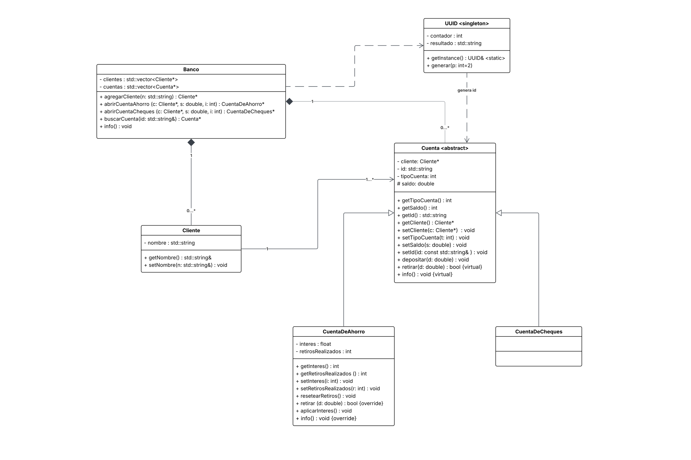

# Tarea 1 — Modelado de un sistema bancario (POO en C++)

Este ejercicio corresponde a la **Tarea 1** de la segunda parte del curso 
**propedéutico de Programación y Estructuras de Datos**, impartido por el 
**Dr. Miguel Morales Sandoval**.

## Enunciado

Realizar un proceso de abstracción y modelar las clases `Banco`, `Cliente`,
`Cuenta`, `CuentaDeCheques` y `CuentaDeAhorro` de acuerdo con estos
requerimientos:

- Al crear una cuenta, ésta se asigna a un cliente y recibe un **identificador
  único** de 10 dígitos con formato `2-mm-yy-id`, donde `id` es un consecutivo
  de 5 dígitos que empieza en `1`, `mm` es el mes actual y `yy` el año. Por
  ejemplo, la primera cuenta será `2-09-16-00001`, la siguiente `2-09-16-00002`,
  y así sucesivamente.
- Existen dos tipos de cuenta —**ahorro** y **cheques**— y el diseño debe
  permitir incorporar otros tipos en el futuro.
- Ambas permiten al cliente **depositar** y **retirar** dinero en cualquier
  momento; el cliente siempre tiene acceso a la totalidad de su dinero.
- La **cuenta de ahorro** tiene una tasa de **interés** fijada por el banco
  (normalmente entre 1% y 5%), está limitada a **6 retiros por mes** y debe
  mantener **siempre un saldo mínimo de $1,000.00**.
- La **cuenta de cheques** no genera interés: está pensada para pagar, no para
  ahorrar.

## Solución propuesta (modelado)

Se prompone una **jerarquía de herencia** con `Cuenta` como clase base y los dos
tipos de cuenta como clases derivadas, de modo que agregar un tipo nuevo solo
implique crear otra subclase:

- **`Cuenta`** concentra lo común a toda cuenta (saldo, id, cliente y tipo) y
  declara `depositar`, `retirar` e `info` como métodos **`virtual`**, para que
  cada subclase pueda redefinir su comportamiento.
- **`CuentaDeAhorro`** sobreescribe `retirar` para imponer las reglas del
  enunciado (máximo 6 retiros y saldo mínimo de $1,000) y añade el interés.
- **`CuentaDeCheques`** es una cuenta simple que hereda el comportamiento base
  sin interés.
- **`Cliente`** representa al titular; cada `Cuenta` guarda un puntero a su
  `Cliente` (asociación *cuenta -> cliente*).
- **`Banco`** es el contenedor principal: administra los clientes y las cuentas,
  abre cuentas asignándolas a un cliente y es **dueño** de esa memoria.
- El identificador `2-mm-yy-id` lo produce **`UUID`**, implementado como
  **singleton**: una sola instancia mantiene el contador, garantizando IDs
  consecutivos y únicos en toda la ejecución.

A continuacion se muestra el *diagrama de clases* propuesto:



## Estructura del proyecto

Las **interfaces** (declaraciones de clase) viven en `if/` y las
**implementaciones** (`.cpp`) en la raíz.

### `if/` — headers
- `Utils.h` — constantes del proyecto: tipos de cuenta, máximo de retiros y
  saldo mínimo de ahorro.
- `UUID.h` — singleton generador de identificadores `2-mm-yy-id`.
- `Cliente.h` — clase `Cliente` (nombre del titular).
- `Cuenta.h` — clase base con saldo, id, cliente y tipo; métodos virtuales.
- `CuentaDeAhorro.h` — subclase con interés, límite de retiros y saldo mínimo.
- `CuentaDeCheques.h` — subclase de cuenta simple, sin interés.
- `Banco.h` — administra clientes y cuentas.

### Raíz — fuentes
- `main.cpp` — programa de prueba: crea un banco y un cliente, abre una cuenta
  de cada tipo y ejercita todas las reglas (IDs, depósito/retiro, interés,
  límite de retiros y saldo mínimo).
- `Cuenta.cpp`, `CuentaDeAhorro.cpp`, `Banco.cpp` — implementación de los
  métodos no triviales.
- `Cliente.cpp`, `CuentaDeCheques.cpp` — sin implementación externa (sus métodos
  son sencillos y van *inline* en el header).

**Nota**: Todo es in-mem, no se tiene persistencia on-disk. No es interactivo.

## Compilar y ejecutar

```bash
g++ -std=c++11 -Wall *.cpp -o banco
./banco
```

Se muestra ejemplo de la salida 
```bash
$ ./banco 

>>> IDs generados (formato 2-mm-yy-id):
Ahorro:  2-06-26-00001
Cheques: 2-06-26-00002

>>> Deposito y retiro en cuenta de cheques:
Cuenta ID: 2-06-26-00002
Tipo de cuenta: Cheques
Saldo: 1700.00

>>> Aplicando interes a la cuenta de ahorro:
Aplicando interes del 3.00%, interes aplicado: 150.00 
    nuevo saldo: 5150.00

>>> Intentando retirar de mas (rompe el minimo de $1000):
Retiro de 5000: RECHAZADO

>>> Probando el limite de 6 retiros:
Retirando 10.00, nuevo saldo: 5140.00
 Retiros realizados: 1
 Retiros restantes: 5
Retiro #1 de 10: exitoso
Retirando 10.00, nuevo saldo: 5130.00
 Retiros realizados: 2
 Retiros restantes: 4
Retiro #2 de 10: exitoso
Retirando 10.00, nuevo saldo: 5120.00
 Retiros realizados: 3
 Retiros restantes: 3
Retiro #3 de 10: exitoso
Retirando 10.00, nuevo saldo: 5110.00
 Retiros realizados: 4
 Retiros restantes: 2
Retiro #4 de 10: exitoso
Retirando 10.00, nuevo saldo: 5100.00
 Retiros realizados: 5
 Retiros restantes: 1
Retiro #5 de 10: exitoso
Retirando 10.00, nuevo saldo: 5090.00
 Retiros realizados: 6
 Retiros restantes: 0
Retiro #6 de 10: exitoso
Retiro #7 de 10: RECHAZADO

>>> Intentando abrir cuenta de ahorro con $500:
No se puede abrir una cuenta de ahorro con menos de $1000.00 (saldo dado: $500.00)
Resultado: NO se abrio

>>> Buscar cuenta por id:
Buscando 2-06-26-00001 -> encontrada

>>> Estado final del banco:
===== Cuentas del banco (2) =====
Cuenta ID: 2-06-26-00001
Tipo de cuenta: Ahorro
Saldo: 5090.00
Interes: 3.00%
Retiros realizados este mes: 6
Retiros restantes este mes: 0
------------------------------
Cuenta ID: 2-06-26-00002
Tipo de cuenta: Cheques
Saldo: 1700.00
------------------------------

```
