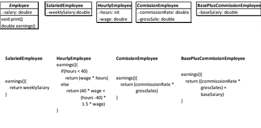
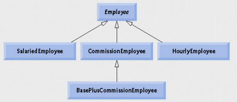

# Tarea 2 - Jerarquía de empleados y polimorfismo (POO en C++)

Este ejercicio corresponde a la **Tarea 2** de la segunda parte del curso 
**propedéutico de Programación y Estructuras de Datos**, impartido por el 
**Dr. Miguel Morales Sandoval**.

## Enunciado

1. Crear las clases de la jerarquía `Employee` tal como se muestran en la figura.
2. Realizar una aplicación que cree una instancia de cada subclase y las procese
   **polimórficamente**, mostrando el valor que regresa el método
   `earnings()` (aquí `ganancias()`).

A continuación se muestra la *figura* con las clases, sus atributos y la
definición de `earnings()` de cada una:



Cada clase calcula sus ganancias de forma distinta:

- **`SalariedEmployee`** - regresa el salario semanal.
- **`HourlyEmployee`** - paga las horas normales y, a partir de la hora 40,
  paga las horas extra a 1.5x: `40 * wage + (hours-40) * 1.5 * wage`.
- **`CommissionEmployee`** - regresa `commissionRate * grossSales`.
- **`BasePlusCommissionEmployee`** - lo mismo que el de comisiones más un salario
  base: `commissionRate * grossSales + baseSalary`.

## Solución propuesta (modelado)

Se propone, siguendo la estructura dada en el enunciado de la tarea (la cual se muestra en la figura de abajo) una **jerarquía de herencia** con `Empleado` como clase base. 
La base declara `ganancias()` e `imprimir()` como métodos **`virtual`** para que cada subclase redefina su comportamiento y puedan tratarse de forma polimórfica 
a través de un puntero `Empleado*`:



- **`EmpleadoBaseMasComisiones`** hereda de **`EmpleadoPorComisiones`** (no de
  `Empleado` directamente), por lo que reutiliza la comisión y las ventas en
  lugar de redeclararlas: su `ganancias()` e `imprimir()` llaman a la versión de
  la base y solo agregan el salario base.

## Estructura del proyecto

Las **interfaces** (declaraciones de clase) viven en `if/` y las
**implementaciones** (`.cpp`) en la raíz.

### `if/` - headers
- `Utils.h` - constantes del proyecto: umbral de horas extra (40) y factor de
  pago de horas extra (1.5).
- `Empleado.h` - clase base con `salario`; métodos virtuales `ganancias()` e
  `imprimir()` y destructor virtual.
- `EmpleadoAsalariado.h` - subclase con `salarioSemanal`.
- `EmpleadoPorHora.h` - subclase con `horasTrabajadas` y `tarifaPorHora`.
- `EmpleadoPorComisiones.h` - subclase con `comisionPorVenta` y `ventasTotales`.
- `EmpleadoBaseMasComisiones.h` - subclase de `EmpleadoPorComisiones` que agrega
  `salarioBase`.

### Raíz - fuentes
- `main.cpp` - programa de prueba: crea un `std::vector<Empleado*>` con un
  empleado de cada tipo y lo recorre con dos `for each`, uno que muestra
  `ganancias()` y otro que llama a `imprimir()`; al final libera la memoria.
- `Empleado.cpp`, `EmpleadoAsalariado.cpp`, `EmpleadoPorHora.cpp`,
  `EmpleadoPorComisiones.cpp`, `EmpleadoBaseMasComisiones.cpp` - implementación
  de `ganancias()` e `imprimir()` de cada clase.

**Nota**: Todo es in-mem, no se tiene persistencia on-disk. No es interactivo.

## Compilar y ejecutar

```bash
g++ -std=c++11 -Wall *.cpp -o tarea2
./tarea2
```

Se muestra ejemplo de la salida
```bash
$ ./tarea2

===== Ganancias =====
Ganancias: 1000.00
Ganancias: 2375.00
Ganancias: 500.00
Ganancias: 800.00

===== Imprimir =====
Salario semanal: 1000.00
---------------------
Horas trabajadas: 45
Tarifa por hora: 50.00
---------------------
Comision por venta: 0.10
Ventas totales: 5000
---------------------
Comision por venta: 0.10
Ventas totales: 5000
Salario base: 300.00
---------------------
```
