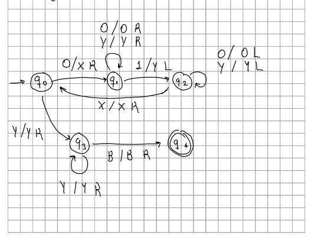
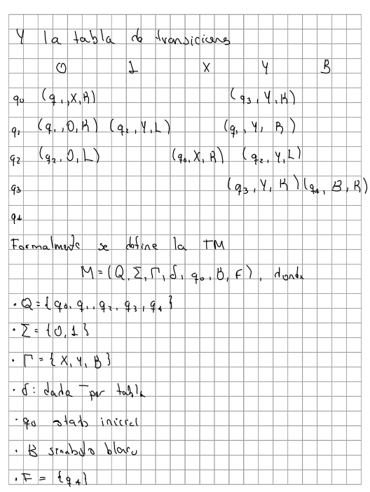
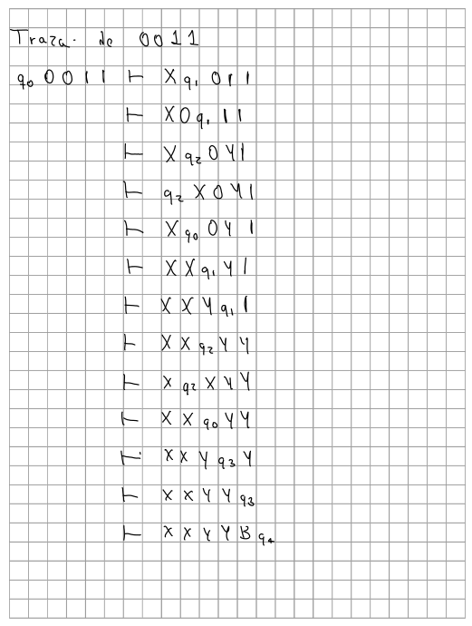

# Simulador de Maquina de Turing Determinista Simple

Simulador de una **Máquina de Turing (MT)** determinista de una sola cinta 
basado en la definicion del capitulo 8, seccion 8.2.2 - Introduccion a las Maquinas
de Turing del HMU (pag. 271)

Este experimento surge como la necesidad de probar/experimentar lo establecido en la seccion
8.6.1 "Simulacion de una maquina de Turing mediante una computadora" (pag. 302 ) 
y probar las limitaciones de los alfabetos muy grandes y la memoria, asi como
para experimentar y mejorar el entendimiento de las MT.

Basicamente es el cascaron generico de una DTM simple, en el cual se puede
construir una TM a base de cada uno de sus elementos; el conjunto de estados,
alfabeto inicial, alfabeto de cinta, estado inicial, etc. A travez de un archivo
en texto plano con cada uno de estos datos

Posteriormente se pueden simular entradas paso a paso para ver que es lo que
ocurre en el interior de la MT cada paso (cinta, estados, etc), dando al final
el veredicto de si la cadena evaluada es aceptada o no

Esta maquina no determina el lenguaje de la TM

## Estructura del proyecto

Las interfaces (declaraciones) viven en `if/` y las implementaciones
(`.cpp`) en la raíz

### `if/` - headers
- `Utils.h` - `enum class Mov { L, R }` y el `struct Transicion`
- `Cinta.h` - declaración de la cinta (cabeza, lectura/escritura/movimiento)
- `MaquinaTuring.h` - declaración del cascaron de la MT
- `LectorMT.h` - declaración del lector/constructor de MT desde texto

### Raíz - fuentes
- `main.cpp` - carga la MT desde el archivo de definición recibido como argumento y la
  corre en modo interactivo paso a paso
- `Cinta.cpp` - implementación de la cinta
- `MaquinaTuring.cpp` - implementación del cascaron 
- `LectorMT.cpp` - parser de la definición y construcción de la MT

### `ejemplos/` - definiciones de MT (cárgalas con `./tm ejemplos/<archivo>`)
- `0n1n.tm` - acepta `L = { 0ⁿ1ⁿ | n ≥ 1 }` (mismo número de `0`s y `1`s, en
  ese orden). Pruébala con `01`, `0011`, `000111`.
- `palindromos_ab.tm` - acepta los **palíndromos** sobre `{a,b}`,
  `L = { w | w = wᴿ }` (incluye un solo símbolo). Pruébala con `aba`, `abba`,
  `aabaa`.
- `anbncn.tm` - acepta `L = { aⁿbⁿcⁿ | n ≥ 1 }` (mismo número de `a`s, `b`s y
  `c`s, en ese orden); lenguaje **no libre de contexto**. Pruébala con `abc`,
  `aabbcc`, `aaabbbccc`.

**Nota**: Todo es in-mem, no hay persistencia

## Compilar y ejecutar

El programa **siempre requiere** la ruta de un archivo de definición:

```bash
g++ -std=c++11 -Wall *.cpp -o tm
./tm ejemplos/0n1n.tm
```

## Formato de archivo y como generar una MT

La MT se define en un archivo de texto que se pasa como argumento:

El archivo de texto tiene el siguiente formato el cual se basa en la definición 
que sigue la **7-tupla** `M = (Q, Σ, Γ, δ, q₀, B, F)`.
Una instrucción por línea; `#` inicia un comentario y las líneas en blanco se 
ignoran. Los atributos usan `=` con valores separados por coma o espacio; 
la flecha `->` de las transiciones es opcional. A continuacion se muestra
el formato:

```
Q=q0,q1,q2,q3,q4                  # conjunto de estados
Sigma=0,1                         # alfabeto de entrada (Σ)
Gamma=X,Y,B                       # alfabeto de cinta (Γ)
q_ini=q0                          # estado inicial
F=q4                              # estado(s) de aceptación: "F=q4,q5"
blanco=B                          # opcional; por defecto B

# función de transición δ:  estado  lee  ->  destino  escribe  mueve(L|R)
q0 0 -> q1 X R
q1 1 -> q2 Y L
```

El lector valida la definición y aborta indicando la línea del error si:
falta `q_ini`; un movimiento no es `L`/`R`; hay **dos transiciones para el mismo
`(estado, símbolo)`** (debe ser determinista); o —cuando se declaran `Q`, `Σ` o
`Γ`- una transición usa un estado o símbolo que no pertenece a esos conjuntos
En la tabla, los estados de aceptación se marcan con `*`

Para ejecutar con el archivo de una TM, suponiendo que el ejecutable se llama
`tm` se hace como sigue

```bash
./tm ejemplos/0n1n.tm   
```

## Ejemplo

Se mostrara un ejemplo sobre la MT que acepta el lenguaje L = { 0^n 1^n | n >= 1 }

Su diagrama de estados es:



y su definición formal como 7-tupla `M = (Q, Σ, Γ, δ, q₀, B, F)` con la tabla de
transiciones:



La salida del programa para la entrada `0011` es:

```
$ ./tm ejemplos/0n1n.tm   
T = (Q, Sigma, Gamma, delta, q_ini, B, F)
  Q      = { q0, q1, q2, q3, q4 }
  Sigma  = { 0, 1 }
  Gamma  = { 0, 1, X, Y, B }
  q_ini  = q0
  B      = B
  F      = { q4 }

Tabla de transiciones:
-----------------------------------------------------------------------
  delta |   0           1           X           Y           B        
--------+--------------------------------------------------------------
  ->q0  | (q1,X,R)      -           -        (q3,Y,R)      -       
  q1    | (q1,0,R)   (q2,Y,L)      -        (q1,Y,R)      -       
  q2    | (q2,0,L)      -        (q0,X,R)   (q2,Y,L)      -       
  q3    |    -           -           -        (q3,Y,R)   (q4,B,R)  
  *q4   |    -           -           -           -           -       
-----------------------------------------------------------------------
w = 0011
=======================================================================
Simulando entrada: "0011"
=======================================================================
Paso   0 |- [q0]0011
	Enter para continuar...
           delta(q0, 0) = (q1, X, R)
Paso   1 |- X[q1]011
	Enter para continuar...
           delta(q1, 0) = (q1, 0, R)
Paso   2 |- X0[q1]11
	Enter para continuar...
           delta(q1, 1) = (q2, Y, L)
Paso   3 |- X[q2]0Y1
	Enter para continuar...
           delta(q2, 0) = (q2, 0, L)
Paso   4 |- [q2]X0Y1
	Enter para continuar...
           delta(q2, X) = (q0, X, R)
Paso   5 |- X[q0]0Y1
	Enter para continuar...
           delta(q0, 0) = (q1, X, R)
Paso   6 |- XX[q1]Y1
	Enter para continuar...
           delta(q1, Y) = (q1, Y, R)
Paso   7 |- XXY[q1]1
	Enter para continuar...
           delta(q1, 1) = (q2, Y, L)
Paso   8 |- XX[q2]YY
	Enter para continuar...
           delta(q2, Y) = (q2, Y, L)
Paso   9 |- X[q2]XYY
	Enter para continuar...
           delta(q2, X) = (q0, X, R)
Paso  10 |- XX[q0]YY
	Enter para continuar...
           delta(q0, Y) = (q3, Y, R)
Paso  11 |- XXY[q3]Y
	Enter para continuar...
           delta(q3, Y) = (q3, Y, R)
Paso  12 |- XXYY[q3]B
	Enter para continuar...
           delta(q3, B) = (q4, B, R)
Paso  13 |- XXYYB[q4]B
--> Se alcanzo un estado de aceptacion (q4)
RESULTADO: ACEPTADA

```

Esa misma traza, escrita a mano como descripciones instantáneas:



**Nota**: Para este proyecto se uso IA generativa exclusivamente para el formateo
de las tablas y de info para la visualizacion, asi como para debuggear y las rutinas 
para el parseo de los text files. Para la logica, diseño
y planteamiento de la solucion no se utilizo esta herramienta.

